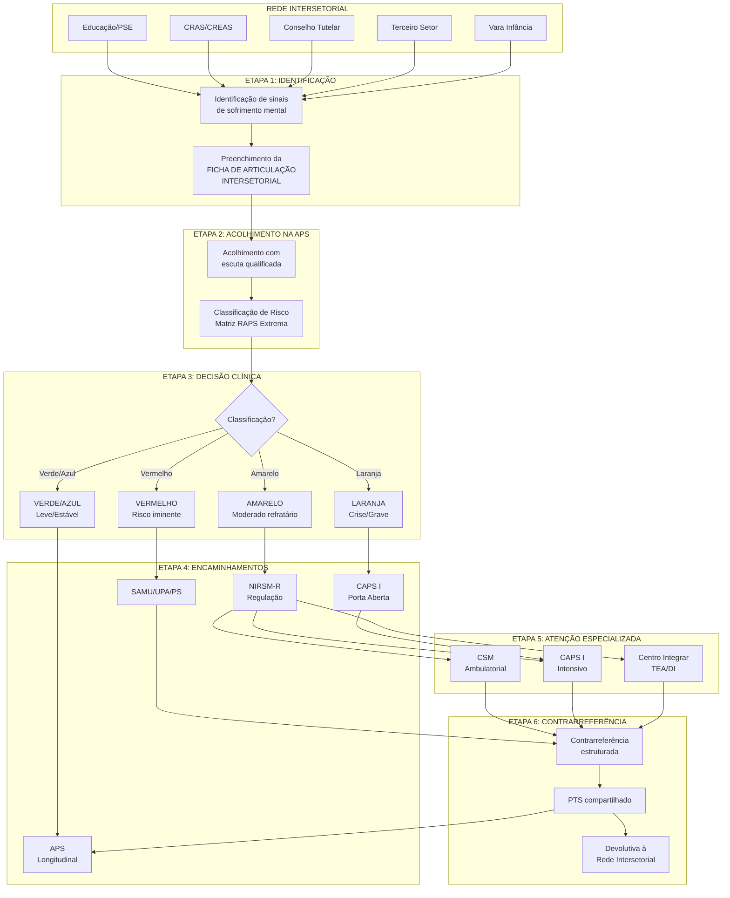

# PROTOCOLO PCC-01: COMPARTILHAMENTO DO CUIDADO
## Fluxo: Rede Intersetorial → APS → NIRSM-R → Atenção Especializada em Saúde Mental

**Secretaria Municipal de Saúde de Extrema/MG**
**Versão:** 1.0 | **Data:** Janeiro/2026
**Status:** Documento Normativo

---

## 1. OBJETIVO

Estabelecer o fluxo assistencial para casos de saúde mental identificados pela rede intersetorial (Educação, Assistência Social, Terceiro Setor, Justiça, Conselho Tutelar), garantindo acesso qualificado à Atenção Primária à Saúde (APS) e, quando necessário, à Atenção Especializada em Saúde Mental (AES-SM) da RAPS.

---

## 2. ÂMBITO DE APLICAÇÃO

- Secretaria Municipal de Educação (SEMED)
- Secretaria Municipal de Assistência Social (SMAS) - CRAS/CREAS
- Organizações do Terceiro Setor conveniadas
- Conselho Tutelar
- Vara da Infância e Juventude
- Unidades Básicas de Saúde (UBS/e-ESF)
- Equipes Multiprofissionais (e-Multi)
- NIRSM-R
- CAPS I, CSM, Centro Integrar

---

## 3. DEFINIÇÕES

| Termo | Definição |
|-------|-----------|
| **Rede Intersetorial** | Conjunto de equipamentos e serviços de outros setores (educação, assistência social, justiça) que atuam no território e podem identificar demandas de saúde mental |
| **APS** | Atenção Primária à Saúde - porta de entrada preferencial e coordenadora do cuidado |
| **NIRSM-R** | Núcleo Interno de Regulação de Saúde Mental - gatekeeper para atenção especializada |
| **AES-SM** | Atenção Especializada em Saúde Mental (CAPS I, CSM, Centro Integrar) |
| **PSE** | Programa Saúde na Escola |
| **CRAS** | Centro de Referência de Assistência Social |
| **CREAS** | Centro de Referência Especializado de Assistência Social |

---

## 4. FLUXOGRAMA GERAL



---

## 5. DESCRIÇÃO DETALHADA DAS ETAPAS

### ETAPA 1: IDENTIFICAÇÃO NA REDE INTERSETORIAL

#### 5.1.1 Responsáveis
- Professores e coordenadores pedagógicos (Educação)
- Técnicos de referência CRAS/CREAS (Assistência Social)
- Conselheiros Tutelares
- Técnicos de ONGs e projetos sociais
- Equipes técnicas da Vara da Infância

#### 5.1.2 Sinais de Alerta a Observar

**Em crianças e adolescentes (ambiente escolar):**
- Mudança abrupta de comportamento ou rendimento escolar
- Isolamento social ou agressividade persistente
- Sinais de automutilação ou ideação suicida
- Relato de violência doméstica ou negligência
- Uso de substâncias psicoativas
- Dificuldades significativas de aprendizagem com componente emocional
- Sinais sugestivos de TEA ou TDAH

**Em adultos e idosos (equipamentos sociais):**
- Sofrimento psíquico intenso ou persistente
- Sinais de negligência ou abandono
- Uso problemático de álcool e outras drogas
- Ideação suicida ou tentativa prévia
- Quadros de confusão mental ou demência
- Situação de rua com transtorno mental

#### 5.1.3 Ação Requerida
1. Preencher a **Ficha de Articulação Intersetorial** (Anexo I)
2. Contatar a UBS de referência do território do usuário
3. Agendar visita compartilhada ou acompanhar o usuário até a UBS (quando necessário)
4. **Prazo:** 72 horas para casos não urgentes; imediato para casos de risco

#### 5.1.4 Situações de Urgência (Fluxo Diferenciado)
Quando houver **risco iminente** (suicídio, violência, crise aguda):
- Acionar SAMU 192 imediatamente
- Comunicar Conselho Tutelar (se menor de 18 anos)
- Notificar a UBS de referência em até 24 horas

---

### ETAPA 2: ACOLHIMENTO NA APS

#### 5.2.1 Responsáveis
- Recepção da UBS (agendamento prioritário)
- Enfermeiro(a) da e-ESF (acolhimento inicial)
- Médico(a) da e-ESF (avaliação clínica)
- Equipe e-Multi (avaliação complementar)

#### 5.2.2 Prazo para Acolhimento
| Classificação Prévia | Prazo Máximo |
|----------------------|--------------|
| Urgência (risco) | Imediato - mesmo dia |
| Prioridade alta | Até 72 horas |
| Prioridade média | Até 7 dias |
| Rotina | Até 15 dias |

#### 5.2.3 Procedimentos do Acolhimento

**a) Escuta Qualificada:**
- Receber o usuário em ambiente privativo
- Acolher o familiar/acompanhante quando pertinente
- Leitura da Ficha de Articulação Intersetorial
- Complementação da anamnese

**b) Avaliação Clínica Inicial:**
- Anamnese psiquiátrica breve (queixa principal, história pregressa, antecedentes)
- Avaliação de risco (suicídio, heteroagressividade, vulnerabilidade)
- Exame do estado mental simplificado
- Verificação de condições clínicas associadas

**c) Classificação de Risco:**
Aplicar a **Matriz de Risco RAPS Extrema** conforme protocolo REG-01.

---

### ETAPA 3: CLASSIFICAÇÃO DE RISCO E DECISÃO CLÍNICA

#### 5.3.1 Matriz de Risco RAPS Extrema

| Cor | Critérios Clínicos | Conduta | Destino |
|-----|-------------------|---------|---------|
| **VERMELHO** | Risco iminente de suicídio; heteroagressividade ativa; agitação psicomotora grave; intoxicação aguda com alteração comportamental severa; sintomas psicóticos com comando imperativo | Acionamento imediato SAMU 192 ou remoção para UPA/PS. NÃO aguardar vaga ambulatorial | UPA/PS |
| **LARANJA** | Sofrimento psíquico intenso (crise não suicida); ideação suicida sem plano estruturado; psicose com baixa funcionalidade; transtorno grave descompensado | Acolhimento Porta Aberta CAPS I (24-72h) ou regulação prioritária CSM | CAPS I ou CSM |
| **AMARELO** | Transtornos moderados refratários ao manejo inicial; prejuízo funcional moderado; necessidade de ajuste medicamentoso especializado | Encaminhamento via NIRSM-R para consulta agendada | CSM |
| **VERDE/AZUL** | Transtornos mentais comuns leves; sofrimento situacional; casos estáveis em manutenção | Acompanhamento longitudinal na APS; intervenções psicossociais | APS/e-Multi |

#### 5.3.2 Instrumentos de Apoio à Decisão
- MI-mhGAP (Mapa Geral: Avaliar-Decidir-Manejar)
- CuidaSM (estratificação longitudinal)
- PHQ-9 (rastreio depressão)
- GAD-7 (rastreio ansiedade)
- M-CHAT-R/F (rastreio TEA em crianças 16-30 meses)
- AUDIT (rastreio uso de álcool)

---

### ETAPA 4: MANEJO INICIAL NA APS E ENCAMINHAMENTO

#### 5.4.1 Para Casos VERDE/AZUL (Permanecem na APS)

**Ações obrigatórias:**
1. Registro em prontuário eletrônico
2. Elaboração de PTS simplificado
3. Prescrição de intervenções psicossociais (grupos, atividades comunitárias)
4. Tratamento farmacológico quando indicado (MI-mhGAP)
5. Agendamento de retorno em 30-45 dias
6. Devolutiva ao serviço intersetorial de origem

#### 5.4.2 Para Casos AMARELO (Encaminhamento Ambulatorial)

**Pré-requisitos para encaminhamento:**
1. Tentativa de manejo inicial na APS documentada
2. Discussão de caso em matriciamento ou preenchimento qualificado da Guia NIRSM-R
3. PTS preliminar elaborado
4. Critérios de refratariedade atendidos (quando aplicável):
   - Ausência de resposta após 8-12 semanas de tratamento adequado
   - Dose plena de medicamento por tempo adequado
   - Adesão confirmada

**Procedimento:**
1. Preencher Guia de Referência NIRSM-R (POP-03)
2. Anexar resumo clínico e exames relevantes
3. Inserir solicitação no sistema de regulação
4. Informar usuário sobre o fluxo e tempo estimado
5. Manter acompanhamento na APS durante a espera

#### 5.4.3 Para Casos LARANJA (Porta Aberta CAPS ou Regulação Prioritária)

**Procedimento CAPS I (Porta Aberta):**
1. Contato telefônico direto com CAPS I
2. Encaminhamento no mesmo dia ou próximo dia útil
3. Acompanhamento presencial do usuário quando necessário
4. Documentação em prontuário

**Procedimento Regulação Prioritária CSM:**
1. Preencher Guia NIRSM-R com marcador "PRIORIDADE"
2. Prazo de agendamento: 24-72 horas
3. Manter contato com usuário/família

#### 5.4.4 Para Casos VERMELHO (Urgência/Emergência)

**Procedimento:**
1. Acionar SAMU 192 imediatamente
2. Manter usuário em ambiente seguro até chegada do SAMU
3. Se menor: acionar Conselho Tutelar
4. Comunicar família/responsável
5. Registro detalhado em prontuário
6. Notificar CAPS I em até 24 horas (para seguimento pós-crise)

---

### ETAPA 5: ATENÇÃO ESPECIALIZADA

#### 5.5.1 CSM - Centro de Saúde Mental

**Critérios de atendimento:**
- Transtornos depressivos refratários
- Transtornos de ansiedade com prejuízo funcional significativo
- Transtornos psicóticos estáveis com necessidade de ajuste
- Comorbidades psiquiátricas complexas

**Fluxo interno:**
1. Recepção da Guia NIRSM-R
2. Análise e agendamento (até 30 dias)
3. Consulta inicial com elaboração/revisão de PTS
4. Tratamento compartilhado com APS
5. Contrarreferência após estabilização

#### 5.5.2 CAPS I

**Critérios de atendimento:**
- Transtornos mentais graves e persistentes
- Crises não contidas na APS
- Necessidade de cuidado intensivo/semi-intensivo
- Reabilitação psicossocial

**Modalidades:**
- Intensivo: atendimento diário
- Semi-intensivo: até 12 atendimentos/mês
- Não intensivo: até 3 atendimentos/mês

#### 5.5.3 Centro Integrar

**Critérios de atendimento:**
- Transtorno do Espectro Autista (TEA)
- Deficiência Intelectual
- Atrasos do desenvolvimento neuropsicomotor
- Necessidade de reabilitação multidisciplinar

**Fluxo específico:** Ver Protocolo CLI-02 (TEA)

---

### ETAPA 6: CONTRARREFERÊNCIA E RETORNO À APS

#### 5.6.1 Critérios para Contrarreferência

- Estabilização do quadro clínico
- Definição de diagnóstico e plano terapêutico
- Capacitação da equipe APS para seguimento (via matriciamento)
- Ajuste medicamentoso concluído

#### 5.6.2 Conteúdo da Contrarreferência

A **Ficha de Contrarreferência** (Anexo III) deve conter:

1. **Diagnóstico(s)** - CID-10/CID-11
2. **Resumo da evolução** no serviço especializado
3. **Medicações em uso** com posologia
4. **Orientações de manejo** para a APS
5. **Sinais de alerta** para re-encaminhamento
6. **Plano de seguimento** (frequência de consultas, exames)
7. **Critérios de retorno** à atenção especializada

#### 5.6.3 Devolutiva à Rede Intersetorial

Quando o caso foi originado na rede intersetorial:
1. Enviar cópia da contrarreferência (sem detalhes clínicos sigilosos)
2. Informar sobre orientações de apoio escolar/social
3. Agendar reunião intersetorial quando pertinente
4. Manter canal de comunicação para acompanhamento conjunto

---

## 6. RESPONSABILIDADES

### 6.1 Rede Intersetorial
- Identificar sinais de alerta
- Preencher Ficha de Articulação
- Encaminhar para APS de referência
- Participar de reuniões intersetoriais
- Implementar orientações de apoio

### 6.2 APS (e-ESF/e-Multi)
- Acolher em tempo oportuno
- Classificar risco
- Manejar casos leves/moderados
- Elaborar PTS
- Encaminhar qualificadamente via NIRSM-R
- Manter vínculo e responsabilidade sanitária
- Receber contrarreferência e dar continuidade

### 6.3 NIRSM-R
- Analisar qualidade dos encaminhamentos
- Regular o acesso à atenção especializada
- Devolver casos inadequados com orientação
- Monitorar tempos de espera
- Produzir relatórios de gestão

### 6.4 Atenção Especializada (CAPS/CSM/Centro Integrar)
- Acolher casos regulados
- Elaborar/ajustar PTS
- Tratar quadros complexos
- Matriciar equipes APS
- Contrarreferir com qualidade
- Participar de reuniões de rede

---

## 7. INDICADORES DE MONITORAMENTO

| Indicador | Meta | Periodicidade |
|-----------|------|---------------|
| % de casos intersetoriais acolhidos em até 7 dias | ≥ 80% | Mensal |
| % de Guias NIRSM-R com preenchimento completo | ≥ 90% | Mensal |
| Tempo médio entre encaminhamento e consulta especializada | ≤ 30 dias | Mensal |
| % de casos contrarreferidos com ficha completa | ≥ 85% | Mensal |
| % de devolutivas realizadas à rede intersetorial | ≥ 70% | Trimestral |
| Taxa de re-encaminhamentos em 90 dias | ≤ 20% | Trimestral |

---

## 8. ANEXOS

### ANEXO I - Ficha de Articulação Intersetorial

```
┌─────────────────────────────────────────────────────────────────────────┐
│           FICHA DE ARTICULAÇÃO INTERSETORIAL - SAÚDE MENTAL            │
│                    Secretaria Municipal de Saúde                        │
│                         Extrema/MG - 2026                               │
├─────────────────────────────────────────────────────────────────────────┤
│ 1. IDENTIFICAÇÃO DO USUÁRIO                                             │
├─────────────────────────────────────────────────────────────────────────┤
│ Nome completo: ________________________________________________         │
│ Data de nascimento: ___/___/_____ Idade: _____ Sexo: ( )M ( )F ( )Outro│
│ Nome da mãe: __________________________________________________         │
│ CPF: ___________________ CNS: _________________________                 │
│ Endereço: _____________________________________________________         │
│ Bairro: _______________________ Telefone: ____________________          │
│ UBS de referência: ____________________________________________         │
├─────────────────────────────────────────────────────────────────────────┤
│ 2. SERVIÇO DE ORIGEM                                                    │
├─────────────────────────────────────────────────────────────────────────┤
│ Equipamento: ( )Escola ( )CRAS ( )CREAS ( )Conselho Tutelar             │
│              ( )ONG: ___________ ( )Outro: _______________              │
│ Nome do equipamento: __________________________________________         │
│ Profissional responsável: _____________________________________         │
│ Função: _______________________ Telefone: ____________________          │
│ Data do encaminhamento: ___/___/_____                                   │
├─────────────────────────────────────────────────────────────────────────┤
│ 3. MOTIVO DO ENCAMINHAMENTO                                             │
├─────────────────────────────────────────────────────────────────────────┤
│ Sinais/comportamentos observados (descrever):                           │
│ ________________________________________________________________        │
│ ________________________________________________________________        │
│ ________________________________________________________________        │
│                                                                         │
│ Tempo de observação dos sinais: _______________________________         │
│                                                                         │
│ Há risco identificado? ( )Não ( )Sim - Qual? __________________         │
│                                                                         │
│ Ações já realizadas pelo serviço:                                       │
│ ________________________________________________________________        │
│ ________________________________________________________________        │
├─────────────────────────────────────────────────────────────────────────┤
│ 4. INFORMAÇÕES COMPLEMENTARES                                           │
├─────────────────────────────────────────────────────────────────────────┤
│ A família foi informada? ( )Sim ( )Não                                  │
│ Responsável que acompanhará: __________________________________         │
│ Telefone do responsável: _____________________________________          │
│                                                                         │
│ Observações adicionais:                                                 │
│ ________________________________________________________________        │
│ ________________________________________________________________        │
├─────────────────────────────────────────────────────────────────────────┤
│ 5. CLASSIFICAÇÃO DE PRIORIDADE (Preencher pela APS)                     │
├─────────────────────────────────────────────────────────────────────────┤
│ ( )URGÊNCIA - Risco iminente     ( )PRIORIDADE ALTA - Até 72h           │
│ ( )PRIORIDADE MÉDIA - Até 7 dias ( )ROTINA - Até 15 dias                │
│                                                                         │
│ Data do acolhimento na UBS: ___/___/_____                               │
│ Profissional que acolheu: _____________________________________         │
└─────────────────────────────────────────────────────────────────────────┘
```

### ANEXO II - Guia de Referência NIRSM-R

*Ver documento completo em: Escalas_Instrumentos/GUIA_REFERENCIA_NIRSM.md*

### ANEXO III - Ficha de Contrarreferência

*Ver documento completo em: Escalas_Instrumentos/FICHA_CONTRARREFERENCIA.md*

---

## 9. REFERÊNCIAS

1. Brasil. Lei nº 10.216/2001 - Reforma Psiquiátrica
2. Brasil. Portaria GM/MS nº 3.088/2011 - RAPS
3. Brasil. Cadernos de Atenção Básica nº 34 - Saúde Mental
4. OMS/OPAS. MI-mhGAP 2.0 - Guia de Intervenção
5. Secretaria Municipal de Saúde de Extrema. Caderno RAPS 2026

---

*Aprovado pela Coordenação de Saúde Mental de Extrema/MG*
*Data: Janeiro/2026*
