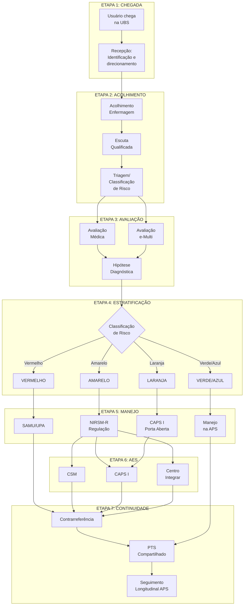

# PROTOCOLO PCC-02: COMPARTILHAMENTO DO CUIDADO
## Fluxo: Demanda Espontânea → APS → NIRSM-R → Atenção Especializada em Saúde Mental

**Secretaria Municipal de Saúde de Extrema/MG**
**Versão:** 1.0 | **Data:** Janeiro/2026
**Status:** Documento Normativo

---

## 1. OBJETIVO

Normatizar o fluxo de atendimento para usuários que procuram espontaneamente a Atenção Primária à Saúde (APS) com queixas ou demandas de saúde mental, estabelecendo critérios para acolhimento, classificação de risco, manejo inicial e compartilhamento do cuidado com a Atenção Especializada em Saúde Mental (AES-SM).

---

## 2. ÂMBITO DE APLICAÇÃO

- Unidades Básicas de Saúde (UBS/e-ESF)
- Equipes Multiprofissionais (e-Multi)
- NIRSM-R
- CAPS I
- CSM
- Centro Integrar

---

## 3. DEFINIÇÕES

| Termo | Definição |
|-------|-----------|
| **Demanda Espontânea** | Procura direta do usuário por atendimento, sem agendamento prévio ou encaminhamento formal |
| **Acolhimento** | Escuta qualificada e resolutiva às necessidades de saúde do usuário, com classificação de risco |
| **Transtorno Mental Comum (TMC)** | Quadros de ansiedade, depressão leve/moderada, somatização e estresse - alta prevalência na APS |
| **Transtorno Mental Grave e Persistente (TMGP)** | Psicoses, transtorno bipolar, depressão grave - menor prevalência, maior complexidade |
| **Refratariedade** | Ausência de resposta clínica satisfatória após tratamento adequado |

---

## 4. PREVALÊNCIA E CONTEXTO EPIDEMIOLÓGICO

### 4.1 Dados Epidemiológicos de Referência

| Condição | Prevalência na APS | Observação |
|----------|-------------------|------------|
| Transtornos mentais (geral) | 30-50% dos atendimentos | Queixa principal ou secundária |
| Depressão | 10-15% | Subdiagnosticada |
| Ansiedade | 15-20% | Frequentemente somatizada |
| Uso problemático de álcool | 8-12% | Baixa identificação |
| Transtornos psicóticos | 1-2% | Maior complexidade |
| Risco de suicídio | Variável | Rastreio obrigatório |

### 4.2 Queixas Comuns na Demanda Espontânea

**Queixas explícitas de saúde mental:**
- "Estou muito ansioso(a)"
- "Não consigo dormir"
- "Estou muito triste/sem ânimo"
- "Preciso de remédio para os nervos"
- "Quero conversar com psicólogo"

**Queixas somáticas que podem mascarar sofrimento mental:**
- Dor crônica sem causa definida
- Cefaleia tensional frequente
- Sintomas gastrointestinais inespecíficos
- Palpitações, tontura, formigamentos
- Fadiga persistente inexplicada

---

## 5. FLUXOGRAMA GERAL

---

## 6. DESCRIÇÃO DETALHADA DAS ETAPAS

### ETAPA 1: CHEGADA E RECEPÇÃO

#### 6.1.1 Atuação da Recepção

**Objetivo:** Identificar a demanda e direcionar o usuário para acolhimento.

**Ações:**
1. Registrar chegada do usuário no sistema
2. Verificar se possui cadastro na UBS
3. Identificar natureza da demanda:
   - Aguda/urgente → Acolhimento imediato
   - Não urgente → Acolhimento conforme fluxo
4. Orientar sobre tempo estimado de espera
5. **Atenção:** Queixas de "nervosismo", "ansiedade", "pensamentos ruins" → Priorizar acolhimento

#### 6.1.2 Sinais de Alerta na Recepção

A recepção deve acionar imediatamente a enfermagem quando identificar:
- Usuário chorando ou em sofrimento visível
- Comportamento agitado ou agressivo
- Relato de "querer morrer" ou "não aguentar mais"
- Acompanhante relatando crise ou mudança brusca
- Usuário desorientado ou com discurso desorganizado

---

### ETAPA 2: ACOLHIMENTO COM CLASSIFICAÇÃO DE RISCO

#### 6.2.1 Responsável
Enfermeiro(a) da e-ESF ou Técnico(a) de Enfermagem capacitado(a)

#### 6.2.2 Ambiente
- Sala privativa com porta fechada
- Ambiente calmo e acolhedor
- Sem interrupções

#### 6.2.3 Procedimentos da Escuta Qualificada

**a) Apresentação e acolhimento inicial:**
- Apresentar-se pelo nome e função
- Explicar o objetivo do acolhimento
- Garantir sigilo das informações

**b) Escuta ativa:**
- Permitir que o usuário fale livremente
- Não interromper desnecessariamente
- Validar emoções expressas
- Utilizar perguntas abertas:
  - "O que traz você aqui hoje?"
  - "Como você tem se sentido?"
  - "Há quanto tempo isso está acontecendo?"

**c) Investigação dirigida:**
- Queixa principal e história atual
- Impacto na vida diária (trabalho, família, sono, alimentação)
- Uso de medicações (atuais e prévias)
- Uso de álcool e outras substâncias
- Rede de apoio

**d) Avaliação de risco obrigatória:**

> **PERGUNTA OBRIGATÓRIA:** "Você tem tido pensamentos de se machucar ou de que seria melhor estar morto(a)?"

Se resposta positiva → Aplicar avaliação estruturada de suicidalidade (ver Protocolo CLI-03)

---

### ETAPA 3: CLASSIFICAÇÃO DE RISCO EM SAÚDE MENTAL

#### 6.3.1 Matriz de Classificação

| COR | CRITÉRIOS CLÍNICOS | TEMPO-RESPOSTA | DESTINO |
|-----|-------------------|----------------|---------|
| **VERMELHO** | • Tentativa de suicídio atual ou iminente • Ideação suicida com plano e acesso a meios • Heteroagressividade ativa • Agitação psicomotora grave • Intoxicação aguda com risco vital • Abstinência grave (delirium tremens) • Sintomas psicóticos com comando imperativo | **IMEDIATO** | SAMU 192 → UPA/PS Não liberar paciente |
| **LARANJA** | • Ideação suicida sem plano estruturado • Autolesão recente • Sofrimento psíquico intenso (crise) • Psicose com baixa funcionalidade • Mania/hipomania descompensada • Uso de substâncias com complicações • Depressão grave com prostração | **24-72h** | Avaliação médica imediata na UBS → CAPS I (Porta Aberta) ou Regulação Prioritária CSM |
| **AMARELO** | • Depressão moderada com prejuízo funcional • Ansiedade com impacto significativo • Transtornos refratários ao manejo inicial • Necessidade de ajuste medicamentoso • Suspeita de TDAH/TEA (adulto) • Comorbidades psiquiátricas | **Até 30 dias** | Manejo inicial APS → Encaminhamento NIRSM-R |
| **VERDE/AZUL** | • Ansiedade leve/situacional • Depressão leve • Insônia primária • Luto não complicado • Estresse adaptativo • Casos estáveis em manutenção | **Programado** | Manejo na APS Intervenções psicossociais e-Multi |

#### 6.3.2 Instrumentos de Apoio

**Rastreio rápido (aplicar conforme indicação):**

| Instrumento | Indicação | Tempo |
|-------------|-----------|-------|
| PHQ-2/PHQ-9 | Rastreio/gravidade de depressão | 2-5 min |
| GAD-2/GAD-7 | Rastreio/gravidade de ansiedade | 2-5 min |
| AUDIT-C | Rastreio de uso problemático de álcool | 2 min |
| Columbia-Suicide | Avaliação estruturada de suicidalidade | 5-10 min |

---

### ETAPA 4: AVALIAÇÃO CLÍNICA

#### 6.4.1 Avaliação Médica

**Responsável:** Médico(a) da e-ESF

**Roteiro de avaliação:**

1. **Revisão da classificação de risco**
2. **Anamnese psiquiátrica:**
   - Queixa principal e história da doença atual
   - Sintomas específicos (humor, ansiedade, psicose, etc.)
   - História psiquiátrica pregressa
   - Tratamentos anteriores e resposta
   - História familiar
   - Uso de substâncias psicoativas
   - Antecedentes médicos e medicações em uso

3. **Exame do estado mental (simplificado):**
   - Aparência e comportamento
   - Humor e afeto
   - Pensamento (forma e conteúdo)
   - Sensopercepção
   - Cognição (orientação, memória)
   - Juízo crítico e insight

4. **Avaliação de funcionalidade:**
   - Capacidade para atividades da vida diária
   - Impacto no trabalho/escola
   - Qualidade das relações interpessoais

5. **Hipótese diagnóstica** (CID-10/CID-11)

6. **Definição de conduta:**
   - Manejo na APS
   - Necessidade de compartilhamento
   - Urgência/emergência

#### 6.4.2 Avaliação Multiprofissional (e-Multi)

**Quando acionar:**
- Casos com determinantes sociais significativos
- Necessidade de intervenção psicológica/psicossocial
- Avaliação de vulnerabilidade familiar
- Suspeita de violência ou negligência
- Necessidade de visita domiciliar

**Profissionais disponíveis:**
- Psicólogo(a)
- Assistente Social
- Terapeuta Ocupacional
- Nutricionista
- Fisioterapeuta

---

### ETAPA 5: MANEJO E CONDUTA

#### 6.5.1 Casos VERDE/AZUL - Manejo na APS

**Intervenções farmacológicas (quando indicadas):**

| Condição | Primeira Linha | Orientações |
|----------|---------------|-------------|
| Depressão leve/moderada | Sertralina 50mg ou Fluoxetina 20mg | Iniciar em dose baixa, reavaliar em 4 semanas |
| Ansiedade generalizada | Sertralina 50mg | Evitar benzodiazepínicos por tempo prolongado |
| Insônia | Higiene do sono primeiro | Usar indutor se necessário, por tempo limitado |
| Somatização | Não medicar sintomas somáticos | Abordar sofrimento subjacente |

**Intervenções psicossociais:**

| Intervenção | Indicação | Responsável |
|-------------|-----------|-------------|
| Psicoeducação | Todos os casos | Médico/Enfermeiro |
| Escuta qualificada regular | Sofrimento leve | Enfermeiro/ACS |
| Grupo de saúde mental | Ansiedade/depressão leve | e-Multi |
| Práticas integrativas | Casos indicados | e-Multi |
| Orientação de atividade física | Todos | Médico/Enfermeiro |
| Articulação comunitária | Isolamento social | ACS/Ass. Social |

**Elaboração do PTS:**
- Definir diagnóstico situacional
- Pactuar metas com usuário e família
- Definir responsabilidades
- Agendar reavaliação (30-45 dias)

#### 6.5.2 Casos AMARELO - Encaminhamento Ambulatorial

**Pré-requisitos obrigatórios:**

☐ Tentativa de manejo inicial na APS (mínimo 4 semanas para casos novos)
☐ Critério de refratariedade documentado (quando aplicável)
☐ Discussão prévia em matriciamento OU preenchimento completo da Guia NIRSM-R
☐ PTS preliminar elaborado
☐ Exames complementares pertinentes realizados (hemograma, função tireoidiana, etc.)

**Procedimento de encaminhamento:**

1. Preencher **Guia de Referência NIRSM-R** (ver POP-03)
2. Anexar:
   - Resumo clínico
   - Resultados de exames
   - Instrumentos aplicados (PHQ-9, GAD-7)
3. Inserir no sistema de regulação
4. Orientar usuário sobre o fluxo
5. Manter acompanhamento na APS durante a espera
6. Agendar retorno em 30 dias (mesmo com encaminhamento pendente)

**Critérios específicos de encaminhamento:**

| Condição | Critério para CSM |
|----------|-------------------|
| Depressão | Ausência de resposta em dose plena por 8-12 semanas com adesão confirmada; OU falha de 2 antidepressivos (refratariedade confirmada) |
| Ansiedade | Refratariedade a ISRS + intervenções psicossociais por 12 semanas |
| TOC | Qualquer caso com prejuízo funcional significativo |
| Bipolaridade | Suspeita diagnóstica ou descompensação |
| Psicose estável | Necessidade de ajuste medicamentoso |

#### 6.5.3 Casos LARANJA - Crise/Prioridade

**Fluxo para CAPS I (Porta Aberta):**

1. Avaliação médica imediata na UBS
2. Contato telefônico com CAPS I
3. Se aceito: encaminhar no mesmo dia
4. Se fora de horário: estabilizar e encaminhar no próximo dia útil
5. Documentar em prontuário
6. Monitorar comparecimento

**Regulação Prioritária CSM (quando CAPS não indicado):**

1. Preencher Guia NIRSM-R com marcador **"PRIORIDADE - LARANJA"**
2. Tempo máximo para agendamento: 72 horas
3. Manter contato ativo com usuário/família

#### 6.5.4 Casos VERMELHO - Urgência/Emergência

**Protocolo de urgência:**

1. **NÃO LIBERAR O PACIENTE**
2. Manter em ambiente seguro e supervisionado
3. Remover objetos potencialmente perigosos
4. Acionar SAMU 192
5. Se menor de 18 anos: acionar Conselho Tutelar
6. Contatar familiar/responsável
7. Acompanhar até chegada do SAMU
8. Registrar detalhadamente em prontuário
9. Notificar CAPS I em até 24 horas (para seguimento pós-crise)

---

### ETAPA 6: ATENÇÃO ESPECIALIZADA

#### 6.6.1 Centro de Saúde Mental (CSM)

**Perfil de casos:**
- Depressão refratária
- Transtornos de ansiedade graves
- Ajuste medicamentoso complexo
- Primeira avaliação psiquiátrica formal
- Comorbidades psiquiátricas

**Fluxo interno:**
1. Recepção da guia regulada
2. Agendamento (até 30 dias para amarelo, 72h para prioridade)
3. Consulta psiquiátrica inicial
4. Elaboração/revisão de PTS conjunto com APS
5. Seguimento conforme necessidade
6. Contrarreferência quando estável

#### 6.6.2 CAPS I

**Perfil de casos:**
- Transtornos mentais graves e persistentes
- Crises não contidas na APS
- Necessidade de cuidado intensivo
- Reabilitação psicossocial

**Modalidades de cuidado:**
- Intensivo (diário)
- Semi-intensivo (até 12x/mês)
- Não intensivo (até 3x/mês)

#### 6.6.3 Centro Integrar

**Perfil de casos:**
- TEA confirmado ou suspeita forte
- Deficiência Intelectual
- Necessidade de reabilitação multiprofissional

---

### ETAPA 7: CONTRARREFERÊNCIA E SEGUIMENTO LONGITUDINAL

#### 6.7.1 Responsabilidades da AES

Ao contrarreferir, o serviço especializado deve:

1. Preencher **Ficha de Contrarreferência** contendo:
   - Diagnóstico(s) definitivo(s) - CID-10/CID-11
   - Resumo da evolução
   - Medicações atuais com posologia
   - Orientações de manejo para APS
   - Sinais de alerta para re-encaminhamento
   - Plano de seguimento
   - Critérios de retorno à AES

2. Enviar via sistema ou contato direto com UBS

3. Disponibilizar-se para discussão de dúvidas (matriciamento)

#### 6.7.2 Responsabilidades da APS

Ao receber contrarreferência:

1. Agendar retorno do usuário em até 15 dias
2. Revisar e assumir o plano de cuidado
3. Manter prescrição conforme orientação
4. Monitorar adesão e efeitos adversos
5. Identificar precocemente sinais de descompensação
6. Acionar matriciamento quando necessário
7. **Manter responsabilidade sanitária permanente**

#### 6.7.3 PTS Compartilhado

O Projeto Terapêutico Singular deve ser revisto:
- Após cada transição de nível de atenção
- A cada 90 dias para casos crônicos
- Quando houver mudança significativa do quadro
- A pedido do usuário/família

---

## 7. SITUAÇÕES ESPECIAIS

### 7.1 Gestantes com Demanda de Saúde Mental

- Pré-natal deve incluir rastreio de depressão (PHQ-2/PHQ-9)
- Evitar benzodiazepínicos no primeiro trimestre
- Sertralina é opção mais segura para depressão
- Casos complexos: discussão obrigatória com CSM
- Acompanhamento conjunto obstetra + equipe SM

### 7.2 Idosos

- Considerar delirium em quadros agudos
- Avaliar demência em queixas cognitivas
- Risco aumentado de interações medicamentosas
- Maior sensibilidade a psicofármacos
- Risco de suicídio frequentemente subestimado

### 7.3 Adolescentes

- Acolher sem presença dos pais quando pertinente
- Garantir sigilo (exceto risco)
- Avaliar contexto escolar e familiar
- Considerar uso de substâncias
- Se menor de 18 anos em risco: acionar Conselho Tutelar

### 7.4 Usuário que não deseja tratamento

- Respeitar autonomia quando há capacidade de decisão
- Documentar recusa em prontuário
- Orientar sobre riscos e disponibilidade de retorno
- Se risco para si ou terceiros: internação involuntária pode ser indicada (Lei 10.216)
- Acionar CAPS I para avaliação se necessário

---

## 8. INDICADORES DE MONITORAMENTO

| Indicador | Fórmula | Meta | Periodicidade |
|-----------|---------|------|---------------|
| Taxa de acolhimento no mesmo dia | (Acolhimentos mesmo dia / Total demandas SM) x 100 | ≥ 90% | Mensal |
| % de classificação de risco realizada | (Classificados / Total atendimentos SM) x 100 | 100% | Mensal |
| Taxa de encaminhamentos qualificados | (Guias completas / Total guias) x 100 | ≥ 90% | Mensal |
| Tempo médio para consulta especializada | Média de dias (solicitação → consulta) | ≤ 30 dias | Mensal |
| Taxa de resolutividade APS | (Casos resolvidos APS / Total casos SM) x 100 | ≥ 60% | Trimestral |
| Taxa de abandono pós-contrarreferência | (Abandonos 90d / Contrarreferências) x 100 | ≤ 15% | Trimestral |

---

## 9. EDUCAÇÃO PERMANENTE

### 9.1 Capacitações Recomendadas

| Tema | Carga Horária | Público-Alvo |
|------|---------------|--------------|
| MI-mhGAP (OMS) | 46 horas | Médicos e Enfermeiros APS |
| Classificação de Risco em SM | 8 horas | Enfermeiros |
| Manejo de Crise | 4 horas | Toda equipe UBS |
| Intervenções Psicossociais na APS | 16 horas | e-Multi |
| Prevenção do Suicídio | 4 horas | Toda equipe UBS |

### 9.2 Tele-matriciamento

- Frequência: semanal
- Duração: 2 horas
- Participantes: APS + CSM + CAPS I
- Casos discutidos: 5-7 por sessão
- Registro: ata com devolutiva

---

## 10. REFERÊNCIAS

1. Brasil. Ministério da Saúde. Cadernos de Atenção Básica nº 34: Saúde Mental. 2013.
2. OMS/OPAS. MI-mhGAP 2.0 - Guia de Intervenção para Transtornos Mentais, Neurológicos e por Uso de Substâncias. 2020.
3. Brasil. Portaria GM/MS nº 3.088/2011 - RAPS.
4. TelessaúdeRS-UFRGS. Protocolos de Encaminhamento para Psiquiatria Adulto. 2023.
5. Secretaria Municipal de Saúde de Extrema. Caderno Institucional RAPS. 2026.

---

*Aprovado pela Coordenação de Saúde Mental de Extrema/MG*
*Data: Janeiro/2026*
