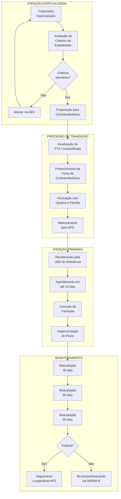

# PROTOCOLO PCC-03: CONTRARREFERÊNCIA ESTRUTURADA
## Fluxo: Atenção Especializada em Saúde Mental → APS → Seguimento Longitudinal

**Secretaria Municipal de Saúde de Extrema/MG**
**Versão:** 1.0 | **Data:** Janeiro/2026
**Status:** Documento Normativo

---

## 1. OBJETIVO

Normatizar o processo de contrarreferência da Atenção Especializada em Saúde Mental (AES-SM) para a Atenção Primária à Saúde (APS), garantindo a transição segura do cuidado, a continuidade do tratamento e a manutenção do vínculo terapêutico longitudinal.

---

## 2. PRINCÍPIOS NORTEADORES

1. **Responsabilidade Sanitária Compartilhada:** A APS mantém vínculo permanente, mesmo durante acompanhamento especializado
2. **Comunicação Estruturada:** Informações clínicas completas e padronizadas
3. **Capacitação da APS:** Transferência de conhecimento via matriciamento
4. **Pactuação com o Usuário:** Participação ativa na definição do plano de cuidado
5. **Monitoramento da Transição:** Acompanhamento do período crítico pós-alta

---

## 3. DEFINIÇÕES

| Termo | Definição |
|-------|-----------|
| **Contrarreferência** | Processo de devolutiva do caso da AES para a APS com orientações estruturadas |
| **Alta do Serviço Especializado** | Término do acompanhamento intensivo na AES, não do tratamento |
| **Período de Transição** | 90 dias críticos após contrarreferência com monitoramento intensificado |
| **Critérios de Estabilidade** | Parâmetros clínicos e funcionais para indicar contrarreferência |
| **Retaguarda Especializada** | Suporte da AES para dúvidas e intercorrências pós-contrarreferência |

---

## 4. FLUXOGRAMA GERAL



---

## 5. CRITÉRIOS DE ESTABILIDADE PARA CONTRARREFERÊNCIA

### 5.1 Critérios Gerais (Aplicáveis a Todos os Casos)

| Domínio | Critérios de Estabilidade |
|---------|--------------------------|
| **Sintomatológico** | Redução significativa dos sintomas-alvo; sem sintomas graves ativos |
| **Funcional** | Capacidade de realizar atividades da vida diária; retorno às atividades ocupacionais/sociais |
| **Risco** | Ausência de ideação suicida ou heteroagressividade; risco classificado como baixo |
| **Farmacológico** | Esquema medicamentoso definido e estável por ≥ 4 semanas |
| **Adesão** | Demonstração de adesão ao tratamento por ≥ 8 semanas |
| **Rede de Apoio** | Identificação de suporte familiar/social adequado |

### 5.2 Critérios Específicos por Diagnóstico

#### 5.2.1 Depressão
- PHQ-9 ≤ 9 (remissão ou depressão leve residual)
- Ausência de ideação suicida
- Funcionalidade recuperada (trabalho, autocuidado)
- Antidepressivo em dose de manutenção estável

#### 5.2.2 Transtornos de Ansiedade
- GAD-7 ≤ 9 (ansiedade leve)
- Ausência de ataques de pânico incapacitantes
- Retomada de atividades evitadas
- Capacidade de usar técnicas de manejo

#### 5.2.3 Transtornos Psicóticos
- Ausência de sintomas positivos ativos (delírios, alucinações)
- Insight preservado sobre doença
- Adesão demonstrada ao antipsicótico
- Acompanhamento familiar estruturado
- **Observação:** Casos graves mantêm vínculo com CAPS em modalidade não intensiva

#### 5.2.4 Transtorno Bipolar
- Eutimia sustentada por ≥ 8 semanas
- Ausência de ciclagem rápida
- Adesão ao estabilizador de humor
- Reconhecimento de pródromos pelo paciente/família

#### 5.2.5 Transtornos por Uso de Substâncias
- Abstinência ou redução significativa de danos
- Vinculação a grupo de apoio (quando indicado)
- Tratamento de comorbidades psiquiátricas estabilizado
- Reinserção social/ocupacional em curso

---

## 6. DESCRIÇÃO DETALHADA DO PROCESSO

### ETAPA 1: AVALIAÇÃO E DECISÃO DE CONTRARREFERÊNCIA

#### 6.1.1 Responsável
Equipe técnica do serviço especializado (CAPS I, CSM, Centro Integrar)

#### 6.1.2 Periodicidade da Avaliação
- Casos novos: a cada 90 dias
- Casos crônicos estáveis: a cada 6 meses
- Sempre que houver melhora clínica significativa

#### 6.1.3 Checklist de Avaliação

```
┌─────────────────────────────────────────────────────────────────────────┐
│       CHECKLIST DE AVALIAÇÃO PARA CONTRARREFERÊNCIA                    │
├─────────────────────────────────────────────────────────────────────────┤
│ Paciente: ___________________________ Prontuário: ___________          │
│ Diagnóstico: ________________________ CID: ___________                 │
│ Serviço: ___________________________ Data: ___/___/______              │
├─────────────────────────────────────────────────────────────────────────┤
│ CRITÉRIOS CLÍNICOS                                           S/N/NA    │
├─────────────────────────────────────────────────────────────────────────┤
│ [ ] Sintomas-alvo controlados ou em remissão                           │
│ [ ] Risco de suicídio/heteroagressividade baixo                        │
│ [ ] Esquema medicamentoso estável por ≥ 4 semanas                      │
│ [ ] Adesão ao tratamento demonstrada por ≥ 8 semanas                   │
│ [ ] Funcionalidade compatível com seguimento APS                       │
├─────────────────────────────────────────────────────────────────────────┤
│ CRITÉRIOS PSICOSSOCIAIS                                      S/N/NA    │
├─────────────────────────────────────────────────────────────────────────┤
│ [ ] Rede de apoio familiar/social identificada                         │
│ [ ] Usuário concorda com transição para APS                            │
│ [ ] Orientações de manejo compreendidas                                │
│ [ ] Situação socioeconômica estável                                    │
├─────────────────────────────────────────────────────────────────────────┤
│ CRITÉRIOS DE REDE                                            S/N/NA    │
├─────────────────────────────────────────────────────────────────────────┤
│ [ ] UBS de referência identificada                                     │
│ [ ] APS capacitada para manejo (via matriciamento)                     │
│ [ ] Canal de comunicação estabelecido (tele-matriciamento)             │
├─────────────────────────────────────────────────────────────────────────┤
│ DECISÃO: [ ] CONTRARREFERIR   [ ] MANTER NA AES                        │
│ Justificativa: _______________________________________________         │
│ Profissional: ________________________ COREN/CRM: __________           │
└─────────────────────────────────────────────────────────────────────────┘
```

---

### ETAPA 2: PREPARAÇÃO PARA CONTRARREFERÊNCIA

#### 6.2.1 Atualização do PTS Compartilhado

O PTS deve ser revisado e conter:

1. **Diagnóstico(s) definitivo(s)** - CID-10/CID-11
2. **Resumo da evolução** no serviço especializado
3. **Objetivos terapêuticos alcançados**
4. **Objetivos pendentes** (a serem trabalhados na APS)
5. **Medicações atuais** com posologia detalhada
6. **Orientações de manejo** para a equipe APS
7. **Sinais de alerta** para descompensação
8. **Critérios de re-encaminhamento** à AES
9. **Recursos comunitários** a serem acionados
10. **Frequência de reavaliação** recomendada

#### 6.2.2 Preenchimento da Ficha de Contrarreferência

**Conteúdo obrigatório:**

| Seção | Informações |
|-------|-------------|
| **Identificação** | Nome, CNS, UBS de referência |
| **Diagnóstico** | Principal e comorbidades (CID) |
| **Histórico resumido** | Motivo do encaminhamento original, tempo na AES |
| **Tratamento realizado** | Intervenções farmacológicas e psicossociais |
| **Estado atual** | Sintomas residuais, funcionalidade, risco |
| **Medicações** | Lista completa com posologia |
| **Orientações APS** | Manejo farmacológico, psicossocial, monitoramento |
| **Sinais de alerta** | O que observar para re-encaminhamento |
| **Exames pendentes** | Solicitações de seguimento |
| **Retaguarda** | Contato para dúvidas (telefone/tele-matriciamento) |

#### 6.2.3 Pactuação com Usuário e Família

**Reunião de transição (obrigatória):**

1. Explicar o significado da contrarreferência (não é "alta")
2. Apresentar o plano de seguimento na APS
3. Reforçar a importância da adesão
4. Entregar orientações por escrito:
   - Medicações e horários
   - Sinais de alerta
   - Quando procurar a UBS
   - Quando procurar urgência
5. Agendar primeira consulta na APS (pré-agendada)
6. Informar sobre retaguarda especializada

---

### ETAPA 3: COMUNICAÇÃO COM A APS

#### 6.3.1 Modalidades de Comunicação

| Modalidade | Quando Usar | Prazo |
|------------|-------------|-------|
| **Sistema Eletrônico** | Todos os casos (envio da ficha) | Imediato |
| **Tele-matriciamento** | Casos complexos, primeira contrarreferência | Até 7 dias antes |
| **Contato telefônico** | Urgência na comunicação | Imediato |
| **Matriciamento presencial** | Casos muito complexos | Agendado |

#### 6.3.2 Matriciamento para Contrarreferência

**Quando é obrigatório:**
- Primeiro caso contrarreferido para aquela equipe APS
- Esquema medicamentoso complexo (≥ 3 psicotrópicos)
- Diagnóstico de transtorno psicótico ou bipolar
- Histórico de múltiplas internações
- Risco de suicídio prévio significativo

**Conteúdo do matriciamento:**
1. Apresentação do caso
2. Discussão do plano de manejo
3. Orientações sobre medicação
4. Sinais de alerta específicos
5. Esclarecimento de dúvidas
6. Definição de retaguarda

---

### ETAPA 4: RECEBIMENTO NA APS

#### 6.4.1 Responsabilidades da UBS

**Ao receber a Ficha de Contrarreferência:**

1. **Coordenador(a) da UBS:**
   - Verificar recebimento no sistema
   - Designar profissional de referência para o caso
   - Garantir agendamento em até 15 dias

2. **Profissional de Referência:**
   - Ler integralmente a ficha de contrarreferência
   - Revisar prontuário e histórico prévio
   - Preparar consulta de transição
   - Contactar usuário se não comparecer

3. **ACS do Território:**
   - Realizar busca ativa se não comparecimento
   - Monitorar adesão domiciliar
   - Reportar sinais de alerta

#### 6.4.2 Consulta de Transição

**Objetivos:**
- Acolher o usuário no retorno à APS
- Validar as informações da contrarreferência
- Revisar medicações e adesão
- Estabelecer vínculo com equipe
- Pactuar frequência de retornos
- Identificar necessidades sociais

**Roteiro:**

```
┌─────────────────────────────────────────────────────────────────────────┐
│           ROTEIRO DA CONSULTA DE TRANSIÇÃO (PÓS-CONTRARREFERÊNCIA)     │
├─────────────────────────────────────────────────────────────────────────┤
│ 1. ACOLHIMENTO INICIAL (5 min)                                         │
│    - Apresentar-se e explicar continuidade do cuidado                  │
│    - Verificar como o usuário está se sentindo com a transição         │
├─────────────────────────────────────────────────────────────────────────┤
│ 2. REVISÃO CLÍNICA (10 min)                                            │
│    - Confirmar diagnósticos                                            │
│    - Verificar sintomas atuais                                         │
│    - Avaliar funcionalidade                                            │
│    - Aplicar instrumentos de acompanhamento (PHQ-9, GAD-7)             │
├─────────────────────────────────────────────────────────────────────────┤
│ 3. REVISÃO FARMACOLÓGICA (10 min)                                      │
│    - Conferir todas as medicações em uso                               │
│    - Verificar adesão e efeitos adversos                               │
│    - Renovar receitas se necessário                                    │
│    - Orientar sobre interações e precauções                            │
├─────────────────────────────────────────────────────────────────────────┤
│ 4. PLANO DE CUIDADO (10 min)                                           │
│    - Revisar PTS com o usuário                                         │
│    - Definir metas de curto prazo                                      │
│    - Identificar recursos comunitários                                 │
│    - Envolver família quando pertinente                                │
├─────────────────────────────────────────────────────────────────────────┤
│ 5. ORIENTAÇÕES FINAIS (5 min)                                          │
│    - Agendar próximo retorno (30 dias)                                 │
│    - Reforçar sinais de alerta                                         │
│    - Informar quando/como procurar ajuda urgente                       │
│    - Entregar cartão com contatos da UBS                               │
└─────────────────────────────────────────────────────────────────────────┘
```

---

### ETAPA 5: PERÍODO DE TRANSIÇÃO (90 DIAS)

#### 6.5.1 Monitoramento Intensificado

| Tempo | Ação | Responsável |
|-------|------|-------------|
| **Semana 1** | Contato ACS para verificar adesão | ACS |
| **Dia 30** | Consulta de reavaliação | Médico/Enfermeiro |
| **Dia 45** | Contato telefônico ou VD se necessário | Enfermeiro/ACS |
| **Dia 60** | Consulta de reavaliação | Médico/Enfermeiro |
| **Dia 90** | Consulta de alta do período de transição | Médico |

#### 6.5.2 Avaliação aos 30 Dias

**Instrumentos:**
- PHQ-9 (depressão)
- GAD-7 (ansiedade)
- Escala CuidaSM (estratificação)
- Avaliação de risco

**Desfechos possíveis:**
1. **Estável:** Manter plano, agendar 60 dias
2. **Instável leve:** Intensificar acompanhamento APS, discutir em matriciamento
3. **Instável grave:** Re-encaminhamento via NIRSM-R

#### 6.5.3 Avaliação aos 90 Dias

**Decisão final do período de transição:**

| Situação | Conduta |
|----------|---------|
| **Estabilidade mantida** | Alta do período de transição, seguimento longitudinal padrão |
| **Melhora parcial** | Estender monitoramento por mais 90 dias |
| **Piora ou instabilidade** | Re-encaminhamento para AES |

---

### ETAPA 6: SEGUIMENTO LONGITUDINAL

#### 6.6.1 Frequência de Consultas (Pós-Transição)

| Condição | Frequência Mínima |
|----------|-------------------|
| Depressão em remissão | A cada 2-3 meses no 1º ano; depois a cada 4-6 meses |
| Ansiedade controlada | A cada 3 meses no 1º ano; depois a cada 6 meses |
| Transtorno bipolar eutímico | A cada 2 meses (permanente) |
| Psicose estabilizada | A cada 1-2 meses (permanente) + CAPS não intensivo |
| Uso de substâncias em recuperação | A cada mês no 1º ano |

#### 6.6.2 Manutenção Medicamentosa

**Duração recomendada do tratamento farmacológico:**

| Condição | Duração Mínima |
|----------|----------------|
| Depressão (1º episódio) | 9-12 meses após remissão |
| Depressão recorrente | ≥ 2 anos ou indefinido |
| TAG | 12-24 meses após remissão |
| Pânico | 12-18 meses após controle |
| Bipolaridade | Indefinido |
| Psicose | Indefinido |

**Desmame medicamentoso:**
- Sempre gradual (redução de 10-25% a cada 2-4 semanas)
- Nunca interromper abruptamente
- Monitorar sinais de recaída
- Discutir em matriciamento se dúvida

---

## 7. RE-ENCAMINHAMENTO À AES

### 7.1 Critérios para Re-encaminhamento

| Critério | Via |
|----------|-----|
| Recaída com sintomas graves | NIRSM-R (prioridade) |
| Ideação suicida | CAPS Porta Aberta ou UPA |
| Psicose com descompensação | CAPS Porta Aberta ou UPA |
| Efeitos adversos graves | NIRSM-R (prioridade) |
| Refratariedade a novo ajuste | NIRSM-R (ambulatorial) |
| Comorbidade nova identificada | NIRSM-R (ambulatorial) |

### 7.2 Procedimento

1. Avaliar gravidade e urgência
2. Se urgente: acionar CAPS Porta Aberta ou SAMU
3. Se eletivo: preencher Guia NIRSM-R
4. Anexar evolução desde contrarreferência
5. Manter acompanhamento APS durante espera

---

## 8. RETAGUARDA ESPECIALIZADA

### 8.1 Tele-matriciamento

**Funcionamento:**
- Horário: Conforme agenda semanal da rede
- Modalidade: Síncrono (tempo real) ou assíncrono
- Acesso: Plataforma de telessaúde municipal
- Registro: Obrigatório em prontuário

**Indicações:**
- Dúvidas sobre manejo medicamentoso
- Orientações sobre efeitos adversos
- Discussão de casos com evolução atípica
- Capacitação pontual da equipe

### 8.2 Interconsulta Presencial

**Quando solicitar:**
- Necessidade de avaliação presencial pelo especialista
- Caso complexo que não se resolve por tele-matriciamento
- Procedimento que exige presença física

---

## 9. RESPONSABILIDADES

### 9.1 Atenção Especializada (AES)
- Avaliar critérios de estabilidade
- Preparar contrarreferência completa
- Matriciar equipe APS
- Disponibilizar retaguarda
- Receber re-encaminhamentos

### 9.2 NIRSM-R
- Monitorar fluxo de contrarreferências
- Regular re-encaminhamentos
- Identificar gargalos e necessidades de capacitação

### 9.3 APS (e-ESF/e-Multi)
- Receber e agendar contrarreferências em tempo oportuno
- Realizar consulta de transição
- Monitorar período de 90 dias
- Manter seguimento longitudinal
- Acionar retaguarda quando necessário
- Identificar e encaminhar descompensações

### 9.4 Usuário e Família
- Comparecer às consultas agendadas
- Aderir ao tratamento
- Comunicar sinais de alerta
- Participar ativamente do PTS

---

## 10. INDICADORES DE MONITORAMENTO

| Indicador | Fórmula | Meta | Periodicidade |
|-----------|---------|------|---------------|
| % de contrarreferências com ficha completa | (Fichas completas / Total) x 100 | ≥ 90% | Mensal |
| Tempo entre contrarreferência e consulta APS | Média de dias | ≤ 15 dias | Mensal |
| Taxa de comparecimento à consulta de transição | (Comparecimentos / Agendados) x 100 | ≥ 85% | Mensal |
| Taxa de re-encaminhamento em 90 dias | (Re-encaminhamentos / Contrarreferências) x 100 | ≤ 20% | Trimestral |
| % de casos com monitoramento completo (30-60-90d) | (Monitorados / Total) x 100 | ≥ 80% | Trimestral |

---

## 11. ANEXOS

### ANEXO I - Ficha de Contrarreferência Estruturada

*Documento completo em: Escalas_Instrumentos/FICHA_CONTRARREFERENCIA.md*

### ANEXO II - Checklist de Critérios de Estabilidade

*Incluído na Seção 6.1.3*

### ANEXO III - Roteiro da Consulta de Transição

*Incluído na Seção 6.4.2*

---

## 12. REFERÊNCIAS

1. Brasil. Ministério da Saúde. Cadernos de Atenção Básica nº 34: Saúde Mental. 2013.
2. Brasil. Portaria GM/MS nº 3.088/2011 - RAPS.
3. TelessaúdeRS-UFRGS. Protocolos de Encaminhamento para Psiquiatria Adulto. 2023.
4. OMS/OPAS. MI-mhGAP 2.0. 2020.
5. Secretaria Municipal de Saúde de Extrema. Caderno Institucional RAPS. 2026.

---

*Aprovado pela Coordenação de Saúde Mental de Extrema/MG*
*Data: Janeiro/2026*
