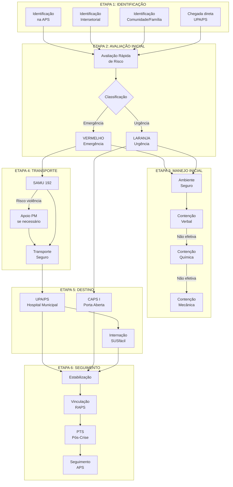
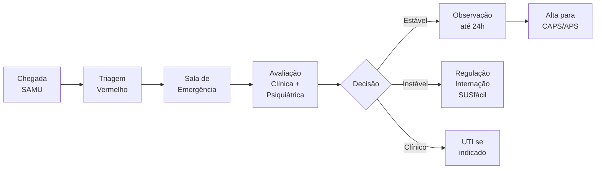

# PROTOCOLO PCC-04: URGÊNCIA E EMERGÊNCIA EM SAÚDE MENTAL
## Fluxo: APS → RUE (SAMU/UPA/PS) → Atenção Especializada RAPS

**Secretaria Municipal de Saúde de Extrema/MG**
**Versão:** 1.0 | **Data:** Janeiro/2026
**Status:** Documento Normativo

---

## 1. OBJETIVO

Normatizar o fluxo de atendimento às urgências e emergências psiquiátricas no município de Extrema/MG, estabelecendo critérios para identificação, manejo inicial, transporte seguro e articulação entre os pontos de atenção da Rede de Urgência e Emergência (RUE) e da Rede de Atenção Psicossocial (RAPS).

---

## 2. PRINCÍPIOS FUNDAMENTAIS

1. **Preservação da Vida:** Prioridade absoluta à segurança do paciente e terceiros
2. **Dignidade:** Tratamento humanizado, sem contenção desnecessária ou exposição vexatória
3. **Menos Restritivo:** Utilizar a intervenção menos restritiva possível
4. **Territorialidade:** Preferência por manejo no território sempre que possível
5. **Continuidade:** Vinculação obrigatória à RAPS após estabilização
6. **Integralidade:** Atenção a comorbidades clínicas associadas

---

## 3. DEFINIÇÕES

| Termo | Definição |
|-------|-----------|
| **Urgência Psiquiátrica** | Condição que requer intervenção em horas a dias para evitar agravamento |
| **Emergência Psiquiátrica** | Risco iminente à vida do paciente ou terceiros, requer intervenção imediata |
| **Crise em Saúde Mental** | Momento de intensificação do sofrimento que pode ou não configurar urgência |
| **Contenção** | Medidas para limitar a movimentação do paciente (verbal, mecânica, química) |
| **RUE** | Rede de Urgência e Emergência (SAMU, UPA, Pronto Socorro) |
| **RAPS** | Rede de Atenção Psicossocial (CAPS, CSM, etc.) |

---

## 4. CLASSIFICAÇÃO DAS SITUAÇÕES DE URGÊNCIA/EMERGÊNCIA

### 4.1 Emergências Psiquiátricas (VERMELHO)

| Situação | Descrição | Risco |
|----------|-----------|-------|
| **Tentativa de suicídio em curso** | Paciente em ato ou imediatamente após tentativa | Iminente |
| **Ideação suicida com plano e acesso a meios** | Intenção declarada + método disponível | Iminente |
| **Heteroagressividade ativa** | Violência física ou ameaça concreta a terceiros | Iminente |
| **Agitação psicomotora grave** | Inquietação extrema, comportamento desorganizado, impossibilidade de contenção verbal | Alto |
| **Sintomas psicóticos com comando imperativo** | Alucinações ordenando auto/heteroagressão | Iminente |
| **Intoxicação aguda grave** | Alteração comportamental severa por substâncias | Alto |
| **Abstinência com delirium tremens** | Confusão, alucinações, instabilidade autonômica | Vital |
| **Síndrome neuroléptica maligna** | Rigidez + febre + alteração de consciência pós-antipsicótico | Vital |
| **Síndrome serotoninérgica** | Agitação + hipertermia + tremor pós-antidepressivo | Vital |

### 4.2 Urgências Psiquiátricas (LARANJA)

| Situação | Descrição | Tempo-Resposta |
|----------|-----------|----------------|
| **Ideação suicida sem plano estruturado** | Pensamentos de morte/suicídio sem planejamento concreto | 24-72h |
| **Autolesão não suicida recente** | Cutting, queimaduras, outras lesões autoprovocadas | 24-72h |
| **Crise de ansiedade incapacitante** | Pânico intenso, despersonalização, impossibilidade funcional | 24-48h |
| **Episódio psicótico agudo** | Primeiro surto ou descompensação, sem comando imperativo | 24-72h |
| **Episódio maníaco/misto** | Euforia, grandiosidade, comportamento de risco | 24-72h |
| **Depressão grave com prostração** | Impossibilidade de autocuidado, recusa alimentar | 24-48h |
| **Uso de substâncias com complicações** | Intoxicação moderada, abstinência sem delirium | 24-48h |

---

## 5. FLUXOGRAMA GERAL



---

## 6. DESCRIÇÃO DETALHADA DAS ETAPAS

### ETAPA 1: IDENTIFICAÇÃO DA SITUAÇÃO DE URGÊNCIA/EMERGÊNCIA

#### 6.1.1 Locais de Identificação

| Local | Responsável pela Identificação | Ação Imediata |
|-------|-------------------------------|---------------|
| **APS/UBS** | Enfermeiro, médico, e-Multi | Classificação + manejo + acionamento SAMU se necessário |
| **Escola/CRAS/CREAS** | Profissional presente | Acolhimento + acionamento SAMU/APS |
| **Domicílio** | ACS, família | Acionamento SAMU 192 |
| **Via pública** | Qualquer cidadão | Acionamento SAMU 192 ou PM 190 |
| **UPA/PS** | Equipe de plantão | Atendimento imediato |

#### 6.1.2 Sinais de Alerta para Emergência

**Observar e perguntar:**
- "Você está pensando em se machucar ou em fazer mal a alguém?"
- "Você tem algum plano de como fazer isso?"
- "Você tem acesso a armas, medicamentos, cordas ou outros meios?"

**Sinais de comportamento:**
- Agitação ou inquietação extrema
- Discurso desorganizado ou bizarro
- Agressividade verbal ou física
- Automutilação ativa
- Recusa total de comunicação com postura de risco
- Intoxicação evidente com alteração comportamental

---

### ETAPA 2: AVALIAÇÃO RÁPIDA DE RISCO

#### 6.2.1 Avaliação em 5 Minutos

```
┌─────────────────────────────────────────────────────────────────────────┐
│              AVALIAÇÃO RÁPIDA DE RISCO - URGÊNCIA SM                   │
├─────────────────────────────────────────────────────────────────────────┤
│ PERGUNTAS ESSENCIAIS (Responder SIM ou NÃO)                            │
├─────────────────────────────────────────────────────────────────────────┤
│ 1. O paciente representa risco IMEDIATO para si mesmo?       [ ]S [ ]N │
│    (tentativa de suicídio em curso, autolesão ativa)                   │
│                                                                         │
│ 2. O paciente representa risco IMEDIATO para terceiros?      [ ]S [ ]N │
│    (agressividade física, ameaças concretas)                           │
│                                                                         │
│ 3. O paciente está em agitação psicomotora grave?            [ ]S [ ]N │
│    (impossibilidade de abordagem verbal)                               │
│                                                                         │
│ 4. Há sinais de intoxicação/abstinência grave?               [ ]S [ ]N │
│    (rebaixamento de consciência, convulsões, alucinações)              │
│                                                                         │
│ 5. Há sinais de gravidade clínica associada?                 [ ]S [ ]N │
│    (febre alta, rigidez, instabilidade de sinais vitais)               │
├─────────────────────────────────────────────────────────────────────────┤
│ INTERPRETAÇÃO:                                                          │
│ • Qualquer SIM em 1-5 = EMERGÊNCIA (VERMELHO) → SAMU 192 imediato      │
│ • Todos NÃO, mas sofrimento intenso = URGÊNCIA (LARANJA)               │
│   → CAPS Porta Aberta ou regulação prioritária                         │
└─────────────────────────────────────────────────────────────────────────┘
```

#### 6.2.2 Avaliação de Risco de Suicídio (Columbia Protocol Simplificado)

Se houver menção a pensamentos de morte ou suicídio:

| Pergunta | Se SIM |
|----------|--------|
| 1. Desejo de estar morto? | Continuar avaliação |
| 2. Pensamentos suicidas não específicos? | Continuar avaliação |
| 3. Pensamento suicida com método (sem plano)? | LARANJA - Urgência |
| 4. Intenção suicida sem plano específico? | LARANJA/VERMELHO |
| 5. Intenção suicida com plano? | **VERMELHO - Emergência** |
| 6. Comportamento suicida recente (tentativa)? | **VERMELHO - Emergência** |

---

### ETAPA 3: MANEJO INICIAL DA CRISE

#### 6.3.1 Princípios Gerais

1. **Segurança primeiro:** Proteger paciente, equipe e terceiros
2. **Ambiente adequado:** Sala sem objetos potencialmente perigosos
3. **Comunicação:** Tom calmo, frases curtas, não confrontar
4. **Menos restritivo:** Sempre tentar contenção verbal primeiro
5. **Documentação:** Registrar todas as intervenções

#### 6.3.2 Contenção Verbal (Primeira Escolha)

**Técnicas:**
- Apresentar-se calmamente, explicar que está ali para ajudar
- Manter distância segura (1-2 metros)
- Postura corporal não ameaçadora (mãos visíveis, sem cruzar braços)
- Tom de voz baixo e constante
- Perguntas abertas: "O que está acontecendo?", "Como posso ajudar?"
- Validar sentimentos: "Percebo que você está muito angustiado(a)"
- Oferecer opções: "Podemos conversar sentados? Você prefere água?"
- Evitar: ordens diretas, confronto, argumentação lógica excessiva

**Tempo de tentativa:** 10-15 minutos antes de escalar para contenção química

#### 6.3.3 Contenção Química (Segunda Escolha)

**Indicações:**
- Falha da contenção verbal
- Agitação com risco para si ou terceiros
- Necessidade de procedimentos urgentes

**Medicações de primeira linha:**

| Situação | Medicação | Dose | Via | Observação |
|----------|-----------|------|-----|------------|
| Agitação sem psicose | Midazolam | 5-15mg | IM | Monitorar respiração |
| Agitação com psicose | Haloperidol | 5mg | IM | + Prometazina 25mg se necessário |
| Agitação com psicose | Haloperidol 5mg + Midazolam 5mg | - | IM | Associação segura |
| Intoxicação por estimulantes | Midazolam | 5-15mg | IM | Evitar antipsicóticos |
| Abstinência alcoólica | Diazepam | 10mg | VO/IM | Repetir se necessário |

**Monitoramento pós-contenção química:**
- Sinais vitais a cada 15 minutos na primeira hora
- Nível de consciência
- Padrão respiratório
- Efeitos extrapiramidais (se antipsicótico)

#### 6.3.4 Contenção Mecânica (Último Recurso)

**Indicações estritas:**
- Falha das contenções verbal e química
- Risco iminente de violência grave
- Necessidade de procedimento vital urgente

**Princípios:**
- Equipe mínima de 5 pessoas
- Materiais adequados (faixas largas, não cordas)
- Contenção de 4 membros + tórax se necessário
- NUNCA contenção em decúbito ventral (risco de asfixia)
- Reavaliação a cada 15 minutos
- Documentação obrigatória
- Liberar assim que possível

**Duração máxima:** 2 horas (reavaliar necessidade)

---

### ETAPA 4: ACIONAMENTO DE TRANSPORTE

#### 6.4.1 SAMU 192 - Acionamento Padrão

**Quando acionar:**
- Toda emergência psiquiátrica (VERMELHO)
- Urgência psiquiátrica (LARANJA) quando:
  - Paciente necessita remoção e não há transporte familiar seguro
  - Risco de descompensação durante trajeto
  - Necessidade de monitoramento

**Informações para a Central de Regulação:**

```
┌─────────────────────────────────────────────────────────────────────────┐
│              ROTEIRO DE ACIONAMENTO - SAMU 192                         │
├─────────────────────────────────────────────────────────────────────────┤
│ 1. Identificação do solicitante e local                                │
│ 2. Identificação do paciente (nome, idade, sexo)                       │
│ 3. Situação atual:                                                      │
│    - "Paciente em surto psicótico com agitação"                        │
│    - "Tentativa de suicídio por [método]"                              │
│    - "Paciente agressivo, já contido"                                  │
│ 4. Risco atual:                                                         │
│    - Há armas ou objetos perigosos?                                    │
│    - Há necessidade de apoio policial?                                 │
│    - Paciente está contido?                                            │
│ 5. Condições clínicas:                                                  │
│    - Está consciente?                                                   │
│    - Sinais vitais (se disponíveis)                                    │
│    - Uso de substâncias?                                               │
│ 6. Destino sugerido (UPA/PS/CAPS)                                      │
└─────────────────────────────────────────────────────────────────────────┘
```

#### 6.4.2 Apoio do Departamento de Segurança Pública

**Quando solicitar (PM 190):**
- Paciente armado ou com acesso a armas
- Histórico ou risco concreto de violência grave
- Ambiente inseguro para equipe de saúde
- Necessidade de contenção que excede capacidade da equipe

**Protocolo de acionamento conjunto:**
1. Acionar SAMU 192 primeiro
2. Informar necessidade de apoio PM
3. PM atua para garantir segurança da cena
4. SAMU realiza atendimento clínico
5. Transporte é realizado pelo SAMU (não viatura policial)
6. PM acompanha se necessário para segurança

**Orientações à PM:**
- O paciente está em crise de saúde, não é criminoso
- Evitar uso de força desproporcional
- Não usar algemas de metal (preferir contenção adequada)
- Auxiliar na remoção de objetos perigosos
- Acompanhar até estabilização se necessário

#### 6.4.3 Transporte Familiar (Excepcional)

**Permitido apenas quando:**
- Urgência LARANJA sem agitação
- Paciente cooperativo
- Familiar capaz de garantir segurança
- Distância curta até o serviço
- Termo de responsabilidade assinado

**Não permitido quando:**
- Qualquer situação VERMELHA
- Agitação ou agressividade
- Risco de fuga ou autolesão durante trajeto
- Familiar em sofrimento intenso

---

### ETAPA 5: DESTINO E ATENDIMENTO NA RUE

#### 6.5.1 UPA / Pronto Socorro Hospital Municipal

**Indicações:**
- Toda emergência psiquiátrica (VERMELHO)
- Necessidade de estabilização clínica
- Risco de complicações orgânicas
- Intoxicação/abstinência grave
- Tentativa de suicídio com lesão física

**Fluxo interno:**



**Atendimento no PS:**
1. Triagem imediata (classificação vermelha)
2. Sala de emergência ou sala de observação segura
3. Avaliação clínica (descartar causas orgânicas)
4. Contenção química se ainda agitado
5. Avaliação psiquiátrica (plantonista ou interconsulta)
6. Exames complementares se indicados:
   - Glicemia capilar (obrigatório)
   - Eletrólitos, função renal, hepática
   - Toxicológico de urina
   - TC crânio (se primeiro episódio ou suspeita orgânica)
7. Decisão: observação, internação ou alta para RAPS

#### 6.5.2 CAPS I - Porta Aberta

**Indicações:**
- Urgência LARANJA sem necessidade de estabilização clínica
- Crise em usuário já vinculado ao CAPS
- Pós-estabilização no PS (alta para CAPS)

**Horário de funcionamento:** 8h às 18h, segunda a sexta

**Fluxo:**
1. Acolhimento imediato pela equipe
2. Avaliação de risco
3. Plano de crise (manejo intensivo)
4. Contato com família
5. Decisão: atendimento-dia intensivo ou encaminhamento

**Fora do horário:**
- Encaminhar para UPA/PS
- CAPS recebe caso no próximo dia útil

#### 6.5.3 Regulação de Internação Psiquiátrica

**Quando indicar internação:**
- Risco persistente de suicídio/heteroagressão após manejo inicial
- Impossibilidade de tratamento ambulatorial/CAPS
- Ausência de suporte familiar/social mínimo
- Condição clínica que exige ambiente hospitalar

**Tipos de internação (Lei 10.216/2001):**

| Tipo | Definição | Requisitos |
|------|-----------|------------|
| **Voluntária** | Com consentimento do paciente | Termo assinado |
| **Involuntária** | Sem consentimento, a pedido de terceiro | Laudo médico + comunicação ao MP em 72h |
| **Compulsória** | Determinada por autoridade judicial | Ordem judicial |

**Fluxo de regulação:**
1. Médico do PS preenche solicitação no SUSfácil
2. Regulador avalia e autoriza vaga
3. Transferência para hospital de referência
4. Comunicação ao CAPS do território para seguimento pós-alta

---

### ETAPA 6: SEGUIMENTO PÓS-CRISE

#### 6.6.1 Vinculação Obrigatória à RAPS

**Todo paciente atendido por urgência/emergência psiquiátrica deve:**
1. Ser notificado ao CAPS do território (em até 24h)
2. Ter agendamento na RAPS (até 7 dias pós-alta)
3. Receber orientações por escrito (medicações, sinais de alerta)
4. Ter familiar/responsável contatado

#### 6.6.2 Notificação ao CAPS

**Conteúdo da notificação:**

```
┌─────────────────────────────────────────────────────────────────────────┐
│           NOTIFICAÇÃO DE ATENDIMENTO DE URGÊNCIA AO CAPS               │
├─────────────────────────────────────────────────────────────────────────┤
│ Data/hora do atendimento: ___/___/_____ às _____h                      │
│ Local do atendimento: [ ]UPA [ ]PS Hospital [ ]Outro: _______          │
│                                                                         │
│ IDENTIFICAÇÃO DO PACIENTE                                              │
│ Nome: ______________________________________ CNS: _______________      │
│ Data nascimento: ___/___/_____ Endereço: ___________________________   │
│ Telefone: ___________________ UBS de referência: ___________________   │
│                                                                         │
│ MOTIVO DO ATENDIMENTO                                                  │
│ [ ] Tentativa de suicídio    [ ] Ideação suicida                       │
│ [ ] Surto psicótico          [ ] Agitação psicomotora                  │
│ [ ] Intoxicação por SPA      [ ] Abstinência                           │
│ [ ] Outro: _________________________________________________           │
│                                                                         │
│ DESFECHO                                                               │
│ [ ] Alta para domicílio      [ ] Observação (até 24h)                  │
│ [ ] Internação hospitalar    [ ] Transferência                         │
│                                                                         │
│ CONDUTA RECOMENDADA                                                    │
│ [ ] Busca ativa em 24-72h    [ ] Agendamento CAPS                      │
│ [ ] Agendamento CSM          [ ] Acompanhamento APS                    │
│                                                                         │
│ Medicações de alta: _____________________________________________      │
│ Observações: ____________________________________________________      │
│                                                                         │
│ Profissional notificante: ______________________ CRM/COREN: __________│
└─────────────────────────────────────────────────────────────────────────┘
```

#### 6.6.3 Plano de Segurança Pós-Crise

Para pacientes com tentativa ou ideação suicida, elaborar junto ao paciente e família:

```
┌─────────────────────────────────────────────────────────────────────────┐
│                    PLANO DE SEGURANÇA PÓS-CRISE                        │
├─────────────────────────────────────────────────────────────────────────┤
│ Paciente: _________________________________________ Data: ___/___/___  │
├─────────────────────────────────────────────────────────────────────────┤
│ 1. SINAIS DE ALERTA (O que percebo quando estou piorando)              │
│ ________________________________________________________________       │
│ ________________________________________________________________       │
├─────────────────────────────────────────────────────────────────────────┤
│ 2. ESTRATÉGIAS DE ENFRENTAMENTO (O que posso fazer sozinho)            │
│ ________________________________________________________________       │
│ ________________________________________________________________       │
├─────────────────────────────────────────────────────────────────────────┤
│ 3. PESSOAS QUE POSSO PROCURAR (Nome e telefone)                        │
│ 1) _________________________________ Tel: _____________________        │
│ 2) _________________________________ Tel: _____________________        │
│ 3) _________________________________ Tel: _____________________        │
├─────────────────────────────────────────────────────────────────────────┤
│ 4. SERVIÇOS DE EMERGÊNCIA                                              │
│ • CVV: 188 (24 horas)                                                  │
│ • SAMU: 192                                                            │
│ • CAPS Extrema: (35) XXXX-XXXX                                         │
│ • UPA Extrema: (35) XXXX-XXXX                                          │
├─────────────────────────────────────────────────────────────────────────┤
│ 5. AMBIENTE SEGURO (Remover ou restringir acesso a:)                   │
│ [ ] Medicamentos    [ ] Armas    [ ] Cordas/cintos                     │
│ [ ] Pesticidas      [ ] Outros: _______________________________        │
│ Responsável por guardar: ______________________________________        │
├─────────────────────────────────────────────────────────────────────────┤
│ 6. MOTIVOS PARA VIVER (O que me mantém aqui)                           │
│ ________________________________________________________________       │
│ ________________________________________________________________       │
├─────────────────────────────────────────────────────────────────────────┤
│ Assinatura do paciente: ___________________________________________    │
│ Assinatura do familiar: ___________________________________________    │
│ Profissional: ________________________ Registro: __________________    │
└─────────────────────────────────────────────────────────────────────────┘
```

#### 6.6.4 Seguimento pela APS

**Ações obrigatórias da UBS após notificação:**
1. Busca ativa pelo ACS em 24-72 horas
2. Agendamento de consulta médica/enfermagem em até 7 dias
3. Verificação de adesão às medicações
4. Monitoramento de sinais de alerta
5. Comunicação com CAPS sobre evolução
6. Inclusão no PTS com revisão do plano de cuidado

---

## 7. SITUAÇÕES ESPECIAIS

### 7.1 Crianças e Adolescentes

- Sempre acionar Conselho Tutelar se risco
- Preferência por manejo menos restritivo
- Contenção mecânica: último recurso, equipe pediátrica
- Notificação obrigatória de violência autoprovocada (SINAN)
- Internação: comunicação ao Juizado da Infância

### 7.2 Gestantes

- Evitar benzodiazepínicos no 1º trimestre
- Haloperidol: categoria C (usar se benefício > risco)
- Monitoramento obstétrico concomitante
- Comunicar pré-natal de alto risco

### 7.3 Idosos

- Maior risco de delirium (descartar causa orgânica)
- Doses reduzidas de medicações (50% da dose adulta)
- Maior risco de efeitos adversos
- Considerar demência como diagnóstico diferencial

### 7.4 Pessoa em Situação de Rua

- Acionar Consultório na Rua (se disponível)
- Articular com Assistência Social (CREAS)
- Abrigamento temporário pode ser necessário
- Vinculação ao CAPS com busca ativa

---

## 8. NOTIFICAÇÕES COMPULSÓRIAS

| Situação | Sistema | Prazo |
|----------|---------|-------|
| Tentativa de suicídio | SINAN - Violência autoprovocada | Imediato (até 24h) |
| Violência contra criança/adolescente | SINAN + Conselho Tutelar | Imediato |
| Violência contra idoso | SINAN + Delegacia do Idoso | Imediato |
| Violência contra mulher | SINAN | Imediato |
| Intoxicação por drogas | SINAN (se indicado) | Semanal |

---

## 9. INDICADORES DE MONITORAMENTO

| Indicador | Fórmula | Meta | Periodicidade |
|-----------|---------|------|---------------|
| Tempo resposta SAMU (chamados SM) | Média minutos (acionamento → chegada) | ≤ 20 min | Mensal |
| Taxa de contenção mecânica | (Contenções mecânicas / Atendimentos urgência SM) x 100 | ≤ 10% | Mensal |
| Taxa de vinculação RAPS pós-urgência | (Vinculados em 7d / Total urgências) x 100 | ≥ 80% | Mensal |
| Taxa de retorno à urgência em 30 dias | (Retornos / Total atendidos) x 100 | ≤ 20% | Mensal |
| Taxa de notificação de TS | (Notificados / Atendidos por TS) x 100 | 100% | Mensal |

---

## 10. CONTATOS DE EMERGÊNCIA

| Serviço | Telefone | Horário |
|---------|----------|---------|
| SAMU | 192 | 24 horas |
| Polícia Militar | 190 | 24 horas |
| CVV (apoio emocional) | 188 | 24 horas |
| CAPS I Extrema | (35) XXXX-XXXX | 8h-18h seg-sex |
| UPA Extrema | (35) XXXX-XXXX | 24 horas |
| Hospital Municipal | (35) XXXX-XXXX | 24 horas |
| Conselho Tutelar | (35) XXXX-XXXX | Conforme plantão |

---

## 11. REFERÊNCIAS

1. Brasil. Lei nº 10.216/2001 - Reforma Psiquiátrica.
2. Brasil. Portaria GM/MS nº 3.088/2011 - RAPS.
3. Brasil. Ministério da Saúde. Prevenção do Suicídio: Manual dirigido a profissionais de saúde da APS. 2022.
4. ABP. Emergências Psiquiátricas: Diretrizes da Associação Brasileira de Psiquiatria. 2021.
5. OMS. Prevenção do Suicídio: Um recurso para conselheiros. 2006.
6. Secretaria Municipal de Saúde de Extrema. Protocolo RUE. 2026.

---

*Aprovado pela Coordenação de Saúde Mental de Extrema/MG*
*Data: Janeiro/2026*
