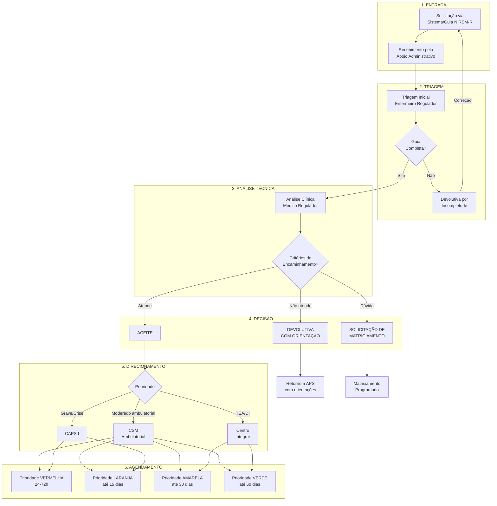

# PROTOCOLO REG-01: REGULAÇÃO DO ACESSO À ATENÇÃO ESPECIALIZADA
## Núcleo Interno de Regulação em Saúde Mental (NIRSM-R)

**Secretaria Municipal de Saúde de Extrema/MG**
**Versão:** 1.0 | **Data:** Janeiro/2026
**Status:** Documento Normativo

---

## 1. OBJETIVO

Normatizar o funcionamento do Núcleo Interno de Regulação em Saúde Mental (NIRSM-R), estabelecendo critérios técnicos para análise, aceite, devolutiva e priorização dos encaminhamentos da Atenção Primária à Saúde (APS) para a Atenção Especializada em Saúde Mental (AES-SM) da RAPS de Extrema/MG.

---

## 2. CONCEITO E FUNÇÃO DO NIRSM-R

### 2.1 Definição

O NIRSM-R é o dispositivo de **regulação do acesso** aos serviços especializados em saúde mental do município. Funciona como **gatekeeper qualificado**, garantindo que:

1. Os encaminhamentos sejam **pertinentes** e **completos**
2. Os casos sejam **direcionados** ao ponto de atenção mais adequado
3. A APS seja **apoiada** no manejo dos casos que podem permanecer no território
4. Os **tempos de espera** sejam monitorados e reduzidos
5. A **equidade** no acesso seja garantida (priorização por risco)

### 2.2 Princípios

| Princípio | Descrição |
|-----------|-----------|
| **Equidade** | Priorização conforme gravidade clínica e vulnerabilidade |
| **Integralidade** | Visão do caso em sua totalidade, não apenas da queixa |
| **Longitudinalidade** | Manutenção do vínculo com APS mesmo após encaminhamento |
| **Resolutividade** | Apoio à APS para resolver o que é de sua competência |
| **Transparência** | Critérios claros e conhecidos por toda a rede |

---

## 3. ESTRUTURA E FUNCIONAMENTO

### 3.1 Composição da Equipe Reguladora

| Profissional | Função | Carga Horária |
|--------------|--------|---------------|
| **Coordenador(a) de Saúde Mental** | Supervisão geral, decisões complexas | Parcial |
| **Médico(a) Regulador(a)** | Análise técnica, decisão de aceite/devolutiva | Parcial |
| **Enfermeiro(a) Regulador(a)** | Triagem inicial, verificação de completude | Parcial |
| **Apoio Administrativo** | Gestão de filas, agendamentos, relatórios | Integral |

### 3.2 Fluxo Operacional



### 3.3 Horário de Funcionamento

| Atividade | Horário | Frequência |
|-----------|---------|------------|
| Recebimento de solicitações | 8h-17h | Segunda a sexta |
| Análise de casos | 8h-12h | Diária |
| Agendamentos | 13h-17h | Diária |
| Reunião de regulação | 8h-9h | Quarta-feira |
| Devolutivas e orientações | 14h-16h | Terça e quinta |

---

## 4. CRITÉRIOS DE ENCAMINHAMENTO

### 4.1 Critérios Gerais para Aceite

**Para que um encaminhamento seja ACEITO, deve atender a TODOS os critérios:**

1. **Guia de Referência NIRSM-R completa** (ver checklist abaixo)
2. **Avaliação prévia por AMBAS as equipes da APS** (e-ESF E e-Multi)
3. **Critério clínico específico** para atenção especializada (ver 4.3)
4. **Tentativa documentada de manejo na APS** (exceto casos de porta aberta)

### 4.2 Checklist de Completude da Guia

```
┌─────────────────────────────────────────────────────────────────────────┐
│     CHECKLIST DE COMPLETUDE - GUIA DE REFERÊNCIA NIRSM-R               │
├─────────────────────────────────────────────────────────────────────────┤
│ CAMPOS OBRIGATÓRIOS                                         PRESENTE?  │
├─────────────────────────────────────────────────────────────────────────┤
│ IDENTIFICAÇÃO DO PACIENTE                                              │
│ [ ] Nome completo                                                      │
│ [ ] Data de nascimento                                                 │
│ [ ] CNS (Cartão Nacional de Saúde)                                     │
│ [ ] Endereço completo com telefone                                     │
│ [ ] UBS de referência                                                  │
├─────────────────────────────────────────────────────────────────────────┤
│ DADOS CLÍNICOS                                                         │
│ [ ] Hipótese diagnóstica (CID-10)                                      │
│ [ ] Queixa principal e história atual                                  │
│ [ ] Tempo de evolução dos sintomas                                     │
│ [ ] Tratamentos já realizados na APS                                   │
│ [ ] Medicações em uso (com doses)                                      │
│ [ ] Motivo específico do encaminhamento                                │
├─────────────────────────────────────────────────────────────────────────┤
│ AVALIAÇÕES REALIZADAS                                                  │
│ [ ] Avaliação médica da e-ESF (data e assinatura)                      │
│ [ ] Avaliação da e-Multi (data e assinatura)                           │
│ [ ] Classificação de risco (CuidaSM ou similar)                        │
│ [ ] Instrumentos aplicados (PHQ-9, GAD-7, etc.) - se disponíveis       │
├─────────────────────────────────────────────────────────────────────────┤
│ INFORMAÇÕES COMPLEMENTARES                                             │
│ [ ] Exames laboratoriais pertinentes (se realizados)                   │
│ [ ] Resumo de internações/atendimentos prévios (se houver)             │
│ [ ] Informações relevantes sobre contexto social/familiar              │
├─────────────────────────────────────────────────────────────────────────┤
│ RESULTADO DA TRIAGEM                                                   │
│ [ ] Todos os campos obrigatórios presentes = COMPLETA                  │
│ [ ] Campos faltantes = DEVOLUTIVA POR INCOMPLETUDE                     │
│                                                                         │
│ Data: ___/___/_____ Responsável: _____________________________________│
└─────────────────────────────────────────────────────────────────────────┘
```

### 4.3 Critérios Clínicos Específicos por Condição

#### 4.3.1 Depressão

| Critério | Destino |
|----------|---------|
| Depressão leve a moderada, primeiro episódio | APS |
| Depressão leve/moderada responsiva a ISRS | APS |
| Depressão moderada **refratária** (falha de 2 ISRS em dose plena por 8+ semanas cada) | CSM |
| Depressão grave com sintomas psicóticos | CAPS I |
| Depressão com risco de suicídio elevado | CAPS I (Porta Aberta) |
| Depressão em comorbidade com bipolaridade suspeita | CSM |

**Definição de refratariedade:**
- Uso de pelo menos 2 antidepressivos diferentes
- Em dose plena (ex: Sertralina 100-200mg, Fluoxetina 40-60mg)
- Por tempo adequado (mínimo 8 semanas cada)
- Com adesão confirmada

#### 4.3.2 Transtornos de Ansiedade

| Critério | Destino |
|----------|---------|
| TAG leve/moderado, responsivo a ISRS | APS |
| Pânico com resposta parcial | APS + tele-matriciamento |
| TAG/Pânico **refratário** (falha de ISRS + intervenção psicossocial por 12 semanas) | CSM |
| TOC (qualquer gravidade) | CSM |
| TEPT moderado/grave | CSM |
| Fobias específicas incapacitantes | CSM |

#### 4.3.3 Transtornos Psicóticos

| Critério | Destino |
|----------|---------|
| Primeiro episódio psicótico | CAPS I |
| Esquizofrenia estável, necessidade de ajuste | CSM |
| Esquizofrenia com sintomas residuais | CAPS I (modalidade não intensiva) |
| Psicose com descompensação aguda | CAPS I (Porta Aberta) |
| Psicose com comorbidade clínica complexa | CSM + interconsulta |

#### 4.3.4 Transtorno Bipolar

| Critério | Destino |
|----------|---------|
| Suspeita de bipolaridade (nunca diagnosticado) | CSM |
| Bipolar tipo I ou II estável, necessidade de ajuste | CSM |
| Episódio maníaco/misto agudo | CAPS I |
| Ciclagem rápida | CSM + CAPS I |
| Depressão bipolar refratária | CSM |

#### 4.3.5 TEA e Deficiência Intelectual

| Critério | Destino |
|----------|---------|
| Suspeita de TEA em crianças < 3 anos | Centro Integrar (estimulação precoce) |
| Suspeita de TEA em crianças 3-12 anos | Centro Integrar |
| TEA confirmado + comorbidade psiquiátrica | Centro Integrar + CSM/CAPS |
| TEA em adolescentes/adultos (primeira avaliação) | Centro Integrar |
| Deficiência intelectual + comportamento desafiador | Centro Integrar |

#### 4.3.6 Transtornos por Uso de Substâncias

| Critério | Destino |
|----------|---------|
| Uso problemático de álcool sem dependência grave | APS + CAPS AD (se disponível) ou CAPS I |
| Dependência de álcool com síndrome de abstinência | CAPS I |
| Uso de múltiplas substâncias | CAPS I |
| Comorbidade psiquiátrica + SPA | CAPS I |

### 4.4 Critérios de NÃO ACEITE (Devolutiva)

O encaminhamento será **DEVOLVIDO** quando:

1. **Guia incompleta** - campos obrigatórios faltantes
2. **Sem avaliação prévia pela APS** - caso não foi avaliado por e-ESF E e-Multi
3. **Sem tentativa de manejo na APS** - nenhuma intervenção documentada
4. **Condição manejável na APS** - não atende critérios de especializada
5. **Duplicidade** - caso já em acompanhamento na AES
6. **Destino inadequado** - caso enviado para serviço errado

---

## 5. CLASSIFICAÇÃO DE PRIORIDADE

### 5.1 Matriz de Priorização

| Prioridade | Cor | Critérios | Tempo Máximo para Agendamento |
|------------|-----|-----------|-------------------------------|
| **P1** | VERMELHA | Risco de suicídio atual; psicose aguda; crise não contida na APS | 24-72 horas |
| **P2** | LARANJA | Depressão grave; bipolar em descompensação inicial; risco moderado | Até 15 dias |
| **P3** | AMARELA | Depressão moderada refratária; ansiedade grave; primeiro diagnóstico | Até 30 dias |
| **P4** | VERDE | Casos estáveis para reavaliação; ajustes medicamentosos não urgentes | Até 60 dias |

### 5.2 Critérios de Priorização Adicional

Além da gravidade clínica, considerar:

| Fator | Impacto na Prioridade |
|-------|----------------------|
| Gestante | +1 nível |
| Criança/adolescente | +1 nível |
| Idoso > 65 anos | Avaliar caso a caso |
| Situação de rua | +1 nível |
| Tentativa de suicídio prévia recente (< 6 meses) | +1 nível |
| Vulnerabilidade social extrema | +1 nível |

---

## 6. PROCESSO DE DEVOLUTIVA

### 6.1 Tipos de Devolutiva

| Tipo | Motivo | Ação |
|------|--------|------|
| **Incompletude** | Guia com campos obrigatórios faltantes | Retornar para complementação |
| **Técnica** | Não atende critérios de AES | Orientar manejo na APS + oferecer matriciamento |
| **Redirecionamento** | Caso indicado para outro serviço | Indicar serviço correto |

### 6.2 Estrutura da Devolutiva

```
┌─────────────────────────────────────────────────────────────────────────┐
│                    DEVOLUTIVA DE ENCAMINHAMENTO                        │
│                           NIRSM-R EXTREMA                              │
├─────────────────────────────────────────────────────────────────────────┤
│ Data: ___/___/_____                                                     │
│ UBS de Origem: _______________________________________________________│
│ Paciente: ____________________________________________________________│
│ CNS: _________________________________________________________________│
│ Protocolo nº: ________________________________________________________│
├─────────────────────────────────────────────────────────────────────────┤
│ MOTIVO DA DEVOLUTIVA                                                   │
│                                                                         │
│ [ ] INCOMPLETUDE - Campos faltantes:                                   │
│     ________________________________________________________________   │
│     ________________________________________________________________   │
│                                                                         │
│ [ ] NÃO ATENDE CRITÉRIOS TÉCNICOS                                      │
│     Justificativa: _________________________________________________   │
│     ________________________________________________________________   │
│                                                                         │
│ [ ] REDIRECIONAMENTO                                                   │
│     Serviço indicado: ______________________________________________   │
├─────────────────────────────────────────────────────────────────────────┤
│ ORIENTAÇÕES PARA A EQUIPE APS                                          │
│                                                                         │
│ Conduta sugerida:                                                       │
│ ______________________________________________________________________ │
│ ______________________________________________________________________ │
│ ______________________________________________________________________ │
│                                                                         │
│ Medicações sugeridas (se aplicável):                                   │
│ ______________________________________________________________________ │
│                                                                         │
│ Sinais de alerta para re-encaminhamento:                               │
│ ______________________________________________________________________ │
│ ______________________________________________________________________ │
├─────────────────────────────────────────────────────────────────────────┤
│ OFERTA DE MATRICIAMENTO                                                │
│                                                                         │
│ [ ] Disponível na próxima sessão de tele-matriciamento                 │
│     Data/horário: ________________                                     │
│ [ ] Solicitar inclusão em pauta de matriciamento presencial            │
├─────────────────────────────────────────────────────────────────────────┤
│ Médico Regulador: ____________________________ CRM: __________________│
│ Enfermeiro Regulador: ________________________ COREN: ________________│
└─────────────────────────────────────────────────────────────────────────┘
```

### 6.3 Fluxo Pós-Devolutiva

1. **UBS recebe devolutiva** (via sistema ou documento físico)
2. **Profissional de referência analisa** as orientações
3. **Três possibilidades:**
   - **Corrigir e reenviar** (se incompletude)
   - **Implementar orientações** e manter na APS
   - **Solicitar matriciamento** para discussão do caso

---

## 7. MATRICIAMENTO INTEGRADO À REGULAÇÃO

### 7.1 Conceito

O matriciamento é ferramenta complementar à regulação, permitindo:
- Discussão de casos devolvidos
- Capacitação da APS para manejo
- Compartilhamento de conhecimento sem transferência do caso
- Redução de encaminhamentos desnecessários

### 7.2 Modalidades

| Modalidade | Frequência | Participantes | Casos |
|------------|------------|---------------|-------|
| **Tele-matriciamento** | Semanal | APS + CSM + CAPS | 5-8 casos/sessão |
| **Matriciamento presencial** | Quinzenal | APS + Matriciadores SM | Casos complexos |
| **Interconsulta regulada** | Sob demanda | Especialista + Paciente + APS | Avaliação pontual |

### 7.3 Integração com NIRSM-R

- Casos devolvidos são **automaticamente oferecidos** para matriciamento
- Equipe APS pode **solicitar inclusão** em pauta antes de reencaminhar
- Matriciador pode **reverter devolutiva** se caso for pertinente após discussão

---

## 8. MONITORAMENTO E GESTÃO DE FILAS

### 8.1 Painel de Indicadores (Mínimo Mensal)

| Indicador | Descrição | Meta |
|-----------|-----------|------|
| **Tempo médio de análise** | Dias entre recebimento e decisão | ≤ 5 dias úteis |
| **Taxa de aceite** | % de encaminhamentos aceitos | 60-70% |
| **Taxa de devolutiva por incompletude** | % devolvido por guia incompleta | ≤ 15% |
| **Taxa de devolutiva técnica** | % devolvido por não atender critérios | 15-25% |
| **Tempo médio para agendamento (por prioridade)** | Dias entre aceite e consulta | Conforme matriz |
| **Fila de espera por serviço** | Nº de pacientes aguardando | Monitorar tendência |

### 8.2 Reunião de Regulação

**Frequência:** Semanal (quarta-feira, 8h-9h)

**Pauta:**
1. Revisão de indicadores da semana
2. Casos complexos para decisão colegiada
3. Discussão de devolutivas contestadas
4. Planejamento de capacidade
5. Identificação de necessidades de capacitação da APS

---

## 9. GUIA DE REFERÊNCIA NIRSM-R (FORMULÁRIO)

```
┌─────────────────────────────────────────────────────────────────────────┐
│           GUIA DE REFERÊNCIA PARA ATENÇÃO ESPECIALIZADA                │
│                     EM SAÚDE MENTAL - NIRSM-R                          │
│              Secretaria Municipal de Saúde - Extrema/MG                │
├─────────────────────────────────────────────────────────────────────────┤
│                                                      Protocolo nº _____|
│ Data da solicitação: ___/___/_____                                     │
├─────────────────────────────────────────────────────────────────────────┤
│ 1. IDENTIFICAÇÃO DO PACIENTE                                           │
├─────────────────────────────────────────────────────────────────────────┤
│ Nome completo: ______________________________________________________ │
│ Data de nascimento: ___/___/_____ Idade: _____ Sexo: ( )M ( )F ( )Outro│
│ CNS: ___________________________ CPF: ____________________________    │
│ Nome da mãe: _______________________________________________________ │
│ Endereço: __________________________________________________________ │
│ Bairro: _________________ Cidade: Extrema/MG CEP: ___________________ │
│ Telefone 1: _________________ Telefone 2: ___________________________ │
│ UBS de referência: _________________________________________________ │
│ ACS responsável: ___________________________________________________ │
├─────────────────────────────────────────────────────────────────────────┤
│ 2. DADOS CLÍNICOS                                                      │
├─────────────────────────────────────────────────────────────────────────┤
│ Hipótese diagnóstica principal: ___________________________ CID: _____ │
│ Hipóteses secundárias: __________________________________ CID: _____ │
│                                                                         │
│ Queixa principal:                                                       │
│ ______________________________________________________________________ │
│ ______________________________________________________________________ │
│                                                                         │
│ História da doença atual (início, evolução, fatores desencadeantes):   │
│ ______________________________________________________________________ │
│ ______________________________________________________________________ │
│ ______________________________________________________________________ │
│ ______________________________________________________________________ │
│                                                                         │
│ Tempo de evolução dos sintomas: ______________________________________ │
│                                                                         │
│ Antecedentes psiquiátricos:                                            │
│ Internações prévias? ( )Não ( )Sim - Quantas: ___ Último ano: _______ │
│ Tentativas de suicídio? ( )Não ( )Sim - Quantas: ___ Último: _________ │
│ Acompanhamento prévio em SM? ( )Não ( )Sim - Onde: __________________ │
│                                                                         │
│ Antecedentes clínicos relevantes:                                      │
│ ______________________________________________________________________ │
│                                                                         │
│ História familiar de transtornos mentais:                              │
│ ______________________________________________________________________ │
│                                                                         │
│ Uso de substâncias psicoativas:                                        │
│ ( )Não ( )Álcool ( )Tabaco ( )Maconha ( )Cocaína/Crack ( )Outras: ____ │
│ Padrão de uso: _____________________________________________________ │
├─────────────────────────────────────────────────────────────────────────┤
│ 3. AVALIAÇÃO DE RISCO                                                  │
├─────────────────────────────────────────────────────────────────────────┤
│ Classificação de risco atual:                                          │
│ ( ) BAIXO   ( ) MODERADO   ( ) ALTO   ( ) MUITO ALTO                   │
│                                                                         │
│ Escala CuidaSM aplicada? ( )Não ( )Sim - Nível: ______________________ │
│                                                                         │
│ Risco de suicídio: ( )Não avaliado ( )Baixo ( )Moderado ( )Alto        │
│ Justificativa: _____________________________________________________ │
│                                                                         │
│ Risco de heteroagressividade: ( )Não ( )Baixo ( )Moderado ( )Alto      │
│                                                                         │
│ Instrumentos aplicados (anexar resultados):                            │
│ ( )PHQ-9: ___ pontos  ( )GAD-7: ___ pontos  ( )AUDIT: ___ pontos       │
│ ( )M-CHAT-R: ___ pontos  ( )Outro: __________________________________ │
├─────────────────────────────────────────────────────────────────────────┤
│ 4. TRATAMENTO REALIZADO NA APS                                         │
├─────────────────────────────────────────────────────────────────────────┤
│ Medicações utilizadas (com doses e tempo de uso):                      │
│ 1) ______________________________________ Dose: ______ Tempo: ________ │
│ 2) ______________________________________ Dose: ______ Tempo: ________ │
│ 3) ______________________________________ Dose: ______ Tempo: ________ │
│                                                                         │
│ Resposta ao tratamento:                                                │
│ ( )Boa resposta ( )Resposta parcial ( )Sem resposta ( )Efeitos adversos│
│ Detalhamento: ______________________________________________________ │
│                                                                         │
│ Intervenções psicossociais realizadas:                                 │
│ ( )Psicoterapia/escuta qualificada ( )Grupo terapêutico                │
│ ( )Orientação familiar ( )Articulação intersetorial                    │
│ ( )Visita domiciliar ( )Outras: ____________________________________ │
│                                                                         │
│ Exames laboratoriais realizados (anexar):                              │
│ ( )Hemograma ( )TSH/T4L ( )Glicemia ( )Função hepática ( )Função renal │
│ ( )Outros: _________________________________________________________ │
├─────────────────────────────────────────────────────────────────────────┤
│ 5. MOTIVO DO ENCAMINHAMENTO                                            │
├─────────────────────────────────────────────────────────────────────────┤
│ ( ) Refratariedade ao tratamento inicial                               │
│ ( ) Necessidade de avaliação diagnóstica especializada                 │
│ ( ) Necessidade de ajuste medicamentoso complexo                       │
│ ( ) Gravidade do quadro (especificar): ______________________________ │
│ ( ) Comorbidade psiquiátrica                                           │
│ ( ) Suspeita de TEA/TDAH/DI                                            │
│ ( ) Outro: _________________________________________________________ │
│                                                                         │
│ O que se espera da avaliação especializada?                            │
│ ______________________________________________________________________ │
│ ______________________________________________________________________ │
├─────────────────────────────────────────────────────────────────────────┤
│ 6. MEDICAÇÕES ATUAIS (Todas em uso)                                    │
├─────────────────────────────────────────────────────────────────────────┤
│ Medicação                    │ Dose      │ Posologia                   │
│ _____________________________|___________|_____________________________|
│ _____________________________|___________|_____________________________|
│ _____________________________|___________|_____________________________|
│ _____________________________|___________|_____________________________|
├─────────────────────────────────────────────────────────────────────────┤
│ 7. SERVIÇO SOLICITADO                                                  │
├─────────────────────────────────────────────────────────────────────────┤
│ ( ) CSM - Centro de Saúde Mental (ambulatorial)                        │
│ ( ) CAPS I (transtornos graves/crises)                                 │
│ ( ) Centro Integrar (TEA/DI/Reabilitação)                              │
├─────────────────────────────────────────────────────────────────────────┤
│ 8. ASSINATURAS                                                         │
├─────────────────────────────────────────────────────────────────────────┤
│ AVALIAÇÃO e-ESF                                                        │
│ Profissional: ______________________________ Data: ___/___/_____       │
│ Categoria: ( )Médico(a) ( )Enfermeiro(a)    Registro: ______________   │
│ Assinatura: _________________________________________________________│
│                                                                         │
│ AVALIAÇÃO e-MULTI                                                      │
│ Profissional: ______________________________ Data: ___/___/_____       │
│ Categoria: _________________________________ Registro: ______________   │
│ Assinatura: _________________________________________________________│
├─────────────────────────────────────────────────────────────────────────┤
│ 9. USO EXCLUSIVO NIRSM-R                                               │
├─────────────────────────────────────────────────────────────────────────┤
│ Data do recebimento: ___/___/_____                                     │
│ Triagem: ( )Completa ( )Incompleta - Campos: ________________________ │
│                                                                         │
│ Decisão: ( )ACEITO ( )DEVOLVIDO                                        │
│ Prioridade: ( )P1-Vermelha ( )P2-Laranja ( )P3-Amarela ( )P4-Verde     │
│ Destino: ( )CSM ( )CAPS I ( )Centro Integrar                           │
│                                                                         │
│ Data do agendamento: ___/___/_____                                     │
│ Regulador: ___________________________ CRM/COREN: ________________     │
└─────────────────────────────────────────────────────────────────────────┘
```

---

## 10. RESPONSABILIDADES

### 10.1 APS (Solicitante)
- Preencher Guia NIRSM-R de forma completa e legível
- Garantir avaliação por e-ESF E e-Multi
- Tentar manejo inicial antes de encaminhar
- Implementar orientações de devolutivas
- Manter acompanhamento durante espera

### 10.2 NIRSM-R
- Analisar encaminhamentos em tempo hábil
- Aplicar critérios de forma transparente e equitativa
- Fornecer devolutivas qualificadas com orientação
- Monitorar filas e tempos de espera
- Articular matriciamento quando necessário

### 10.3 AES (Serviços de Destino)
- Disponibilizar agenda conforme capacidade
- Informar vagas ao NIRSM-R
- Comunicar não comparecimentos
- Contrarreferir adequadamente

---

## 11. INDICADORES DE QUALIDADE

| Indicador | Meta | Periodicidade |
|-----------|------|---------------|
| % de Guias com preenchimento completo | ≥ 85% | Mensal |
| Tempo médio entre solicitação e decisão | ≤ 5 dias úteis | Mensal |
| Taxa de aceite global | 60-70% | Mensal |
| % de P1 agendados em até 72h | ≥ 95% | Mensal |
| % de P2 agendados em até 15 dias | ≥ 90% | Mensal |
| % de P3 agendados em até 30 dias | ≥ 85% | Mensal |
| Taxa de absenteísmo (faltas) | ≤ 15% | Mensal |
| Satisfação da APS com devolutivas | ≥ 80% | Trimestral |

---

## 12. REFERÊNCIAS

1. Brasil. Ministério da Saúde. Manual de Regulação do Acesso. 2017.
2. Brasil. Portaria GM/MS nº 3.088/2011 - RAPS.
3. TelessaúdeRS-UFRGS. Protocolos de Encaminhamento para Psiquiatria. 2023.
4. Secretaria Municipal de Saúde de Extrema. Plano Municipal de Saúde. 2026.

---

*Aprovado pela Coordenação de Saúde Mental de Extrema/MG*
*Data: Janeiro/2026*
