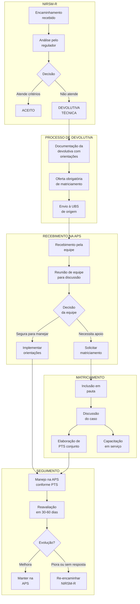

# PROTOCOLO REG-02: NÃO ACEITAÇÃO DE CASOS E MATRICIAMENTO RETROATIVO
## Fluxo: NIRSM-R → APS (Devolutiva) → Matriciamento em Saúde Mental

**Secretaria Municipal de Saúde de Extrema/MG**
**Versão:** 1.0 | **Data:** Janeiro/2026
**Status:** Documento Normativo

---

## 1. OBJETIVO

Normatizar o fluxo de casos não aceitos pelo NIRSM-R para Atenção Especializada em Saúde Mental, estabelecendo a obrigatoriedade do matriciamento como estratégia de apoio à APS para qualificação do manejo e garantia da continuidade do cuidado no território.

---

## 2. JUSTIFICATIVA

A devolutiva de casos pela regulação NÃO significa abandono do paciente. Pelo contrário, representa:

1. **Reconhecimento da competência da APS** para manejar casos de menor complexidade
2. **Oportunidade de capacitação** via matriciamento
3. **Uso racional dos recursos especializados**
4. **Fortalecimento do vínculo territorial**

O matriciamento retroativo transforma a devolutiva em **momento pedagógico** e de **compartilhamento do cuidado** sem transferência do caso.

---

## 3. DEFINIÇÕES

| Termo | Definição |
|-------|-----------|
| **Devolutiva Técnica** | Retorno do encaminhamento por não atendimento dos critérios de AES |
| **Matriciamento Retroativo** | Apoio especializado à APS após devolutiva de caso |
| **Apoio Matricial** | Suporte técnico-pedagógico de especialistas para equipes da APS |
| **Núcleo de Saber** | Conhecimento especializado compartilhado pelo matriciador |
| **Campo de Prática** | Espaço da APS onde o cuidado se efetiva |

---

## 4. PRINCÍPIOS DO MATRICIAMENTO

1. **Corresponsabilização:** Especialista e APS dividem responsabilidade pelo caso
2. **Horizontalidade:** Relação não hierárquica entre equipes
3. **Capacitação em serviço:** Aprendizado a partir de casos reais
4. **Singularização:** Cada caso discutido em sua particularidade
5. **Territorialização:** Cuidado preferencialmente no território do paciente

---

## 5. FLUXOGRAMA



---

## 6. DESCRIÇÃO DETALHADA DO FLUXO

### ETAPA 1: DEVOLUTIVA PELO NIRSM-R

#### 6.1.1 Categorias de Devolutiva Técnica

| Categoria | Descrição | Orientação Padrão |
|-----------|-----------|-------------------|
| **A - Caso manejável na APS** | Transtorno leve/moderado sem critério de refratariedade | Continuar ISRS, psicoeducação, retorno 30d |
| **B - Tentativa insuficiente** | Tratamento ainda não esgotado na APS | Completar esquema, reavaliar em 8-12 semanas |
| **C - Avaliação incompleta** | Falta avaliação e-Multi ou exames | Completar avaliação, resubmeter se necessário |
| **D - Condição social predominante** | Sofrimento reativo a situação social | Articulação CRAS/CREAS, suporte psicossocial |

#### 6.1.2 Conteúdo Obrigatório da Devolutiva

1. **Justificativa técnica clara** para a não aceitação
2. **Orientações de manejo** específicas para o caso
3. **Sugestão de medicação/dose** quando pertinente
4. **Sinais de alerta** para re-encaminhamento
5. **Oferta formal de matriciamento** (data/horário disponível)
6. **Prazo sugerido para reavaliação** na APS

#### 6.1.3 Modelo de Devolutiva com Orientação

```
┌─────────────────────────────────────────────────────────────────────────┐
│              DEVOLUTIVA TÉCNICA COM ORIENTAÇÃO CLÍNICA                 │
│                           NIRSM-R EXTREMA                              │
├─────────────────────────────────────────────────────────────────────────┤
│ Protocolo nº: ___________ Data: ___/___/_____                          │
│ UBS: ___________________________________ Paciente: ____________________|
├─────────────────────────────────────────────────────────────────────────┤
│ MOTIVO DA DEVOLUTIVA                                                   │
│ [ ] A - Caso manejável na APS                                          │
│ [ ] B - Tentativa terapêutica insuficiente                             │
│ [ ] C - Avaliação incompleta                                           │
│ [ ] D - Condição social predominante                                   │
│                                                                         │
│ JUSTIFICATIVA:                                                          │
│ O quadro descrito (F32.0 - Episódio depressivo leve) não atende os    │
│ critérios de encaminhamento para AES. O paciente está em uso de        │
│ Sertralina 50mg há apenas 3 semanas, tempo insuficiente para avaliação │
│ de resposta terapêutica.                                               │
├─────────────────────────────────────────────────────────────────────────┤
│ ORIENTAÇÕES DE MANEJO                                                  │
│                                                                         │
│ 1. FARMACOLÓGICO:                                                      │
│    - Manter Sertralina 50mg por mais 4-5 semanas                       │
│    - Se resposta parcial em 8 semanas: aumentar para 100mg             │
│    - Se insônia persistente: considerar Trazodona 50mg à noite         │
│                                                                         │
│ 2. PSICOSSOCIAL:                                                       │
│    - Psicoeducação sobre depressão (entregar material)                 │
│    - Orientar atividade física regular (30min/dia)                     │
│    - Avaliar inclusão em grupo de apoio na UBS                         │
│    - Verificar rede de apoio familiar                                  │
│                                                                         │
│ 3. MONITORAMENTO:                                                      │
│    - Aplicar PHQ-9 em cada retorno                                     │
│    - Retorno em 4 semanas para reavaliação                             │
│    - Perguntar ativamente sobre ideação suicida                        │
├─────────────────────────────────────────────────────────────────────────┤
│ SINAIS DE ALERTA PARA RE-ENCAMINHAMENTO                                │
│                                                                         │
│ • Surgimento de ideação suicida estruturada                            │
│ • Piora significativa após ajuste medicamentoso                        │
│ • Sintomas psicóticos                                                  │
│ • Impossibilidade de manter atividades básicas                         │
│ • Ausência de resposta após 12 semanas de tratamento otimizado         │
├─────────────────────────────────────────────────────────────────────────┤
│ OFERTA DE MATRICIAMENTO                                                │
│                                                                         │
│ [X] Caso incluído automaticamente na pauta de tele-matriciamento       │
│     Data sugerida: Quarta-feira, ___/___/_____ às 14h                  │
│     Plataforma: Teams/Meet (link será enviado)                         │
│                                                                         │
│ [ ] Solicitar matriciamento presencial (casos complexos)               │
├─────────────────────────────────────────────────────────────────────────┤
│ PRAZO PARA REAVALIAÇÃO NA APS: 30 dias                                 │
│                                                                         │
│ Médico Regulador: ___________________________ CRM: ___________________│
└─────────────────────────────────────────────────────────────────────────┘
```

---

### ETAPA 2: RECEBIMENTO E DECISÃO NA APS

#### 6.2.1 Responsabilidades da UBS

1. **Coordenador(a) da UBS:**
   - Receber devolutiva e encaminhar ao profissional de referência
   - Garantir discussão em reunião de equipe

2. **Profissional de referência (médico/enfermeiro):**
   - Ler integralmente a devolutiva
   - Apresentar caso em reunião de equipe
   - Decidir se implementa orientações ou solicita matriciamento

3. **Equipe e-Multi:**
   - Participar da discussão
   - Ofertar intervenções psicossociais

#### 6.2.2 Reunião de Equipe para Discussão

**Frequência:** Semanal (mínimo)
**Duração:** 15-20 minutos por caso devolvido
**Participantes:** Médico, enfermeiro, psicólogo, assistente social, ACS

**Roteiro:**
1. Apresentação do caso pelo profissional de referência
2. Leitura das orientações da devolutiva
3. Avaliação da capacidade da equipe para manejar
4. Decisão: implementar orientações OU solicitar matriciamento
5. Definição de responsabilidades

#### 6.2.3 Critérios para Solicitar Matriciamento

| Situação | Recomendação |
|----------|--------------|
| Equipe segura para manejar, orientações claras | Implementar e monitorar |
| Primeira vez que equipe recebe este tipo de caso | Solicitar matriciamento |
| Dúvidas sobre medicação/dose | Solicitar matriciamento |
| Caso com múltiplas comorbidades | Solicitar matriciamento |
| Equipe já tentou manejo sem sucesso | Solicitar matriciamento |
| Contexto social complexo | Matriciamento + articulação CRAS |

---

### ETAPA 3: MATRICIAMENTO

#### 6.3.1 Modalidades Disponíveis

| Modalidade | Frequência | Formato | Indicação |
|------------|------------|---------|-----------|
| **Tele-matriciamento síncrono** | Semanal | Videoconferência 2h | Maioria dos casos |
| **Matriciamento presencial** | Quinzenal | Reunião na UBS 3h | Casos complexos |
| **Interconsulta matricial** | Sob demanda | Especialista + paciente + APS | Avaliação conjunta |
| **Tele-consultoria assíncrona** | Contínuo | Plataforma digital | Dúvidas pontuais |

#### 6.3.2 Tele-matriciamento Semanal

**Horário fixo:** Quartas-feiras, 14h-16h
**Plataforma:** Teams/Google Meet (link institucional)
**Participantes:**
- Equipes APS (rodízio por UBS)
- Matriciadores: Psiquiatra (CSM), Psicólogo (CAPS), Enfermeiro (CAPS)

**Estrutura da sessão:**

| Tempo | Atividade |
|-------|-----------|
| 0-10 min | Abertura, informes, organização da pauta |
| 10-90 min | Discussão de casos (5-8 casos, 10-15 min cada) |
| 90-110 min | Momento formativo (tema do mês) |
| 110-120 min | Encaminhamentos, agendamentos, encerramento |

**Roteiro de discussão de caso:**

```
┌─────────────────────────────────────────────────────────────────────────┐
│              ROTEIRO DE DISCUSSÃO DE CASO - MATRICIAMENTO              │
├─────────────────────────────────────────────────────────────────────────┤
│ 1. APRESENTAÇÃO BREVE (2-3 min) - Equipe APS                           │
│    - Identificação: idade, sexo, contexto                              │
│    - Queixa principal e história resumida                              │
│    - O que já foi feito                                                │
│    - Dúvida/demanda específica para o matriciamento                    │
├─────────────────────────────────────────────────────────────────────────┤
│ 2. PERGUNTAS ESCLARECEDORAS (2-3 min) - Matriciador                    │
│    - Completar informações relevantes                                  │
│    - Não repetir anamnese completa                                     │
├─────────────────────────────────────────────────────────────────────────┤
│ 3. DISCUSSÃO E ORIENTAÇÕES (5-7 min) - Conjunto                        │
│    - Hipótese diagnóstica                                              │
│    - Orientações de manejo                                             │
│    - Ajustes medicamentosos                                            │
│    - Intervenções psicossociais                                        │
│    - Sinais de alerta                                                  │
├─────────────────────────────────────────────────────────────────────────┤
│ 4. PACTUAÇÃO FINAL (2 min)                                             │
│    - Quem faz o quê                                                    │
│    - Quando reavaliar                                                  │
│    - Precisa retornar ao matriciamento?                                │
└─────────────────────────────────────────────────────────────────────────┘
```

#### 6.3.3 Matriciamento Presencial

**Quando indicado:**
- Casos muito complexos que não se resolvem por tele
- Necessidade de avaliação conjunta com paciente presente
- Capacitação específica para a equipe
- Organização de processo de trabalho da UBS

**Estrutura:**
1. Primeira hora: discussão de casos com pacientes
2. Segunda hora: discussão de casos sem pacientes
3. Terceira hora: momento formativo ou organização de fluxos

#### 6.3.4 Interconsulta Matricial

**Diferente de consulta especializada tradicional:**
- Paciente é atendido CONJUNTAMENTE por especialista + profissional da APS
- Objetivo: capacitar a equipe para casos semelhantes
- Retorno fica com a APS (não abre prontuário na especializada)

**Quando usar:**
- Dúvida diagnóstica que exige exame presencial
- Necessidade de demonstrar técnica de manejo
- Caso que gera insegurança na equipe

---

### ETAPA 4: ELABORAÇÃO DO PTS CONJUNTO

#### 6.4.1 Componentes do PTS Pós-Matriciamento

Após discussão em matriciamento, elaborar PTS contendo:

1. **Diagnóstico situacional atualizado**
2. **Objetivos terapêuticos** (curto e médio prazo)
3. **Intervenções pactuadas:**
   - Farmacológicas (medicação, dose, tempo)
   - Psicossociais (grupos, acompanhamento, atividades)
   - Intersetoriais (CRAS, escola, etc.)
4. **Responsabilidades definidas:**
   - O que a APS faz
   - O que a família faz
   - O que o paciente faz
5. **Cronograma de reavaliação**
6. **Sinais de alerta documentados**

#### 6.4.2 Modelo de PTS Simplificado

```
┌─────────────────────────────────────────────────────────────────────────┐
│                 PTS SIMPLIFICADO PÓS-MATRICIAMENTO                     │
├─────────────────────────────────────────────────────────────────────────┤
│ Paciente: ______________________________ Data: ___/___/_____           │
│ UBS: __________________________________ Equipe: __________________      │
├─────────────────────────────────────────────────────────────────────────┤
│ DIAGNÓSTICO SITUACIONAL                                                │
│ CID principal: ______________ Comorbidades: _________________________ │
│ Classificação de risco: ( )Baixo ( )Moderado ( )Alto                   │
│ Contexto relevante: ________________________________________________ │
├─────────────────────────────────────────────────────────────────────────┤
│ OBJETIVOS (Próximos 30-60 dias)                                        │
│ 1. __________________________________________________________________ │
│ 2. __________________________________________________________________ │
│ 3. __________________________________________________________________ │
├─────────────────────────────────────────────────────────────────────────┤
│ PLANO TERAPÊUTICO                                                      │
│                                                                         │
│ Medicações:                                                             │
│ ___________________________________ Dose: _______ Posologia: _________ │
│ ___________________________________ Dose: _______ Posologia: _________ │
│                                                                         │
│ Intervenções psicossociais:                                            │
│ [ ] Psicoeducação individual/familiar                                  │
│ [ ] Grupo terapêutico: _____________________________________________  │
│ [ ] Acompanhamento ACS (frequência): ________________________________ │
│ [ ] Visita domiciliar: ______________________________________________ │
│ [ ] Articulação com: _______________________________________________ │
│                                                                         │
│ Orientações específicas:                                               │
│ ______________________________________________________________________ │
├─────────────────────────────────────────────────────────────────────────┤
│ RESPONSABILIDADES                                                      │
│ APS: ________________________________________________________________ │
│ Paciente: ___________________________________________________________ │
│ Família: ____________________________________________________________ │
├─────────────────────────────────────────────────────────────────────────┤
│ CRONOGRAMA                                                             │
│ Próximo retorno: ___/___/_____ com: _________________________________ │
│ Reaplicação PHQ-9/GAD-7: ___/___/_____                                 │
│ Retorno ao matriciamento: ( )Sim, em ___/___/_____ ( )Não necessário   │
├─────────────────────────────────────────────────────────────────────────┤
│ SINAIS DE ALERTA (Procurar UBS ou Urgência)                            │
│ • __________________________________________________________________ │
│ • __________________________________________________________________ │
│ • __________________________________________________________________ │
├─────────────────────────────────────────────────────────────────────────┤
│ Elaborado por: _________________________ Função: _____________________│
│ Discutido em matriciamento: ___/___/_____                              │
│ Matriciador: ___________________________ CRM/CRP: ___________________│
└─────────────────────────────────────────────────────────────────────────┘
```

---

### ETAPA 5: SEGUIMENTO E REAVALIAÇÃO

#### 6.5.1 Monitoramento Pós-Matriciamento

| Momento | Ação | Responsável |
|---------|------|-------------|
| Imediato | Implementar PTS | e-ESF/e-Multi |
| 2 semanas | Contato telefônico ou ACS | Enfermeiro/ACS |
| 30 dias | Consulta de reavaliação | Médico |
| 30 dias | Aplicar PHQ-9/GAD-7 | Enfermeiro |
| 60 dias | Reavaliação completa | Médico + e-Multi |

#### 6.5.2 Critérios de Evolução

| Evolução | Definição | Conduta |
|----------|-----------|---------|
| **Melhora** | PHQ-9/GAD-7 com redução ≥ 50% | Manter plano, espaçar retornos |
| **Estabilidade** | Sem piora, melhora < 50% | Ajustar plano, novo matriciamento |
| **Piora** | Aumento de sintomas ou risco | Re-encaminhar NIRSM-R |
| **Refratariedade** | Sem resposta após 12 semanas otimizadas | Re-encaminhar NIRSM-R |

#### 6.5.3 Re-encaminhamento Pós-Matriciamento

Quando indicado, o re-encaminhamento deve:

1. Referenciar o matriciamento prévio (data, orientações)
2. Documentar as intervenções implementadas
3. Demonstrar evolução (PHQ-9, GAD-7 seriados)
4. Justificar por que APS não consegue mais manejar

**Casos com matriciamento prévio têm prioridade na análise**

---

## 7. TEMAS FORMATIVOS PARA MATRICIAMENTO

### 7.1 Calendário Sugerido (Mensal)

| Mês | Tema | Objetivo |
|-----|------|----------|
| Janeiro | Classificação de risco em SM | Capacitar para triagem |
| Fevereiro | Manejo de depressão na APS | Protocolo MI-mhGAP |
| Março | Manejo de ansiedade na APS | Protocolo MI-mhGAP |
| Abril | Prevenção do suicídio | Identificação e abordagem |
| Maio | Psicofarmacologia básica | Uso seguro de psicotrópicos |
| Junho | Intervenções psicossociais | Grupos, psicoeducação |
| Julho | Saúde mental na infância | TEA, TDAH, ansiedade infantil |
| Agosto | Uso de álcool e drogas | Rastreio e intervenção breve |
| Setembro | Setembro Amarelo (suicídio) | Campanha + capacitação |
| Outubro | Saúde mental do idoso | Depressão e demência |
| Novembro | Emergências psiquiátricas | Manejo inicial de crise |
| Dezembro | Avaliação e planejamento | Balanço do ano |

### 7.2 Materiais de Apoio

Disponibilizar para as equipes:
- MI-mhGAP 2.0 (versão digital)
- Protocolos de encaminhamento TelessaúdeRS
- Fichas de psicoeducação para pacientes
- Vídeos de técnicas de abordagem
- Fluxogramas de manejo

---

## 8. INDICADORES DE MONITORAMENTO

| Indicador | Fórmula | Meta | Periodicidade |
|-----------|---------|------|---------------|
| Taxa de solicitação de matriciamento após devolutiva | (Solicitações / Devolutivas) x 100 | ≥ 50% | Mensal |
| % de matriciamentos realizados vs. solicitados | (Realizados / Solicitados) x 100 | ≥ 90% | Mensal |
| Taxa de melhora após matriciamento | (Melhorados / Matriciados) x 100 | ≥ 60% | Trimestral |
| Taxa de re-encaminhamento pós-matriciamento | (Re-encaminhados / Matriciados) x 100 | ≤ 30% | Trimestral |
| Satisfação das equipes APS | Pesquisa | ≥ 80% satisfeitos | Semestral |
| Nº de profissionais capacitados | Absoluto | Progressivo | Semestral |

---

## 9. RESPONSABILIDADES

### 9.1 NIRSM-R
- Elaborar devolutivas qualificadas
- Ofertar matriciamento em toda devolutiva técnica
- Monitorar re-encaminhamentos

### 9.2 Matriciadores (CSM/CAPS)
- Conduzir sessões de matriciamento
- Elaborar orientações de manejo
- Disponibilizar retaguarda

### 9.3 APS
- Participar das sessões de matriciamento
- Implementar orientações pactuadas
- Monitorar evolução dos pacientes
- Solicitar apoio quando necessário

### 9.4 Coordenação de Saúde Mental
- Organizar agenda de matriciamento
- Garantir recursos (plataforma, materiais)
- Monitorar indicadores
- Promover educação permanente

---

## 10. REFERÊNCIAS

1. Brasil. Ministério da Saúde. Cadernos de Atenção Básica nº 39: Núcleo de Apoio à Saúde da Família. 2014.
2. Campos GWS, Domitti AC. Apoio matricial e equipe de referência: uma metodologia para gestão do trabalho interdisciplinar em saúde. Cad Saúde Pública. 2007.
3. Brasil. Portaria GM/MS nº 3.088/2011 - RAPS.
4. OMS/OPAS. MI-mhGAP 2.0. 2020.
5. TelessaúdeRS-UFRGS. Protocolos de Encaminhamento. 2023.

---

*Aprovado pela Coordenação de Saúde Mental de Extrema/MG*
*Data: Janeiro/2026*
