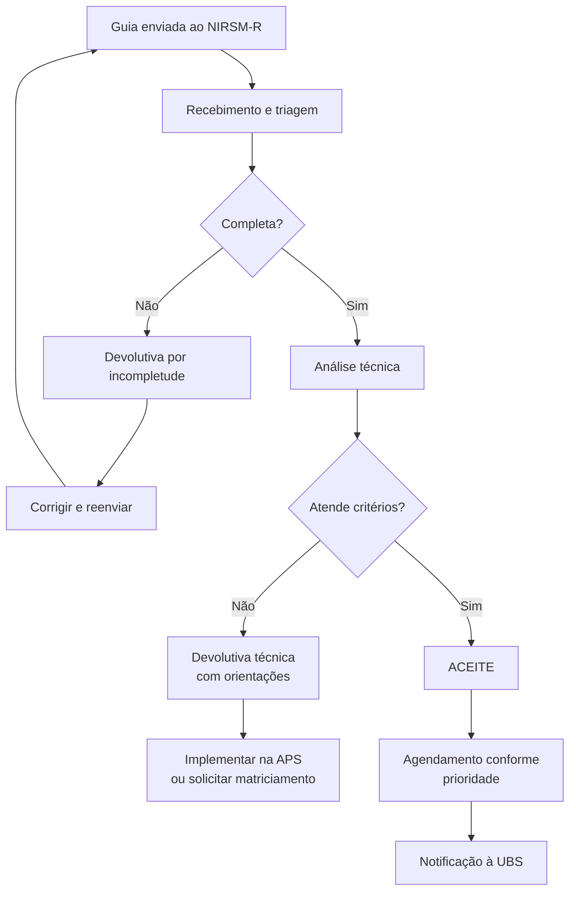

# POP-03: PREENCHIMENTO DA GUIA DE REFERÊNCIA NIRSM-R
## Procedimento Operacional Padrão

**Secretaria Municipal de Saúde de Extrema/MG**
**Versão:** 1.0 | **Data:** Janeiro/2026
**Setor:** Atenção Primária à Saúde / Regulação

---

## 1. OBJETIVO

Padronizar o preenchimento da Guia de Referência para o Núcleo Interno de Regulação em Saúde Mental (NIRSM-R), garantindo a qualidade das informações necessárias para análise, priorização e direcionamento dos encaminhamentos à Atenção Especializada em Saúde Mental.

---

## 2. CAMPO DE APLICAÇÃO

- Unidades Básicas de Saúde (UBS)
- Equipes de Saúde da Família (e-ESF)
- Equipes Multiprofissionais (e-Multi)
- Profissionais de nível superior da APS

---

## 3. DEFINIÇÕES

| Termo | Definição |
|-------|-----------|
| **NIRSM-R** | Núcleo Interno de Regulação em Saúde Mental - dispositivo que analisa e direciona encaminhamentos |
| **Guia de Referência** | Formulário padronizado para solicitação de atendimento especializado |
| **Refratariedade** | Ausência de resposta ao tratamento em dose plena por 8-12 semanas com adesão confirmada |
| **CuidaSM** | Escala de Avaliação da Necessidade de Cuidado em Saúde Mental |

---

## 4. MATERIAIS NECESSÁRIOS

- Formulário "Guia de Referência NIRSM-R" (impresso ou digital)
- Prontuário do paciente
- Resultados de instrumentos aplicados (PHQ-9, GAD-7, AUDIT, CuidaSM)
- Resultados de exames laboratoriais (quando disponíveis)
- Caneta azul ou preta (para versão impressa)

---

## 5. RESPONSABILIDADES

| Profissional | Responsabilidade |
|--------------|------------------|
| **Médico(a) e-ESF** | Avaliação clínica, hipótese diagnóstica, prescrição, assinatura |
| **Enfermeiro(a) e-ESF** | Avaliação de enfermagem, aplicação de escalas, coordenação do fluxo |
| **Profissional e-Multi** | Avaliação multiprofissional, intervenções psicossociais, assinatura |
| **ACS** | Informações sobre contexto familiar e territorial |

---

## 6. PROCEDIMENTO

### 6.1 Pré-Requisitos para Preenchimento

**ANTES de preencher a Guia, verificar:**

1. **Avaliação dupla realizada:**
   - [ ] Paciente foi avaliado pela e-ESF (médico ou enfermeiro)
   - [ ] Paciente foi avaliado pela e-Multi (psicólogo, TO, assistente social ou outro)

2. **Tentativa de manejo na APS documentada:**
   - [ ] Pelo menos uma intervenção terapêutica foi tentada
   - [ ] Tempo adequado de tratamento (mínimo 8 semanas para medicações)
   - [ ] Ou caso de porta aberta (crise, risco imediato)

3. **Critério clínico para encaminhamento identificado:**
   - [ ] Refratariedade ao tratamento inicial
   - [ ] Gravidade do quadro (risco, psicose, mania)
   - [ ] Necessidade de avaliação diagnóstica especializada
   - [ ] Comorbidade psiquiátrica complexa

---

### 6.2 Preenchimento Seção por Seção

#### SEÇÃO 1: IDENTIFICAÇÃO DO PACIENTE

| Campo | Orientação de Preenchimento |
|-------|----------------------------|
| **Nome completo** | Conforme documento oficial, sem abreviações |
| **Data de nascimento** | Formato DD/MM/AAAA |
| **CNS** | 15 dígitos do Cartão Nacional de Saúde (obrigatório) |
| **CPF** | 11 dígitos (complementar ao CNS) |
| **Nome da mãe** | Conforme documento oficial |
| **Endereço** | Completo com número, complemento se houver |
| **Telefones** | Mínimo 2 contatos (paciente e responsável/familiar) |
| **UBS de referência** | Nome oficial da unidade |
| **ACS responsável** | Nome do agente comunitário da microárea |

**ATENÇÃO:** Campos incompletos de identificação resultam em **DEVOLUTIVA AUTOMÁTICA**.

---

#### SEÇÃO 2: DADOS CLÍNICOS

##### 2.1 Hipótese Diagnóstica

| Campo | Orientação |
|-------|-----------|
| **Hipótese principal** | Diagnóstico mais provável, em linguagem técnica |
| **CID-10** | Código correspondente (ex: F32.1 - Episódio depressivo moderado) |
| **Hipóteses secundárias** | Comorbidades ou diagnósticos diferenciais |

**Códigos CID-10 mais frequentes:**

| Condição | Código |
|----------|--------|
| Episódio depressivo leve | F32.0 |
| Episódio depressivo moderado | F32.1 |
| Episódio depressivo grave sem sintomas psicóticos | F32.2 |
| Episódio depressivo grave com sintomas psicóticos | F32.3 |
| Transtorno depressivo recorrente | F33.x |
| Transtorno ansioso generalizado | F41.1 |
| Transtorno de pânico | F41.0 |
| Transtorno misto ansioso e depressivo | F41.2 |
| Esquizofrenia | F20.x |
| Transtorno afetivo bipolar | F31.x |
| TEA - Transtorno do Espectro Autista | F84.0 |
| Transtorno por uso de álcool | F10.x |
| Transtorno por uso de múltiplas drogas | F19.x |

##### 2.2 Queixa Principal e História

| Campo | Orientação |
|-------|-----------|
| **Queixa principal** | Sintoma ou problema que motivou a busca, nas palavras do paciente |
| **História da doença atual** | Descrição cronológica: início, evolução, fatores desencadeantes, agravantes e atenuantes |
| **Tempo de evolução** | Duração dos sintomas atuais em dias, semanas, meses ou anos |

**Exemplo de boa descrição:**
> "Paciente refere tristeza persistente há 6 meses, com piora progressiva. Início após perda de emprego. Relata insônia terminal, anedonia, fadiga e dificuldade de concentração. Nega ideação suicida atual, mas relata pensamentos de morte passivos há 2 meses. Iniciou Sertralina 50mg há 8 semanas, com aumento para 100mg há 4 semanas, sem melhora significativa."

##### 2.3 Antecedentes

| Campo | O que incluir |
|-------|--------------|
| **Antecedentes psiquiátricos** | Internações (quantas, quando, motivo), tentativas de suicídio (quantas, método, último), acompanhamentos prévios em SM |
| **Antecedentes clínicos** | Doenças crônicas (HAS, DM, hipotireoidismo), cirurgias, alergias medicamentosas |
| **História familiar** | Transtornos mentais em pais, irmãos, filhos (especificar: depressão, bipolaridade, esquizofrenia, suicídio) |
| **Uso de substâncias** | Tipo, frequência, quantidade, tempo de uso, última vez |

---

#### SEÇÃO 3: AVALIAÇÃO DE RISCO

##### 3.1 Classificação Geral

| Classificação | Critérios |
|---------------|-----------|
| **BAIXO** | Sintomas leves, funcionalidade preservada, suporte social adequado |
| **MODERADO** | Sintomas moderados, algum prejuízo funcional, suporte parcial |
| **ALTO** | Sintomas graves, prejuízo funcional importante, suporte limitado |
| **MUITO ALTO** | Risco de suicídio/violência, psicose aguda, crise não contida |

##### 3.2 Escala CuidaSM

**IMPORTANTE:** A escala CuidaSM deve ser aplicada apenas em:
- **Adultos** (18 anos ou mais)
- **Consultas programadas ou visitas domiciliares** (NÃO em acolhimento de demanda espontânea aguda)
- **Condições NÃO agudas** (não aplicar em crise ou emergência)

| Nível CuidaSM | Escore | Interpretação |
|---------------|--------|---------------|
| Baixa | 0-1 | Acompanhamento APS, intervenções de baixa intensidade |
| Moderada | 2-3 | APS com apoio e-Multi, considerar matriciamento |
| Alta | 4-6 | Compartilhamento com AES, PTS estruturado |
| Altíssima | 7+ | Atenção especializada prioritária, CAPS |

##### 3.3 Risco de Suicídio

**Avaliar SEMPRE os seguintes elementos:**

| Elemento | Perguntas sugeridas |
|----------|---------------------|
| **Ideação** | "Você tem tido pensamentos de que seria melhor estar morto ou de se machucar?" |
| **Plano** | "Você pensou em como faria isso?" |
| **Acesso a meios** | "Você tem acesso a medicamentos, armas ou outros meios?" |
| **Intenção** | "Você pretende agir nesses pensamentos?" |
| **Fatores de risco** | Tentativa prévia, transtorno mental, uso de substâncias, isolamento, perdas recentes |
| **Fatores de proteção** | Suporte familiar, religiosidade, filhos dependentes, tratamento em curso |

| Classificação | Critérios | Conduta |
|---------------|-----------|---------|
| **Baixo** | Ideação passiva, sem plano, fatores de proteção presentes | Monitorar, PTS na APS |
| **Moderado** | Ideação ativa, plano vago, alguns fatores de proteção | Intensificar acompanhamento, matriciamento |
| **Alto** | Ideação ativa, plano definido, acesso a meios, poucos fatores de proteção | Encaminhar CAPS porta aberta, contrato de não-suicídio, restringir acesso a meios |

##### 3.4 Instrumentos de Rastreio

| Instrumento | Quando aplicar | Pontuação de corte |
|-------------|----------------|-------------------|
| **PHQ-9** | Suspeita de depressão | ≥10 pontos = depressão provável |
| **GAD-7** | Suspeita de ansiedade | ≥10 pontos = ansiedade provável |
| **AUDIT** | Uso de álcool | ≥8 pontos = uso de risco |
| **Columbia Protocol** | Risco de suicídio | Qualquer "sim" = avaliar risco |

**Registrar na Guia:** Instrumento aplicado + pontuação + data

---

#### SEÇÃO 4: TRATAMENTO REALIZADO NA APS

##### 4.1 Medicações

| Informação | O que registrar |
|------------|-----------------|
| **Nome do medicamento** | Nome genérico (ex: Sertralina, não Zoloft) |
| **Dose** | Dose atual em mg |
| **Tempo de uso** | Semanas ou meses em uso |
| **Resposta** | Boa / Parcial / Sem resposta / Efeitos adversos |

**Critérios de dose plena (referência):**

| Medicamento | Dose inicial | Dose plena |
|-------------|--------------|------------|
| Fluoxetina | 20mg | 40-60mg |
| Sertralina | 50mg | 100-200mg |
| Escitalopram | 10mg | 20mg |
| Paroxetina | 20mg | 40-60mg |
| Venlafaxina | 75mg | 150-225mg |
| Amitriptilina | 25mg | 75-150mg |

**Para caracterizar REFRATARIEDADE:**
- Uso de pelo menos 1 medicamento (ou 2 para refratariedade confirmada)
- Em dose plena
- Por tempo adequado (8-12 semanas)
- Com adesão confirmada

##### 4.2 Intervenções Psicossociais

Registrar todas as intervenções não farmacológicas realizadas:

| Intervenção | Descrição |
|-------------|-----------|
| **Psicoterapia/escuta qualificada** | Atendimentos individuais com psicólogo ou outro profissional |
| **Grupo terapêutico** | Participação em grupos de saúde mental na UBS |
| **Orientação familiar** | Atendimentos com familiares para orientação e suporte |
| **Articulação intersetorial** | Contato com escola, CRAS, CREAS, etc. |
| **Visita domiciliar** | VDs realizadas por ACS, enfermeiro ou equipe |
| **Práticas integrativas** | Meditação, yoga, auriculoterapia, etc. |

##### 4.3 Exames Laboratoriais

**Exames recomendados antes do encaminhamento:**

| Condição | Exames sugeridos |
|----------|------------------|
| Depressão/Ansiedade | TSH, T4L (excluir hipotireoidismo), hemograma |
| Primeiro episódio psicótico | Hemograma, glicemia, função hepática, função renal, TSH, T4L, HIV, VDRL |
| Uso de substâncias | Hemograma, função hepática (TGO, TGP, GGT), glicemia |
| Uso de lítio | Função renal, TSH, T4L, hemograma |

**Nota:** A ausência de exames NÃO impede o encaminhamento em casos de urgência.

---

#### SEÇÃO 5: MOTIVO DO ENCAMINHAMENTO

Marcar o motivo principal e detalhar:

| Motivo | Quando marcar |
|--------|---------------|
| **Refratariedade** | Falha de tratamento em dose plena por tempo adequado |
| **Avaliação diagnóstica** | Dúvida diagnóstica, suspeita de bipolaridade, TEA, etc. |
| **Ajuste medicamentoso complexo** | Necessidade de medicações não disponíveis na APS ou combinações complexas |
| **Gravidade** | Sintomas psicóticos, risco elevado, crise não contida |
| **Comorbidade** | Mais de um transtorno mental coexistente |
| **Suspeita TEA/TDAH/DI** | Sinais de transtorno do neurodesenvolvimento |

**Campo "O que se espera da avaliação especializada?"**

Ser específico sobre a demanda:
- "Confirmação diagnóstica de transtorno bipolar"
- "Ajuste de medicação antipsicótica"
- "Avaliação para possível TEA"
- "Estabilização de quadro e contrarreferência"

---

#### SEÇÃO 6: MEDICAÇÕES ATUAIS

Listar TODAS as medicações em uso, não apenas psiquiátricas:

| Informação | Exemplo |
|------------|---------|
| Medicação | Sertralina |
| Dose | 100mg |
| Posologia | 1x ao dia pela manhã |

---

#### SEÇÃO 7: SERVIÇO SOLICITADO

| Serviço | Indicação |
|---------|-----------|
| **CSM** | Casos ambulatoriais moderados, ajustes, diagnósticos |
| **CAPS I** | Transtornos graves, crises, psicose, risco elevado |
| **Centro Integrar** | TEA, deficiência intelectual, reabilitação psicossocial |

**Em caso de dúvida, o NIRSM-R fará o direcionamento adequado.**

---

#### SEÇÃO 8: ASSINATURAS

**OBRIGATÓRIO:** Duas assinaturas de profissionais diferentes

1. **Avaliação e-ESF:** Médico(a) OU Enfermeiro(a) da equipe
   - Nome legível
   - Categoria profissional
   - Número do registro (CRM ou COREN)
   - Data da avaliação
   - Assinatura

2. **Avaliação e-Multi:** Psicólogo(a), TO, Assistente Social ou outro
   - Nome legível
   - Categoria profissional
   - Número do registro (CRP, CREFITO, CRESS, etc.)
   - Data da avaliação
   - Assinatura

---

### 6.3 Checklist Final Antes do Envio

```
┌─────────────────────────────────────────────────────────────────────────┐
│              CHECKLIST DE COMPLETUDE - ANTES DO ENVIO                   │
├─────────────────────────────────────────────────────────────────────────┤
│ IDENTIFICAÇÃO                                                           │
│ [ ] Nome completo preenchido                                            │
│ [ ] CNS preenchido (15 dígitos)                                         │
│ [ ] Telefones de contato (mínimo 2)                                     │
│ [ ] UBS de referência identificada                                      │
├─────────────────────────────────────────────────────────────────────────┤
│ DADOS CLÍNICOS                                                          │
│ [ ] Hipótese diagnóstica com CID-10                                     │
│ [ ] História clínica descrita (início, evolução, fatores)               │
│ [ ] Antecedentes relevantes registrados                                 │
├─────────────────────────────────────────────────────────────────────────┤
│ AVALIAÇÃO DE RISCO                                                      │
│ [ ] Classificação de risco marcada                                      │
│ [ ] Risco de suicídio avaliado e registrado                             │
│ [ ] Instrumentos aplicados com pontuação (se realizados)                │
├─────────────────────────────────────────────────────────────────────────┤
│ TRATAMENTO NA APS                                                       │
│ [ ] Medicações utilizadas com doses e tempo                             │
│ [ ] Resposta ao tratamento registrada                                   │
│ [ ] Intervenções psicossociais descritas                                │
├─────────────────────────────────────────────────────────────────────────┤
│ ENCAMINHAMENTO                                                          │
│ [ ] Motivo do encaminhamento marcado e justificado                      │
│ [ ] Expectativa em relação à AES descrita                               │
│ [ ] Serviço solicitado indicado                                         │
├─────────────────────────────────────────────────────────────────────────┤
│ ASSINATURAS                                                             │
│ [ ] Assinatura da e-ESF (com registro profissional)                     │
│ [ ] Assinatura da e-Multi (com registro profissional)                   │
│ [ ] Datas das avaliações preenchidas                                    │
├─────────────────────────────────────────────────────────────────────────┤
│ RESULTADO: [ ] COMPLETA - Enviar  [ ] INCOMPLETA - Revisar              │
└─────────────────────────────────────────────────────────────────────────┘
```

---

## 7. MOTIVOS COMUNS DE DEVOLUTIVA

| Motivo | Como evitar |
|--------|-------------|
| **CNS faltante ou inválido** | Conferir no cadastro antes de preencher |
| **Sem assinatura da e-Multi** | Garantir avaliação multiprofissional antes do encaminhamento |
| **Hipótese diagnóstica sem CID** | Sempre incluir o código CID-10 |
| **Tratamento na APS não descrito** | Detalhar todas as intervenções tentadas |
| **Risco de suicídio não avaliado** | Avaliar e registrar em todos os casos |
| **Motivo do encaminhamento vago** | Ser específico sobre a necessidade |
| **Caso não atende critérios de AES** | Revisar critérios antes de encaminhar |

---

## 8. FLUXO APÓS ENVIO



---

## 9. SITUAÇÕES ESPECIAIS

### 9.1 Casos de Porta Aberta (sem necessidade de Guia completa)

| Situação | Conduta |
|----------|---------|
| Risco iminente de suicídio | Encaminhar diretamente ao CAPS ou UPA |
| Psicose aguda | Encaminhar diretamente ao CAPS porta aberta |
| Agitação psicomotora grave | SAMU 192 |

**Nestes casos:** Preencher Guia simplificada após estabilização, para regularização do fluxo.

### 9.2 Crianças e Adolescentes

- **CuidaSM NÃO deve ser aplicada** em menores de 18 anos
- Usar instrumentos específicos quando disponíveis (M-CHAT-R/F para TEA, SDQ, etc.)
- Priorizar avaliação pela e-Multi antes do encaminhamento
- Incluir informações escolares quando pertinentes

### 9.3 Gestantes

- Prioridade +1 nível na classificação
- Registrar idade gestacional e acompanhamento pré-natal
- Atenção especial às medicações (risco teratogênico)

---

## 10. INDICADORES DE QUALIDADE

| Indicador | Meta | Responsável |
|-----------|------|-------------|
| % de Guias com preenchimento completo | ≥ 85% | UBS |
| % de Guias com ambas assinaturas | 100% | UBS |
| Tempo médio entre decisão de encaminhar e envio da Guia | ≤ 5 dias úteis | UBS |
| Taxa de devolutiva por incompletude | ≤ 15% | UBS/NIRSM-R |

---

## 11. REFERÊNCIAS

1. Brasil. Ministério da Saúde. Cadernos de Atenção Básica nº 34 - Saúde Mental. 2013.
2. OMS. MI-mhGAP: Manual de Intervenções para Transtornos Mentais. 2ª ed. 2019.
3. Protocolo REG-01: Regulação do Acesso à Atenção Especializada - NIRSM-R. Extrema/MG. 2026.
4. TelessaúdeRS-UFRGS. Protocolos de Encaminhamento para Psiquiatria Adulto. 2023.

---

## 12. HISTÓRICO DE REVISÕES

| Versão | Data | Alterações | Responsável |
|--------|------|------------|-------------|
| 1.0 | Jan/2026 | Versão inicial | Coordenação SM |

---

*Aprovado pela Coordenação de Saúde Mental de Extrema/MG*
*Data: Janeiro/2026*
