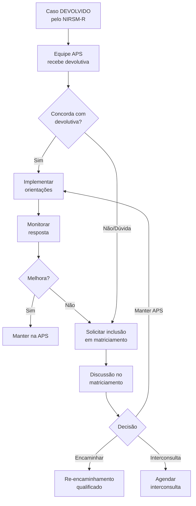

# POP-04: MATRICIAMENTO EM SAÚDE MENTAL
## Procedimento Operacional Padrão

**Secretaria Municipal de Saúde de Extrema/MG**
**Versão:** 1.0 | **Data:** Janeiro/2026
**Setor:** Atenção Primária / Atenção Especializada em Saúde Mental

---

## 1. OBJETIVO

Normatizar o processo de matriciamento em saúde mental entre a Atenção Primária à Saúde (APS) e a Atenção Especializada (AES), estabelecendo modalidades, fluxos e responsabilidades para qualificar o cuidado em saúde mental no território.

---

## 2. CAMPO DE APLICAÇÃO

- Equipes de Saúde da Família (e-ESF)
- Equipes Multiprofissionais (e-Multi)
- Centro de Saúde Mental (CSM)
- CAPS I
- Centro Integrar
- NIRSM-R

---

## 3. DEFINIÇÕES

| Termo | Definição |
|-------|-----------|
| **Matriciamento** | Apoio técnico-pedagógico especializado às equipes da APS para qualificar o cuidado em saúde mental sem transferência de responsabilidade |
| **Apoio Matricial** | Suporte especializado que opera por referência e não por encaminhamento |
| **Tele-matriciamento** | Matriciamento realizado por meio de tecnologia de comunicação à distância |
| **Interconsulta** | Avaliação pontual do especialista junto ao paciente, com retorno à equipe de referência |
| **Discussão de caso** | Análise coletiva de casos clínicos com participação de equipe APS e matriciadores |

---

## 4. PRINCÍPIOS DO MATRICIAMENTO

| Princípio | Aplicação |
|-----------|-----------|
| **Corresponsabilização** | APS e AES compartilham o cuidado sem transferência total do caso |
| **Construção compartilhada** | Plano terapêutico elaborado conjuntamente |
| **Educação permanente** | Cada discussão é oportunidade de aprendizagem |
| **Territorialidade** | Priorizar intervenções no contexto de vida do usuário |
| **Longitudinalidade** | APS mantém vínculo mesmo durante compartilhamento |

---

## 5. MODALIDADES DE MATRICIAMENTO

### 5.1 Tele-Matriciamento

| Aspecto | Especificação |
|---------|---------------|
| **Frequência** | Semanal |
| **Duração** | 1h30 a 2h |
| **Plataforma** | Definida pela SMS (Teams, Google Meet, Zoom) |
| **Casos por sessão** | 5 a 8 casos |
| **Participantes** | Equipes APS + Psiquiatra/Psicólogo do CSM ou CAPS |

**Estrutura da Sessão:**

| Tempo | Atividade |
|-------|-----------|
| 10 min | Acolhimento e alinhamento inicial |
| 60-80 min | Discussão de casos (8-10 min/caso) |
| 15 min | Mini-aula ou atualização técnica (opcional) |
| 10 min | Encaminhamentos e agenda |

### 5.2 Matriciamento Presencial

| Aspecto | Especificação |
|---------|---------------|
| **Frequência** | Quinzenal ou mensal |
| **Duração** | 2 a 3 horas |
| **Local** | UBS ou serviço de referência |
| **Casos** | Casos complexos que exigem discussão aprofundada |
| **Participantes** | Equipe APS + Matriciador + pode incluir família/usuário |

**Atividades possíveis:**
- Discussão de casos complexos
- Consulta compartilhada (atendimento conjunto)
- Visita domiciliar conjunta
- Atividade educativa para equipe
- Supervisão de PTS

### 5.3 Interconsulta Regulada

| Aspecto | Especificação |
|---------|---------------|
| **Indicação** | Necessidade de avaliação pontual sem transferência do caso |
| **Solicitação** | Via NIRSM-R ou acordo direto em matriciamento |
| **Formato** | Avaliação do especialista + devolutiva à equipe |
| **Retorno** | Paciente volta ao acompanhamento da APS |

---

## 6. PROCEDIMENTO PARA TELE-MATRICIAMENTO

### 6.1 Preparação pela Equipe APS (Antes da Sessão)

**Até 48 horas antes:**

1. **Selecionar casos para discussão:**
   - Dúvidas diagnósticas
   - Casos devolvidos pelo NIRSM-R
   - Pacientes com resposta parcial ao tratamento
   - Situações de manejo complexo

2. **Preparar apresentação do caso:**

```
┌─────────────────────────────────────────────────────────────────────────┐
│            ROTEIRO DE APRESENTAÇÃO DE CASO - MATRICIAMENTO              │
├─────────────────────────────────────────────────────────────────────────┤
│ IDENTIFICAÇÃO (sem nome completo - usar iniciais)                       │
│ Iniciais: ____ Idade: ____ Sexo: ____ Microárea: ____                   │
├─────────────────────────────────────────────────────────────────────────┤
│ QUEIXA/MOTIVO DA DISCUSSÃO                                              │
│ ______________________________________________________________________ │
├─────────────────────────────────────────────────────────────────────────┤
│ HISTÓRIA BREVE                                                          │
│ • Início dos sintomas: _______________________________________________ │
│ • Evolução: _________________________________________________________ │
│ • Fatores desencadeantes: ___________________________________________ │
├─────────────────────────────────────────────────────────────────────────┤
│ TRATAMENTO ATUAL                                                        │
│ • Medicações: _______________________________________________________ │
│ • Intervenções psicossociais: _______________________________________ │
│ • Resposta: _________________________________________________________ │
├─────────────────────────────────────────────────────────────────────────┤
│ AVALIAÇÃO DE RISCO                                                      │
│ • Risco de suicídio: ( )Baixo ( )Moderado ( )Alto                       │
│ • Risco de heteroagressividade: ( )Baixo ( )Moderado ( )Alto            │
├─────────────────────────────────────────────────────────────────────────┤
│ PERGUNTA PARA O MATRICIADOR                                             │
│ ______________________________________________________________________ │
│ ______________________________________________________________________ │
└─────────────────────────────────────────────────────────────────────────┘
```

3. **Enviar lista de casos** ao coordenador do matriciamento

### 6.2 Durante a Sessão

**Papel de cada participante:**

| Participante | Responsabilidades |
|--------------|-------------------|
| **Coordenador** | Conduzir a sessão, controlar tempo, mediar discussão |
| **Apresentador (APS)** | Apresentar o caso de forma objetiva |
| **Matriciador** | Fazer perguntas, oferecer hipóteses, sugerir condutas |
| **Demais participantes** | Contribuir com informações, aprender com a discussão |

**Dinâmica recomendada (8-10 min/caso):**

1. **Apresentação** (2 min): Equipe APS expõe o caso
2. **Perguntas de clarificação** (2 min): Matriciador questiona para entender melhor
3. **Discussão** (3 min): Hipóteses diagnósticas e diferenciais
4. **Orientação** (2 min): Plano de ação e condutas sugeridas
5. **Registro** (1 min): Registrar no prontuário e na ata

### 6.3 Após a Sessão

**Equipe APS deve:**

1. **Registrar no prontuário do paciente:**
   - Data da discussão em matriciamento
   - Participantes
   - Hipóteses discutidas
   - Orientações recebidas
   - Plano de ação definido

2. **Implementar as orientações:**
   - Ajustes medicamentosos conforme acordado
   - Intervenções psicossociais indicadas
   - Encaminhamentos quando necessário

3. **Agendar retorno:**
   - Definir data de reavaliação
   - Incluir em pauta futura se necessário

---

## 7. DEVOLUTIVA PADRONIZADA DO MATRICIAMENTO

```
┌─────────────────────────────────────────────────────────────────────────┐
│                    DEVOLUTIVA DE MATRICIAMENTO                          │
├─────────────────────────────────────────────────────────────────────────┤
│ Data: ___/___/_____          UBS: _____________________________________│
│ Caso: ________________       Profissional referência: _________________│
├─────────────────────────────────────────────────────────────────────────┤
│ HIPÓTESES DIAGNÓSTICAS                                                  │
│ Principal: __________________________________________________________ │
│ Diferenciais: _______________________________________________________ │
├─────────────────────────────────────────────────────────────────────────┤
│ PLANO DE AÇÃO                                                           │
│ Medicação:                                                              │
│ [ ] Manter atual  [ ] Ajustar: ______________________________________ │
│ [ ] Iniciar: ________________________________________________________ │
│                                                                         │
│ Intervenções psicossociais:                                            │
│ [ ] Escuta qualificada  [ ] Grupo terapêutico  [ ] Orientação familiar │
│ [ ] Articulação intersetorial: ______________________________________ │
│ [ ] Outro: __________________________________________________________ │
│                                                                         │
│ Exames/avaliações:                                                     │
│ [ ] Solicitar: ______________________________________________________ │
├─────────────────────────────────────────────────────────────────────────┤
│ SINAIS DE ALERTA (para re-discussão ou encaminhamento)                 │
│ ______________________________________________________________________ │
│ ______________________________________________________________________ │
├─────────────────────────────────────────────────────────────────────────┤
│ CRITÉRIOS PARA RETORNO AO MATRICIAMENTO                                │
│ [ ] Ausência de melhora em _____ semanas                               │
│ [ ] Piora do quadro                                                    │
│ [ ] Surgimento de: __________________________________________________ │
├─────────────────────────────────────────────────────────────────────────┤
│ ENCAMINHAMENTO                                                          │
│ [ ] Manter na APS    [ ] Encaminhar para: ____________________________│
│ Justificativa: ______________________________________________________ │
├─────────────────────────────────────────────────────────────────────────┤
│ Matriciador: ___________________________ Registro: ___________________│
└─────────────────────────────────────────────────────────────────────────┘
```

---

## 8. MATRICIAMENTO DE CASOS DEVOLVIDOS PELO NIRSM-R

### 8.1 Fluxo Específico



### 8.2 Quando Solicitar Matriciamento Após Devolutiva

| Situação | Ação |
|----------|------|
| Discordância técnica com a devolutiva | Solicitar discussão para esclarecimento |
| Dúvida sobre implementação das orientações | Solicitar orientação detalhada |
| Orientações implementadas sem sucesso | Solicitar nova discussão |
| Necessidade de avaliação presencial | Solicitar interconsulta |

---

## 9. CASOS PRIORITÁRIOS PARA MATRICIAMENTO

### 9.1 Indicações de Prioridade

| Prioridade | Casos |
|------------|-------|
| **ALTA** | Risco de suicídio moderado em manejo na APS |
| **ALTA** | Gestantes com transtorno mental |
| **ALTA** | Crianças/adolescentes com suspeita de TEA ou transtornos graves |
| **ALTA** | Primeiro episódio psicótico em estabilização |
| **MÉDIA** | Depressão com resposta parcial a ISRS |
| **MÉDIA** | Ansiedade refratária |
| **MÉDIA** | Dúvida diagnóstica (bipolar? TEA? TDAH?) |
| **ROTINA** | Casos estáveis em acompanhamento compartilhado |
| **ROTINA** | Capacitação da equipe sobre manejo específico |

### 9.2 Casos que NÃO devem ser discutidos em matriciamento

| Situação | Conduta correta |
|----------|-----------------|
| Emergência psiquiátrica ativa | Encaminhar CAPS porta aberta ou UPA |
| Risco iminente de suicídio | Encaminhar imediatamente para CAPS/UPA |
| Psicose aguda não contida | SAMU/CAPS/UPA |
| Caso já em acompanhamento regular na AES | Discutir diretamente com o serviço |

---

## 10. MATRICIAMENTO POR CATEGORIA PROFISSIONAL

### 10.1 Matriciamento Psiquiátrico

**Foco:**
- Diagnóstico diferencial
- Manejo farmacológico
- Indicação de encaminhamento
- Casos refratários

**Competências que podem ser desenvolvidas na APS:**
- Prescrição de ISRS em doses adequadas
- Manejo de insônia e ansiedade leve
- Identificação de sinais de alarme
- Avaliação de risco de suicídio

### 10.2 Matriciamento Psicológico

**Foco:**
- Intervenções psicossociais na APS
- Técnicas de manejo breve
- Grupos terapêuticos
- Avaliação psicológica

**Competências que podem ser desenvolvidas na APS:**
- Escuta qualificada
- Primeiros cuidados psicológicos
- Psicoeducação
- Técnicas de relaxamento
- Entrevista motivacional

### 10.3 Matriciamento de Terapia Ocupacional

**Foco:**
- Avaliação funcional
- Atividades de reabilitação psicossocial
- Inclusão social e produtiva
- Manejo de AVDs

### 10.4 Matriciamento de Serviço Social

**Foco:**
- Articulação intersetorial
- Acesso a benefícios
- Situações de vulnerabilidade
- Rede de proteção social

---

## 11. REGISTRO E DOCUMENTAÇÃO

### 11.1 Ata de Matriciamento

Cada sessão deve gerar ata contendo:
- Data e horário
- Participantes (nome e função)
- Casos discutidos (iniciais, UBS)
- Resumo das orientações por caso
- Encaminhamentos definidos
- Temas para próxima sessão

### 11.2 Registro em Prontuário

**Obrigatório registrar:**
- "Caso discutido em matriciamento em [data]"
- Participantes da discussão
- Hipóteses levantadas
- Plano de ação acordado
- Data de reavaliação

**Código de procedimento:** Verificar tabela SIGTAP vigente para registro.

---

## 12. INDICADORES DE QUALIDADE DO MATRICIAMENTO

| Indicador | Meta | Periodicidade |
|-----------|------|---------------|
| Nº de sessões de matriciamento realizadas | ≥ 4/mês | Mensal |
| Nº de casos discutidos | ≥ 20/mês | Mensal |
| % de UBS participantes | ≥ 80% | Mensal |
| % de casos com devolutiva registrada | 100% | Mensal |
| % de casos devolvidos que passaram por matriciamento | ≥ 50% | Mensal |
| Satisfação das equipes APS | ≥ 80% | Trimestral |
| Redução de encaminhamentos evitáveis | -20% após 6 meses | Semestral |

---

## 13. AGENDA DE MATRICIAMENTO

### 13.1 Modelo de Agenda Semanal

| Dia | Horário | Modalidade | UBS/Região | Responsável |
|-----|---------|------------|------------|-------------|
| Segunda | 14h-16h | Tele-matriciamento | Região Norte | Psiquiatra CSM |
| Terça | 14h-16h | Tele-matriciamento | Região Sul | Psiquiatra CSM |
| Quarta | 8h-10h | Presencial (quinzenal) | Rotativo | Equipe CSM |
| Quinta | 14h-16h | Tele-matriciamento | Região Leste | Psicóloga CSM |
| Sexta | 10h-12h | Tele-matriciamento | Região Oeste | Psiquiatra CAPS |

### 13.2 Inscrição de Casos

- **Canal:** E-mail ou sistema definido pela SMS
- **Prazo:** Até 48h antes da sessão
- **Informações mínimas:** Iniciais, idade, UBS, motivo da discussão

---

## 14. RESPONSABILIDADES

### 14.1 Coordenação de Saúde Mental

- Organizar agenda de matriciamento
- Designar matriciadores
- Monitorar indicadores
- Capacitar equipes

### 14.2 Matriciadores (CSM/CAPS)

- Preparar-se para as sessões
- Fornecer orientações baseadas em evidências
- Registrar devolutivas
- Participar de capacitações

### 14.3 Equipes APS

- Preparar casos com qualidade
- Participar das sessões programadas
- Implementar orientações
- Registrar em prontuário
- Dar feedback sobre resultados

---

## 15. REFERÊNCIAS

1. Brasil. Ministério da Saúde. Cadernos de Atenção Básica nº 39 - NASF. 2014.
2. Campos GWS, Domitti AC. Apoio matricial e equipe de referência: uma metodologia para gestão do trabalho interdisciplinar em saúde. Cad Saúde Pública. 2007.
3. Brasil. Guia Prático de Matriciamento em Saúde Mental. MS/OPAS. 2011.
4. Chiaverini DH et al. Guia Prático de Matriciamento em Saúde Mental. Brasília: MS. 2011.

---

## 16. HISTÓRICO DE REVISÕES

| Versão | Data | Alterações | Responsável |
|--------|------|------------|-------------|
| 1.0 | Jan/2026 | Versão inicial | Coordenação SM |

---

*Aprovado pela Coordenação de Saúde Mental de Extrema/MG*
*Data: Janeiro/2026*
