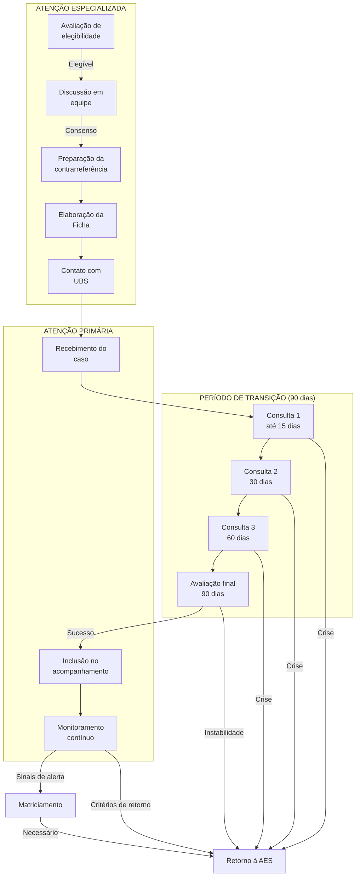

# POP-06: CONTRARREFERÊNCIA DA ATENÇÃO ESPECIALIZADA PARA APS
## Procedimento Operacional Padrão

**Secretaria Municipal de Saúde de Extrema/MG**
**Versão:** 1.0 | **Data:** Janeiro/2026
**Setor:** Atenção Especializada em Saúde Mental / APS

---

## 1. OBJETIVO

Padronizar o processo de contrarreferência dos usuários em acompanhamento na Atenção Especializada em Saúde Mental (AES-SM) para continuidade do cuidado na Atenção Primária à Saúde (APS), garantindo transição segura, longitudinalidade e prevenção de recaídas.

---

## 2. CAMPO DE APLICAÇÃO

- Centro de Saúde Mental (CSM)
- CAPS I
- Centro Integrar
- Unidades Básicas de Saúde (UBS)
- Equipes de Saúde da Família (e-ESF)
- Equipes Multiprofissionais (e-Multi)

---

## 3. DEFINIÇÕES

| Termo | Definição |
|-------|-----------|
| **Contrarreferência** | Processo de retorno do usuário da atenção especializada para continuidade do cuidado na APS |
| **Alta assistencial** | Encerramento do acompanhamento especializado com transferência da responsabilidade para APS |
| **Alta compartilhada** | Transição gradual do cuidado com período de acompanhamento conjunto |
| **Estabilidade clínica** | Condição em que o usuário apresenta sintomas controlados e funcionalidade preservada |
| **Período de transição** | Intervalo de 90 dias para consolidação da contrarreferência |

---

## 4. PRINCÍPIOS DA CONTRARREFERÊNCIA

| Princípio | Aplicação |
|-----------|-----------|
| **Continuidade** | Garantir que não haja interrupção do cuidado |
| **Comunicação** | Informações claras entre AES e APS |
| **Gradualidade** | Transição progressiva, não abrupta |
| **Autonomia** | Usuário informado e participante do processo |
| **Monitoramento** | Acompanhamento da adaptação à nova modalidade |

---

## 5. CRITÉRIOS DE ELEGIBILIDADE PARA CONTRARREFERÊNCIA

### 5.1 Critérios Gerais de Estabilidade

**Para que um usuário seja elegível para contrarreferência, deve atender:**

| Critério | Descrição |
|----------|-----------|
| **Sintomas controlados** | Remissão ou melhora significativa dos sintomas principais |
| **Funcionalidade preservada** | Retorno às atividades da vida diária |
| **Medicação estabilizada** | Sem necessidade de ajustes frequentes há pelo menos 3 meses |
| **Sem internações recentes** | Ausência de internação psiquiátrica nos últimos 6 meses |
| **Adesão ao tratamento** | Comparecimento regular e uso correto das medicações |
| **Suporte social adequado** | Rede de apoio familiar/social identificada |
| **Baixo risco** | Risco de suicídio baixo ou ausente |

### 5.2 Critérios Específicos por Condição

#### 5.2.1 Depressão

| Critério | Parâmetro |
|----------|-----------|
| PHQ-9 | ≤ 9 pontos (remissão ou depressão leve) |
| Sintomas | Ausência de ideação suicida, sono e apetite regulados |
| Funcionalidade | Retorno ao trabalho/atividades habituais |
| Medicação | Dose estável há ≥ 3 meses, disponível na REMUME |
| Tempo de estabilidade | ≥ 6 meses após resposta inicial |

#### 5.2.2 Transtornos de Ansiedade

| Critério | Parâmetro |
|----------|-----------|
| GAD-7 | ≤ 9 pontos |
| Crises de pânico | Ausentes ou raras (≤ 1/mês) e controláveis |
| Evitação | Redução significativa de comportamentos evitativos |
| Medicação | Dose estável, sem necessidade de benzodiazepínicos contínuos |

#### 5.2.3 Transtornos Psicóticos (Esquizofrenia e outros)

| Critério | Parâmetro |
|----------|-----------|
| Sintomas positivos | Ausentes ou mínimos, sem prejuízo funcional |
| Sintomas negativos | Estáveis ou em melhora |
| Insight | Presente, reconhece necessidade de tratamento |
| Medicação | Antipsicótico em dose estável há ≥ 6 meses |
| Adesão | Comprovada por familiares/cuidadores |
| Internações | Nenhuma nos últimos 12 meses |

**ATENÇÃO:** Casos de esquizofrenia geralmente requerem acompanhamento compartilhado permanente, não contrarreferência total.

#### 5.2.4 Transtorno Bipolar

| Critério | Parâmetro |
|----------|-----------|
| Eutimia | Ausência de episódio de humor há ≥ 12 meses |
| Ciclagem | Sem ciclagem rápida |
| Medicação | Estabilizador em nível terapêutico, dose estável |
| Monitoramento | Capacidade de automonitoramento de sintomas prodrômicos |
| Litemia | Se em uso de lítio: níveis estáveis, função renal e tireoidiana normais |

**ATENÇÃO:** Transtorno bipolar geralmente requer acompanhamento compartilhado de longo prazo.

#### 5.2.5 TEA/Deficiência Intelectual

| Critério | Parâmetro |
|----------|-----------|
| Comorbidades | Controladas (ansiedade, agitação, etc.) |
| Comportamentos desafiadores | Manejáveis pela família |
| Plano de inclusão | Estabelecido (escola, trabalho, comunidade) |
| Orientação familiar | Concluída, família capacitada |

---

## 6. PROCEDIMENTO DE CONTRARREFERÊNCIA

### 6.1 Fase 1: Avaliação de Elegibilidade (AES)

**Responsável:** Profissional de referência na AES

1. **Avaliar critérios de estabilidade:**
   - Revisar evolução clínica dos últimos 6-12 meses
   - Verificar adesão ao tratamento
   - Avaliar funcionalidade e qualidade de vida
   - Confirmar suporte social

2. **Discutir em equipe:**
   - Apresentar caso em reunião de equipe
   - Obter consenso sobre elegibilidade
   - Definir plano de transição

3. **Comunicar ao usuário e família:**
   - Explicar os motivos da contrarreferência
   - Esclarecer que não é "abandono"
   - Apresentar o plano de transição
   - Obter concordância

### 6.2 Fase 2: Preparação da Contrarreferência

**Responsável:** Equipe AES

1. **Elaborar Ficha de Contrarreferência (ver modelo):**
   - Resumo clínico completo
   - Diagnósticos e comorbidades
   - Histórico de tratamento
   - Medicações atuais com doses
   - Plano de cuidados para APS
   - Sinais de alerta e critérios de retorno

2. **Contatar a UBS de referência:**
   - Ligar ou enviar comunicação formal
   - Agendar consulta de transição
   - Enviar ficha de contrarreferência antecipadamente

3. **Preparar o usuário:**
   - Psicoeducação sobre continuidade do cuidado
   - Orientar sobre sinais de alerta
   - Fornecer plano de crise por escrito

### 6.3 Fase 3: Período de Transição (90 dias)

**Responsável:** AES + APS

```
┌─────────────────────────────────────────────────────────────────────────┐
│                    CRONOGRAMA DO PERÍODO DE TRANSIÇÃO                   │
├─────────────────────────────────────────────────────────────────────────┤
│ DIAS 0-30 (Primeiro Mês)                                                │
│ ───────────────────────────                                             │
│ • Consulta de transferência na APS (até 15 dias)                        │
│ • Apresentação do caso em reunião de equipe APS                         │
│ • Contato telefônico da AES com APS (após 1ª consulta)                  │
│ • Usuário ainda pode acessar AES se necessário                          │
├─────────────────────────────────────────────────────────────────────────┤
│ DIAS 31-60 (Segundo Mês)                                                │
│ ────────────────────────                                                │
│ • Segunda consulta de seguimento na APS                                 │
│ • Avaliação de adaptação                                                │
│ • Contato AES-APS para monitoramento                                    │
│ • Discussão em matriciamento se necessário                              │
├─────────────────────────────────────────────────────────────────────────┤
│ DIAS 61-90 (Terceiro Mês)                                               │
│ ────────────────────────                                                │
│ • Terceira consulta na APS                                              │
│ • Avaliação final de transição                                          │
│ • Fechamento formal da contrarreferência                                │
│ • Alta do período de transição                                          │
├─────────────────────────────────────────────────────────────────────────┤
│ APÓS 90 DIAS                                                            │
│ ────────────                                                            │
│ • Acompanhamento regular na APS                                         │
│ • AES disponível via matriciamento                                      │
│ • Re-encaminhamento se critérios de retorno                             │
└─────────────────────────────────────────────────────────────────────────┘
```

### 6.4 Fase 4: Consolidação na APS

**Responsável:** Equipe APS

1. **Incorporar ao acompanhamento regular:**
   - Incluir na agenda de condições crônicas
   - Definir frequência de consultas
   - Incluir em grupos se indicado

2. **Monitorar indicadores:**
   - Adesão às consultas
   - Uso regular da medicação
   - Estabilidade dos sintomas
   - Funcionalidade

3. **Manter vigilância:**
   - Atenção aos sinais de alerta
   - Acionar matriciamento se dúvidas
   - Re-encaminhar se critérios de retorno

---

## 7. FICHA DE CONTRARREFERÊNCIA

```
┌─────────────────────────────────────────────────────────────────────────┐
│           FICHA DE CONTRARREFERÊNCIA - SAÚDE MENTAL                     │
│              Secretaria Municipal de Saúde - Extrema/MG                │
├─────────────────────────────────────────────────────────────────────────┤
│ SERVIÇO DE ORIGEM: ( )CSM  ( )CAPS I  ( )Centro Integrar               │
│ Data: ___/___/_____         Protocolo nº: _____________________________│
├─────────────────────────────────────────────────────────────────────────┤
│ 1. IDENTIFICAÇÃO                                                        │
├─────────────────────────────────────────────────────────────────────────┤
│ Nome: ________________________________________________________________ │
│ Data de nascimento: ___/___/_____ CNS: _______________________________ │
│ UBS de referência: __________________________________________________ │
│ Telefones: __________________________________________________________ │
├─────────────────────────────────────────────────────────────────────────┤
│ 2. DIAGNÓSTICOS                                                         │
├─────────────────────────────────────────────────────────────────────────┤
│ Diagnóstico principal: _________________________________ CID: ________ │
│ Diagnósticos secundários: ______________________________ CID: ________ │
│ Comorbidades clínicas: ______________________________________________ │
├─────────────────────────────────────────────────────────────────────────┤
│ 3. HISTÓRICO DO ACOMPANHAMENTO NA AES                                  │
├─────────────────────────────────────────────────────────────────────────┤
│ Data de início do acompanhamento: ___/___/_____                        │
│ Motivo do encaminhamento inicial: ___________________________________ │
│ Internações durante o acompanhamento: ( )Não ( )Sim - Quantas: _______ │
│ Evolução: __________________________________________________________ │
│ ______________________________________________________________________ │
│ ______________________________________________________________________ │
│ ______________________________________________________________________ │
├─────────────────────────────────────────────────────────────────────────┤
│ 4. MEDICAÇÕES ATUAIS                                                   │
├─────────────────────────────────────────────────────────────────────────┤
│ Medicação              │ Dose    │ Posologia   │ Disponível REMUME?    │
│ _______________________|_________|_____________|_______________________│
│ _______________________|_________|_____________|_______________________│
│ _______________________|_________|_____________|_______________________│
│ _______________________|_________|_____________|_______________________│
├─────────────────────────────────────────────────────────────────────────┤
│ 5. EXAMES LABORATORIAIS RECENTES                                       │
├─────────────────────────────────────────────────────────────────────────┤
│ Exame                  │ Data        │ Resultado                       │
│ _______________________|_____________|_________________________________│
│ _______________________|_____________|_________________________________│
│ _______________________|_____________|_________________________________│
│                                                                         │
│ Próximos exames de controle: ________________________________________ │
├─────────────────────────────────────────────────────────────────────────┤
│ 6. SITUAÇÃO ATUAL                                                      │
├─────────────────────────────────────────────────────────────────────────┤
│ Sintomas residuais: _________________________________________________ │
│ Funcionalidade: ( )Preservada ( )Parcialmente prejudicada              │
│ Risco de suicídio: ( )Ausente ( )Baixo                                 │
│ Suporte social: ( )Adequado ( )Parcial ( )Limitado                     │
│ Adesão ao tratamento: ( )Boa ( )Regular ( )Irregular                   │
│ Insight sobre a doença: ( )Presente ( )Parcial ( )Ausente              │
├─────────────────────────────────────────────────────────────────────────┤
│ 7. PLANO DE CUIDADOS PARA A APS                                        │
├─────────────────────────────────────────────────────────────────────────┤
│ Frequência de consultas recomendada: _________________________________ │
│ Profissionais envolvidos: ( )Médico ( )Enfermeiro ( )Psicólogo ( )TO   │
│                                                                         │
│ Orientações específicas para manejo:                                   │
│ ______________________________________________________________________ │
│ ______________________________________________________________________ │
│ ______________________________________________________________________ │
│                                                                         │
│ Grupos/atividades indicadas: ________________________________________ │
│                                                                         │
│ Articulação intersetorial necessária: _______________________________ │
├─────────────────────────────────────────────────────────────────────────┤
│ 8. SINAIS DE ALERTA E CRITÉRIOS DE RETORNO À AES                       │
├─────────────────────────────────────────────────────────────────────────┤
│ Sinais de alerta (comunicar AES via matriciamento):                    │
│ • __________________________________________________________________ │
│ • __________________________________________________________________ │
│ • __________________________________________________________________ │
│                                                                         │
│ Critérios para re-encaminhamento imediato:                             │
│ • __________________________________________________________________ │
│ • __________________________________________________________________ │
│ • __________________________________________________________________ │
├─────────────────────────────────────────────────────────────────────────┤
│ 9. PLANO DE CRISE                                                      │
├─────────────────────────────────────────────────────────────────────────┤
│ Em caso de crise, orientar:                                            │
│ 1º) ________________________________________________________________ │
│ 2º) ________________________________________________________________ │
│ 3º) ________________________________________________________________ │
│                                                                         │
│ Contatos de emergência:                                                │
│ CAPS I (Porta Aberta): (35) XXXX-XXXX                                  │
│ UPA: (35) XXXX-XXXX                                                    │
│ SAMU: 192                                                               │
│ CVV: 188                                                                │
├─────────────────────────────────────────────────────────────────────────┤
│ 10. AGENDAMENTO DO PERÍODO DE TRANSIÇÃO                                │
├─────────────────────────────────────────────────────────────────────────┤
│ 1ª consulta APS (até 15 dias): Data ___/___/_____ Horário: __________ │
│ 2ª consulta APS (30 dias): Data ___/___/_____ Horário: ______________│
│ 3ª consulta APS (60 dias): Data ___/___/_____ Horário: ______________│
│ Avaliação final (90 dias): Data ___/___/_____ Horário: ______________│
├─────────────────────────────────────────────────────────────────────────┤
│ 11. ASSINATURAS                                                        │
├─────────────────────────────────────────────────────────────────────────┤
│ Profissional de referência AES:                                        │
│ Nome: ________________________________ Registro: _____________________ │
│ Assinatura: _________________________________________________________ │
│                                                                         │
│ Ciente - Usuário/Responsável:                                          │
│ Nome: _______________________________________________________________ │
│ Assinatura: _________________________________________________________ │
│                                                                         │
│ Recebido pela APS:                                                     │
│ Profissional: ______________________________ Data: ___/___/_____       │
│ Assinatura: _________________________________________________________ │
└─────────────────────────────────────────────────────────────────────────┘
```

---

## 8. CRITÉRIOS PARA RETORNO À ATENÇÃO ESPECIALIZADA

### 8.1 Retorno Imediato (Encaminhar sem discussão prévia)

| Critério | Conduta |
|----------|---------|
| Risco de suicídio moderado a alto | CAPS porta aberta |
| Episódio psicótico agudo | CAPS porta aberta |
| Episódio maníaco/misto | CAPS porta aberta |
| Agitação psicomotora não contida | SAMU → CAPS/UPA |
| Internação psiquiátrica | Notificar AES após alta |

### 8.2 Retorno Programado (Via NIRSM-R ou matriciamento)

| Critério | Prazo |
|----------|-------|
| Recaída de sintomas com perda funcional | Até 15 dias |
| Falha de reajuste medicamentoso na APS | Até 30 dias |
| Necessidade de medicação não disponível na REMUME | Até 30 dias |
| Comorbidade psiquiátrica nova | Até 30 dias |
| 2 ou mais faltas consecutivas com suspeita de abandono | Avaliar em matriciamento |

---

## 9. FLUXO DE CONTRARREFERÊNCIA



---

## 10. MONITORAMENTO PÓS-CONTRARREFERÊNCIA

### 10.1 Indicadores de Qualidade

| Indicador | Meta | Periodicidade |
|-----------|------|---------------|
| % de contrarreferências com ficha completa | 100% | Mensal |
| % de 1ªs consultas na APS em até 15 dias | ≥ 90% | Mensal |
| Taxa de retorno à AES em 90 dias | ≤ 15% | Trimestral |
| Taxa de retorno à AES em 12 meses | ≤ 30% | Anual |
| Taxa de abandono pós-contrarreferência | ≤ 10% | Trimestral |
| Satisfação do usuário com a transição | ≥ 80% | Semestral |

### 10.2 Monitoramento de Casos

A AES deve manter lista de casos contrarreferidos nos últimos 12 meses para:
- Acompanhar taxas de retorno
- Identificar padrões de recaída
- Avaliar qualidade das contrarreferências
- Ajustar critérios se necessário

---

## 11. RESPONSABILIDADES

### 11.1 Serviço de Origem (AES)

- Avaliar elegibilidade com rigor
- Preparar usuário e família
- Elaborar ficha de contrarreferência completa
- Contatar UBS e agendar transição
- Monitorar durante período de transição
- Manter disponibilidade via matriciamento

### 11.2 Equipe APS

- Receber o caso e estudar a ficha
- Agendar consultas do período de transição
- Implementar plano de cuidados
- Monitorar sinais de alerta
- Comunicar intercorrências à AES
- Manter acompanhamento longitudinal

### 11.3 Usuário e Família

- Comparecer às consultas agendadas
- Seguir orientações de tratamento
- Comunicar sinais de alerta
- Procurar ajuda em caso de crise

---

## 12. REFERÊNCIAS

1. Brasil. Ministério da Saúde. Linha de Cuidado em Saúde Mental. 2022.
2. Protocolo PCC-03: Contrarreferência AES-APS. Extrema/MG. 2026.
3. TelessaúdeRS. Critérios de Alta Ambulatorial em Psiquiatria. 2023.
4. Thornicroft G, Tansella M. Components of a modern mental health service. World Psychiatry. 2004.

---

## 13. HISTÓRICO DE REVISÕES

| Versão | Data | Alterações | Responsável |
|--------|------|------------|-------------|
| 1.0 | Jan/2026 | Versão inicial | Coordenação SM |

---

*Aprovado pela Coordenação de Saúde Mental de Extrema/MG*
*Data: Janeiro/2026*
