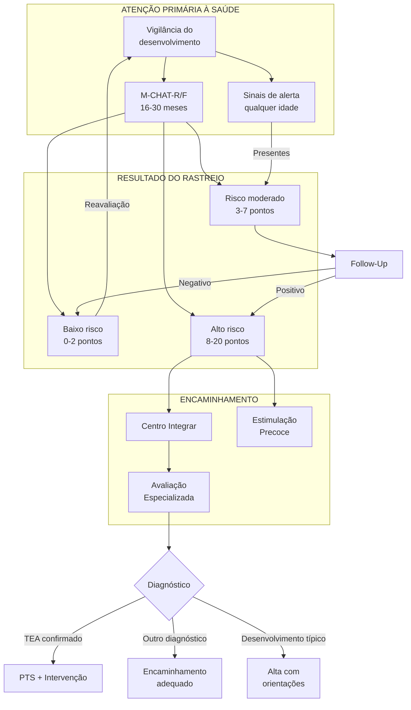
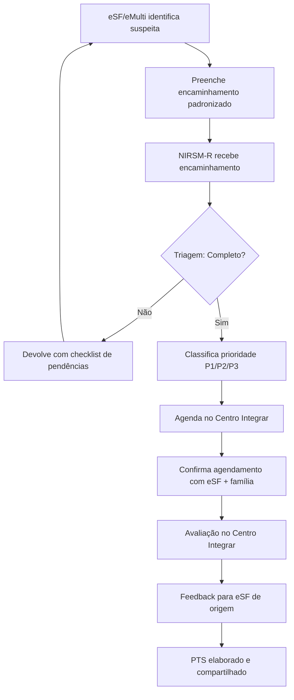
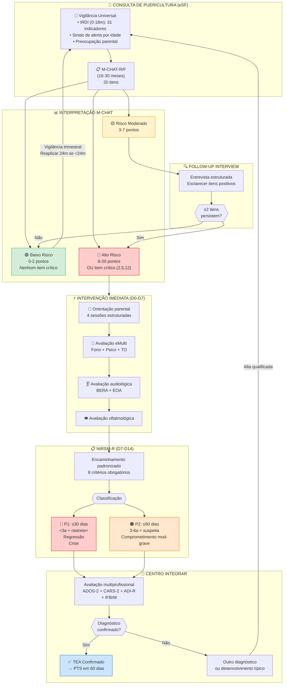
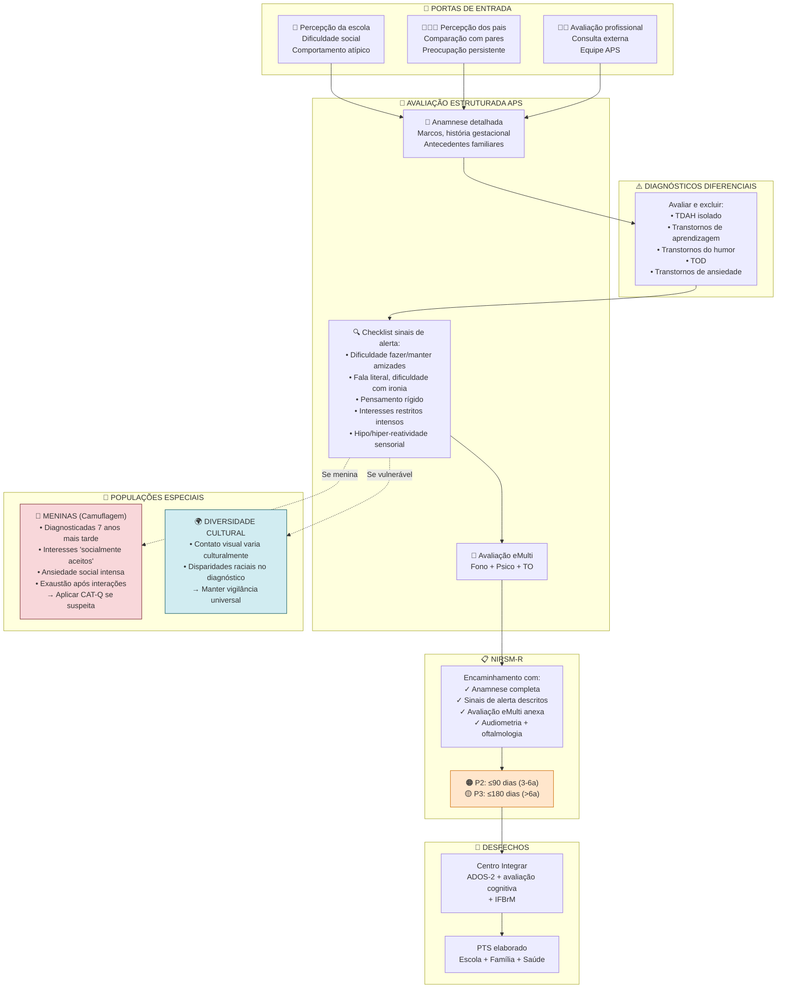
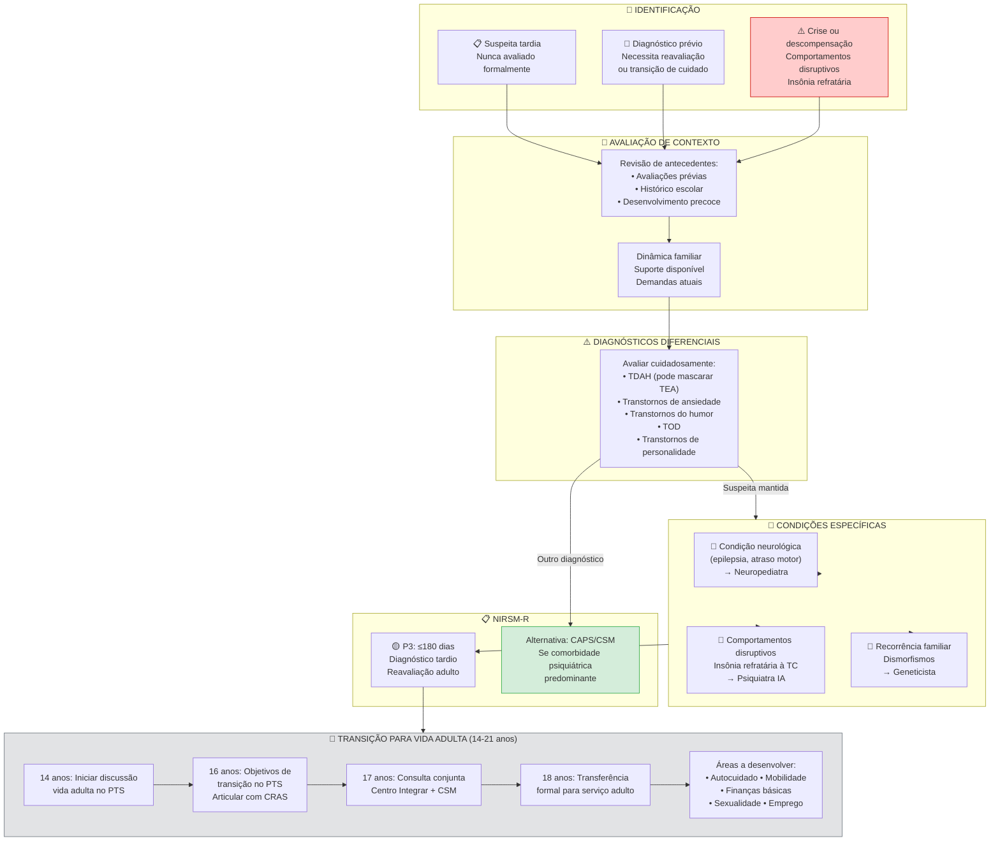

# PROTOCOLO CLÍNICO CLI-02: TRANSTORNO DO ESPECTRO AUTISTA (TEA)
## Linha de Cuidado para Identificação, Avaliação e Acompanhamento

**Secretaria Municipal de Saúde de Extrema/MG**
**Versão:** 2.7 | **Data:** Janeiro/2026
**Status:** Documento Normativo (Alinhado ao Contexto Consolidado v2.0)

---

## 1. OBJETIVO

Estabelecer diretrizes técnicas para identificação precoce, rastreamento, diagnóstico, acompanhamento e reabilitação de pessoas com Transtorno do Espectro Autista (TEA) na Rede de Atenção Psicossocial (RAPS) de Extrema/MG.

---

## 2. ABRANGÊNCIA

- Atenção Primária à Saúde (APS): UBS, eSF, eMulti
- Atenção Especializada: Centro Integrar, CSM, CAPS I
- Rede Intersetorial: Educação, Assistência Social, Cultura

---

## 3. FUNDAMENTAÇÃO TÉCNICA

### 3.1 Definição Clínica e Conceitual

#### 3.1.1 Conceito Central

O **Transtorno do Espectro Autista (TEA)** é uma condição do neurodesenvolvimento de origem neurobiológica, caracterizada por diferenças persistentes na comunicação social e por padrões restritos e repetitivos de comportamento, interesses ou atividades. O termo "espectro" reflete a ampla variação dimensional nas manifestações clínicas, que podem variar desde apresentações com necessidade de apoio muito substancial até indivíduos com alto funcionamento e habilidades excepcionais em áreas específicas.

> **Ponto-Chave:** O TEA é uma **condição do neurodesenvolvimento**, não uma doença progressiva. É uma forma de organização neurológica que acompanha o indivíduo ao longo de toda a vida, com apresentação que evolui conforme o desenvolvimento e as demandas ambientais.

**Princípios fundamentais:**
- **Perspectiva do espectro:** Variação contínua em gravidade e apresentação
- **Condição permanente:** Persiste ao longo da vida, com evolução adaptativa
- **Heterogeneidade:** Cada pessoa com TEA é única em seu perfil
- **Neurodiversidade:** Reconhecimento de diferentes formas de organização neurológica
- **Foco funcional:** Ênfase em impacto e necessidades de apoio, não apenas em déficits

**Alinhamento com MS Brasil (2025):** Conforme a Linha de Cuidado para Pessoas com TEA do Ministério da Saúde, *"a intervenção deve iniciar-se ANTES da conclusão do diagnóstico formal; o Projeto Terapêutico Singular (PTS) deve ser elaborado imediatamente após rastreamento positivo, não após confirmação diagnóstica."*

---

#### 3.1.2 Critérios Diagnósticos (DSM-5-TR)

O diagnóstico de TEA requer o preenchimento de **todos os critérios** abaixo, conforme o Manual Diagnóstico e Estatístico de Transtornos Mentais, 5ª edição, Texto Revisado (DSM-5-TR, APA, 2022):

##### Critério A — Déficits na Comunicação e Interação Social

**TODOS os três domínios são obrigatórios** (em múltiplos contextos, atualmente ou por história):

| Domínio | Descrição | Exemplos Clínicos por Faixa Etária |
|---------|-----------|-----------------------------------|
| **A1 — Reciprocidade socioemocional** | Falha na conversação bidirecional; redução do compartilhamento de interesses, emoções ou afeto; falha em iniciar ou responder a interações sociais | *Lactente:* Ausência de sorriso social recíproco. *Pré-escolar:* Conversação unilateral sobre interesse restrito. *Escolar:* Não percebe que interlocutor perdeu interesse |
| **A2 — Comunicação não-verbal** | Integração pobre entre comunicação verbal e não-verbal; anormalidades no contato visual e linguagem corporal; déficits na compreensão e uso de gestos | *Lactente:* Contato visual escasso ou atípico. *Pré-escolar:* Ausência de apontar protodeclarativo. *Escolar:* Expressões faciais incongruentes com fala |
| **A3 — Relacionamentos** | Dificuldade em ajustar comportamento a contextos sociais; dificuldade em compartilhar brincadeira imaginativa ou fazer amigos; ausência de interesse por pares | *Lactente:* Não responde ao nome. *Pré-escolar:* Prefere brincar sozinho, sem brincadeira simbólica. *Escolar:* Dificuldade em manter amizades, não compreende regras sociais implícitas |

##### Critério B — Padrões Restritos e Repetitivos

**Pelo menos 2 dos 4 domínios** (atualmente ou por história):

| Domínio | Descrição | Exemplos Clínicos |
|---------|-----------|-------------------|
| **B1 — Estereotipias motoras/verbais** | Movimentos, uso de objetos ou fala estereotipados ou repetitivos | Flapping de mãos, balançar corpo, alinhar brinquedos, ecolalia imediata ou tardia, uso idiossincrático de linguagem |
| **B2 — Insistência em uniformidade** | Adesão inflexível a rotinas, padrões ritualizados de comportamento verbal ou não-verbal, resistência extrema a mudanças | Angústia intensa com pequenas mudanças, rituais de saudação, necessidade de seguir mesmo caminho, pensamento rígido |
| **B3 — Interesses fixos e restritos** | Interesses altamente restritos, fixos, anormais em intensidade ou foco | Forte apego a objetos incomuns, interesses excessivamente circunscritos ou perseverativos (ex: memorizar placas de carro) |
| **B4 — Hipo/Hiperreatividade sensorial** | Hiper ou hiporreatividade a estímulos sensoriais ou interesse incomum por aspectos sensoriais do ambiente | Aparente indiferença a dor/temperatura, reação adversa a sons ou texturas específicas, fascínio visual por luzes ou movimento, cheirar ou tocar objetos excessivamente |

##### Critérios C, D e E

| Critério | Descrição | Implicação Clínica |
|----------|-----------|-------------------|
| **C — Início precoce** | Sintomas presentes desde o período inicial do desenvolvimento | Podem não se manifestar plenamente até que demandas sociais excedam capacidades; podem ser mascarados por estratégias aprendidas |
| **D — Prejuízo funcional** | Sintomas causam prejuízo clinicamente significativo no funcionamento social, ocupacional ou outras áreas importantes | Avaliação deve considerar múltiplos contextos (casa, escola, trabalho); impacto pode variar conforme suporte disponível |
| **E — Exclusão** | Perturbações não são melhor explicadas por deficiência intelectual ou atraso global do desenvolvimento | TEA e DI frequentemente coocorrem; quando há comorbidade, comunicação social deve estar abaixo do esperado para nível de desenvolvimento geral |

> **Nota Prática para APS:** O diagnóstico formal de TEA requer avaliação especializada. Na Atenção Primária, a função é **identificar sinais de alerta** e **encaminhar precocemente**, não fechar diagnóstico. A **triagem positiva justifica intervenção imediata** mesmo sem diagnóstico definitivo.

---

#### 3.1.3 Dimensão Sensorial como Característica Nuclear

A partir do DSM-5 (2013), as alterações sensoriais foram reconhecidas como **característica nuclear** do TEA (Critério B4), não mais como manifestação secundária. Estudos demonstram prevalência de **69-95%** de alterações sensoriais em indivíduos com TEA.

| Padrão Sensorial | Manifestações Clínicas | Prevalência | Impacto Funcional |
|------------------|------------------------|-------------|-------------------|
| **Hiperreatividade** | Aversão a sons (liquidificador, secador), texturas (etiquetas, costuras), luzes fortes, cheiros, toques leves | 60-70% | Seletividade alimentar, dificuldade em ambientes públicos, recusa escolar |
| **Hiporreatividade** | Não responde à dor, calor ou frio; não se orienta para sons; parece não perceber pessoas entrando | 40-50% | Risco de lesões, não responder ao nome, parecer "no próprio mundo" |
| **Busca sensorial** | Procura estímulos intensos: girar, pular, apertar, cheirar, olhar fixamente para luzes ou objetos em movimento | 50-60% | Comportamentos de risco, dificuldade de atenção, estereotipias funcionais |

**Domínios sensoriais afetados:**
- **Auditivo:** Hipersensibilidade a sons específicos (misofonia)
- **Visual:** Fascínio por luzes, padrões; aversão a luzes fortes
- **Tátil:** Aversão a texturas, etiquetas; ou busca por pressão profunda
- **Proprioceptivo:** Busca por movimentos intensos, dificuldade com coordenação
- **Vestibular:** Busca ou aversão a movimento; problemas de equilíbrio
- **Olfativo/Gustativo:** Seletividade alimentar extrema; cheirar objetos

> **Implicação clínica:** Alterações sensoriais impactam diretamente **alimentação, sono, participação escolar e interações sociais**. Devem ser sistematicamente investigadas na avaliação.

---

#### 3.1.4 Bases Neurobiológicas

O TEA possui **base neurobiológica bem estabelecida**, com etiologia multifatorial envolvendo fatores genéticos e ambientais. Este conhecimento fundamenta tanto a compreensão da condição quanto a necessidade de intervenção precoce.

| Domínio | Evidências Científicas | Implicação Clínica |
|---------|------------------------|-------------------|
| **Genética** | Herdabilidade estimada em **80-90%** (Tick et al., 2016); >100 genes associados; variantes raras e poligênicas | História familiar de TEA ou traços autísticos é fator de risco significativo; irmãos têm risco 10-20x maior |
| **Conectividade cerebral** | Alterações em redes de larga escala (default mode, saliência, executiva); diferenças em conectividade local vs. longa distância | Explica a variabilidade na apresentação e resposta a intervenções |
| **Neurotransmissores** | Alterações em sistemas GABAérgico, glutamatérgico e serotoninérgico | Base para comorbidades (ansiedade, epilepsia) e algumas respostas farmacológicas |
| **Neuroinflamação** | Marcadores inflamatórios elevados em subgrupos; ativação microglial | Área de pesquisa ativa; pode explicar heterogeneidade |

**Pontos educativos obrigatórios para famílias e equipes:**

> ⚠️ **IMPORTANTE:** O TEA **NÃO é causado por:**
> - Vacinas (refutado por múltiplos estudos de grande escala)
> - Estilo parental ou "falta de afeto"
> - Fatores emocionais ou psicológicos dos pais
> - Uso de telas na primeira infância (embora uso excessivo possa agravar sintomas)

**Modelo etiológico atual:**
- **Predisposição genética** + **modificadores ambientais** (idade parental avançada, prematuridade, baixo peso ao nascer, intercorrências perinatais)
- Não existe "gene do autismo" único — arquitetura genética complexa e heterogênea
- Maioria dos casos: **idiopáticos** (sem causa identificável específica)
- Minoria: associados a síndromes genéticas (X-Frágil, Esclerose Tuberosa, Rett)

**Janela de neuroplasticidade:** O período de **0 a 3 anos** representa a fase de máxima plasticidade cerebral. Este é o fundamento científico para a **intervenção precoce intensiva**, que pode modificar trajetórias de desenvolvimento mesmo antes do diagnóstico formal.

---

#### 3.1.5 Heterogeneidade Cognitiva e Linguística

O TEA apresenta **ampla variação** nos perfis cognitivo e linguístico, desde indivíduos não-falantes com deficiência intelectual até pessoas com inteligência superior e habilidades savant. Esta heterogeneidade é capturada pelos especificadores do DSM-5-TR e pelos códigos CID-11.

| Perfil | Características | Prevalência Estimada | Código CID-11 |
|--------|-----------------|----------------------|---------------|
| **TEA + DI + ausência linguagem funcional** | Necessita apoio muito substancial em todas áreas; comunicação alternativa essencial | ~25-30% | 6A02.5 |
| **TEA + DI + linguagem funcional** | Linguagem presente mas simplificada; compreensão limitada de abstrações | ~15% | 6A02.1 ou 6A02.3 |
| **TEA sem DI + linguagem funcional** | Funcionamento cognitivo típico ou acima; dificuldades pragmáticas | ~40-45% | 6A02.0 |
| **TEA + altas habilidades** | Inteligência superior; possíveis habilidades savant em áreas específicas | ~10-15% | 6A02.0 |

**Terminologia atualizada:**
- **"Não-falante"** substitui "não-verbal" (preferido pela comunidade autista)
- Ausência de fala oral **NÃO indica** ausência de compreensão ou capacidade cognitiva
- **Comunicação Alternativa e Aumentativa (CAA)** deve ser oferecida precocemente

> **Nota clínica:** A avaliação cognitiva em TEA requer instrumentos e profissionais especializados. Testes padronizados podem **subestimar** habilidades devido a dificuldades de compreensão de instruções ou motivação social.

---

#### 3.1.6 Padrões de Início e Fenótipos Temporais

O reconhecimento dos diferentes padrões de início é essencial para identificação precoce e aconselhamento familiar.

| Padrão | Descrição | Prevalência | Idade Típica |
|--------|-----------|-------------|--------------|
| **Início precoce clássico** | Sinais presentes desde os primeiros meses de vida; desenvolvimento atípico desde o início | ~70% | Sinais identificáveis <12 meses |
| **Regressão** | Perda de habilidades previamente adquiridas (linguagem, social) após período de desenvolvimento aparentemente típico | ~25-30% | Tipicamente 15-24 meses |
| **Plateau** | Desenvolvimento estagna sem perda evidente; falha em adquirir novas habilidades no ritmo esperado | ~5% | Variável |

**Definição de regressão:**
- Perda de **≥5 palavras** com significado comunicativo OU
- Perda de habilidades sociais previamente estabelecidas (ex: parou de responder ao nome, perdeu contato visual)
- Média de idade: 19-21 meses (coincide com janela M-CHAT)

> ⚠️ **IMPORTANTE:** A regressão **NÃO é causada por vacinas**. Estudos extensivos demonstram que a coincidência temporal com calendário vacinal é fortuita. A regressão representa um fenótipo específico do TEA.

**Dados epidemiológicos brasileiros (MS, 2025):**

| Indicador | Valor | Fonte |
|-----------|-------|-------|
| Idade média primeira preocupação parental | **23,6 meses** | Censo Autismo Brasil |
| Idade média diagnóstico | **59,6 meses** | Censo Autismo Brasil |
| **GAP diagnóstico** | **36 meses** | Calculado |
| Estabilidade diagnóstica aos 14 meses | 0,79 | Pierce et al., 2019 |
| Estabilidade diagnóstica aos 16 meses | **0,83** | Pierce et al., 2019 |

> **Implicação:** O diagnóstico de TEA pode ser feito de forma **estável e confiável a partir dos 16-18 meses**. O atraso médio de 36 meses representa oportunidade perdida de intervenção na janela crítica.

---

#### 3.1.7 Diferenças por Sexo e Gênero

Existe um **viés significativo de subdiagnóstico em pessoas do sexo feminino**, com implicações diretas para a prática clínica.

| Aspecto | Sexo Masculino | Sexo Feminino |
|---------|----------------|---------------|
| Razão diagnóstica histórica | 4:1 | 1:4 |
| Razão estimada real | ~3:1 | ~1:3 |
| Idade média diagnóstico | Referência | **+4 a 7 anos mais tarde** |
| Apresentação típica | Mais externalizada, "clássica" | Frequentemente internalizada, mascarada |
| Interesses restritos | Mais evidentes (trens, dinossauros) | Podem parecer "típicos" (animais, celebridades) |
| Camuflagem social | Menos frequente | **Muito frequente** |

**O fenômeno da camuflagem (masking/camouflage):**

A camuflagem é uma estratégia adaptativa onde a pessoa autista suprime ou modifica comportamentos para "se encaixar" socialmente. Embora presente em ambos os sexos, é **significativamente mais comum em mulheres**.

| Componente | Descrição | Custo Associado |
|------------|-----------|-----------------|
| **Assimilação** | Esforço para parecer "normal" e se encaixar | Exaustão social, perda de identidade |
| **Mascaramento** | Supressão ativa de comportamentos autísticos (estereotipias, interesses) | Ansiedade, burnout autístico |
| **Compensação** | Uso de estratégias cognitivas para simular habilidades sociais | Sobrecarga cognitiva, depressão |

**Sinais de alerta específicos para meninas:**
- Interesses intensos em temas "socialmente aceitáveis" (animais, séries, K-pop)
- Capacidade de imitar comportamentos sociais observados
- Preferência por amizade com uma única pessoa ou adultos
- Perfeccionismo e alto desempenho acadêmico inicial
- Ansiedade social intensa, mutismo seletivo
- Problemas alimentares (seletividade, anorexia)
- Autolesão ou crises em ambiente privado (não na escola)

> **Implicação clínica:** Diante de **meninas com ansiedade, mutismo seletivo, problemas alimentares ou dificuldades sociais**, manter **limiar de suspeita mais baixo** para TEA. Avaliar em múltiplos contextos — comportamento pode ser muito diferente em casa vs. escola.

---

#### 3.1.8 Perfil de Comorbidades

As comorbidades em TEA são a **regra, não a exceção**. A avaliação abrangente deve sistematicamente investigar condições associadas.

| Comorbidade | Prevalência em TEA | Ação Clínica |
|-------------|-------------------|--------------|
| **TDAH** | 30-50% | Avaliação obrigatória; tratamento melhora funcionamento |
| **Transtornos de ansiedade** | 40-50% | Alta prioridade; impacta qualidade de vida |
| **Deficiência Intelectual** | 32-40% | Ajusta expectativas e estratégias do PTS |
| **Epilepsia** | Até 77,5% (com DI) | Monitoramento neurológico; EEG se indicado |
| **Problemas gastrointestinais** | Até 67,8% | Constipação, refluxo; impacta comportamento |
| **Transtornos do sono** | 50-80% | Prioridade no PTS; impacta toda família |
| **Transtorno de linguagem** | ~60% | Avaliação fonoaudiológica essencial |
| **Depressão** | 20-40% (adolescentes/adultos) | Atenção especial na transição para vida adulta |
| **Transtornos alimentares** | Elevada (especialmente meninas) | Seletividade vs. anorexia/bulimia |

> **Princípio clínico:** Mudanças comportamentais abruptas em pessoa com TEA devem **primeiro investigar causas médicas** (dor, infecção, constipação, problema dentário) antes de atribuir a "comportamento autístico".

---

#### 3.1.9 Definição de Prejuízo Funcional

O Critério D do DSM-5-TR exige que os sintomas causem **prejuízo clinicamente significativo**. A avaliação do prejuízo funcional é essencial para diagnóstico e planejamento terapêutico.

| Domínio Funcional | Indicadores de Prejuízo | Avaliação |
|-------------------|------------------------|-----------|
| **Social** | Dificuldade em fazer/manter amizades; isolamento; conflitos interpessoais frequentes | Entrevista com múltiplos informantes |
| **Acadêmico/Ocupacional** | Desempenho abaixo do esperado para capacidade cognitiva; dificuldade de adaptação | Relatório escolar; histórico ocupacional |
| **Atividades de Vida Diária** | Dependência em AVDs acima do esperado para idade/cognição | Escalas funcionais (IFBrM) |
| **Familiar** | Sobrecarga significativa de cuidador; impacto na dinâmica familiar | Avaliação familiar |
| **Comunitário** | Restrição de participação social; dificuldade de acesso a serviços | Histórico de participação |

**Avaliação formal:** Utilizar o **IFBrM (Índice de Funcionalidade Brasileiro Modificado)** — ver Seção 17 — para avaliação padronizada. Perfil típico TEA apresenta maior prejuízo nos Domínios 2 (Comunicação), 6 (Educação/Trabalho) e 7 (Relações Interpessoais).

> **Nota:** O prejuízo pode **não ser evidente** até que demandas sociais excedam capacidades (ex: entrada na escola, adolescência, vida adulta independente). Pode também ser **mascarado** por estratégias de compensação ou suporte familiar intensivo.

---

#### 3.1.10 Classificação Nosológica (CID-10 e CID-11)

**CID-10** (em uso no Brasil para faturamento SUS):

| Código | Denominação |
|--------|-------------|
| **F84.0** | Autismo infantil |
| **F84.1** | Autismo atípico |
| **F84.5** | Síndrome de Asperger |

**CID-11** (vigente internacionalmente desde 2022; Brasil em período de transição — **aceitar ambas classificações**):

| Código | Descrição | Quando Usar |
|--------|-----------|-------------|
| **6A02** | Transtorno do espectro autista (código geral) | Quando especificação não disponível |
| **6A02.0** | TEA sem TDI, linguagem funcional preservada | QI ≥70, linguagem para comunicação |
| **6A02.1** | TEA com TDI, linguagem funcional preservada | QI <70, linguagem para comunicação |
| **6A02.2** | TEA sem TDI, deficiência linguagem funcional | QI ≥70, linguagem limitada |
| **6A02.3** | TEA com TDI, deficiência linguagem funcional | QI <70, linguagem limitada |
| **6A02.4** | TEA sem TDI, ausência linguagem funcional | QI ≥70, não-falante |
| **6A02.5** | TEA com TDI, ausência linguagem funcional | QI <70, não-falante |

*TDI = Transtorno do Desenvolvimento Intelectual*

> **Orientação prática:** Para fins de faturamento SUS, utilizar **CID-10 (F84.x)**. Para documentação clínica e alinhamento com padrões internacionais, **registrar também código CID-11**. A transição completa está prevista para os próximos anos.

---

### 3.2 Epidemiologia

| Dado | Valor |
|------|-------|
| Prevalência estimada | 1:31 crianças / 3,2% (CDC MMWR, Abril 2025) |
| Prevalência por sexo | Meninos 4,9% / Meninas 1,4% — razão 3,4:1 |
| Variação por raça/etnia (EUA) | Asiáticos 3,82% > Negros 3,66% > Hispânicos 3,30% > Brancos 2,77% |
| Idade média de diagnóstico no Brasil | 4-6 anos (ideal: antes dos 3 anos) |

### 3.3 Níveis de Suporte (DSM-5)

| Nível | Comunicação Social | Comportamentos Repetitivos |
|-------|-------------------|---------------------------|
| **Nível 1** (Requer apoio) | Dificuldades sem apoio, respostas atípicas | Interferência em alguns contextos |
| **Nível 2** (Requer apoio substancial) | Déficits marcados, interação limitada | Óbvios para observador casual |
| **Nível 3** (Requer apoio muito substancial) | Déficits graves, interação mínima | Interferência marcada em todas áreas |

---

## 4. IDENTIFICAÇÃO PRECOCE NA APS

### 4.1 Princípio Fundamental

> **"Atraso no desenvolvimento é urgência funcional. NÃO aguardar diagnóstico definitivo para iniciar intervenção."**

### 4.2 Vigilância Universal do Desenvolvimento

**Em TODAS as consultas de puericultura:**
- Avaliar marcos do desenvolvimento (Caderneta da Criança)
- Investigar fatores de risco
- Orientar estimulação adequada à idade
- Identificar sinais de alerta (red flags)

#### 4.2.1 Orientações de Estimulação para Famílias

**Orientações universais (toda criança):**

| Faixa Etária | Orientações de Estimulação |
|--------------|---------------------------|
| **0-6 meses** | Contato visual durante mamadas; conversar narrando ações; responder a vocalizações; tempo de barriga (tummy time) |
| **6-12 meses** | Brincar de esconder e achar; nomear objetos; estimular apontar; responder quando a criança busca atenção |
| **12-18 meses** | Brincadeiras de imitação; leitura compartilhada com figuras; nomear partes do corpo; brincadeiras de faz-de-conta simples |
| **18-24 meses** | Expandir frases da criança; brincadeiras com outras crianças; seguir o interesse da criança; rotinas previsíveis |
| **24-36 meses** | Perguntas abertas; histórias com sequência; jogos de turnos; incentivar autonomia em AVDs |

**Orientações específicas para crianças em vigilância ou com M-CHAT positivo:**

| Área | Orientação para Família | Frequência |
|------|------------------------|------------|
| **Atenção compartilhada** | Posicionar-se no campo visual; apontar e aguardar resposta; mostrar objetos | Ao longo do dia |
| **Comunicação** | Falar devagar e claramente; usar gestos junto com fala; aguardar tempo de resposta | Contínuo |
| **Interação social** | Brincadeiras face a face; imitação de sons e gestos da criança; celebrar tentativas | Múltiplas vezes/dia |
| **Brincadeira** | Seguir o interesse da criança; expandir brincadeira gradualmente; evitar diretividade excessiva | Sessões de 15-20 min |
| **Rotina** | Estabelecer rotinas previsíveis; avisar transições; usar apoio visual se útil | Diário |
| **Sensorial** | Identificar preferências e aversões; oferecer alternativas; não forçar exposição | Conforme necessidade |

> **Princípio:** Orientar a família a **seguir a liderança da criança** e **transformar interações cotidianas em oportunidades de estimulação**. Evitar "treino" excessivo; priorizar interação natural e prazerosa.

**Material de apoio:** Encaminhar famílias para:
- Caderneta de Saúde da Criança (7ª edição) — orientações de estimulação por faixa
- Programa Criança Feliz (se disponível no município)
- Vídeos de orientação parental (canal MS/OPAS, quando disponíveis)

### 4.3 Fatores de Risco para TEA

| Categoria | Fatores |
|-----------|---------|
| **Biológicos** | Prematuridade, baixo peso ao nascer, asfixia perinatal, idade parental avançada |
| **Genéticos** | Irmão com TEA (risco 10-20x), síndromes genéticas (X-Frágil, Esclerose Tuberosa) |
| **Ambientais** | Uso de valproato na gestação, infecções congênitas |
| **Familiares** | História familiar de TEA, DI, atraso de fala, transtornos psiquiátricos |

### 4.4 Sinais de Alerta por Faixa Etária

#### 4.4.1 Bebês (0-12 meses)

| Sinal | Descrição |
|-------|-----------|
| **Contato visual** | Reduzido ou ausente |
| **Sorriso social** | Ausente ou inconsistente após 3 meses |
| **Orientação ao nome** | Não responde ao nome após 6 meses |
| **Interação** | Baixo interesse por faces e pessoas |
| **Atenção compartilhada** | Não segue o olhar do cuidador |

#### 4.4.2 Crianças (12-36 meses)

| Sinal | Descrição |
|-------|-----------|
| **Linguagem** | Ausência de palavras aos 16 meses; ausência de frases aos 24 meses |
| **Regressão** | Perda de habilidades linguísticas ou sociais previamente adquiridas |
| **Apontar** | Não aponta para mostrar interesse (apontar protodeclarativo) |
| **Imitação** | Ausência de imitação de gestos ou ações |
| **Brincadeira** | Ausência de brincadeira simbólica (faz-de-conta) |
| **Estereotipias** | Movimentos repetitivos (flapping, girar objetos) |
| **Interesses** | Fixação intensa em objetos ou partes de objetos |

#### 4.4.3 Crianças Maiores e Adolescentes

| Sinal | Descrição |
|-------|-----------|
| **Socialização** | Dificuldade em fazer e manter amizades |
| **Comunicação** | Literalidade, dificuldade com linguagem figurada e ironia |
| **Rigidez** | Dificuldade com mudanças, rituais inflexíveis |
| **Interesses** | Interesses intensos e restritos |
| **Sensorialidade** | Hiper ou hiporreatividade sensorial |

---

## 5. INSTRUMENTOS DE VIGILÂNCIA E RASTREIO

### 5.1 Matriz de Instrumentos por Faixa Etária

| Instrumento | Faixa Etária | Aplicador | Propriedades Psicométricas | Contexto |
|-------------|--------------|-----------|---------------------------|----------|
| **IRDI** | 0-18 meses | eSF | 31 indicadores, 4 subfaixas | Puericultura |
| **M-CHAT-R/F** | **16-30 meses** | eSF/eMulti | Sens 88,2%, Esp 98%, α 0,88 | Rastreio universal TEA |
| **MDI (Caderneta)** | 0-10 anos | eSF | Instrumento primário contínuo | Vigilância integral |

**Fonte:** M-CHAT-R/F: Losapio MF, Siquara GM et al. 2023 (validação brasileira); demais: Santos et al., Clinics 2024 (metanálise)

> **Sobreposição IRDI × M-CHAT (16-18 meses):** No período de 16-18 meses, ambos instrumentos são aplicáveis. **Recomendação:** Aplicar IRDI nas consultas de rotina (0-18 meses) e M-CHAT-R/F especificamente aos 18 meses. Se IRDI apresentar indicadores ausentes nesta faixa, aplicar M-CHAT antecipadamente aos 16 meses.

### 5.2 IRDI — Indicadores de Risco para o Desenvolvimento Infantil

**Aplicação:** 0-18 meses, durante consultas de puericultura

**Propriedades Psicométricas:** Sensibilidade **96,9%** para detecção de risco desenvolvimental

**Estrutura:**
- 31 indicadores clínicos organizados em 4 subfaixas etárias:
  - Fase I: 0-4 meses incompletos
  - Fase II: 4-8 meses incompletos
  - Fase III: 8-12 meses incompletos
  - Fase IV: 12-18 meses

**Eixos avaliados:**
1. Suposição de sujeito (SS)
2. Estabelecimento da demanda (ED)
3. Alternância presença/ausência (PA)
4. Função paterna (FP)

**Interpretação:**
- Presença dos indicadores → Desenvolvimento típico
- Ausência de ≥2 indicadores em qualquer fase → Risco para o desenvolvimento → Monitoramento intensificado

---

## 6. RASTREAMENTO COM M-CHAT-R/F

### 6.1 Indicação

**Aplicação UNIVERSAL entre 16 e 30 meses de idade**
- Idealmente aos 18 meses e 24 meses
- Pode ser reaplicado até 30 meses se dúvida

### 6.2 Instrumento: M-CHAT-R/F™

O **Modified Checklist for Autism in Toddlers, Revised with Follow-Up** é o instrumento de rastreio recomendado pela OMS e pelo Ministério da Saúde.

**Características:**
- 20 perguntas de sim/não
- Aplicado pelos pais/cuidadores
- Pode ser aplicado por qualquer profissional de saúde
- Tempo: 5-10 minutos
- Gratuito e validado para o Brasil

### 6.3 Pontuação e Interpretação

| Pontuação | Classificação | Conduta |
|-----------|---------------|---------|
| **0-2** | Baixo risco | Vigilância de rotina; se <24m, reaplicar aos 24m |
| **3-7** | Risco moderado | Aplicar entrevista de seguimento (M-CHAT-R/F Follow-Up) |
| **8-20** | Alto risco | Encaminhamento IMEDIATO para avaliação especializada |

**Valor Preditivo Positivo (VPP):**
- **Para TEA:** 47% (AAP, 2020)
- **Para qualquer transtorno do neurodesenvolvimento:** 95% (AAP, 2020)

> **Implicação clínica:** Mesmo que menos da metade das crianças com M-CHAT positivo confirmem TEA, quase todas apresentam alguma alteração do desenvolvimento que se beneficia de intervenção precoce.

### 6.4 Entrevista de Seguimento (Follow-Up)

**Aplicar quando pontuação 3-7:**
- Esclarecer cada item positivo com perguntas detalhadas
- Se ≥2 itens persistirem positivos → Encaminhar
- Se <2 itens → Reavaliação em 1-3 meses

### 6.5 Itens do M-CHAT-R: Críticos vs Alto Valor Preditivo

**Itens CRÍTICOS (Best 3) — qualquer um positivo indica ALTO RISCO:**

| Item | Pergunta | Se positivo |
|------|----------|-------------|
| **2** | Interesse em outras crianças | Alto risco |
| **5** | Brincadeira de faz-de-conta | Alto risco |
| **12** | Sensibilidade a ruídos | Alto risco |

> **Regra:** Se QUALQUER item crítico (2, 5 ou 12) for positivo, considerar ALTO RISCO independente da pontuação total.

**Itens de ALTO VALOR PREDITIVO (aumentam atenção clínica):**
- Item 7: Apontar para indicar interesse
- Item 9: Mostrar objetos
- Item 13: Imitação
- Item 14: Responder ao nome
- Item 15: Olhar quando apontam

> **Nota:** A combinação de itens críticos + itens de alto valor preditivo aumenta a acurácia da triagem.

### 6.6 Limitações do M-CHAT-R/F e Considerações Especiais

#### 6.6.1 Meninas com TEA — Fenômeno de Camuflagem

**Problema:** Meninas são diagnosticadas em média **7 anos depois** que meninos devido à camuflagem social.

| Componente da Camuflagem | Descrição |
|--------------------------|-----------|
| **Assimilação** | Esforço para "encaixar-se" em grupos sociais |
| **Mascaramento** | Supressão ativa de comportamentos autísticos |
| **Compensação** | Uso de estratégias cognitivas alternativas para interação |

**Indicadores de Risco em Meninas:**
- Exaustão após situações sociais ("burnout social")
- Perfeccionismo e aderência rígida a regras
- Mutismo seletivo
- Diferenças comportamentais marcantes casa vs escola
- Diagnóstico prévio de ansiedade ou transtornos alimentares

**Ferramentas Complementares:**
- **CAT-Q** (Camouflaging Autistic Traits Questionnaire)
- **GQ-ASC** (Girls Questionnaire for Autism Spectrum Condition)

> **Recomendação:** Ao avaliar meninas, investigar ativamente camuflagem e colher informações de múltiplos contextos (escola, casa, atividades extracurriculares).

#### 6.6.2 Bebês Prematuros

**M-CHAT em prematuros tem desempenho reduzido:**

| Parâmetro | Valor em Prematuros | Valor Geral |
|-----------|---------------------|-------------|
| Taxa de triagem positiva | 13-26% | 3-5% |
| VPP (Valor Preditivo Positivo) | 20% | 47% |
| Sensibilidade | 52% | 88,2% |

**Abordagem Modificada:**
- Utilizar **idade corrigida** (não cronológica) até 24 meses
- Realizar **avaliações seriadas** (não depender de ponto único)
- Triagem aos 2-3 anos pode ser mais acurada
- Manter na vigilância PIPA/MG mesmo com M-CHAT negativo

#### 6.6.3 Populações Culturalmente Diversas

| Fator Cultural | Impacto no Rastreio |
|----------------|---------------------|
| Expectativas de contato visual | Variam entre culturas; pode não ser indicador confiável |
| Comportamentos sociais "aceitáveis" | Definição de "atípico" varia culturalmente |
| Barreiras linguísticas | Podem afetar compreensão do questionário |
| Estigma cultural | Pode suprimir relatos de preocupações |
| Atribuição de sintomas | Explicações espirituais vs médicas |

**Disparidades Raciais no Brasil (Mapa Autismo Brasil):**

| Indicador | Pop. Branca | Pop. Negra/Parda |
|-----------|-------------|------------------|
| Taxa diagnóstico reportada | ~3% | **1,3%** |
| Acesso a terapias | Maior | Substancialmente menor |
| Idade no diagnóstico | Mais cedo | Mais tarde |

> **Princípio de Equidade:** A triagem universal é especialmente importante para populações vulneráveis com menor acesso a especialistas. Profissionais devem realizar busca ativa de crianças em situação de vulnerabilidade social.

#### 6.6.4 Manejo de Falso-Negativos no M-CHAT

**Problema:** Aproximadamente 12% das crianças com M-CHAT negativo (0-2 pontos) podem desenvolver TEA posteriormente. A sensibilidade de 88,2% significa que ~12% dos casos verdadeiros não são detectados na triagem inicial.

**Situações de maior risco de falso-negativo:**

| Situação | Motivo | Conduta |
|----------|--------|---------|
| Prematuros | VPP reduzido (~20%) | Manter vigilância PIPA até 3 anos |
| Meninas | Camuflagem social | Atenção a sinais sutis; baixar limiar clínico |
| Crianças com DI | Sobreposição sintomática | Avaliação especializada mesmo sem M-CHAT+ |
| Regressão tardia | Sintomas após 24 meses | Nova triagem aos 30 meses |
| Preocupação parental persistente | Pais frequentemente estão certos | Encaminhar mesmo com M-CHAT negativo |

**Protocolo para Suspeita Clínica com M-CHAT Negativo:**

1. **Documentar preocupações parentais** detalhadamente no prontuário
2. **Reaplicar M-CHAT** em 3-6 meses
3. **Solicitar apoio matricial** ao NIRSM-R ou Centro Integrar
4. **Encaminhar diretamente** se:
   - Preocupação parental persistente após ≥2 consultas
   - Perda de habilidades previamente adquiridas (regressão)
   - Presença de qualquer item crítico (2, 5 ou 12) mesmo com pontuação total baixa
   - Profissional de saúde com suspeita clínica fundamentada

> **Regra de Ouro:** *"Preocupação parental persistente nunca deve ser ignorada, independente do resultado da triagem."* — Zwaigenbaum et al., 2019

---

## 7. FLUXO DE ATENDIMENTO

### 7.1 Fluxograma Geral

### 7.2 Prazos de Encaminhamento (Sistema P1/P2/P3)

| Prioridade | Prazo | Critérios |
|------------|-------|-----------|
| **P1 — Urgente** | Até 30 dias | < 3 anos com rastreio positivo; regressão; comorbidade grave; risco psicossocial |
| **P2 — Alta** | Até 90 dias | 3-6 anos com suspeita; comprometimento moderado-grave; documentação direitos |
| **P3 — Regular** | Até 180 dias | > 6 anos com suspeita; adultos diagnóstico tardio; reavaliação |

**Situações de Encaminhamento Imediato:**
- Regressão do desenvolvimento
- Alto risco M-CHAT (8-20 pontos)

### 7.3 Papel do NIRSM-R na Regulação de TEA

O **NIRSM-R** (Núcleo Intersetorial de Regulação em Saúde Mental - Regional) é o ponto central de regulação para encaminhamentos de suspeita de TEA da APS para a Atenção Especializada.

#### 7.3.1 Funções do NIRSM-R

| Função | Descrição | Prazo |
|--------|-----------|-------|
| **Porta de entrada** | Recebe TODOS os encaminhamentos da APS para avaliação de TEA | Contínuo |
| **Triagem técnica** | Verifica completude do encaminhamento (M-CHAT, anamnese, sinais de alerta) | 48-72h úteis |
| **Classificação de prioridade** | Atribui P1/P2/P3 conforme critérios da Seção 7.2 | No ato da triagem |
| **Distribuição** | Agenda no Centro Integrar conforme prioridade e disponibilidade | Conforme prazo P1/P2/P3 |
| **Devolução** | Retorna encaminhamentos incompletos com orientação de complementação | 48-72h úteis |
| **Monitoramento** | Acompanha tempo de espera e indicadores de acesso | Mensal |
| **Feedback** | Comunica resultado da avaliação à eSF de origem | Após conclusão |

#### 7.3.2 Requisitos do Encaminhamento

**Documentação obrigatória para aceite pelo NIRSM-R:**

| Item | Obrigatório | Descrição |
|------|-------------|-----------|
| Identificação completa | ✓ | Nome, DN, CNS, endereço, telefone, eSF de referência |
| M-CHAT-R/F aplicado | ✓ (16-30m) | Pontuação total + itens críticos positivos |
| Sinais de alerta descritos | ✓ | Conforme Seção 4.4 (quais, desde quando, evolução) |
| Anamnese desenvolvimental | ✓ | Marcos atingidos, preocupações parentais, história gestacional |
| Fatores de risco | ✓ | Conforme Seção 4.3 (prematuridade, história familiar, etc.) |
| História familiar | ✓ | TEA, DI, atraso de fala em parentes de 1º/2º grau |
| Exames realizados | Recomendado | Audiometria/BERA, oftalmológico, outros |
| IRDI (se <18m) | ✓ (se aplicável) | Indicadores ausentes identificados |
| Justificativa clínica | ✓ | Por que a criança precisa de avaliação especializada |

> **Encaminhamento incompleto:** Será DEVOLVIDO à eSF de origem com checklist de pendências. O prazo de espera conta a partir do recebimento do encaminhamento COMPLETO.

#### 7.3.3 Fluxo de Encaminhamento via NIRSM-R

#### 7.3.4 Critérios de Rejeição de Encaminhamento

| Motivo de Rejeição | Ação |
|--------------------|------|
| M-CHAT não aplicado (16-30m) | Devolver com solicitação de aplicação |
| Ausência de sinais de alerta descritos | Devolver com solicitação de descrição |
| Criança >6 anos sem justificativa clínica | Devolver com solicitação de justificativa |
| Duplicidade de encaminhamento | Informar e cancelar duplicata |
| Encaminhamento para benefício apenas | Orientar fluxo CRAS + apoio matricial se necessário |

> **Exceção:** Encaminhamentos com **regressão do desenvolvimento** ou **preocupação parental intensa** são aceitos para discussão mesmo com documentação incompleta (completar posteriormente).

#### 7.3.5 Feedback Obrigatório para APS

Após conclusão da avaliação no Centro Integrar, o NIRSM-R deve garantir que a eSF de origem receba:

| Informação | Prazo | Responsável |
|------------|-------|-------------|
| Resultado da avaliação | 15 dias após conclusão | Centro Integrar → NIRSM-R → eSF |
| Diagnóstico (se confirmado) | 15 dias | Médico avaliador |
| PTS resumido | 30 dias após diagnóstico | Profissional de referência |
| Orientações para APS | 30 dias | Centro Integrar |
| Agendamento de retorno na APS | 30-60 dias | eSF (após receber feedback) |

#### 7.3.6 Indicadores de Desempenho do NIRSM-R

| Indicador | Meta | Fórmula |
|-----------|------|---------|
| Tempo médio de triagem | ≤ 72h úteis | Média(data triagem − data recebimento) |
| Taxa de encaminhamentos completos | ≥ 80% | (Completos / Total recebidos) × 100 |
| Taxa de agendamento no prazo | ≥ 90% | (Agendados no prazo P / Total triados) × 100 |
| Taxa de feedback para APS | 100% | (Feedbacks enviados / Avaliações concluídas) × 100 |

---

## 8. AVALIAÇÃO DIAGNÓSTICA

### 8.1 Equipe de Avaliação

**Centro Integrar - Equipe Mínima:**
- Médico (pediatra, psiquiatra ou neurologista com experiência em TEA)
- Psicólogo
- Fonoaudiólogo
- Terapeuta Ocupacional

### 8.2 Componentes da Avaliação

| Componente | Profissional | Instrumentos/Métodos |
|------------|--------------|---------------------|
| **Avaliação médica** | Médico | Anamnese, exame físico/neurológico, exclusão de causas orgânicas |
| **Avaliação comportamental** | Psicólogo | CARS-2, ADOS-2 (se disponível), observação clínica |
| **Avaliação cognitiva** | Psicólogo | Escala Bayley, WISC, Vineland |
| **Avaliação de linguagem** | Fonoaudiólogo | ADL, PROC, PLS-5 |
| **Avaliação sensório-motora** | TO | Perfil Sensorial, avaliação funcional |
| **Avaliação auditiva** | Fonoaudiólogo | Audiometria, BERA |

### 8.3 Propriedades Psicométricas dos Instrumentos Diagnósticos

| Instrumento | Sensibilidade | Especificidade | Observação |
|-------------|---------------|----------------|------------|
| **ADOS-2** | 87% (IC 0,79-0,92) | 75% (IC 0,73-0,78) | Observação estruturada |
| **CARS-2** | 89% (IC 0,78-0,95) | 79% (IC 0,65-0,88) | Rating scale clínico |
| **ADI-R** | 77% (IC 0,56-0,90) | 68% (IC 0,52-0,81) | Entrevista cuidadores |

**Fonte:** Santos et al., Clinics 2024 (metanálise)

> **Recomendação:** Nenhum instrumento isolado para diagnóstico. Acurácia maior quando ADOS-2 + ADI-R combinados.

### 8.4 Exames Complementares

| Exame | Indicação |
|-------|-----------|
| **Audiometria/BERA** | TODOS os casos (excluir perda auditiva) |
| **Avaliação oftalmológica** | TODOS os casos |
| **Eletroencefalograma** | Se suspeita de epilepsia ou regressão |
| **Ressonância magnética** | Se dismorfismos, macrocefalia, convulsões, regressão |
| **Cariótipo/Array-CGH** | Se dismorfismos ou DI associada |
| **X-Frágil** | Meninos com TEA + DI, história familiar |
| **Erros inatos do metabolismo** | Se regressão, consanguinidade, sintomas sistêmicos |

### 8.5 Critérios Diagnósticos (DSM-5-TR) — Resumo

> 📋 **Para detalhamento completo com exemplos clínicos e tabelas por faixa etária, consultar Seção 3.1.2.**

**Critério A — Comunicação e Interação Social** (TODOS os 3 obrigatórios):
1. Déficits na reciprocidade socioemocional
2. Déficits nos comportamentos comunicativos não verbais
3. Déficits em desenvolver, manter e compreender relacionamentos

**Critério B — Padrões Restritos e Repetitivos** (pelo menos 2 de 4):
1. Movimentos, uso de objetos ou fala estereotipados ou repetitivos
2. Insistência em rotinas, padrões ritualizados, resistência a mudanças
3. Interesses restritos e fixos, anormais em intensidade ou foco
4. **Hiper ou hiporreatividade a estímulos sensoriais** (característica nuclear)

**Critério C:** Sintomas presentes desde o período inicial do desenvolvimento

**Critério D:** Sintomas causam prejuízo clinicamente significativo

**Critério E:** Não melhor explicados por DI ou atraso global do desenvolvimento (comorbidade possível)

---

## 9. INTERVENÇÃO TERAPÊUTICA

### 9.1 Princípios da Intervenção

| Princípio | Descrição |
|-----------|-----------|
| **Precocidade** | Iniciar o mais cedo possível, mesmo sem diagnóstico definitivo |
| **Intensidade** | Intervenções estruturadas com frequência adequada |
| **Individualização** | Baseada nas necessidades e potencialidades de cada pessoa |
| **Família como protagonista** | Capacitação e participação ativa da família |
| **Naturalidade** | Intervenções em contextos naturais (casa, escola) |
| **Baseada em evidências** | Abordagens com comprovação científica |

### 9.2 Abordagens Recomendadas

#### 9.2.1 Intervenções Comportamentais

| Abordagem | Descrição | Nível de Evidência |
|-----------|-----------|-------------------|
| **ABA** (Applied Behavior Analysis) | Análise do comportamento aplicada | Alto |
| **EIBI** (Early Intensive Behavioral Intervention) | Intervenção comportamental intensiva precoce | Alto |
| **PRT** (Pivotal Response Treatment) | Treino de respostas pivotais | Moderado |
| **PECS** (Picture Exchange Communication System) | Sistema de comunicação por troca de figuras | Moderado |

#### 9.2.2 Intervenções Desenvolvimentais

| Abordagem | Descrição |
|-----------|-----------|
| **DIR/Floortime** | Modelo baseado no desenvolvimento, diferenças individuais e relação |
| **ESDM** (Early Start Denver Model) | Modelo Denver de início precoce |
| **TEACCH** | Tratamento e educação de crianças autistas |

#### 9.2.3 Intervenções Específicas

| Área | Intervenção |
|------|-------------|
| **Linguagem** | Fonoterapia, comunicação aumentativa e alternativa (CAA) |
| **Motor/Sensorial** | Terapia ocupacional, integração sensorial |
| **Social** | Treino de habilidades sociais, grupos terapêuticos |
| **Comportamento** | Manejo comportamental, suporte comportamental positivo |

#### 9.2.4 Algoritmo de Seleção de Intervenção

**Critérios para definição do plano terapêutico individualizado:**

| Perfil da Criança | Intervenção Primária | Intervenções Complementares | Intensidade Recomendada |
|-------------------|---------------------|----------------------------|------------------------|
| **<3 anos, qualquer nível** | EIBI ou ESDM | Orientação parental intensiva; CAA se necessário | 15-25h/semana (mínimo 10h) |
| **3-6 anos, Nível 3** | ABA estruturado | Fono (CAA), TO, suporte comportamental | 15-20h/semana |
| **3-6 anos, Nível 2** | ABA ou TEACCH | Fono, TO, grupo social | 10-15h/semana |
| **3-6 anos, Nível 1** | TEACCH ou grupos | Fono (pragmática), TO se necessário | 5-10h/semana |
| **>6 anos, Nível 3** | ABA funcional | Fono, TO, suporte escolar intensivo | 10-15h/semana |
| **>6 anos, Nível 2** | TEACCH + grupos | Treino habilidades sociais | 5-10h/semana |
| **>6 anos, Nível 1** | Grupos terapêuticos | Treino habilidades sociais, TO se sensorial | 2-5h/semana |
| **Adolescente/Adulto** | Grupos + individual | Habilitação profissional, vida independente | 2-5h/semana |

**Critérios de ajuste de intensidade:**

| Critério | Ação |
|----------|------|
| Resposta rápida (ganhos >esperado em 3m) | Considerar redução gradual de intensidade |
| Resposta lenta (sem ganhos em 6m) | Revisar abordagem, aumentar intensidade, investigar comorbidades |
| Presença de comportamentos desafiadores graves | Priorizar manejo comportamental; aumentar intensidade |
| Regressão | Avaliar causas; intensificar temporariamente |
| Comorbidade psiquiátrica ativa | Estabilizar comorbidade antes de intensificar intervenção TEA |

**Frequência por modalidade terapêutica:**

| Modalidade | Frequência Mínima | Frequência Ideal | Duração da Sessão |
|------------|-------------------|------------------|-------------------|
| **ABA/EIBI** | 2x/semana | 4-5x/semana | 2-4 horas |
| **ESDM** | 2x/semana | 4-5x/semana | 1-2 horas |
| **Fonoaudiologia** | 1x/semana | 2-3x/semana | 45-60 min |
| **Terapia Ocupacional** | 1x/semana | 2x/semana | 45-60 min |
| **Grupo social** | 1x/semana | 1-2x/semana | 60-90 min |
| **Orientação parental** | Quinzenal | Semanal (inicial) | 60 min |

> **Princípio:** A intensidade deve ser **máxima tolerada** pela criança e família, especialmente nos primeiros anos. Quanto mais precoce e mais intensa a intervenção, melhores os resultados a longo prazo.

#### 9.2.5 Cronograma de Reavaliação Terapêutica

| Momento | O que reavaliar | Decisão |
|---------|-----------------|---------|
| **3 meses** | Adesão, tolerância, resposta inicial | Ajustar abordagem se baixa resposta |
| **6 meses** | Ganhos funcionais vs metas PTS | Manter, intensificar ou mudar abordagem |
| **12 meses** | Avaliação formal de habilidades | Redefinir metas e plano |
| **Anualmente** | Reavaliação diagnóstica completa | Reavaliar nível de suporte e PTS |

### 9.3 Medicação

**O TEA não tem tratamento medicamentoso específico. Medicações são indicadas para:**

| Sintoma/Comorbidade | Opções farmacológicas |
|--------------------|----------------------|
| **Irritabilidade/Agressividade** | Risperidona*, Aripiprazol* |
| **Hiperatividade/Impulsividade** | Metilfenidato, Atomoxetina |
| **Ansiedade** | ISRS (Fluoxetina, Sertralina) |
| **Insônia** | Melatonina, higiene do sono |
| **Epilepsia** | Antiepilépticos conforme indicação |

*Únicos com indicação FDA para irritabilidade em TEA

---

## 10. PROJETO TERAPÊUTICO SINGULAR (PTS)

### 10.1 Construção do PTS

**Quatro Momentos:**

1. **Diagnóstico situacional:**
   - Avaliação multidimensional (saúde, funcionalidade, contexto)
   - Identificação de potencialidades e necessidades
   - Mapeamento da rede de suporte

2. **Definição de metas:**
   - Metas funcionais e mensuráveis
   - Priorizadas com família
   - Curto (3m), médio (6m) e longo prazo (12m)

3. **Divisão de responsabilidades:**
   - Profissional de referência definido
   - Papel de cada membro da equipe
   - Responsabilidades da família
   - Articulação intersetorial

4. **Reavaliação:**
   - Trimestral ou conforme necessidade
   - Avaliação de metas
   - Ajustes no plano

### 10.2 Componentes do PTS para TEA

| Área | Elementos |
|------|-----------|
| **Terapêutica** | Frequência e tipo de terapias (ABA, fono, TO) |
| **Educação** | Apoio escolar, sala de recursos, mediação |
| **Saúde** | Consultas de acompanhamento, medicação |
| **Social** | Atividades de inclusão, lazer |
| **Família** | Orientação, grupos de apoio, descanso do cuidador |

---

## 11. ACOMPANHAMENTO LONGITUDINAL

### 11.1 Frequência de Consultas

| Serviço | Frequência | Objetivo |
|---------|------------|----------|
| **Centro Integrar** | Conforme PTS (semanal a mensal para terapias) | Intervenção terapêutica |
| **APS** | Trimestral (consulta de acompanhamento) | Monitoramento, vacinas, comorbidades |
| **Especialista médico** | Semestral (se estável) ou conforme necessidade | Reavaliação global, medicação |

#### 11.1.1 Protocolo de Consulta Trimestral na APS

**Objetivo:** Monitorar evolução, identificar intercorrências, manter vínculo e coordenar cuidado longitudinal.

**Roteiro de Consulta Trimestral (20-30 min):**

| Etapa | O que avaliar | Como registrar |
|-------|---------------|----------------|
| **1. Acolhimento** | Preocupações da família, eventos desde última consulta | Subjetivo (S) |
| **2. Adesão** | Frequência às terapias, uso de medicação, escola | Subjetivo (S) |
| **3. Desenvolvimento** | Ganhos funcionais relatados, novas habilidades | Objetivo (O) |
| **4. Comportamento** | Irritabilidade, sono, alimentação, estereotipias | Objetivo (O) |
| **5. Comorbidades** | Sinais de ansiedade, TDAH, epilepsia, GI | Avaliação (A) |
| **6. Saúde geral** | Calendário vacinal, crescimento, dentição | Objetivo (O) |
| **7. Família** | Sobrecarga do cuidador, rede de apoio | Avaliação (A) |
| **8. Orientações** | Reforçar estimulação, ajustar orientações | Plano (P) |
| **9. Articulação** | Comunicação com Centro Integrar/escola | Plano (P) |
| **10. Agendamento** | Próxima consulta, exames pendentes | Plano (P) |

**Instrumentos de apoio (opcionais):**

| Instrumento | Uso | Periodicidade |
|-------------|-----|---------------|
| Escala de Sobrecarga de Zarit (reduzida) | Rastreio sobrecarga cuidador | Semestral |
| PHQ-2 | Rastreio depressão cuidador | Anual ou se sinais |
| Checklist comportamental breve | Monitoramento comportamento | Trimestral |
| Caderneta da Criança | Marcos do desenvolvimento | A cada consulta |

**Critérios de encaminhamento durante monitoramento:**

| Achado | Conduta |
|--------|---------|
| Regressão de habilidades | Encaminhamento urgente ao Centro Integrar |
| Crise comportamental grave | CSM/CAPS para manejo de crise |
| Suspeita de comorbidade psiquiátrica | Matriciamento ou encaminhamento CSM |
| Convulsão | Encaminhamento neurologia |
| Dificuldade importante na escola | Articulação intersetorial |

> **Nota:** A consulta trimestral na APS NÃO substitui o acompanhamento no Centro Integrar. É complementar e visa garantir continuidade do cuidado no território.

### 11.2 Monitoramento

| Aspecto | O que monitorar | Frequência |
|---------|-----------------|------------|
| **Desenvolvimento** | Ganhos funcionais, habilidades adquiridas | Trimestral |
| **Comportamento** | Irritabilidade, autoagressão, estereotipias | Contínuo |
| **Comorbidades** | Ansiedade, TDAH, epilepsia, sono | Semestral |
| **Inclusão** | Escola, comunidade, atividades | Semestral |
| **Família** | Sobrecarga do cuidador, dinâmica familiar | Trimestral |

### 11.3 Transições

| Transição | Ações |
|-----------|-------|
| **Escola regular → AEE** | Relatório para escola, articulação com equipe pedagógica |
| **Infância → Adolescência** | Adaptação do PTS, temas de puberdade e sexualidade |
| **Adolescência → Adulto** | Preparação para vida adulta, habilitação profissional |
| **Centro Integrar → CSM** | Se necessidade de acompanhamento psiquiátrico adulto |

#### 11.3.1 Protocolo de Transição para Vida Adulta (Centro Integrar → CSM/APS)

**Faixa etária de transição:** 16-21 anos (planejamento inicia aos 14 anos)

**Critérios para transição ao CSM (adulto):**

| Critério | Descrição | Verificação |
|----------|-----------|-------------|
| **Idade** | ≥18 anos (pode iniciar aos 16 se estável) | Documento de identidade |
| **Comorbidade psiquiátrica** | Presença de transtorno psiquiátrico que requeira acompanhamento | Avaliação psiquiátrica |
| **Estabilidade funcional** | Padrão de funcionamento estabelecido, sem ganhos significativos esperados | Reavaliação de equipe |
| **Necessidade de medicação** | Uso contínuo de psicotrópicos | Prontuário |

**Cronograma de transição:**

| Idade | Ações |
|-------|-------|
| **14 anos** | Iniciar discussão sobre vida adulta no PTS; avaliar habilidades de vida independente |
| **16 anos** | Incluir objetivos de transição no PTS; articular com CRAS (habilitação profissional) |
| **17 anos** | Primeira consulta conjunta Centro Integrar + CSM (se indicado); atualizar documentação |
| **18 anos** | Transferência formal; relatório completo para serviço adulto; alta do Centro Integrar |
| **18-21 anos** | Período de acompanhamento paralelo se necessário; disponibilidade para matriciamento |

**Áreas a desenvolver na transição:**

| Área | Objetivos | Responsável |
|------|-----------|-------------|
| **Autocuidado** | AVDs, higiene, alimentação independente | TO + família |
| **Vida doméstica** | Tarefas domésticas básicas, segurança em casa | TO + família |
| **Mobilidade comunitária** | Uso de transporte, orientação no território | TO + educação |
| **Finanças básicas** | Manejo de dinheiro, noção de valor | Assistente Social + família |
| **Sexualidade** | Educação sexual adaptada, limites, consentimento | Psicólogo + família |
| **Trabalho** | Avaliação de habilidades, estágio protegido, Lei de Cotas | Assistente Social + CRAS |
| **Lazer** | Atividades comunitárias, esporte adaptado | Articulação intersetorial |

**Documentação de transição:**

| Documento | Conteúdo | Destinatário |
|-----------|----------|--------------|
| Relatório de transição | História completa, diagnóstico, PTS, intervenções realizadas, estado atual | CSM/serviço adulto |
| Laudo atualizado | CID-10/11, nível de suporte, funcionalidade | INSS, CRAS, empregador |
| Orientações para família | Direitos do adulto com TEA, serviços disponíveis, emergências | Família |
| Comunicação à APS | Resumo clínico, medicações, alertas | eSF de referência |

> **Princípio:** A transição deve ser **gradual, planejada e centrada na pessoa**. O objetivo não é "dar alta", mas transferir o cuidado para serviços apropriados à fase adulta, mantendo suporte conforme necessidade.

---

## 12. REDE INTERSETORIAL

### 12.1 Articulação com Educação

| Ação | Responsável | Periodicidade |
|------|-------------|---------------|
| Relatório técnico para escola | Centro Integrar | A cada semestre ou conforme demanda |
| Programa Saúde na Escola (PSE) | APS + Educação | Conforme calendário PSE |
| Capacitação de professores sobre TEA | SMS + SME | Anual (mínimo) |
| Reuniões intersetoriais saúde-educação | Coordenação SM + SME | Mensal |
| Elaboração conjunta do PEI | Centro Integrar + Escola | Ao diagnóstico e anualmente |

**Protocolo de Relatório Escola-Saúde:**

| Item Obrigatório | Descrição |
|------------------|-----------|
| Identificação | Nome, data nascimento, CID, data diagnóstico |
| Síntese do perfil | Pontos fortes, desafios, necessidades de apoio |
| Sensorialidade | Hiper/hiporreatividades identificadas, adaptações sugeridas |
| Comunicação | Nível de linguagem, necessidade de CAA |
| Comportamento | Padrões repetitivos, estratégias de manejo |
| Recomendações | Adaptações curriculares, suporte em sala, AEE |
| Contato | Profissional de referência para dúvidas |

> **Nota:** Relatório requer **consentimento informado** da família (LGPD, Lei 13.709/2018).

### 12.2 Articulação com Assistência Social

| Ação | Responsável | Critério de Encaminhamento |
|------|-------------|---------------------------|
| Cadastro Único / BPC | CRAS | Renda per capita ≤ 1/4 SM |
| Cuidador de pessoa com deficiência | CRAS | IFBrM ≤60 (moderada a grave) |
| Situações de vulnerabilidade social | CRAS/CREAS | Risco social identificado |
| Avaliação social para BPC | INSS (via CRAS) | Solicitação familiar + laudo médico |
| Busca ativa de famílias vulneráveis | ACS + CRAS | Territórios de maior vulnerabilidade |

**Protocolo CRAS/CREAS ↔ Saúde:**

| Situação | Fluxo | Responsável |
|----------|-------|-------------|
| Suspeita de negligência/maus-tratos | CREAS → CSM → APS (monitoramento) | Assistente Social CREAS |
| Família em situação de rua | CRAS/Centro POP → APS (prioridade cadastro) | Assistente Social CRAS |
| Violência doméstica | CREAS → CAPS → APS (apoio cuidador) | Equipe CREAS |
| Abandono de tratamento + vulnerabilidade | APS → CRAS (busca ativa conjunta) | ACS + Assistente Social CRAS |
| Necessidade de benefício eventual | Saúde → CRAS (relatório social) | Profissional de referência |

> **Reunião intersetorial obrigatória:** Casos em situação de vulnerabilidade DEVEM ser discutidos em reunião conjunta Saúde + Assistência Social (mínimo mensal).

### 12.3 Direitos e Benefícios

| Benefício | Requisitos | Documentação Necessária |
|-----------|------------|------------------------|
| **BPC** (Benefício de Prestação Continuada) | Renda per capita ≤ 1/4 SM + avaliação biopsicossocial INSS | Laudo médico CID, IFBrM, comprovante renda |
| **Passe livre interestadual** | Renda familiar ≤ 3 SM + laudo médico | Laudo específico, foto, RG, comprovante renda |
| **Carteira de identificação (CIPTEA)** | Diagnóstico de TEA (Lei 13.977/2020) | Laudo médico com CID, foto, documentos pessoais |
| **Prioridade de atendimento** | Diagnóstico de TEA (LBI + Lei 14.626/2023) | CIPTEA ou laudo médico |
| **Isenção IPVA** | Deficiência que impeça direção ou necessidade de adaptação | Laudo + avaliação DETRAN |
| **Dedução IR (dependente)** | Diagnóstico comprovado de TEA | Laudo médico + documentação fiscal |

### 12.4 Articulação com 3º Setor

| Tipo de Parceiro | Papel na Rede | Articulação com Saúde |
|------------------|---------------|----------------------|
| **Associações de autismo** | Grupos de apoio, advocacy, informação | Encaminhamento pós-diagnóstico; palestras conjuntas |
| **ONGs de reabilitação** | Terapias complementares (equoterapia, musicoterapia) | Coordenação com PTS; relatórios compartilhados |
| **Instituições religiosas** | Acolhimento, suporte emocional, inclusão comunitária | Orientação sobre inclusão; parceria PSE |
| **Empresas (Lei de Cotas)** | Inclusão profissional, estágios | Transição vida adulta; laudos para contratação |
| **Universidades** | Atendimento supervisionado, pesquisa | Estágios; programas de extensão |
| **Fundações/Institutos** | Projetos específicos, financiamento | Captação de recursos; capacitação |

**Cadastro de Parceiros do Território:**

Cada UBS deve manter cadastro atualizado de:
- Associações de pais e familiares de pessoas com TEA no município/região
- ONGs e instituições que oferecem atendimento/atividades para pessoas com TEA
- Escolas com experiência em inclusão
- Empresas parceiras para inclusão profissional

> **Orientação:** A articulação com 3º setor **NÃO substitui** o atendimento SUS, mas **complementa** o cuidado com ações de inclusão social, suporte familiar e atividades comunitárias.

### 12.5 Telecare e Atendimento Remoto

| Modalidade | Indicação | Plataforma |
|------------|-----------|------------|
| **Teleconsultoria** | Dúvidas técnicas eSF → Centro Integrar/CSM | Telessaúde MG ou similar |
| **Telemonitoramento** | Famílias em área rural ou com dificuldade de deslocamento | WhatsApp institucional, videochamada |
| **Orientação parental remota** | Demonstração de técnicas, suporte entre consultas | Videochamada agendada |
| **Grupos de apoio virtuais** | Famílias que não podem comparecer presencialmente | Plataforma de videoconferência |
| **Capacitação à distância** | Profissionais da rede, ACS, professores | Plataforma UNA-SUS, EAD SMS |

**Protocolo de Teleatendimento:**

1. **Elegibilidade:** Pacientes estáveis, com familiar capacitado, acesso à internet
2. **Frequência:** Não substitui mais de 50% dos atendimentos presenciais
3. **Documentação:** Registro em prontuário com termo "TELEATENDIMENTO"
4. **Consentimento:** Termo de consentimento específico para atendimento remoto
5. **Emergências:** Orientar busca de atendimento presencial imediato se sinais de alerta

> **Especialmente útil para:** Comunidades rurais, famílias com múltiplos filhos, cuidadores com dificuldade de locomoção, acompanhamento entre consultas presenciais.

### 12.6 Saúde Mental do Cuidador

**Fundamentação:** Cuidadores de pessoas com TEA apresentam taxas elevadas de estresse, ansiedade e depressão. O cuidado ao cuidador é componente essencial do PTS.

| Indicador de Sobrecarga | Instrumento de Rastreio | Conduta |
|-------------------------|------------------------|---------|
| Estresse crônico | Escala de Sobrecarga de Zarit (reduzida) | Encaminhamento para apoio psicológico |
| Sintomas depressivos | PHQ-2 / PHQ-9 | Avaliação CSM ou CAPS se moderado/grave |
| Sintomas ansiosos | GAD-2 / GAD-7 | Avaliação CSM ou CAPS se moderado/grave |
| Isolamento social | Avaliação clínica | Grupos de apoio, rede social |
| Sobrecarga física | Avaliação clínica | Programa de descanso do cuidador |

**Ações de Suporte ao Cuidador:**

| Ação | Responsável | Periodicidade |
|------|-------------|---------------|
| Rastreio de sobrecarga do cuidador | eSF/eMulti | A cada consulta de acompanhamento |
| Grupos de apoio para famílias | Centro Integrar + APS | Mensal ou quinzenal |
| Psicoterapia individual (se indicada) | CSM ou CAPS I | Conforme necessidade |
| Programa de descanso do cuidador | Assistência Social | Conforme disponibilidade |
| Orientação sobre rede de apoio informal | ACS + Assistente Social | Contínuo |
| Capacitação em manejo comportamental | Centro Integrar | Ao diagnóstico + reciclagem anual |

> **Princípio:** *"Cuidar de quem cuida"* — A saúde mental do cuidador impacta diretamente a qualidade do cuidado e o prognóstico da pessoa com TEA.

---

## 13. INDICADORES DE QUALIDADE

### 13.1 Indicadores e Metas

| Indicador | Meta | Periodicidade |
|-----------|------|---------------|
| % de crianças 18-24 meses rastreadas com M-CHAT | ≥ 80% | Mensal |
| Tempo médio entre rastreio positivo e 1ª consulta especializada | ≤ 30 dias | Mensal |
| % de casos com PTS elaborado em 60 dias | ≥ 90% | Trimestral |
| % de crianças <3 anos em estimulação precoce | ≥ 90% | Trimestral |
| Taxa de abandono de tratamento | ≤ 15% | Trimestral |
| % de famílias que receberam orientação parental | 100% | Trimestral |

### 13.2 Fórmulas de Cálculo

| Indicador | Fórmula | Fonte de Dados |
|-----------|---------|----------------|
| **Taxa de Cobertura de Triagem** | (Crianças 18-24m triadas / Total crianças 18-24m na área) × 100 | e-SUS PEC + Cadastro ACS |
| **Tempo até Avaliação Especializada** | Média(Data 1ª consulta Centro Integrar − Data triagem positiva) | Sistema de Regulação |
| **Taxa de PTS em 60 dias** | (PTS elaborados em ≤60 dias / Total diagnósticos confirmados) × 100 | Centro Integrar |
| **Taxa de Estimulação Precoce** | (Crianças <3 anos em estimulação / Total crianças <3 anos com TEA) × 100 | Centro Integrar |
| **Taxa de Abandono** | (Casos sem comparecimento >90 dias / Total em acompanhamento) × 100 | Todos os serviços |
| **Orientação Parental** | (Famílias que completaram orientação / Total famílias atendidas) × 100 | Centro Integrar + APS |

### 13.3 Monitoramento e Responsabilidades

| Indicador | Responsável pela Coleta | Responsável pela Análise |
|-----------|-------------------------|-------------------------|
| Cobertura triagem | eSF/eMulti | Coordenação APS |
| Tempo até avaliação | NIRSM-R | Coordenação SM |
| PTS em 60 dias | Centro Integrar | Coordenação SM |
| Estimulação precoce | Centro Integrar | Coordenação SM |
| Taxa abandono | Todos os serviços | Coordenação SM |
| Orientação parental | Centro Integrar + APS | Coordenação SM |

---

## 14. RESPONSABILIDADES

### 14.1 APS (eSF + eMulti)

#### 14.1.1 Responsabilidades Gerais da APS

- Vigilância universal do desenvolvimento
- Aplicação do IRDI (0-18 meses) e M-CHAT-R/F (16-30 meses)
- Identificação de sinais de alerta
- Encaminhamento qualificado via NIRSM-R
- Acompanhamento longitudinal pós-contrarreferência
- Articulação intersetorial no território
- Orientação inicial à família

#### 14.1.2 Responsabilidades por Profissional (eSF)

| Profissional | Responsabilidades Específicas para TEA |
|--------------|---------------------------------------|
| **Médico(a)** | Avaliação clínica, aplicação M-CHAT, encaminhamento via NIRSM-R, prescrição de exames, acompanhamento de comorbidades |
| **Enfermeiro(a)** | Aplicação IRDI/M-CHAT em puericultura, vigilância do desenvolvimento, coordenação do cuidado no território |
| **Técnico(a) de Enfermagem** | Apoio à aplicação de instrumentos, agendamento, organização de fluxo |
| **ACS** | Busca ativa de crianças faltosas, identificação de sinais de alerta em visitas, monitoramento de adesão |
| **Dentista** | Avaliação e manejo odontológico adaptado (dessensibilização, técnicas específicas) |

#### 14.1.3 Responsabilidades da eMulti (quando disponível)

| Profissional eMulti | Responsabilidades Específicas para TEA |
|---------------------|---------------------------------------|
| **Psicólogo(a)** | Apoio matricial para casos complexos, avaliação inicial, orientação parental, grupos de apoio |
| **Fonoaudiólogo(a)** | Triagem de linguagem, orientação de estimulação comunicativa, apoio matricial eSF |
| **Terapeuta Ocupacional** | Avaliação sensorial inicial, orientação de adaptações ambientais, estratégias de AVD |
| **Fisioterapeuta** | Avaliação motora em casos com comprometimento motor associado |
| **Assistente Social** | Articulação com CRAS/CREAS, acesso a benefícios, avaliação social |
| **Nutricionista** | Manejo de seletividade alimentar, orientação nutricional |

**Diferenciação APS vs. Atenção Especializada:**

| Ação | APS (eSF/eMulti) | Centro Integrar |
|------|------------------|-----------------|
| Triagem M-CHAT | ✓ Aplica | - |
| Diagnóstico TEA | - | ✓ Confirma |
| Intervenção comportamental intensiva | - | ✓ Coordena |
| Orientação parental básica | ✓ Realiza | ✓ Aprofunda |
| Acompanhamento de rotina (estáveis) | ✓ Realiza | - |
| Avaliação ADOS-2/ADI-R | - | ✓ Realiza |
| Estimulação precoce estruturada | Apoio matricial | ✓ Coordena |
| Elaboração PTS | Participa | ✓ Lidera |

> **Princípio de subsidiariedade:** A APS deve oferecer o máximo de cuidado possível em seu nível de complexidade, encaminhando para atenção especializada apenas o que excede sua capacidade resolutiva.

### 14.2 Centro Integrar

- Avaliação diagnóstica multidisciplinar (ADOS-2, ADI-R, CARS-2)
- Avaliação biopsicossocial (IFBrM)
- Elaboração e coordenação do PTS
- Intervenção terapêutica especializada (ABA, EIBI, ESDM, Floortime)
- Estimulação precoce estruturada
- Orientação parental intensiva (programa CST ou equivalente)
- Capacitação da rede (APS, escolas, CRAS)
- Emissão de laudos e relatórios
- Articulação com escola para PEI

### 14.3 CAPS I / CSM

- Atendimento de comorbidades psiquiátricas (ansiedade, depressão, TDAH)
- Apoio em situações de crise comportamental grave
- Matriciamento para equipes APS e Centro Integrar
- Atendimento de adultos com TEA + transtorno psiquiátrico
- Acolhimento de urgência em saúde mental

### 14.4 NIRSM-R

| Responsabilidade | Descrição | Frequência |
|------------------|-----------|------------|
| **Regulação de encaminhamentos** | Receber, triar e classificar todos encaminhamentos de suspeita TEA | Contínuo |
| **Controle de qualidade** | Verificar completude da documentação de encaminhamento | A cada encaminhamento |
| **Agendamento** | Distribuir casos para Centro Integrar conforme prioridade | Contínuo |
| **Monitoramento de filas** | Acompanhar tempo de espera por prioridade | Semanal |
| **Feedback para APS** | Garantir que eSF receba resultado das avaliações | Após cada avaliação |
| **Relatórios gerenciais** | Produzir indicadores de acesso e tempo de espera | Mensal |
| **Teleconsultoria** | Apoiar eSF em dúvidas sobre encaminhamento | Sob demanda |
| **Reuniões de rede** | Participar de discussões de casos complexos | Quinzenal/mensal |

> **Nota:** O NIRSM-R NÃO realiza atendimento clínico direto. Sua função é **regulatória e de coordenação** do fluxo entre APS e Atenção Especializada.

---

## 15. CRITÉRIOS DE CONTRARREFERÊNCIA (AES → APS)

### 15.1 Critérios para Contrarreferência

| Critério | Operacionalização | Responsável pela Verificação |
|----------|-------------------|------------------------------|
| Objetivos PTS atingidos | ≥70% dos objetivos SMART conforme reavaliação interdisciplinar | **Equipe do Centro Integrar** (reunião de equipe) |
| Estabilização clínica/funcional | Ausência de regressão por ≥3 meses consecutivos | **Terapeuta de referência** + parecer médico |
| Família capacitada | Conclusão programa psicoeducação + demonstração técnicas | **Psicólogo/Assistente Social** do Centro Integrar |
| eSF/eMulti com condições | ≥1 profissional capacitado + agenda trimestral disponível | **Coordenação da APS** (via NIRSM-R) |
| Inclusão escolar estabelecida | Matrícula efetivada + PEI elaborado | **Articulador intersetorial** (verificar documento escolar) |

> **Fluxo de decisão:** A contrarreferência requer **consenso da equipe interdisciplinar** do Centro Integrar, com registro em ata e comunicação formal à eSF de origem. A família deve ser consultada e concordar com a transição.

### 15.2 Critérios de Não-Encaminhamento (Manter na APS)

- Atraso leve responsivo a estimulação APS após 3-6 meses
- Necessidade apenas de orientação familiar
- Casos estáveis em acompanhamento sem intercorrências
- Demanda exclusivamente de acesso a benefícios (avaliar apoio matricial)

### 15.3 Critérios para Retorno à AES pós-Contrarreferência

- Regressão significativa de habilidades adquiridas
- Surgimento de comorbidade psiquiátrica grave
- Crise comportamental não manejável na APS
- Solicitação fundamentada da família com justificativa técnica

---

## 16. PROTOCOLO PIPA/MG — NEONATOS DE RISCO

### 16.1 Critérios de Elegibilidade

Conforme Deliberação CIB-SUS/MG 1.404/2013:

- Prematuridade extrema (<32 semanas)
- Muito baixo peso ao nascer (<1.500g)
- Asfixia perinatal grave
- Convulsões neonatais
- Hemorragia intracraniana
- Leucomalácia periventricular
- Infecções congênitas (STORCH + Zika)
- Síndromes genéticas associadas a atraso do desenvolvimento

### 16.2 Cronograma de Acompanhamento PIPA

| Mês | 1º | 4º | 6º | 9º | 12º | 15º | 18º | 21º | 24º |
|-----|----|----|----|----|-----|-----|-----|-----|-----|
| Consulta | ✓ | ✓ | ✓ | ✓ | ✓ | ✓ | ✓ | ✓ | ✓ |

### 16.3 Fluxo

- Se diagnóstico definido → Inclusão em Intervenção Precoce
- Se sem comprometimento detectado → Alta + monitoramento APS
- Mudança tipo atendimento → Aprovação Junta Reguladora RCPD

---

## 17. AVALIAÇÃO BIOPSICOSSOCIAL — IFBrM

### 17.1 Conceito

O **IFBrM** (Índice de Funcionalidade Brasileiro Modificado) é o instrumento oficial brasileiro para avaliação biopsicossocial da deficiência, conforme Lei 13.146/2015 (LBI).

### 17.2 Domínios Avaliados

| # | Domínio | Atividades Avaliadas |
|---|---------|---------------------|
| 1 | Aprendizagem e aplicação conhecimento | Capacidade cognitiva, resolução problemas |
| 2 | Comunicação | Expressão, compreensão, linguagem |
| 3 | Mobilidade | Locomoção, transferências, uso de membros |
| 4 | Cuidados Pessoais | AVDs básicas (higiene, alimentação, vestuário) |
| 5 | Vida Doméstica | AVDs instrumentais (preparar refeições, limpeza) |
| 6 | Educação, Trabalho, Vida Econômica | Participação escolar/laboral/financeira |
| 7 | Relações Interpessoais, Vida Comunitária | Interação social, participação comunitária |

### 17.3 Classificação e Interpretação

**Cálculo:** Média aritmética das pontuações dos 7 domínios (escala 25-100 por domínio)

| Faixa de Pontuação | Classificação | Nível de Dependência |
|--------------------|---------------|----------------------|
| **86-100** | Sem deficiência | Independência completa ou supervisão ocasional |
| **61-85** | Deficiência Leve | Assistência mínima; independência na maioria das AVDs |
| **41-60** | Deficiência Moderada | Assistência moderada; dependência parcial |
| **25-40** | Deficiência Grave | Assistência máxima; dependência completa ou quase completa |

**Interpretação por Domínio:**
- Cada domínio é pontuado de 25 (dependência total) a 100 (independência)
- Avaliar padrão de dependência: uniforme vs predominante em áreas específicas
- Para TEA: frequentemente maior comprometimento em Domínios 2 (Comunicação), 6 (Educação/Trabalho) e 7 (Relações Interpessoais)

> **Nota:** A classificação IFBrM é obrigatória para acesso a BPC e outros benefícios conforme Lei 13.146/2015 (LBI).

---

## 18. DOCUMENTAÇÃO NO e-SUS PEC

### 18.1 Requisitos de Sistema

- **Versão mínima:** e-SUS PEC 5.3.30 (M-CHAT integrado)
- **Caderneta Digital:** Disponível via ConecteSUS

### 18.2 Campos Obrigatórios para Triagem M-CHAT

| Campo | Formato | Obrigatório |
|-------|---------|-------------|
| Data de triagem | DD/MM/AAAA | Sim |
| Idade na triagem | Meses | Sim |
| Pontuação total M-CHAT-R | 0-20 | Sim |
| Classificação de risco | Baixo/Moderado/Alto | Sim |
| Itens críticos positivos (2, 5, 12) | Lista | Sim |
| Follow-Up conduzida | Sim/Não | Condicional |
| Pontuação Follow-Up | 0-20 | Condicional |
| Impressão clínica | Texto livre | Recomendado |
| Ações tomadas | Lista | Sim |
| Códigos CID-10 | F84.x, R62.0, Z13.4 | Sim |
| Profissional responsável | Nome/CBO | Sim |
| Próxima consulta agendada | DD/MM/AAAA | Recomendado |

### 18.3 Códigos CID-10 para Registro

| Código | Descrição | Uso |
|--------|-----------|-----|
| **F84.0** | Autismo infantil | Diagnóstico confirmado |
| **F84.1** | Autismo atípico | Diagnóstico confirmado |
| **F84.5** | Síndrome de Asperger | Diagnóstico confirmado |
| **F84.9** | TGD não especificado | Investigação em curso |
| **R62.0** | Atraso de marco do desenvolvimento | Triagem positiva, pré-diagnóstico |
| **Z13.4** | Exame especial de rastreamento de certas perturbações do desenvolvimento na infância | Triagem M-CHAT realizada |

### 18.4 Formato de Registro SOAP

**S (Subjetivo):** Preocupações parentais, história do desenvolvimento
**O (Objetivo):** Pontuação M-CHAT-R/F, observação clínica, marcos atingidos
**A (Avaliação):** Classificação de risco, hipótese diagnóstica
**P (Plano):** Conduta (vigilância / follow-up / encaminhamento), próxima consulta

---

## 19. REFERÊNCIAS BIBLIOGRÁFICAS

*Formatadas conforme Normas de Vancouver (ICMJE)*

### 19.1 Legislação Federal

1. Brasil. Lei nº 10.216, de 6 de abril de 2001. Dispõe sobre a proteção e os direitos das pessoas portadoras de transtornos mentais e redireciona o modelo assistencial em saúde mental. Diário Oficial da União. 2001 abr 9;Seção 1:2.

2. Brasil. Lei nº 12.764, de 27 de dezembro de 2012 (Lei Berenice Piana). Institui a Política Nacional de Proteção dos Direitos da Pessoa com Transtorno do Espectro Autista. Diário Oficial da União. 2012 dez 28;Seção 1:2.

3. Brasil. Lei nº 13.146, de 6 de julho de 2015 (Lei Brasileira de Inclusão da Pessoa com Deficiência). Institui a avaliação biopsicossocial da deficiência. Diário Oficial da União. 2015 jul 7;Seção 1:2.

4. Brasil. Lei nº 13.709, de 14 de agosto de 2018 (Lei Geral de Proteção de Dados Pessoais). Art. 14: tratamento de dados pessoais de crianças e adolescentes. Diário Oficial da União. 2018 ago 15;Seção 1:59.

5. Brasil. Lei nº 13.977, de 8 de janeiro de 2020 (Lei Romeo Mion). Institui a Carteira de Identificação da Pessoa com Transtorno do Espectro Autista (CIPTEA). Diário Oficial da União. 2020 jan 9;Seção 1:1.

6. Brasil. Lei nº 14.626, de 20 de julho de 2023. Assegura atendimento prioritário à pessoa com TEA em situação de urgência e emergência. Diário Oficial da União. 2023 jul 21;Seção 1:1.

7. Brasil. Lei nº 15.256, de 12 de novembro de 2025. Altera a Lei nº 12.764, de 27 de dezembro de 2012, para incentivar o diagnóstico de transtorno do espectro autista em população adulta e idosa. Diário Oficial da União. 2025 nov 13;Seção 1.

8. Brasil. Ministério da Saúde. Portaria GM/MS nº 2.436, de 21 de setembro de 2017. Aprova a Política Nacional de Atenção Básica (PNAB). Diário Oficial da União. 2017 set 22;Seção 1:68.

9. Brasil. Ministério da Saúde. Portaria GM/MS nº 3.088, de 23 de dezembro de 2011. Institui a Rede de Atenção Psicossocial (RAPS). Diário Oficial da União. 2011 dez 26;Seção 1:37.

### 19.2 Normativas Estaduais (MG)

10. Minas Gerais. Secretaria de Estado de Saúde. Deliberação CIB-SUS/MG nº 1.092, de 14 de agosto de 2012. Institui a Rede de Atenção Psicossocial em Minas Gerais.

11. Minas Gerais. Secretaria de Estado de Saúde. Deliberação CIB-SUS/MG nº 1.272, de 21 de novembro de 2012. Institui a Rede de Cuidados à Pessoa com Deficiência (RCPD) em Minas Gerais.

12. Minas Gerais. Secretaria de Estado de Saúde. Deliberação CIB-SUS/MG nº 1.403, de 18 de abril de 2013. Institui o Serviço Especializado em Reabilitação para Deficiência Intelectual (SERDI).

13. Minas Gerais. Secretaria de Estado de Saúde. Deliberação CIB-SUS/MG nº 1.404, de 18 de abril de 2013. Institui o Programa de Intervenção Precoce para Bebês de Alto Risco (PIPA).

14. Minas Gerais. Secretaria de Estado de Saúde. Deliberação CIB-SUS/MG nº 2.003, de 19 de agosto de 2014. Institui as Juntas Reguladoras da RCPD.

15. Minas Gerais. Secretaria de Estado de Saúde. Resolução SES-MG nº 8.971, de 12 de setembro de 2023. Estabelece diretrizes para assistência à pessoa com TEA no âmbito do SUS-MG.

### 19.3 Literatura Científica e Diretrizes Clínicas

16. American Psychiatric Association. Diagnostic and statistical manual of mental disorders: DSM-5. 5th ed. Arlington (VA): American Psychiatric Publishing; 2013. 947 p.

17. Brasil. Ministério da Saúde. Secretaria de Atenção Especializada à Saúde. Linha de Cuidado para a Pessoa com Transtorno do Espectro Autista (TEA) e suas famílias na Rede de Atenção Psicossocial do SUS. Brasília: Ministério da Saúde; 2025.

18. Brasil. Ministério da Saúde. Secretaria de Atenção à Saúde. Linha de cuidado para a atenção às pessoas com transtornos do espectro do autismo e suas famílias na Rede de Atenção Psicossocial do Sistema Único de Saúde. Brasília: Ministério da Saúde; 2015. 156 p.

19. Hyman SL, Levy SE, Myers SM; Council on Children with Disabilities, Section on Developmental and Behavioral Pediatrics. Identification, evaluation, and management of children with autism spectrum disorder. Pediatrics. 2020;145(1):e20193447. doi:10.1542/peds.2019-3447

20. Robins DL, Casagrande K, Barton M, Chen CM, Dumont-Mathieu T, Fein D. Validation of the Modified Checklist for Autism in Toddlers, Revised With Follow-up (M-CHAT-R/F). Pediatrics. 2014;133(1):37-45. doi:10.1542/peds.2013-1813

21. Losapio MF, Siquara GM, Pondé MP, Moreno AB, Sanchez ZM, Lopes CS. Psychometric properties of the Brazilian version of the Modified Checklist for Autism in Toddlers-Revised with Follow-Up (M-CHAT-R/F). J Autism Dev Disord. 2023;53(5):2030-2040. doi:10.1007/s10803-022-05489-9

22. Santos CCN, Nascimento RR, Silva LFA, Oliveira MCS. Psychometric properties of screening and diagnostic instruments for autism spectrum disorder: a systematic review and meta-analysis. Clinics. 2024;79:e2024089. doi:10.1016/j.clinics.2024.100089

23. Tryfon A, Foster NEV, Ouimet T, Doyle-Thomas K, Anagnostou E, Bherer L, et al. Systematic review and meta-analysis of early autism interventions: effects on child and caregiver outcomes. Dev Med Child Neurol. 2022;64(9):1062-1078. doi:10.1111/dmcn.15198

24. Sandbank M, Bottema-Beutel K, Crowley S, Cassidy M, Feldman JI, Woynaroski T. Intervention effects on language in children with autism: a Project AIM meta-analysis. J Speech Lang Hear Res. 2023;66(7):2379-2401. doi:10.1044/2023_JSLHR-22-00542

25. Brasil. Escola Nacional de Administração Pública (ENAP). Avaliação biopsicossocial da deficiência: aplicação do Índice de Funcionalidade Brasileiro Modificado (IFBrM). Brasília: ENAP; 2020. 68 p.

26. Zwaigenbaum L, Brian JA, Ip A; Canadian Paediatric Society, Autism Spectrum Disorder Guidelines Task Force. Early detection for autism spectrum disorder in young children. Paediatr Child Health. 2019;24(7):424-432. doi:10.1093/pch/pxz119

27. National Institute for Health and Care Excellence. Autism spectrum disorder in under 19s: recognition, referral and diagnosis. Clinical guideline [CG128]. London: NICE; 2017 [updated 2021]. Available from: https://www.nice.org.uk/guidance/cg128

28. Pierce K, Gazestani VH, Bacon E, Barnes CC, Cha D, Nalabolu S, et al. Evaluation of the diagnostic stability of the early autism spectrum disorder phenotype in the general population starting at 12 months. JAMA Pediatr. 2019;173(6):578-587. doi:10.1001/jamapediatrics.2019.0624

29. Shaw KA, Williams S, Patrick ME, et al. Prevalence and Early Identification of Autism Spectrum Disorder Among Children Aged 4 and 8 Years — Autism and Developmental Disabilities Monitoring Network, 16 Sites, United States, 2022. MMWR Surveill Summ. 2025;74(SS-2):1-22. doi:10.15585/mmwr.ss7402a1

30. World Health Organization. International Classification of Diseases, Eleventh Revision (ICD-11). Geneva: WHO; 2019/2021. Available from: https://icd.who.int/

31. American Psychiatric Association. Diagnostic and Statistical Manual of Mental Disorders, Fifth Edition, Text Revision (DSM-5-TR). Washington, DC: American Psychiatric Publishing; 2022. 1050 p.

32. Lord C, Brugha TS, Charman T, Cusack J, Dumas G, Frazier T, et al. Autism spectrum disorder. Nat Rev Dis Primers. 2020;6(1):5. doi:10.1038/s41572-019-0138-4

33. Tick B, Bolton P, Happé F, Rutter M, Rijsdijk F. Heritability of autism spectrum disorders: a meta-analysis of twin studies. J Child Psychol Psychiatry. 2016;57(5):585-595. doi:10.1111/jcpp.12499

34. Hull L, Petrides KV, Allison C, Smith P, Baron-Cohen S, Lai MC, et al. "Putting on my best normal": social camouflaging in adults with autism spectrum conditions. J Autism Dev Disord. 2017;47(8):2519-2534. doi:10.1007/s10803-017-3166-5

35. Ozonoff S, Gangi D, Hanzel EP, Hill A, Hill MM, Miller M, et al. Onset patterns in autism: variation across informants, methods, and timing. Autism Res. 2018;11(5):788-797. doi:10.1002/aur.1943

---

## 20. ANEXOS

### Anexo A: M-CHAT-R/F (Versão Brasileira)

*Disponível em: www.mchatscreen.com (versão em português)*

### Anexo B: IRDI — Indicadores de Risco para o Desenvolvimento Infantil

*Disponível na Caderneta de Saúde da Criança (7ª edição)*

### Anexo C: Sinais de Alerta - Material para ACS

| Idade | Perguntar à família |
|-------|---------------------|
| 6 meses | "O bebê olha nos olhos quando vocês conversam?" |
| 9 meses | "O bebê responde quando vocês chamam o nome dele?" |
| 12 meses | "O bebê aponta para mostrar coisas que interessam ele?" |
| 18 meses | "Ele brinca de faz-de-conta (dá comidinha, fala no telefone)?" |
| 24 meses | "Ele fala frases de duas palavras (ex: 'quer água')?" |

### Anexo D: IFBrM — Formulário de Avaliação Biopsicossocial

*Disponível no portal do INSS/ENAP*

### Anexo E: Glossário de Siglas

| Sigla | Significado |
|-------|-------------|
| **ABA** | Applied Behavior Analysis (Análise do Comportamento Aplicada) |
| **ACS** | Agente Comunitário de Saúde |
| **ADI-R** | Autism Diagnostic Interview - Revised |
| **ADOS-2** | Autism Diagnostic Observation Schedule, 2nd Edition |
| **AEE** | Atendimento Educacional Especializado |
| **AES** | Atenção Especializada em Saúde |
| **APS** | Atenção Primária à Saúde |
| **AVD** | Atividades de Vida Diária |
| **BPC** | Benefício de Prestação Continuada |
| **CAA** | Comunicação Aumentativa e Alternativa |
| **CAPS** | Centro de Atenção Psicossocial |
| **CARS-2** | Childhood Autism Rating Scale, 2nd Edition |
| **CAT-Q** | Camouflaging Autistic Traits Questionnaire |
| **CER** | Centro Especializado em Reabilitação |
| **CID** | Classificação Internacional de Doenças |
| **CIF** | Classificação Internacional de Funcionalidade |
| **CRAS** | Centro de Referência de Assistência Social |
| **CREAS** | Centro de Referência Especializado de Assistência Social |
| **CSM** | Centro de Saúde Mental |
| **DI** | Deficiência Intelectual |
| **DSM-5** | Manual Diagnóstico e Estatístico de Transtornos Mentais, 5ª ed. |
| **EIBI** | Early Intensive Behavioral Intervention |
| **eMulti** | Equipe Multiprofissional na Atenção Primária |
| **ESDM** | Early Start Denver Model |
| **eSF** | Equipe de Saúde da Família |
| **GQ-ASC** | Girls Questionnaire for Autism Spectrum Condition |
| **IFBrM** | Índice de Funcionalidade Brasileiro Modificado |
| **IRDI** | Indicadores de Risco para o Desenvolvimento Infantil |
| **LBI** | Lei Brasileira de Inclusão (Lei 13.146/2015) |
| **M-CHAT-R/F** | Modified Checklist for Autism in Toddlers, Revised with Follow-Up |
| **MDI** | Marcos do Desenvolvimento Infantil |
| **NIRSM-R** | Núcleo Intersetorial de Regulação em Saúde Mental - Regional |
| **PECS** | Picture Exchange Communication System |
| **PEI** | Plano Educacional Individualizado |
| **PIPA** | Programa de Intervenção Precoce para Bebês de Alto Risco |
| **PNAB** | Política Nacional de Atenção Básica |
| **PRT** | Pivotal Response Treatment |
| **PSE** | Programa Saúde na Escola |
| **PTS** | Projeto Terapêutico Singular |
| **RAPS** | Rede de Atenção Psicossocial |
| **RCPD** | Rede de Cuidados à Pessoa com Deficiência |
| **SERDI** | Serviço Especializado em Reabilitação para Deficiência Intelectual |
| **SUS** | Sistema Único de Saúde |
| **TDI** | Transtorno do Desenvolvimento Intelectual |
| **TEA** | Transtorno do Espectro Autista |
| **TEACCH** | Treatment and Education of Autistic and Communication Handicapped Children |
| **TO** | Terapeuta Ocupacional |
| **UBS** | Unidade Básica de Saúde |
| **VPP** | Valor Preditivo Positivo |

---

### Anexo F: Fluxogramas Visuais por Faixa Etária (Consulta Rápida)

> **Objetivo:** Material visual para consulta rápida durante atendimento clínico. Para detalhes completos, consultar as seções correspondentes do protocolo.

#### F.1 Fluxograma Diagnóstico: 0-3 Anos (Primeira Infância)

**Regras de Ouro — 0-3 Anos:**
- 🕐 **Janela crítica:** Neuroplasticidade máxima — intervenção deve iniciar em D0-D7
- ⚠️ **Itens críticos M-CHAT (2, 5, 12):** Qualquer um positivo = Alto Risco
- 👧 **Meninas:** Podem apresentar camuflagem precoce — manter limiar baixo de suspeição
- 👶 **Prematuros:** Usar idade corrigida até 24 meses; integrar com PIPA/MG
- 👂 **Obrigatório:** Avaliação audiológica e oftalmológica em TODOS os casos

---

#### F.2 Fluxograma Diagnóstico: 3-12 Anos (Infância)

**Regras de Ouro — 3-12 Anos:**
- 📚 **Escola é aliada:** Relatório escolar obrigatório no encaminhamento
- 👧 **Viés de gênero:** Meninas frequentemente diagnosticadas como "ansiosas" ou "tímidas"
- 🧠 **Comorbidades:** TDAH (30-50%) e ansiedade (40-50%) são REGRA, não exceção
- 📊 **Diagnóstico diferencial:** TEA pode coexistir com outros transtornos (não exclui)
- 🕐 **Timing:** Mesmo após 6 anos, diagnóstico correto muda trajetória de vida

---

#### F.3 Fluxograma: 12-18+ Anos (Adolescentes e Diagnóstico Tardio)

**Regras de Ouro — 12-18+ Anos:**
- 🎭 **Camuflagem acumulada:** Anos de adaptação podem mascarar sinais clássicos
- 🧠 **Saúde mental:** Depressão e ansiedade frequentes — avaliar sempre
- 📅 **Transição:** Planejamento deve começar aos 14 anos, não aos 18
- 💼 **Emprego:** Lei de Cotas (8.213/91) — articular com CRAS para habilitação
- 🔄 **Continuum:** TEA não "termina" aos 18 — requer cuidado ao longo da vida

---

#### F.4 Quadro-Resumo: Consulta APS Adaptada para Pessoa com TEA

> **Fonte adaptada:** Einstein HIAE + MS Brasil 2025

##### 🕐 Tempo de Consulta
Agendar **dois slots** (30-40 min) — déficits em interação social, aversões sensoriais e dificuldade com novidades prolongam atendimento.

##### 📋 Estratégias para Melhor Experiência

| Antes da Consulta | Durante a Consulta | Especificidades |
|-------------------|--------------------|-----------------|
| Comunicar-se com cuidadores sobre estratégias | Permitir manipulação de instrumentos | **Tempo de processamento:** Aguardar resposta sem pressionar |
| Oferecer "visita prática" para familiarização | Usar linguagem simples e clara | **Comunicação:** Evitar ironia, metáforas, figuras de linguagem |
| Família usar "história social" ou quadro visual | Usar dicas visuais e suportes | **Sensorial:** Ambiente calmo, luz indireta se possível |
| Propiciar tempo para histórico antes do exame | Abreviar partes opressoras do exame | **Previsibilidade:** Antecipar cada etapa ("Agora vou...") |

##### 👩‍⚕️ Roteiro de Consulta Trimestral (10 Passos)

| # | Passo | O que avaliar | Registrar (SOAP) |
|---|-------|---------------|------------------|
| 1 | Acolhimento | Eventos desde última consulta, preocupações da família | S |
| 2 | Adesão | Frequência às terapias, uso de medicação, frequência escolar | S |
| 3 | Desenvolvimento | Ganhos funcionais, novas habilidades | O |
| 4 | Comportamento | Irritabilidade, sono, alimentação, estereotipias | O |
| 5 | Comorbidades | Sinais de ansiedade, TDAH, convulsões, problemas GI | A |
| 6 | Saúde geral | Vacinas, crescimento, dentição | O |
| 7 | Família | Sobrecarga do cuidador (Zarit), rede de apoio | A |
| 8 | Orientação | Reforçar estimulação, ajustar orientações | P |
| 9 | Articulação | Comunicação com Centro Integrar/escola | P |
| 10 | Agendamento | Próxima consulta, exames pendentes | P |

##### ⚠️ Cuidados de Rotina — Especificidades TEA

| Área | Atenção Especial |
|------|------------------|
| **Segurança** | Risco adicional para afogamento e perambulação (fuga) — orientar família |
| **Alimentação** | Seletividade alimentar → risco de deficiências (Fe, Ca, vit D, B12), constipação, obesidade |
| **Medicamentos** | Antipsicóticos → risco obesidade (↑apetite, sedação). Psicoestimulantes → ↓apetite, insônia se tardio |
| **Autocuidado** | Habilidades (banheiro, vestir, higiene) demandam maior apoio — suporte em consultas de enfermagem |
| **Atividade física** | Coordenação pode estar alterada — avaliar necessidade de Educador Físico adaptado |

##### 📊 Instrumentos de Apoio (Opcionais)

| Instrumento | Frequência | Objetivo |
|-------------|------------|----------|
| **Zarit Burden Scale** | Semestral | Avaliar sobrecarga do cuidador |
| **PHQ-2/PHQ-9** | Anual | Rastrear depressão no cuidador |
| **Checklist comportamental breve** | Trimestral | Monitorar mudanças |
| **Caderneta de Saúde da Criança** | Toda consulta | Vigilância do desenvolvimento |

---

### Anexo G: Cartão de Bolso — Itens Críticos M-CHAT-R/F

> **Para uso durante consulta de puericultura**

| Item | Pergunta Simplificada | Resposta de Risco |
|------|----------------------|-------------------|
| **2** | Seu filho se interessa por outras crianças? | NÃO |
| **5** | Seu filho faz de conta (brinca de faz-de-conta)? | NÃO |
| **12** | Seu filho fica incomodado com barulhos do dia a dia? | SIM |

**⚠️ QUALQUER item crítico positivo = ALTO RISCO → Encaminhamento prioritário**

**Outros itens de alto valor preditivo:** 7 (apontar), 9 (mostrar objetos), 13 (imitar), 14 (responder ao nome), 15 (seguir olhar)

---

## 21. HISTÓRICO DE REVISÕES

| Versão | Data | Alterações | Responsável |
|--------|------|------------|-------------|
| 1.0 | Jan/2026 | Versão inicial | Coordenação SM |
| 2.0 | Jan/2026 | Alinhamento com Contexto Consolidado v2.0: inclusão IRDI, IFBrM, PIPA/MG, sistema P1/P2/P3, critérios contrarreferência, normativas estaduais, correção nomenclatura eSF/eMulti | Coordenação SM + Claude |
| 2.1 | Jan/2026 | **Revisão técnica rigorosa (3 ciclos):** (1) Correção sensibilidade M-CHAT-R/F 78%→88,2% (Losapio 2023); (2) CID-11 6A02.4 adicionado; (3) Nova seção 6.6 Populações Específicas (meninas/camuflagem, prematuros, diversidade cultural, disparidades raciais); (4) IFBrM com cortes de classificação; (5) Sensibilidade IRDI 96,9%; (6) Fórmulas cálculo indicadores; (7) Campos documentação e-SUS obrigatórios; (8) Glossário de siglas; (9) Referências atualizadas (MS 2025, Tryfon 2022, Losapio 2023, Pierce 2019) | Coordenação SM + Claude |
| 2.2 | Jan/2026 | **Verificação e validação com rigor técnico-científico:** (1) Triangulação de dados com fontes oficiais (CDC 2023, Losapio 2023, Santos 2024, ENAP 2020); (2) Correção IFBrM: "média dos domínios" (não soma); (3) VPP M-CHAT adicionado (47% TEA, 95% neurodesenvolvimento); (4) Clarificação itens críticos (2,5,12) vs alto valor preditivo; (5) Nota sobreposição IRDI/M-CHAT 16-18m; (6) **Referências reformatadas em Vancouver (ICMJE)** — 29 referências com DOI; (7) Ciclo iterativo final (self-consistency, self-correction) | Coordenação SM + Claude |
| 2.3 | Jan/2026 | **Completude de fluxos operacionais:** (1) Nova seção 6.6.4 — Manejo de Falso-Negativos M-CHAT (protocolo para suspeita clínica com triagem negativa, situações de maior risco); (2) Seção 15.1 atualizada — Responsáveis por cada critério de contrarreferência especificados (equipe Centro Integrar, terapeuta de referência, coordenação APS, articulador intersetorial); (3) Fluxo de decisão para contrarreferência adicionado | Coordenação SM + Claude |
| 2.4 | Jan/2026 | **Expansão da Fundamentação Técnica (Seção 3.1):** (1) Nova estrutura com 10 subseções (3.1.1–3.1.10); (2) Conceito Central expandido com perspectiva de neurodiversidade e alinhamento MS 2025; (3) Critérios DSM-5-TR detalhados com tabelas de exemplos clínicos por faixa etária; (4) Dimensão Sensorial como característica nuclear (prevalência 69-95%); (5) Bases Neurobiológicas (herdabilidade 80-90%, >100 genes); (6) Heterogeneidade Cognitiva-Linguística integrada aos códigos CID-11; (7) Padrões de Início (precoce 70%, regressão 25-30%); (8) Diferenças Sexo/Gênero e fenômeno de camuflagem; (9) Perfil de Comorbidades (TDAH 30-50%, ansiedade 40-50%, epilepsia até 77,5%); (10) Prejuízo Funcional integrado ao IFBrM; (11) Seção 8.5 atualizada com referência cruzada; (12) **5 novas referências Vancouver** (DSM-5-TR, Lord 2020, Tick 2016, Hull 2017, Ozonoff 2018) — total 34 referências | Coordenação SM + Claude |
| 2.5 | Jan/2026 | **Revisão Final — Operacionalização Completa do Fluxo de Regulação:** (1) **Seção 7.3 NIRSM-R** — Papel do NIRSM-R detalhado: funções, requisitos de encaminhamento, critérios de rejeição, feedback obrigatório para APS, indicadores de desempenho, fluxograma Mermaid; (2) **Seção 12 Rede Intersetorial expandida** — 12.1 Protocolo de relatório escola-saúde; 12.2 Protocolo CRAS/CREAS-Saúde; 12.3 Documentação para benefícios; 12.4 Articulação com 3º Setor (associações, ONGs, universidades, empresas); 12.5 Telecare e atendimento remoto; 12.6 Saúde mental do cuidador (rastreio de sobrecarga, suporte); (3) **Seção 14 Responsabilidades expandida** — 14.1 APS detalhada por profissional (eSF + eMulti); 14.1.3 Diferenciação APS vs Especializada; 14.4 NIRSM-R com responsabilidades explícitas; (4) **Seção 4.2.1** — Orientações de estimulação para famílias por faixa etária; (5) **Seção 9.2.4** — Algoritmo de seleção de intervenção (perfil → abordagem → intensidade); 9.2.5 Cronograma de reavaliação terapêutica; (6) **Seção 11.1.1** — Protocolo de consulta trimestral na APS (roteiro de 10 etapas, instrumentos, critérios encaminhamento); (7) **Seção 11.3.1** — Protocolo de transição para vida adulta (14-21 anos, cronograma, áreas a desenvolver, documentação) | Coordenação SM + Claude |
| 2.6 | Jan/2026 | **Anexos Visuais para Consulta Rápida:** (1) **Anexo F — Fluxogramas Visuais por Faixa Etária:** F.1 Fluxograma 0-3 anos (primeira infância) com IRDI, M-CHAT-R/F, Follow-Up Interview, itens críticos, P1/P2; F.2 Fluxograma 3-12 anos (infância) com portas de entrada, diagnósticos diferenciais, populações especiais (meninas, diversidade cultural); F.3 Fluxograma 12-18+ anos (adolescentes e diagnóstico tardio) com transição para vida adulta; F.4 Quadro-resumo consulta APS adaptada (estratégias, roteiro 10 passos, especificidades TEA); (2) **Anexo G — Cartão de Bolso M-CHAT:** Itens críticos (2, 5, 12) para consulta rápida durante puericultura. **Fonte:** Análise comparativa do Guia Einstein HIAE adaptado para contexto SUS/RAPS | Coordenação SM + Claude |
| 2.7 | Jan/2026 | **Atualização de Referências Clínicas:** (1) **Epidemiologia atualizada CDC MMWR Abril 2025** — Prevalência 1:31 (3,2%), dados por sexo (meninos 4,9%, meninas 1,4%, razão 3,4:1), dados por raça/etnia (asiáticos 3,82% > negros 3,66% > hispânicos 3,30% > brancos 2,77%); (2) **Lei 15.256/2025** adicionada — Incentivo ao diagnóstico de TEA em adultos e idosos (2,4 milhões sem diagnóstico formal); (3) Referência 28 atualizada para Shaw et al. 2025; (4) AAP 2020 reafirmada outubro 2025 | Coordenação SM + Claude |

---

*Aprovado pela Coordenação de Saúde Mental de Extrema/MG*
*Data: Janeiro/2026*
*Versão: 2.7*
