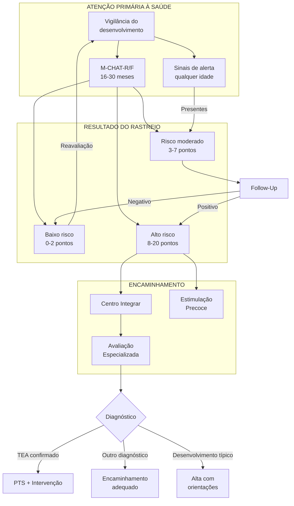

# PROTOCOLO CLÍNICO CLI-02: TRANSTORNO DO ESPECTRO AUTISTA (TEA)
## Linha de Cuidado para Identificação, Avaliação e Acompanhamento

**Secretaria Municipal de Saúde de Extrema/MG**
**Versão:** 1.0 | **Data:** Janeiro/2026
**Status:** Documento Normativo

---

## 1. OBJETIVO

Estabelecer diretrizes técnicas para identificação precoce, rastreamento, diagnóstico, acompanhamento e reabilitação de pessoas com Transtorno do Espectro Autista (TEA) na Rede de Atenção Psicossocial (RAPS) de Extrema/MG.

---

## 2. ABRANGÊNCIA

- Atenção Primária à Saúde (APS): UBS, e-ESF, e-Multi
- Atenção Especializada: Centro Integrar, CSM, CAPS I
- Rede Intersetorial: Educação, Assistência Social, Cultura

---

## 3. FUNDAMENTAÇÃO TÉCNICA

### 3.1 Definição

O Transtorno do Espectro Autista (TEA) é uma condição do neurodesenvolvimento caracterizada por:
- **Déficits persistentes na comunicação e interação social**
- **Padrões restritos e repetitivos de comportamento, interesses ou atividades**

**CID-10:** F84.0 (Autismo infantil), F84.1 (Autismo atípico), F84.5 (Síndrome de Asperger)
**CID-11:** 6A02 (Transtorno do Espectro do Autismo) - transição prevista para 2027

### 3.2 Epidemiologia

| Dado | Valor |
|------|-------|
| Prevalência estimada | 1:36 a 1:44 crianças (CDC, 2023) |
| Razão masculino:feminino | 4:1 (subdiagnóstico em meninas) |
| Idade média de diagnóstico no Brasil | 4-6 anos (ideal: antes dos 3 anos) |

### 3.3 Níveis de Suporte (DSM-5)

| Nível | Comunicação Social | Comportamentos Repetitivos |
|-------|-------------------|---------------------------|
| **Nível 1** (Requer apoio) | Dificuldades sem apoio, respostas atípicas | Interferência em alguns contextos |
| **Nível 2** (Requer apoio substancial) | Déficits marcados, interação limitada | Óbvios para observador casual |
| **Nível 3** (Requer apoio muito substancial) | Déficits graves, interação mínima | Interferência marcada em todas áreas |

---

## 4. IDENTIFICAÇÃO PRECOCE NA APS

### 4.1 Princípio Fundamental

> **"Atraso no desenvolvimento é urgência funcional. NÃO aguardar diagnóstico definitivo para iniciar intervenção."**

### 4.2 Vigilância Universal do Desenvolvimento

**Em TODAS as consultas de puericultura:**
- Avaliar marcos do desenvolvimento (Caderneta da Criança)
- Investigar fatores de risco
- Orientar estimulação adequada à idade
- Identificar sinais de alerta (red flags)

### 4.3 Fatores de Risco para TEA

| Categoria | Fatores |
|-----------|---------|
| **Biológicos** | Prematuridade, baixo peso ao nascer, asfixia perinatal, idade parental avançada |
| **Genéticos** | Irmão com TEA (risco 10-20x), síndromes genéticas (X-Frágil, Esclerose Tuberosa) |
| **Ambientais** | Uso de valproato na gestação, infecções congênitas |
| **Familiares** | História familiar de TEA, DI, atraso de fala, transtornos psiquiátricos |

### 4.4 Sinais de Alerta por Faixa Etária

#### 4.4.1 Bebês (0-12 meses)

| Sinal | Descrição |
|-------|-----------|
| **Contato visual** | Reduzido ou ausente |
| **Sorriso social** | Ausente ou inconsistente após 3 meses |
| **Orientação ao nome** | Não responde ao nome após 6 meses |
| **Interação** | Baixo interesse por faces e pessoas |
| **Atenção compartilhada** | Não segue o olhar do cuidador |

#### 4.4.2 Crianças (12-36 meses)

| Sinal | Descrição |
|-------|-----------|
| **Linguagem** | Ausência de palavras aos 16 meses; ausência de frases aos 24 meses |
| **Regressão** | Perda de habilidades linguísticas ou sociais previamente adquiridas |
| **Apontar** | Não aponta para mostrar interesse (apontar protodeclarativo) |
| **Imitação** | Ausência de imitação de gestos ou ações |
| **Brincadeira** | Ausência de brincadeira simbólica (faz-de-conta) |
| **Estereotipias** | Movimentos repetitivos (flapping, girar objetos) |
| **Interesses** | Fixação intensa em objetos ou partes de objetos |

#### 4.4.3 Crianças Maiores e Adolescentes

| Sinal | Descrição |
|-------|-----------|
| **Socialização** | Dificuldade em fazer e manter amizades |
| **Comunicação** | Literalidade, dificuldade com linguagem figurada e ironia |
| **Rigidez** | Dificuldade com mudanças, rituais inflexíveis |
| **Interesses** | Interesses intensos e restritos |
| **Sensorialidade** | Hiper ou hiporreatividade sensorial |

---

## 5. RASTREAMENTO COM M-CHAT-R/F

### 5.1 Indicação

**Aplicação UNIVERSAL entre 16 e 30 meses de idade**
- Idealmente aos 18 meses e 24 meses
- Pode ser reaplicado até 30 meses se dúvida

### 5.2 Instrumento: M-CHAT-R/F™

O **Modified Checklist for Autism in Toddlers, Revised with Follow-Up** é o instrumento de rastreio recomendado pela OMS e pelo Ministério da Saúde.

**Características:**
- 20 perguntas de sim/não
- Aplicado pelos pais/cuidadores
- Pode ser aplicado por qualquer profissional de saúde
- Tempo: 5-10 minutos
- Gratuito e validado para o Brasil

### 5.3 Pontuação e Interpretação

| Pontuação | Classificação | Conduta |
|-----------|---------------|---------|
| **0-2** | Baixo risco | Vigilância de rotina; se <24m, reaplicar aos 24m |
| **3-7** | Risco moderado | Aplicar entrevista de seguimento (M-CHAT-R/F Follow-Up) |
| **8-20** | Alto risco | Encaminhamento IMEDIATO para avaliação especializada |

### 5.4 Entrevista de Seguimento (Follow-Up)

**Aplicar quando pontuação 3-7:**
- Esclarecer cada item positivo com perguntas detalhadas
- Se ≥2 itens persistirem positivos → Encaminhar
- Se <2 itens → Reavaliação em 1-3 meses

### 5.5 Perguntas Críticas do M-CHAT-R

**Itens de maior valor preditivo (qualquer um positivo deve aumentar atenção):**
- Item 2: Interesse em outras crianças
- Item 5: Brincadeira de faz-de-conta
- Item 7: Apontar para indicar interesse
- Item 9: Mostrar objetos
- Item 13: Imitação
- Item 14: Responder ao nome
- Item 15: Olhar quando apontam

---

## 6. FLUXO DE ATENDIMENTO

### 6.1 Fluxograma Geral

### 6.2 Prazos de Encaminhamento

| Classificação | Prazo máximo para 1ª consulta especializada |
|---------------|---------------------------------------------|
| Alto risco M-CHAT (8-20) | 15 dias |
| Risco moderado confirmado (Follow-Up positivo) | 30 dias |
| Sinais de alerta importantes | 30 dias |
| Sinais de alerta menores | 60 dias |
| Regressão do desenvolvimento | IMEDIATO |

---

## 7. AVALIAÇÃO DIAGNÓSTICA

### 7.1 Equipe de Avaliação

**Centro Integrar - Equipe Mínima:**
- Médico (pediatra, psiquiatra ou neurologista com experiência em TEA)
- Psicólogo
- Fonoaudiólogo
- Terapeuta Ocupacional

### 7.2 Componentes da Avaliação

| Componente | Profissional | Instrumentos/Métodos |
|------------|--------------|---------------------|
| **Avaliação médica** | Médico | Anamnese, exame físico/neurológico, exclusão de causas orgânicas |
| **Avaliação comportamental** | Psicólogo | CARS-2, ADOS-2 (se disponível), observação clínica |
| **Avaliação cognitiva** | Psicólogo | Escala Bayley, WISC, Vineland |
| **Avaliação de linguagem** | Fonoaudiólogo | ADL, PROC, PLS-5 |
| **Avaliação sensório-motora** | TO | Perfil Sensorial, avaliação funcional |
| **Avaliação auditiva** | Fonoaudiólogo | Audiometria, BERA |

### 7.3 Exames Complementares

| Exame | Indicação |
|-------|-----------|
| **Audiometria/BERA** | TODOS os casos (excluir perda auditiva) |
| **Avaliação oftalmológica** | TODOS os casos |
| **Eletroencefalograma** | Se suspeita de epilepsia ou regressão |
| **Ressonância magnética** | Se dismorfismos, macrocefalia, convulsões, regressão |
| **Cariótipo/Array-CGH** | Se dismorfismos ou DI associada |
| **X-Frágil** | Meninos com TEA + DI, história familiar |
| **Erros inatos do metabolismo** | Se regressão, consanguinidade, sintomas sistêmicos |

### 7.4 Critérios Diagnósticos (DSM-5)

**A. Déficits persistentes na comunicação e interação social** (todos os 3):
1. Déficits na reciprocidade socioemocional
2. Déficits nos comportamentos comunicativos não verbais
3. Déficits em desenvolver, manter e compreender relacionamentos

**B. Padrões restritos e repetitivos** (pelo menos 2 de 4):
1. Movimentos, uso de objetos ou fala estereotipados ou repetitivos
2. Insistência em rotinas, padrões ritualizados, resistência a mudanças
3. Interesses restritos e fixos, anormais em intensidade ou foco
4. Hiper ou hiporreatividade a estímulos sensoriais

**C. Sintomas presentes desde o período inicial do desenvolvimento**

**D. Sintomas causam prejuízo clinicamente significativo**

**E. Não explicados por DI ou atraso global do desenvolvimento**

---

## 8. INTERVENÇÃO TERAPÊUTICA

### 8.1 Princípios da Intervenção

| Princípio | Descrição |
|-----------|-----------|
| **Precocidade** | Iniciar o mais cedo possível, mesmo sem diagnóstico definitivo |
| **Intensidade** | Intervenções estruturadas com frequência adequada |
| **Individualização** | Baseada nas necessidades e potencialidades de cada pessoa |
| **Família como protagonista** | Capacitação e participação ativa da família |
| **Naturalidade** | Intervenções em contextos naturais (casa, escola) |
| **Baseada em evidências** | Abordagens com comprovação científica |

### 8.2 Abordagens Recomendadas

#### 8.2.1 Intervenções Comportamentais

| Abordagem | Descrição | Nível de Evidência |
|-----------|-----------|-------------------|
| **ABA** (Applied Behavior Analysis) | Análise do comportamento aplicada | Alto |
| **EIBI** (Early Intensive Behavioral Intervention) | Intervenção comportamental intensiva precoce | Alto |
| **PRT** (Pivotal Response Treatment) | Treino de respostas pivotais | Moderado |
| **PECS** (Picture Exchange Communication System) | Sistema de comunicação por troca de figuras | Moderado |

#### 8.2.2 Intervenções Desenvolvimentais

| Abordagem | Descrição |
|-----------|-----------|
| **DIR/Floortime** | Modelo baseado no desenvolvimento, diferenças individuais e relação |
| **ESDM** (Early Start Denver Model) | Modelo Denver de início precoce |
| **TEACCH** | Tratamento e educação de crianças autistas |

#### 8.2.3 Intervenções Específicas

| Área | Intervenção |
|------|-------------|
| **Linguagem** | Fonoterapia, comunicação aumentativa e alternativa (CAA) |
| **Motor/Sensorial** | Terapia ocupacional, integração sensorial |
| **Social** | Treino de habilidades sociais, grupos terapêuticos |
| **Comportamento** | Manejo comportamental, suporte comportamental positivo |

### 8.3 Medicação

**O TEA não tem tratamento medicamentoso específico. Medicações são indicadas para:**

| Sintoma/Comorbidade | Opções farmacológicas |
|--------------------|----------------------|
| **Irritabilidade/Agressividade** | Risperidona*, Aripiprazol* |
| **Hiperatividade/Impulsividade** | Metilfenidato, Atomoxetina |
| **Ansiedade** | ISRS (Fluoxetina, Sertralina) |
| **Insônia** | Melatonina, higiene do sono |
| **Epilepsia** | Antiepilépticos conforme indicação |

*Únicos com indicação FDA para irritabilidade em TEA

---

## 9. PROJETO TERAPÊUTICO SINGULAR (PTS)

### 9.1 Construção do PTS

**Quatro Momentos:**

1. **Diagnóstico situacional:**
   - Avaliação multidimensional (saúde, funcionalidade, contexto)
   - Identificação de potencialidades e necessidades
   - Mapeamento da rede de suporte

2. **Definição de metas:**
   - Metas funcionais e mensuráveis
   - Priorizadas com família
   - Curto (3m), médio (6m) e longo prazo (12m)

3. **Divisão de responsabilidades:**
   - Profissional de referência definido
   - Papel de cada membro da equipe
   - Responsabilidades da família
   - Articulação intersetorial

4. **Reavaliação:**
   - Trimestral ou conforme necessidade
   - Avaliação de metas
   - Ajustes no plano

### 9.2 Componentes do PTS para TEA

| Área | Elementos |
|------|-----------|
| **Terapêutica** | Frequência e tipo de terapias (ABA, fono, TO) |
| **Educação** | Apoio escolar, sala de recursos, mediação |
| **Saúde** | Consultas de acompanhamento, medicação |
| **Social** | Atividades de inclusão, lazer |
| **Família** | Orientação, grupos de apoio, descanso do cuidador |

---

## 10. ACOMPANHAMENTO LONGITUDINAL

### 10.1 Frequência de Consultas

| Serviço | Frequência |
|---------|------------|
| **Centro Integrar** | Conforme PTS (semanal a mensal para terapias) |
| **APS** | Trimestral (consulta de acompanhamento) |
| **Especialista médico** | Semestral (se estável) ou conforme necessidade |

### 10.2 Monitoramento

| Aspecto | O que monitorar | Frequência |
|---------|-----------------|------------|
| **Desenvolvimento** | Ganhos funcionais, habilidades adquiridas | Trimestral |
| **Comportamento** | Irritabilidade, autoagressão, estereotipias | Contínuo |
| **Comorbidades** | Ansiedade, TDAH, epilepsia, sono | Semestral |
| **Inclusão** | Escola, comunidade, atividades | Semestral |
| **Família** | Sobrecarga do cuidador, dinâmica familiar | Trimestral |

### 10.3 Transições

| Transição | Ações |
|-----------|-------|
| **Escola regular → AEE** | Relatório para escola, articulação com equipe pedagógica |
| **Infância → Adolescência** | Adaptação do PTS, temas de puberdade e sexualidade |
| **Adolescência → Adulto** | Preparação para vida adulta, habilitação profissional |
| **Centro Integrar → CSM** | Se necessidade de acompanhamento psiquiátrico adulto |

---

## 11. REDE INTERSETORIAL

### 11.1 Articulação com Educação

| Ação | Responsável |
|------|-------------|
| Relatório para escola | Centro Integrar |
| Programa Saúde na Escola (PSE) | APS + Educação |
| Capacitação de professores | SMS + SME |
| Reuniões intersetoriais | Coordenação SM |

### 11.2 Articulação com Assistência Social

| Ação | Responsável |
|------|-------------|
| Cadastro Único / BPC | CRAS |
| Cuidador de pessoa com deficiência | CRAS |
| Situações de vulnerabilidade | CRAS/CREAS |

### 11.3 Direitos e Benefícios

| Benefício | Requisitos |
|-----------|------------|
| **BPC** (Benefício de Prestação Continuada) | Renda familiar per capita ≤ 1/4 SM + avaliação INSS |
| **Passe livre** | Laudo médico + renda familiar ≤ 3 SM |
| **Carteira de identificação** | Lei 13.977/2020 (Lei Romeo Mion) |
| **Prioridade de atendimento** | Lei 13.146/2015 (Lei Brasileira de Inclusão) |

---

## 12. INDICADORES DE QUALIDADE

| Indicador | Meta | Periodicidade |
|-----------|------|---------------|
| % de crianças 18-24 meses rastreadas com M-CHAT | ≥ 80% | Mensal |
| Tempo médio entre rastreio positivo e 1ª consulta especializada | ≤ 30 dias | Mensal |
| % de casos com PTS elaborado em 60 dias | ≥ 90% | Trimestral |
| % de crianças <3 anos em estimulação precoce | ≥ 90% | Trimestral |
| Taxa de abandono de tratamento | ≤ 15% | Trimestral |
| % de famílias que receberam orientação parental | 100% | Trimestral |

---

## 13. RESPONSABILIDADES

### 13.1 APS

- Vigilância universal do desenvolvimento
- Aplicação do M-CHAT-R/F (16-30 meses)
- Identificação de sinais de alerta
- Encaminhamento qualificado
- Acompanhamento longitudinal
- Articulação intersetorial no território

### 13.2 Centro Integrar

- Avaliação diagnóstica multidisciplinar
- Elaboração e coordenação do PTS
- Intervenção terapêutica especializada
- Estimulação precoce
- Orientação parental
- Capacitação da rede

### 13.3 CAPS I / CSM

- Atendimento de comorbidades psiquiátricas
- Apoio em situações de crise
- Matriciamento para equipes APS e Centro Integrar

---

## 14. REFERÊNCIAS

1. American Psychiatric Association. DSM-5: Manual Diagnóstico e Estatístico de Transtornos Mentais. 5ª ed. 2014.
2. Brasil. Ministério da Saúde. Linha de Cuidado para a Atenção às Pessoas com Transtornos do Espectro do Autismo e suas Famílias na Rede de Atenção Psicossocial do SUS. 2015.
3. Brasil. Lei nº 12.764/2012 (Lei Berenice Piana) - Política Nacional de Proteção dos Direitos da Pessoa com TEA.
4. Brasil. Lei nº 13.977/2020 (Lei Romeo Mion) - Carteira de Identificação da Pessoa com TEA.
5. Robins DL et al. M-CHAT-R/F™. 2009. Disponível em: www.mchatscreen.com
6. Hyman SL et al. Identification, Evaluation, and Management of Children With Autism Spectrum Disorder. Pediatrics. 2020.

---

## 15. ANEXOS

### Anexo A: M-CHAT-R/F (Versão Brasileira)

*Disponível em: www.mchatscreen.com (versão em português)*

### Anexo B: Sinais de Alerta - Material para ACS

| Idade | Perguntar à família |
|-------|---------------------|
| 6 meses | "O bebê olha nos olhos quando vocês conversam?" |
| 9 meses | "O bebê responde quando vocês chamam o nome dele?" |
| 12 meses | "O bebê aponta para mostrar coisas que interessam ele?" |
| 18 meses | "Ele brinca de faz-de-conta (dá comidinha, fala no telefone)?" |
| 24 meses | "Ele fala frases de duas palavras (ex: 'quer água')?" |

---

## 16. HISTÓRICO DE REVISÕES

| Versão | Data | Alterações | Responsável |
|--------|------|------------|-------------|
| 1.0 | Jan/2026 | Versão inicial | Coordenação SM |

---

*Aprovado pela Coordenação de Saúde Mental de Extrema/MG*
*Data: Janeiro/2026*
