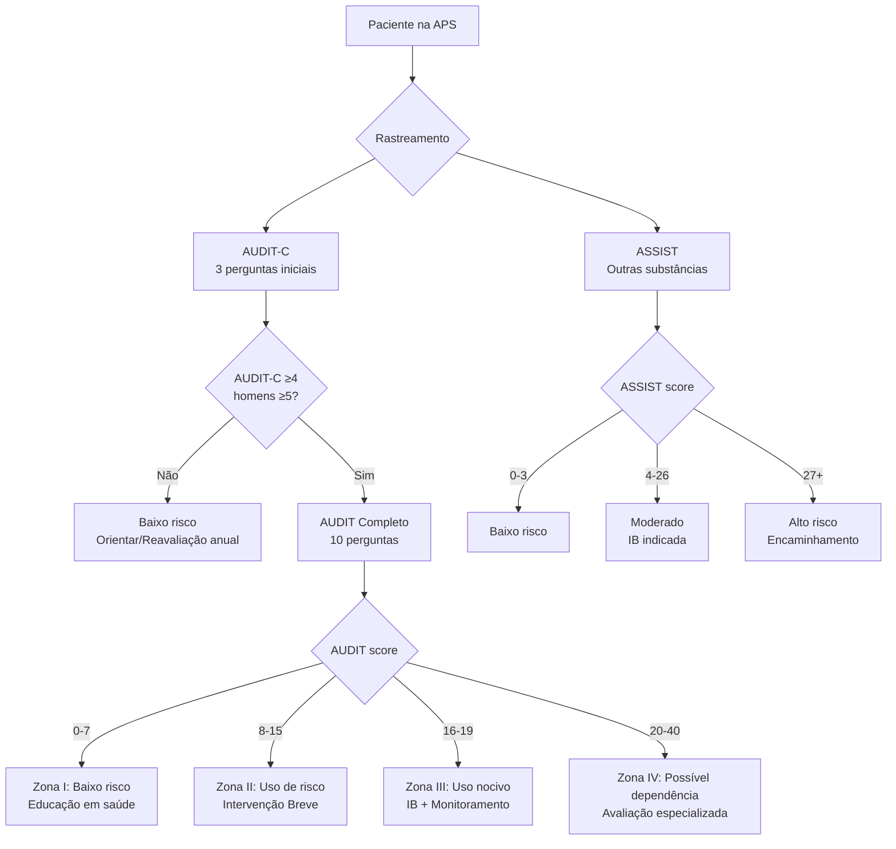
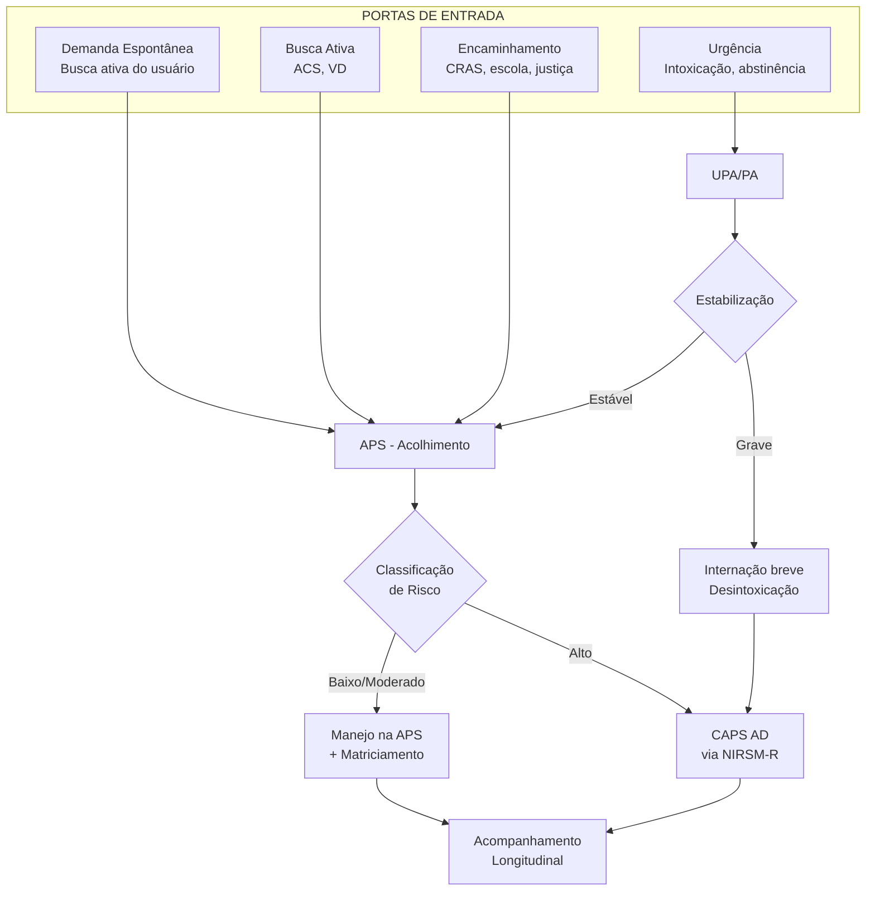
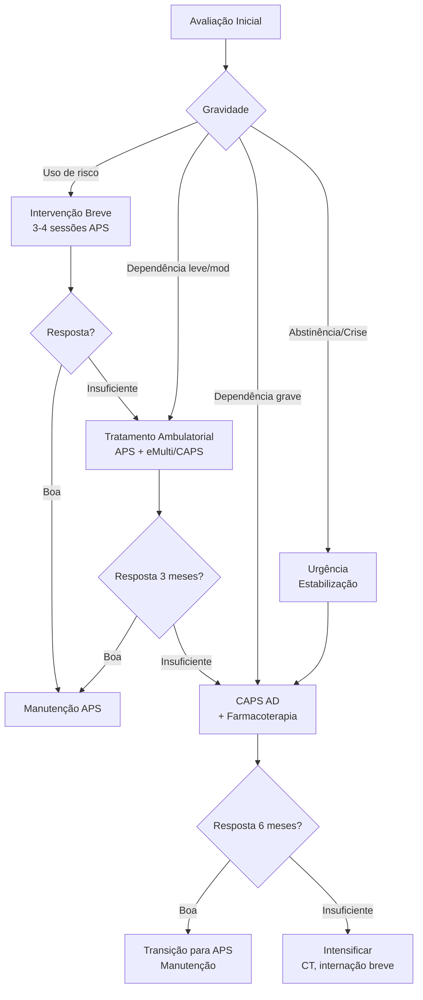
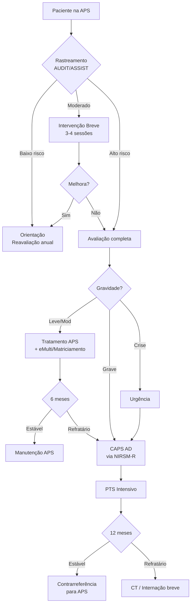

# PROTOCOLO CLÍNICO CLI-04: TRANSTORNOS RELACIONADOS AO USO DE SUBSTÂNCIAS
## Linha de Cuidado para Álcool e Outras Drogas na RAPS

**Secretaria Municipal de Saúde de Extrema/MG**
**Versão:** 1.0 | **Data:** Janeiro/2026
**Status:** Documento Normativo (Alinhado ao Contexto Consolidado v2.0)

---

## 1. OBJETIVO

Estabelecer diretrizes técnicas para identificação, avaliação, tratamento e acompanhamento de pessoas com Transtornos Relacionados ao Uso de Substâncias (TRUS) — incluindo álcool, tabaco, maconha, cocaína/crack e outras drogas — na Rede de Atenção Psicossocial (RAPS) de Extrema/MG, com foco na Atenção Primária à Saúde como coordenadora do cuidado.

---

## 2. ABRANGÊNCIA

- Atenção Primária à Saúde (APS): UBS, eSF, eMulti
- Atenção Especializada: CSM, CAPS I, CAPS AD (referência regional)
- Rede Intersetorial: CRAS, CREAS, CAPS, Comunidades Terapêuticas, Grupos de Mútua Ajuda
- Urgência/Emergência: UPA, Hospital Municipal

---

## 3. FUNDAMENTAÇÃO TÉCNICA

### 3.1 Definição e Conceitos

#### 3.1.1 Transtornos por Uso de Substâncias (TUS)

Os **Transtornos por Uso de Substâncias (TUS)** são condições clínicas caracterizadas por um padrão problemático de uso de substâncias psicoativas que leva a prejuízo ou sofrimento clinicamente significativo. Envolvem alterações nos sistemas de recompensa, motivação, memória e controle do cérebro.

**Princípios fundamentais:**
- **Modelo biopsicossocial:** Condição multifatorial (genética, ambiente, fatores psicológicos)
- **Espectro de gravidade:** Desde uso problemático até dependência grave
- **Condição tratável:** Recuperação é possível com tratamento adequado
- **Cronicidade:** Requer acompanhamento longitudinal com prevenção de recaídas
- **Redução de danos:** Estratégia válida e eficaz quando abstinência não é alcançável

**Alinhamento com políticas nacionais:**
- Política Nacional sobre Drogas (Decreto 9.761/2019)
- Rede de Atenção Psicossocial — RAPS (Portaria 3.088/2011)
- Cadernos de Atenção Básica nº 34 — Saúde Mental (MS, 2013)
- Guia Estratégico para o Cuidado de Pessoas com Necessidades Relacionadas ao Consumo de Álcool e Outras Drogas (MS, 2015)

---

#### 3.1.2 Critérios Diagnósticos (DSM-5-TR)

O DSM-5-TR unificou os antigos conceitos de "abuso" e "dependência" em um único diagnóstico de **Transtorno por Uso de Substância**, com especificadores de gravidade.

##### Critérios Diagnósticos (pelo menos 2 em 12 meses)

| Domínio | Critério | Descrição |
|---------|----------|-----------|
| **Controle Prejudicado** | 1. Quantidade/tempo | Uso em maiores quantidades ou por período mais longo que o pretendido |
| | 2. Desejo de reduzir | Desejo persistente ou esforços malsucedidos para reduzir ou controlar |
| | 3. Tempo gasto | Grande parte do tempo em atividades para obter, usar ou recuperar-se |
| | 4. Fissura (craving) | Desejo intenso ou urgência de usar a substância |
| **Prejuízo Social** | 5. Obrigações | Uso recorrente resultando em fracasso em cumprir obrigações |
| | 6. Problemas interpessoais | Uso continuado apesar de problemas sociais/interpessoais persistentes |
| | 7. Atividades abandonadas | Atividades importantes abandonadas ou reduzidas |
| **Uso de Risco** | 8. Situações perigosas | Uso recorrente em situações fisicamente perigosas |
| | 9. Problemas de saúde | Uso continuado apesar de problema físico/psicológico persistente |
| **Farmacológicos** | 10. Tolerância | Necessidade de quantidades crescentes para o efeito desejado |
| | 11. Abstinência | Síndrome de abstinência ou uso para aliviar/evitar abstinência |

##### Classificação de Gravidade

| Gravidade | Critérios presentes | Características |
|-----------|---------------------|-----------------|
| **Leve** | 2-3 critérios | Uso problemático, preserva funcionamento |
| **Moderado** | 4-5 critérios | Prejuízo significativo, algum funcionamento preservado |
| **Grave** | 6+ critérios | Dependência, prejuízo funcional extenso |

> **Nota para APS:** A identificação precoce do uso problemático (antes da dependência) permite intervenções menos intensivas e com melhor prognóstico. A função da APS é **rastrear, intervir precocemente e encaminhar quando necessário**.

---

#### 3.1.3 Classificação por Tipo de Substância

| Classe | Substâncias | Prevalência Brasil | CID-10 |
|--------|-------------|-------------------|--------|
| **Álcool** | Cerveja, vinho, destilados | 17,9% uso nocivo | F10.x |
| **Tabaco** | Cigarro, narguilé, vapes | 12,6% fumantes | F17.x |
| **Canabinoides** | Maconha, haxixe, THC | 3,1% último ano | F12.x |
| **Estimulantes** | Cocaína, crack, anfetaminas | 1,7% último ano | F14.x / F15.x |
| **Opioides** | Heroína, morfina, tramadol | 0,5% (crescente) | F11.x |
| **Sedativos** | Benzodiazepínicos | Alta (subnotificado) | F13.x |
| **Múltiplas** | Poliusuário | Comum | F19.x |

**Dados epidemiológicos (III LNUD, 2024):**
- 2,3 milhões de brasileiros com critérios para dependência de álcool
- Álcool é a substância psicoativa mais consumida no Brasil
- Crack/cocaína representa a maior demanda nos CAPS AD

---

#### 3.1.4 Neurobiologia da Dependência

O TUS envolve alterações em circuitos cerebrais específicos, fundamentando tanto a compreensão da condição quanto as abordagens terapêuticas.

| Sistema | Alteração | Implicação Clínica |
|---------|-----------|-------------------|
| **Recompensa (mesolímbico)** | Liberação aumentada de dopamina; posteriormente, dessensibilização | Busca compulsiva; anedonia na abstinência |
| **Controle (pré-frontal)** | Hipoativação do córtex pré-frontal | Prejuízo na tomada de decisões, controle de impulsos |
| **Estresse (amígdala/HPA)** | Desregulação do eixo de estresse | Afeto negativo, vulnerabilidade a recaída por estresse |
| **Memória (hipocampo)** | Condicionamento a pistas ambientais | Gatilhos automáticos de fissura e uso |

**Modelo dos 3 estágios (Koob & Volkow, 2016):**
1. **Intoxicação/Binge:** Reforço positivo → busca de prazer
2. **Abstinência/Afeto negativo:** Reforço negativo → alívio do desconforto
3. **Preocupação/Antecipação:** Fissura, planejamento do uso

> **Ponto educativo para famílias:** A dependência é uma **condição médica** com base cerebral, não uma falha moral ou falta de força de vontade. Isso não exime de responsabilidade, mas redefine a abordagem terapêutica.

---

#### 3.1.5 Fatores de Risco e Proteção

| Domínio | Fatores de Risco | Fatores de Proteção |
|---------|-----------------|---------------------|
| **Individual** | Início precoce (<15 anos), TDAH, transtornos de conduta, trauma na infância | Habilidades socioemocionais, projeto de vida, espiritualidade |
| **Familiar** | História familiar de dependência, conflitos familiares, negligência | Supervisão parental, comunicação aberta, vinculação segura |
| **Social** | Pares usuários, disponibilidade de substâncias, pobreza | Conexão escolar/trabalho, suporte social, acesso a lazer |
| **Comunitário** | Violência, tráfico, normas permissivas | Políticas públicas restritivas, redes de suporte |

**Fator genético:** Herdabilidade estimada em 40-60% para TUS de álcool (Verhulst et al., 2015).

---

#### 3.1.6 Comorbidades Psiquiátricas

A coocorrência de TUS com outros transtornos mentais é a **regra, não a exceção** (duplo diagnóstico ou patologia dual).

| Comorbidade | Prevalência em TUS | Ação Clínica |
|-------------|-------------------|--------------|
| **Depressão** | 30-50% | Investigar sistematicamente; diferencial de sintomas induzidos |
| **Transtorno de Ansiedade** | 25-45% | Ansiedade frequentemente motiva uso; tratar conjuntamente |
| **TDAH** | 15-25% | Buscar história desde infância; considerar tratamento específico |
| **Transtorno de Personalidade** | 20-35% | Especialmente borderline e antissocial; influencia prognóstico |
| **TEPT** | 20-40% | História de trauma comum; abordagem integrada essencial |
| **Esquizofrenia** | 25-50% (nesta população) | Alto risco; acompanhamento especializado obrigatório |

> **Princípio:** Transtorno mental e TUS devem ser tratados **simultaneamente** (tratamento integrado), não sequencialmente.

---

### 3.2 Epidemiologia

| Indicador | Brasil | Extrema/MG (estimado) |
|-----------|--------|----------------------|
| Prevalência uso nocivo álcool | 17,9% adultos | ~4.800 pessoas |
| Dependência de álcool | 8,5% | ~2.300 pessoas |
| Tabagismo atual | 12,6% | ~3.400 pessoas |
| Uso drogas ilícitas (ano) | 4,8% | ~1.300 pessoas |
| Crack/cocaína (alguma vez) | 3,9% | ~1.050 pessoas |

*Fonte: III LNUD 2024; estimativas para Extrema baseadas em população de ~27.000 habitantes*

**Perfil de atendimento CAPS AD (nacional):**
- 60% relacionados ao álcool
- 30% crack/cocaína
- 10% outras substâncias

---

### 3.3 Níveis de Uso e Intervenção

| Padrão de Uso | Definição | Intervenção Indicada |
|---------------|-----------|---------------------|
| **Uso de baixo risco** | Uso ocasional, sem prejuízos identificados | Orientação, manutenção de hábitos saudáveis |
| **Uso de risco** | Padrão que aumenta probabilidade de consequências | Intervenção Breve na APS |
| **Uso nocivo** | Prejuízos documentados (saúde, social, legal) | Intervenção Breve intensificada + acompanhamento |
| **Dependência leve/moderada** | Critérios DSM-5 presentes, funcionamento parcialmente preservado | Tratamento ambulatorial APS/CAPS |
| **Dependência grave** | 6+ critérios, prejuízo extenso, complicações | CAPS AD, internação breve se necessário |

---

## 4. RASTREAMENTO E IDENTIFICAÇÃO PRECOCE

### 4.1 Estratégia de Rastreamento Universal

**Quando rastrear:**
- Todo adulto (≥18 anos): **anualmente** ou a cada consulta de rotina
- Adolescentes (12-17 anos): **anualmente** a partir dos 12 anos
- Gestantes: **primeira consulta pré-natal** + cada trimestre
- Situações específicas: trauma, HAS, hepatopatia, problemas de sono, acidentes

**Instrumentos recomendados:**

---

### 4.2 Instrumentos de Triagem

#### 4.2.1 AUDIT — Alcohol Use Disorders Identification Test

**Propriedades psicométricas (versão brasileira):**

| Propriedade | Valor | Referência |
|-------------|-------|------------|
| Sensibilidade | 91,8% | Lima et al., 2005 |
| Especificidade | 62,3% | Lima et al., 2005 |
| Consistência interna (α) | 0,80 | Moreira et al., 2019 |
| Tempo de aplicação | 2-3 minutos | — |

**Perguntas do AUDIT-C (triagem rápida):**

| # | Pergunta | Pontuação |
|---|----------|-----------|
| 1 | Com que frequência você consome bebidas alcoólicas? | 0-4 |
| 2 | Quantas doses você consome em um dia típico? | 0-4 |
| 3 | Com que frequência você consome 6 ou mais doses em uma ocasião? | 0-4 |

**Ponto de corte AUDIT-C:** ≥4 (mulheres) / ≥5 (homens)

**Zonas de risco AUDIT completo:**

| Zona | Score | Interpretação | Ação |
|------|-------|---------------|------|
| **I** | 0-7 | Baixo risco | Educação, manter padrão |
| **II** | 8-15 | Uso de risco | Intervenção Breve |
| **III** | 16-19 | Uso nocivo | IB + monitoramento |
| **IV** | 20-40 | Provável dependência | Avaliação completa + referência |

---

#### 4.2.2 ASSIST — Alcohol, Smoking and Substance Involvement Screening Test

Desenvolvido pela OMS para triagem de múltiplas substâncias.

**Características:**
- 8 perguntas sobre uso de 10 classes de substâncias
- Adaptado e validado para o Brasil (Henrique et al., 2004)
- Tempo: 5-10 minutos
- Gera score por substância

**Pontos de corte:**

| Substância | Baixo risco | Moderado (IB) | Alto risco (referência) |
|------------|-------------|---------------|------------------------|
| Álcool | 0-10 | 11-26 | ≥27 |
| Outras | 0-3 | 4-26 | ≥27 |

---

#### 4.2.3 CAGE — Rastreamento Rápido

Alternativa para ambientes com limitação de tempo (4 perguntas).

| Letra | Pergunta |
|-------|----------|
| **C** (Cut down) | Você já sentiu que deveria diminuir a bebida? |
| **A** (Annoyed) | Pessoas já o irritaram ao criticar seu modo de beber? |
| **G** (Guilty) | Você já se sentiu culpado por beber? |
| **E** (Eye-opener) | Você já bebeu pela manhã para aliviar ressaca/nervosismo? |

**Ponto de corte:** ≥2 respostas "sim" → suspeita de uso problemático

**Limitações:** Baixa sensibilidade para uso de risco; melhor para dependência estabelecida.

---

### 4.3 Sinais de Alerta na Prática Clínica

| Contexto | Sinais que devem levantar suspeita |
|----------|-----------------------------------|
| **Clínica médica** | HAS resistente, alterações hepáticas, pancreatite, trauma repetido, problemas de sono |
| **Saúde mental** | Depressão refratária, ansiedade intensa, sintomas psicóticos, labilidade emocional |
| **Social/Comportamental** | Faltas frequentes ao trabalho/escola, acidentes, problemas legais, conflitos familiares |
| **Gestação** | Baixo peso fetal, descolamento placentário, malformações (SAF) |
| **Odor/Aparência** | Hálito etílico, tremores, sudorese, olhos vermelhos, pupilas alteradas |

---

## 5. FLUXO DE ATENDIMENTO

### 5.1 Porta de Entrada

### 5.2 Classificação de Risco

| Prioridade | Critérios | Prazo | Destino |
|------------|-----------|-------|---------|
| **P1 — Vermelho** | Intoxicação grave, abstinência com risco (DT), ideação suicida, psicose induzida | Imediato | Urgência/CAPS AD crise |
| **P2 — Laranja** | Dependência grave, comorbidade psiquiátrica descompensada, falha de tratamento ambulatorial | 7 dias | CAPS AD |
| **P3 — Amarelo** | Dependência moderada, uso nocivo com prejuízos, comorbidade estável | 30 dias | CAPS AD ou APS intensificada |
| **P4 — Verde** | Uso de risco, primeiro episódio, motivação para mudança | 90 dias | APS + Intervenção Breve |
| **P5 — Azul** | Acompanhamento de manutenção, prevenção de recaída | Programado | APS longitudinal |

---

### 5.3 Papel do NIRSM-R

O NIRSM-R (Núcleo Intersetorial de Regulação em Saúde Mental) atua como regulador do acesso à atenção especializada em AOD.

**Funções:**
1. Análise de encaminhamentos para CAPS AD regional
2. Articulação com Comunidades Terapêuticas credenciadas
3. Regulação de leitos de internação breve
4. Monitoramento de casos complexos
5. Feedback à APS sobre desfechos

**Requisitos para encaminhamento ao NIRSM-R:**
- [ ] Rastreamento com AUDIT/ASSIST documentado
- [ ] Tentativa prévia de Intervenção Breve na APS
- [ ] Avaliação de comorbidades (PHQ-9, GAD-7)
- [ ] Relatório com história clínica estruturada
- [ ] Justificativa da necessidade de atenção especializada

---

## 6. AVALIAÇÃO DIAGNÓSTICA

### 6.1 Avaliação na APS (eSF + eMulti)

| Componente | Conteúdo | Responsável |
|------------|----------|-------------|
| **História do uso** | Substância(s), padrão, tempo, tentativas prévias, tratamentos anteriores | Médico/Enfermeiro |
| **Avaliação física** | Sinais vitais, exame neurológico, estigmas hepáticos, estado nutricional | Médico |
| **Rastreamento padronizado** | AUDIT, ASSIST, CAGE | Qualquer profissional treinado |
| **Avaliação mental** | PHQ-9, GAD-7, risco suicida | Médico/Psicólogo |
| **Contexto social** | Moradia, trabalho, família, rede de apoio, situação de vulnerabilidade | Assistente Social/Enfermeiro |
| **Motivação para mudança** | Régua de Prontidão, Estágios de Mudança | Psicólogo/Enfermeiro |

### 6.2 Instrumentos Complementares

| Instrumento | Finalidade | Quando usar |
|-------------|-----------|-------------|
| **CIWA-Ar** | Gravidade da abstinência de álcool | Suspeita de síndrome de abstinência |
| **COWS** | Gravidade da abstinência de opioides | Uso de opioides |
| **DAST-10** | Rastreio detalhado para drogas | ASSIST positivo para drogas |
| **FTND** | Dependência de nicotina | Tabagistas para planejamento |
| **DUDIT** | Uso de drogas | Alternativa ao ASSIST |

### 6.3 Exames Laboratoriais

| Exame | Indicação | Achados relevantes |
|-------|-----------|-------------------|
| Hemograma | Rotina | Anemia, macrocitose (VCM elevado) |
| Função hepática | Rotina para álcool | GGT, TGO/TGP elevados (AST>ALT sugere álcool) |
| Função renal | Rotina | Desidratação, rabdomiólise |
| Eletrólitos | Abstinência, desnutrição | Hipocalemia, hipomagnesemia |
| Glicemia | Rotina | Hipoglicemia na intoxicação |
| Sorologias | Rotina para injetáveis | HIV, Hepatites B e C, Sífilis |
| EAS | Suspeita drogas | Triagem toxicológica se disponível |

---

## 7. INTERVENÇÃO

### 7.1 Intervenção Breve (IB) — Metodologia FRAMES

A Intervenção Breve é a estratégia de primeira linha na APS para uso de risco e nocivo.

**Componentes FRAMES:**

| Letra | Componente | Descrição |
|-------|------------|-----------|
| **F** | Feedback | Devolutiva objetiva sobre riscos baseada no AUDIT/ASSIST |
| **R** | Responsabilidade | Enfatizar autonomia: decisão é do paciente |
| **A** | Aconselhamento | Orientação clara sobre redução/abstinência |
| **M** | Menu de opções | Oferecer alternativas de mudança |
| **E** | Empatia | Abordagem não-julgadora, acolhedora |
| **S** | Self-efficacy | Fortalecer autoconfiança para mudança |

**Duração:** 5-15 minutos por sessão (até 4 sessões)
**Efetividade:** Redução de 20-30% no consumo (NNT=8 para uso de risco de álcool)

---

### 7.2 Entrevista Motivacional

Abordagem centrada no paciente para explorar ambivalência e fortalecer motivação intrínseca.

**Princípios:**
1. Expressar empatia
2. Desenvolver discrepância
3. Fluir com a resistência
4. Apoiar autoeficácia

**Técnicas:**
- Perguntas abertas
- Afirmações
- Escuta reflexiva
- Resumos

**Estágios de Mudança (Prochaska & DiClemente):**

| Estágio | Características | Estratégia |
|---------|-----------------|------------|
| Pré-contemplação | Não reconhece problema | Aumentar consciência, não confrontar |
| Contemplação | Ambivalente sobre mudar | Explorar ambivalência, decisão balanceada |
| Preparação | Decidido a mudar | Planejar passos concretos |
| Ação | Implementando mudanças | Apoiar, monitorar, resolver obstáculos |
| Manutenção | Mantendo ganhos | Prevenção de recaída, reforço positivo |
| Recaída | Retorno ao padrão anterior | Normalizar, reengajar no processo |

---

### 7.3 Abordagem Farmacológica

#### 7.3.1 Álcool — Tratamento da Dependência

| Medicamento | Mecanismo | Dose | Indicação | Observações |
|-------------|-----------|------|-----------|-------------|
| **Naltrexona** | Antagonista opioide | 50 mg/dia | Redução do consumo/Abstinência | Não usar com opioides |
| **Acamprosato** | Modulador glutamatérgico | 666 mg 3x/dia | Manutenção de abstinência | Seguro em hepatopatia |
| **Dissulfiram** | Inibidor da aldeído desidrogenase | 250-500 mg/dia | Abstinência supervisionada | Reação grave se beber |

#### 7.3.2 Álcool — Síndrome de Abstinência

**Síndrome de Abstinência Alcoólica (SAA):**
- Início: 6-24h após última dose
- Pico: 24-72h
- Duração: 5-7 dias
- **Delirium Tremens:** emergência médica (mortalidade 5-15% sem tratamento)

| Gravidade (CIWA-Ar) | Manejo |
|---------------------|--------|
| Leve (<10) | Ambulatorial, suporte, tiamina, hidratação |
| Moderada (10-18) | Ambulatorial intensivo ou observação, benzodiazepínicos |
| Grave (>18) | Internação, benzodiazepínicos IV, monitoramento contínuo |

**Profilaxia de Wernicke:** Tiamina 300 mg/dia (antes de glicose!)

#### 7.3.3 Tabaco

| Medicamento | Dose | Duração | Taxa de sucesso |
|-------------|------|---------|-----------------|
| **Vareniclina** | 0,5-1 mg 2x/dia | 12 semanas | OR 2,88 vs placebo |
| **Bupropiona** | 150 mg 2x/dia | 7-12 semanas | OR 1,82 vs placebo |
| **TRN (adesivo)** | 7-21 mg/dia | 8-12 semanas | OR 1,64 vs placebo |
| **TRN (goma/pastilha)** | 2-4 mg PRN | Até 12 semanas | OR 1,49 vs placebo |

*TRN = Terapia de Reposição de Nicotina*

#### 7.3.4 Opioides

| Medicamento | Indicação | Disponibilidade SUS |
|-------------|-----------|-------------------|
| **Metadona** | Tratamento de manutenção | CAPS AD (alguns) |
| **Buprenorfina** | Tratamento de manutenção | Limitada |
| **Naloxona** | Reversão de overdose | Urgências |

---

### 7.4 Algoritmo de Seleção de Tratamento

---

## 8. PROJETO TERAPÊUTICO SINGULAR (PTS)

### 8.1 Componentes do PTS em AOD

| Momento | Conteúdo | Prazo |
|---------|----------|-------|
| **1. Diagnóstico** | História completa, substância(s), gravidade, comorbidades, contexto social | Até 2 semanas |
| **2. Metas** | Abstinência vs. redução, objetivos funcionais, prioridades do paciente | Com o paciente |
| **3. Responsabilidades** | Plano de tratamento, quem faz o quê, frequência de retornos | Equipe + paciente |
| **4. Reavaliação** | Datas de revisão, indicadores de progresso, critérios de ajuste | A cada 4-8 semanas |

### 8.2 Modelo de Redução de Danos

A Redução de Danos é estratégia **complementar** à abstinência, não excludente.

**Princípios:**
- Pragmatismo sobre as capacidades atuais do usuário
- Metas individualizadas e progressivas
- Minimizar consequências do uso quando abstinência não é alcançável
- Vínculo sem exigência de abstinência prévia

**Exemplos de estratégias:**
- Troca de seringas para usuários injetáveis
- Distribuição de insumos de redução de riscos
- Hidratação e alimentação para usuários em situação de rua
- Acompanhamento mesmo durante recaídas
- Metas de redução de consumo ao invés de abstinência imediata

---

## 9. ACOMPANHAMENTO LONGITUDINAL

### 9.1 Protocolo de Consultas na APS

| Fase | Frequência | Foco |
|------|------------|------|
| **Inicial (0-3 meses)** | Semanal a quinzenal | Engajamento, manejo agudo, ajuste de tratamento |
| **Estabilização (3-6 meses)** | Quinzenal a mensal | Consolidação, prevenção de recaída, comorbidades |
| **Manutenção (6-12 meses)** | Mensal | Monitoramento, reinserção social, alta gradual |
| **Seguimento (>12 meses)** | Trimestral | Prevenção de recaída, suporte contínuo |

### 9.2 Monitoramento de Recaída

**Sinais de alerta para recaída:**
- Afastamento de consultas
- Pensamentos persistentes sobre uso
- Exposição a gatilhos sem estratégias de enfrentamento
- Mudança de humor (irritabilidade, insônia, ansiedade)
- Conflitos familiares ou profissionais

**Abordagem da recaída:**
1. Não julgar — recaída é parte do processo
2. Identificar gatilhos e contexto
3. Revisar estratégias de enfrentamento
4. Ajustar intensidade do tratamento
5. Manter vínculo

### 9.3 Critérios de Alta

| Nível | Critérios |
|-------|-----------|
| **Alta do CAPS AD** | Abstinência/uso controlado ≥6 meses, estabilidade clínica, suporte social adequado, vinculação APS |
| **Alta da APS intensificada** | Abstinência/uso controlado ≥12 meses, funcionamento preservado, autonomia |
| **Nunca alta completa** | Manter porta aberta, agendar retornos semestrais/anuais |

---

## 10. REDE INTERSETORIAL

### 10.1 Articulação com CRAS/CREAS

| Serviço | Quando encaminhar | O que oferece |
|---------|-------------------|---------------|
| **CRAS** | Vulnerabilidade social, família em risco | Benefícios, grupos, acompanhamento familiar |
| **CREAS** | Violência, situação de rua, medida socioeducativa | Atendimento especializado, abrigo, articulação legal |

### 10.2 Grupos de Mútua Ajuda

| Grupo | Público | Contato Extrema |
|-------|---------|-----------------|
| **Alcoólicos Anônimos (AA)** | Pessoas com problemas com álcool | Verificar local/horário na APS |
| **Narcóticos Anônimos (NA)** | Pessoas com problemas com drogas | Verificar local/horário na APS |
| **Al-Anon/Nar-Anon** | Familiares de pessoas com TUS | Verificar local/horário |

### 10.3 Comunidades Terapêuticas

Indicação para internação em CT (via NIRSM-R):
- Falha de tratamento ambulatorial documentada
- Ausência de suporte social mínimo
- Comorbidade que impede tratamento ambulatorial
- Desejo do paciente (voluntário)

**Duração:** 6-12 meses (conforme regulamentação)
**Monitoramento:** Visitas periódicas pela equipe de referência

### 10.4 Rede Intersetorial Ampliada

| Setor | Papel | Articulação |
|-------|-------|-------------|
| **Educação** | Prevenção, identificação precoce em adolescentes | PSE, encaminhamentos |
| **Justiça** | Medidas alternativas, tratamento compulsório (excepcional) | Central de Penas Alternativas |
| **Trabalho** | Reinserção profissional, qualificação | SINE, programas municipais |
| **Cultura/Esporte** | Ocupação, lazer, pertencimento | Secretarias, ONGs |

---

## 11. POPULAÇÕES ESPECÍFICAS

### 11.1 Gestantes

**Rastreamento:** AUDIT-C obrigatório na primeira consulta pré-natal.

| Substância | Riscos | Manejo |
|------------|--------|--------|
| **Álcool** | SAF (Síndrome Alcoólica Fetal), RCIU, prematuridade | Abstinência total recomendada; TCC; sem farmacoterapia específica segura |
| **Tabaco** | RCIU, prematuridade, placenta prévia | TRN permitida; bupropiona contraindicada 1º tri |
| **Cocaína/Crack** | Descolamento placentário, prematuridade, baixo peso | Hospitalização se uso ativo; cuidado intensivo |
| **Opioides** | Síndrome de abstinência neonatal | Manutenção com metadona/buprenorfina — NÃO descontinuar |

**Prioridade:** P2 (Laranja) — atendimento em até 7 dias para qualquer gestante com rastreamento positivo.

### 11.2 Adolescentes

**Considerações específicas:**
- Triagem anual a partir dos 12 anos (CRAFFT — versão adaptada)
- Envolvimento familiar obrigatório (quando seguro)
- Foco em fatores de proteção
- Manejo de comorbidades frequentes (TDAH, ansiedade, depressão)

**CRAFFT (perguntas-chave):**
- **C**ar: Já andou de carro com motorista alcoolizado/drogado?
- **R**elax: Usa para relaxar ou se sentir melhor?
- **A**lone: Já usou sozinho?
- **F**orget: Já esqueceu o que fez sob efeito?
- **F**riends: Amigos ou família já sugeriram reduzir?
- **T**rouble: Já teve problemas por usar?

### 11.3 Idosos

**Peculiaridades:**
- Subdiagnóstico frequente
- Maior sensibilidade a efeitos adversos
- Interações medicamentosas (polifarmácia)
- Isolamento social como fator de risco

**Pontos de corte diferenciados:**
- AUDIT-C ≥3 para idosos
- Considerar qualquer uso de álcool em uso de medicações de risco

### 11.4 Pessoas em Situação de Rua

**Abordagem:**
- Consultório na Rua como referência principal
- Baixa exigência (não exigir abstinência para atendimento)
- Redução de danos como estratégia central
- Articulação com CREAS e abrigos
- Documentação e acesso a benefícios

---

## 12. URGÊNCIAS E EMERGÊNCIAS

### 12.1 Intoxicação Aguda

| Substância | Manifestações | Manejo |
|------------|---------------|--------|
| **Álcool** | Confusão, ataxia, rebaixamento consciência | Suporte, monitoramento, tiamina, corrigir hipoglicemia |
| **Cocaína/Crack** | Taquicardia, hipertensão, agitação, psicose | BZD para agitação; evitar betabloqueador isolado |
| **Maconha** | Ansiedade, paranoia, taquicardia | Ambiente calmo, suporte, BZD se necessário |
| **Opioides** | Miose, rebaixamento, bradipneia | Naloxona 0,4-2 mg IV/IM/IN; ventilação |
| **Anfetaminas** | Similar cocaína, hipertermia | BZD, resfriamento, hidratação |

### 12.2 Síndrome de Abstinência

| Substância | Início | Riscos | Manejo |
|------------|--------|--------|--------|
| **Álcool** | 6-24h | Convulsões, Delirium Tremens | BZD (diazepam, lorazepam); tiamina; internação se grave |
| **Benzodiazepínicos** | 24-48h | Convulsões, psicose | Redução gradual; internação para abstinência de alta dose |
| **Opioides** | 6-12h (heroína) | Desconforto intenso (baixa mortalidade) | Sintomáticos; metadona/buprenorfina; clonidina |
| **Cocaína/Crack** | 24-48h | Depressão, ideação suicida | Suporte; monitorar humor; sem medicação específica |

---

## 13. RESPONSABILIDADES POR PONTO DE ATENÇÃO

### 13.1 APS (eSF + eMulti)

| Profissional | Responsabilidades |
|--------------|-------------------|
| **Médico eSF** | Rastreamento, diagnóstico, IB, farmacoterapia básica, coordenação do cuidado |
| **Enfermeiro** | Acolhimento, triagem, grupos educativos, visita domiciliar |
| **ACS** | Busca ativa, monitoramento territorial, identificação de casos |
| **Psicólogo (eMulti)** | Entrevista Motivacional, TCC, grupos terapêuticos |
| **Assistente Social (eMulti)** | Avaliação social, articulação CRAS/CREAS, benefícios |

### 13.2 CAPS AD

| Responsabilidade |
|------------------|
| Acolhimento de casos graves e complexos |
| PTS intensivo |
| Atendimento individual e grupal |
| Hospital-dia |
| Atenção à crise |
| Matriciamento para APS |
| Articulação com rede intersetorial |

### 13.3 NIRSM-R

| Responsabilidade |
|------------------|
| Regulação de encaminhamentos APS → CAPS AD |
| Regulação de leitos de internação breve |
| Regulação de vagas em CT credenciadas |
| Monitoramento de casos complexos |
| Feedback à APS sobre desfechos |

---

## 14. CONTRARREFERÊNCIA

### 14.1 Critérios para Retorno à APS

| Critério | Responsável pela avaliação |
|----------|---------------------------|
| Abstinência ou uso controlado ≥6 meses | Terapeuta de referência CAPS AD |
| Estabilidade de comorbidades psiquiátricas | Psiquiatra CAPS AD |
| Suporte social adequado | Equipe CAPS AD |
| Vinculação estabelecida com APS | Coordenação APS |
| Adesão ao tratamento demonstrada | Equipe CAPS AD |

### 14.2 Processo de Contrarreferência

1. **Discussão de caso** entre CAPS AD e eSF de referência
2. **Consulta conjunta** (presencial ou por telessaúde)
3. **Relatório estruturado** com história, tratamento realizado, medicações, plano de continuidade
4. **Agendamento** de primeira consulta na APS antes da alta
5. **Período de transição** (2-4 semanas) com acompanhamento paralelo
6. **Alta administrativa** do CAPS AD após primeira consulta na APS
7. **Porta aberta** para retorno ao CAPS AD se necessário

---

## 15. INDICADORES DE MONITORAMENTO

### 15.1 Indicadores de Processo

| Indicador | Fórmula | Meta |
|-----------|---------|------|
| Taxa de rastreamento AUDIT | (Adultos com AUDIT registrado / Total adultos cadastrados) × 100 | ≥50% |
| Cobertura de Intervenção Breve | (Pacientes com AUDIT 8-19 que receberam IB / Total AUDIT 8-19) × 100 | ≥70% |
| Taxa de encaminhamento CAPS AD | (Encaminhamentos aceitos / Encaminhamentos enviados) × 100 | ≥85% |

### 15.2 Indicadores de Resultado

| Indicador | Fórmula | Meta |
|-----------|---------|------|
| Retenção em tratamento | (Pacientes com ≥4 consultas em 3 meses / Pacientes iniciados) × 100 | ≥60% |
| Abstinência aos 6 meses | (Pacientes abstinentes 6m / Total em acompanhamento) × 100 | ≥30% |
| Redução de consumo | (Pacientes com redução ≥50% / Total em tratamento) × 100 | ≥50% |

### 15.3 Indicadores Sentinela

| Indicador | Descrição | Fonte |
|-----------|-----------|-------|
| Internações por SAA | Número de internações por abstinência alcoólica | SIH/SUS |
| Óbitos por causas relacionadas | Cirrose, acidentes, intoxicação | SIM |
| Violência associada ao uso | Ocorrências policiais com menção a álcool/drogas | SSP |

---

## 16. DOCUMENTAÇÃO E REGISTRO

### 16.1 Registros Obrigatórios no e-SUS

| Campo | Conteúdo |
|-------|----------|
| **CID-10** | F10.x a F19.x conforme substância |
| **CIAP** | P15 (Abuso crônico álcool), P16 (Dependência álcool aguda), P19 (Abuso de drogas) |
| **Procedimento** | 0301080135 (Avaliação diagnóstica), 0301080071 (Atendimento em grupo) |
| **Conduta** | Orientação, IB, encaminhamento, medicação |
| **Risco** | Classificação P1-P5 |

### 16.2 Documentos para Encaminhamento

- Relatório clínico com história estruturada
- Resultados de AUDIT/ASSIST
- Avaliação de comorbidades (PHQ-9, GAD-7)
- Exames laboratoriais recentes
- Tentativas prévias de tratamento
- Justificativa do encaminhamento

---

## 17. REFERÊNCIAS

1. American Psychiatric Association. Diagnostic and Statistical Manual of Mental Disorders, Fifth Edition, Text Revision (DSM-5-TR). Washington, DC: American Psychiatric Publishing; 2022. 1050 p.

2. World Health Organization. International Classification of Diseases, Eleventh Revision (ICD-11). Geneva: WHO; 2019. Available from: https://icd.who.int/

3. Brasil. Ministério da Saúde. Guia Estratégico para o Cuidado de Pessoas com Necessidades Relacionadas ao Consumo de Álcool e Outras Drogas. Brasília: MS; 2015. 100 p.

4. Brasil. Ministério da Saúde. Cadernos de Atenção Básica, n. 34: Saúde Mental. Brasília: MS; 2013. 176 p.

5. Brasil. Portaria GM/MS nº 3.088, de 23 de dezembro de 2011. Institui a Rede de Atenção Psicossocial (RAPS). Diário Oficial da União. 2011 dez 26.

6. Brasil. Decreto nº 9.761, de 11 de abril de 2019. Aprova a Política Nacional sobre Drogas. Diário Oficial da União. 2019 abr 12.

7. Fundação Oswaldo Cruz; Instituto de Comunicação e Informação Científica e Tecnológica em Saúde. III Levantamento Nacional sobre o Uso de Drogas pela População Brasileira (III LNUD). Rio de Janeiro: Fiocruz/ICICT; 2024.

8. Babor TF, Higgins-Biddle JC, Saunders JB, Monteiro MG. AUDIT: The Alcohol Use Disorders Identification Test: Guidelines for Use in Primary Care. 2nd ed. Geneva: WHO; 2001. 40 p.

9. Henrique IFS, De Micheli D, Lacerda RB, Lacerda LA, Formigoni MLOS. Validação da versão brasileira do teste de triagem do envolvimento com álcool, cigarro e outras substâncias (ASSIST). Rev Assoc Med Bras. 2004;50(2):199-206. doi:10.1590/S0104-42302004000200039

10. Lima CT, Freire AC, Silva AP, Teixeira RM, Farrell M, Prince M. Concurrent and construct validity of the AUDIT in an urban Brazilian sample. Alcohol Alcohol. 2005;40(6):584-589. doi:10.1093/alcalc/agh202

11. Moreira PF, Silveira CM, Siu ER, Veldman ACP, Golder S, Andrade AG. Audit validation to identify problem drinking in Brazilian population: pooled results of four validation studies. PLoS One. 2019;14(8):e0220847. doi:10.1371/journal.pone.0220847

12. Koob GF, Volkow ND. Neurobiology of addiction: a neurocircuitry analysis. Lancet Psychiatry. 2016;3(8):760-773. doi:10.1016/S2215-0366(16)00104-8

13. Miller WR, Rollnick S. Motivational Interviewing: Helping People Change. 3rd ed. New York: Guilford Press; 2013. 482 p.

14. Prochaska JO, DiClemente CC. Stages and processes of self-change of smoking: toward an integrative model of change. J Consult Clin Psychol. 1983;51(3):390-395. doi:10.1037/0022-006X.51.3.390

15. Kaner EF, Beyer FR, Muirhead C, Campbell F, Pienaar ED, Bertholet N, et al. Effectiveness of brief alcohol interventions in primary care populations. Cochrane Database Syst Rev. 2018;2(2):CD004148. doi:10.1002/14651858.CD004148.pub4

16. Hartung DM, McCarty D, Fu R, Wiest K, Chalk M, Gastfriend DR. Extended-release naltrexone for alcohol and opioid dependence: a meta-analysis of healthcare utilization studies. J Subst Abuse Treat. 2014;47(2):113-121. doi:10.1016/j.jsat.2014.03.007

17. Anthenelli RM, Benowitz NL, West R, St Aubin L, McRae T, Lawrence D, et al. Neuropsychiatric safety and efficacy of varenicline, bupropion, and nicotine patch in smokers with and without psychiatric disorders (EAGLES): a double-blind, randomised, placebo-controlled clinical trial. Lancet. 2016;387(10037):2507-2520. doi:10.1016/S0140-6736(16)30272-0

18. Verhulst B, Neale MC, Kendler KS. The heritability of alcohol use disorders: a meta-analysis of twin and adoption studies. Psychol Med. 2015;45(5):1061-1072. doi:10.1017/S0033291714002165

19. Sullivan JT, Sykora K, Schneiderman J, Naranjo CA, Sellers EM. Assessment of alcohol withdrawal: the revised clinical institute withdrawal assessment for alcohol scale (CIWA-Ar). Br J Addict. 1989;84(11):1353-1357. doi:10.1111/j.1360-0443.1989.tb00737.x

20. Knight JR, Sherritt L, Shrier LA, Harris SK, Chang G. Validity of the CRAFFT substance abuse screening test among adolescent clinic patients. Arch Pediatr Adolesc Med. 2002;156(6):607-614. doi:10.1001/archpedi.156.6.607

---

## 18. ANEXOS

### Anexo A: AUDIT — Versão Brasileira

*Disponível em: www.who.int/substance_abuse/activities/audit*

### Anexo B: ASSIST — Versão Brasileira

*Disponível em: www.who.int/substance_abuse/activities/assist*

### Anexo C: CIWA-Ar — Escala de Abstinência Alcoólica

*Disponível em material de apoio do CAPS AD*

### Anexo D: Fluxograma de Atendimento

### Anexo E: Glossário de Siglas

| Sigla | Significado |
|-------|-------------|
| **AA** | Alcoólicos Anônimos |
| **ASSIST** | Alcohol, Smoking and Substance Involvement Screening Test |
| **AUDIT** | Alcohol Use Disorders Identification Test |
| **BZD** | Benzodiazepínico |
| **CAGE** | Cut down, Annoyed, Guilty, Eye-opener |
| **CAPS AD** | Centro de Atenção Psicossocial Álcool e Drogas |
| **CIWA-Ar** | Clinical Institute Withdrawal Assessment for Alcohol, Revised |
| **COWS** | Clinical Opiate Withdrawal Scale |
| **CT** | Comunidade Terapêutica |
| **DAST** | Drug Abuse Screening Test |
| **DT** | Delirium Tremens |
| **DUDIT** | Drug Use Disorders Identification Test |
| **FTND** | Fagerström Test for Nicotine Dependence |
| **IB** | Intervenção Breve |
| **NA** | Narcóticos Anônimos |
| **NIRSM-R** | Núcleo Intersetorial de Regulação em Saúde Mental |
| **SAA** | Síndrome de Abstinência Alcoólica |
| **SAF** | Síndrome Alcoólica Fetal |
| **TRN** | Terapia de Reposição de Nicotina |
| **TRUS** | Transtornos Relacionados ao Uso de Substâncias |
| **TUS** | Transtorno por Uso de Substância |

---

## 19. HISTÓRICO DE REVISÕES

| Versão | Data | Alterações | Responsável |
|--------|------|------------|-------------|
| 1.0 | Jan/2026 | Versão inicial: estrutura completa com 18 seções, 4 fluxogramas Mermaid, 20 referências Vancouver, instrumentos AUDIT/ASSIST/CAGE, algoritmos de intervenção, populações específicas | Coordenação SM + Claude |

---

*Aprovado pela Coordenação de Saúde Mental de Extrema/MG*
*Data: Janeiro/2026*
*Versão: 1.0*
