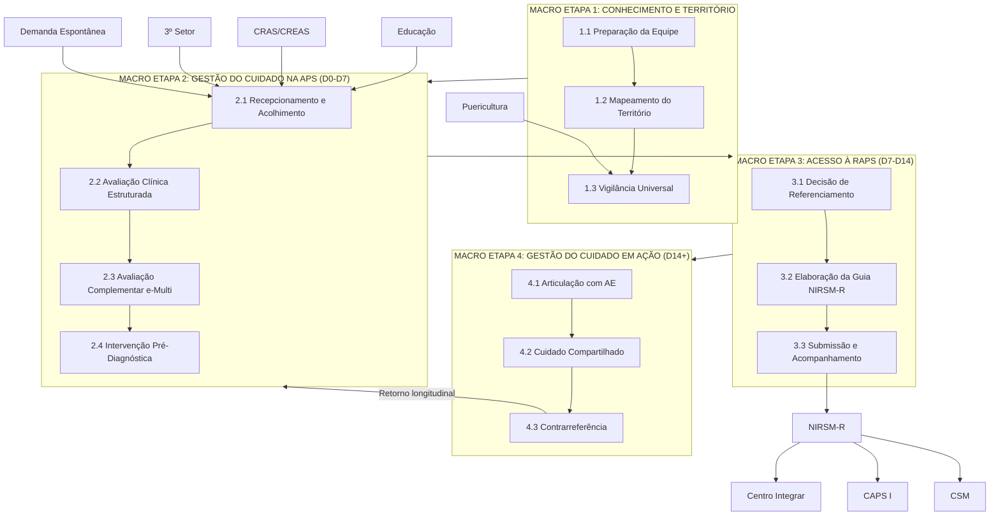

# GUIA NARRATIVO GN-01

## COORDENAÇÃO DO CUIDADO EM DEFICIÊNCIA INTELECTUAL E TRANSTORNO DO ESPECTRO AUTISTA NA ATENÇÃO PRIMÁRIA À SAÚDE

---

**MUNICÍPIO DE EXTREMA — MINAS GERAIS**

| Campo | Informação |
|-------|------------|
| **Código** | GN-01-2026 |
| **Versão** | 1.0 |
| **Vigência** | Janeiro a Dezembro de 2026 |
| **Próxima Revisão** | Julho de 2026 |
| **Elaboração** | Coordenação Municipal de Saúde Mental e Reabilitação |
| **Aprovação** | Secretaria Municipal de Saúde de Extrema-MG |

---

## SUMÁRIO

1. [Identificação](#1-identificação)
2. [Objetivo e Escopo](#2-objetivo-e-escopo)
3. [Fundamentação Normativa](#3-fundamentação-normativa)
4. [Glossário e Definições](#4-glossário-e-definições)
5. [Visão Geral das Macro Etapas](#5-visão-geral-das-macro-etapas)
6. [MACRO ETAPA 1 — Conhecimento e Território](#6-macro-etapa-1--conhecimento-e-território)
7. [MACRO ETAPA 2 — Gestão do Cuidado na APS](#7-macro-etapa-2--gestão-do-cuidado-na-aps)
8. [MACRO ETAPA 3 — Acesso à RAPS](#8-macro-etapa-3--acesso-à-raps)
9. [MACRO ETAPA 4 — Gestão do Cuidado em Ação](#9-macro-etapa-4--gestão-do-cuidado-em-ação)
10. [Considerações Especiais](#10-considerações-especiais)
11. [Matriz de Responsabilidades](#11-matriz-de-responsabilidades)
12. [Instrumentos e Registros](#12-instrumentos-e-registros)
13. [Indicadores de Monitoramento](#13-indicadores-de-monitoramento)
14. [Anexos](#14-anexos)

---

## 1. IDENTIFICAÇÃO

| Campo | Conteúdo |
|-------|----------|
| **Título** | Guia Narrativo para Coordenação do Cuidado em DI e TEA na Atenção Primária à Saúde |
| **Código** | GN-01-2026 |
| **Versão** | 1.0 |
| **Data de Elaboração** | Janeiro de 2026 |
| **Vigência** | Janeiro a Dezembro de 2026 |
| **Próxima Revisão** | Julho de 2026 |
| **Elaboração** | Coordenação Municipal de Saúde Mental e Reabilitação |
| **Aprovação** | Secretaria Municipal de Saúde de Extrema-MG |

---

## 2. OBJETIVO E ESCOPO

### 2.1 Objetivo Geral

Orientar as equipes de Atenção Primária à Saúde (e-ESF, e-Multi e ACS) sobre o passo a passo da navegação e coordenação do cuidado para pessoas com suspeita ou diagnóstico de **Deficiência Intelectual (DI)** e **Transtorno do Espectro Autista (TEA)**, desde o primeiro contato com a APS até o compartilhamento do cuidado com a Atenção Especializada.

### 2.2 Objetivos Específicos

- Padronizar as ações de vigilância do desenvolvimento infantil no território
- Qualificar a identificação precoce de sinais de alerta para DI/TEA
- Estruturar o fluxo de avaliação, intervenção e referenciamento na APS
- Garantir a coordenação do cuidado longitudinal pela APS
- Facilitar a articulação com a Rede de Atenção Psicossocial (RAPS)
- Promover a intersetorialidade com Educação e Assistência Social

### 2.3 Público-Alvo

Este guia é direcionado para:

| Equipe | Composição | Função Principal |
|--------|------------|------------------|
| **e-ESF** | Médico, Enfermeiro, Técnico de Enfermagem | Avaliação clínica, diagnóstico, prescrição, coordenação do cuidado |
| **e-Multi** | Psicólogo, Fonoaudiólogo, Terapeuta Ocupacional, Fisioterapeuta, Nutricionista | Avaliação funcional, intervenções especializadas, matriciamento |
| **ACS** | Agentes Comunitários de Saúde | Vigilância territorial, busca ativa, acompanhamento domiciliar |

### 2.4 Aplicabilidade

Este guia aplica-se ao cuidado de:

- **Crianças de 0 a 6 anos** — Foco principal na detecção precoce
- **Crianças e adolescentes de 6 a 18 anos** — Acompanhamento e reavaliação
- **Adultos** — Casos diagnosticados tardiamente ou em acompanhamento

### 2.5 Não-Aplicabilidade (Exclusões)

| Situação | Protocolo/Documento Aplicável |
|----------|-------------------------------|
| Emergências psiquiátricas | PCC-04 (Urgência e Emergência SM) |
| Manejo de crise comportamental aguda | POP-07 (Manejo de Crise) |
| Avaliação diagnóstica especializada | MACROFLUXO_NARRATIVO_DI_TEA.md (Fase 5) |
| Intervenção terapêutica intensiva | CLI-02 (Protocolo TEA) - Seção de Tratamento |

---

## 3. FUNDAMENTAÇÃO NORMATIVA

### 3.1 Base Legal

| Normativa | Descrição |
|-----------|-----------|
| **Lei Federal nº 10.216/2001** | Proteção e direitos das pessoas com transtornos mentais |
| **Lei Federal nº 12.764/2012** | Política Nacional de Proteção dos Direitos da Pessoa com TEA (Lei Berenice Piana) |
| **Lei Federal nº 13.146/2015** | Lei Brasileira de Inclusão da Pessoa com Deficiência (Estatuto da Pessoa com Deficiência) |
| **Lei Federal nº 13.977/2020** | Institui a Carteira de Identificação da Pessoa com TEA (CIPTEA) |
| **Lei Federal nº 14.624/2023** | Símbolo nacional de identificação da pessoa com deficiência oculta |
| **Portaria GM/MS nº 3.088/2011** | Institui a Rede de Atenção Psicossocial (RAPS) |
| **Portaria GM/MS nº 336/2002** | Normas de funcionamento dos CAPS |
| **Decreto nº 10.502/2020** | Política Nacional de Educação Especial |

### 3.2 Referências Técnicas

| Referência | Ano | Aplicação |
|------------|-----|-----------|
| **Cadernos de Atenção Básica nº 34** | 2013 | Saúde Mental na APS |
| **MI-mhGAP 2.0** (OMS/OPAS) | 2023 | Manejo de condições em saúde mental na APS |
| **DSM-5-TR** | 2022 | Critérios diagnósticos TEA |
| **CID-11** | 2022 | Codificação TEA (6A02) e DI (6A00) |
| **Linha de Cuidado TEA** (MS Brasil) | 2024 | Diretrizes nacionais |
| **Planifica SUS** (CONASS/MS) | 2024 | Metodologia de macro e micro etapas |
| **Protocolo M-CHAT-R/F Validado Brasil** | 2021 | Rastreio universal de TEA |
| **IRDI - Indicadores de Risco para o Desenvolvimento Infantil** | 2015 | Vigilância 0-18 meses |

---

## 4. GLOSSÁRIO E DEFINIÇÕES

### 4.1 Conceitos Fundamentais

| Termo | Definição |
|-------|-----------|
| **TEA** | Transtorno do Espectro Autista — Condição do neurodesenvolvimento caracterizada por déficits persistentes na comunicação social e padrões restritos e repetitivos de comportamento, interesses ou atividades (DSM-5-TR) |
| **DI** | Deficiência Intelectual — Transtorno com início no período do desenvolvimento que inclui déficits funcionais intelectuais e adaptativos nos domínios conceitual, social e prático (DSM-5-TR) |
| **Macro Etapa** | Fase ampla do processo de cuidado que agrupa um conjunto de ações relacionadas (metodologia Planifica SUS) |
| **Micro Etapa** | Ação específica dentro de uma Macro Etapa com responsável, prazo e produto definidos |
| **Escalonamento do Cuidado** | Oferta da intensidade de cuidado adequada às necessidades de cada pessoa, evitando sub ou superoferta |
| **MACC** | Modelo de Atenção às Condições Crônicas — Pirâmide de 5 níveis de estratificação |
| **PTS** | Projeto Terapêutico Singular — Plano de cuidado individualizado construído de forma compartilhada |
| **Matriciamento** | Apoio técnico-pedagógico entre equipes sem transferência de responsabilidade |

### 4.2 Instrumentos de Rastreio

| Instrumento | Faixa Etária | Finalidade |
|-------------|--------------|------------|
| **IRDI** | 0-18 meses | Indicadores de Risco para o Desenvolvimento Infantil — 31 indicadores observacionais |
| **M-CHAT-R/F** | 16-30 meses | Modified Checklist for Autism in Toddlers — Rastreio de TEA com 20 itens |
| **MDI** | 0-10 anos | Marcos do Desenvolvimento Infantil — Caderneta da Criança |
| **CuidaSM** | Todas | Escala de 31 itens para estratificação de risco em saúde mental |

### 4.3 Siglas

| Sigla | Significado |
|-------|-------------|
| ACS | Agente Comunitário de Saúde |
| AE | Atenção Especializada |
| AEE | Atendimento Educacional Especializado |
| APS | Atenção Primária à Saúde |
| BPC | Benefício de Prestação Continuada |
| CAPS | Centro de Atenção Psicossocial |
| CIPTEA | Carteira de Identificação da Pessoa com TEA |
| CRAS | Centro de Referência de Assistência Social |
| CREAS | Centro de Referência Especializado de Assistência Social |
| CSM | Centro de Saúde Mental |
| e-ESF | Equipe de Saúde da Família |
| e-Multi | Equipe Multiprofissional |
| NIRSM-R | Núcleo Interno de Regulação de Saúde Mental |
| PEI | Plano Educacional Individualizado |
| PSE | Programa Saúde na Escola |
| RAPS | Rede de Atenção Psicossocial |
| UBS | Unidade Básica de Saúde |

---

## 5. VISÃO GERAL DAS MACRO ETAPAS

### 5.1 Diagrama Consolidado do Fluxo de Cuidado



### 5.2 Síntese das Macro Etapas

| Macro Etapa | Descrição | Período | Responsável Principal |
|-------------|-----------|---------|----------------------|
| **1. Conhecimento e Território** | Preparação, mapeamento e vigilância universal | Contínuo (Pré-contato) | e-ESF + ACS |
| **2. Gestão do Cuidado na APS** | Acolhimento, avaliação e intervenção inicial | D0 a D7 | e-ESF + e-Multi |
| **3. Acesso à RAPS** | Decisão, elaboração de guia e referenciamento | D7 a D14 | e-ESF + NIRSM-R |
| **4. Gestão do Cuidado em Ação** | Articulação, compartilhamento e contrarreferência | D14+ (Contínuo) | e-ESF + AE |

---

## 6. MACRO ETAPA 1 — CONHECIMENTO E TERRITÓRIO

> **Objetivo:** Preparar a equipe de APS para identificação precoce de sinais de alerta para DI/TEA e estabelecer vigilância universal do desenvolvimento infantil no território.

> **Período:** Contínuo (ações que antecedem o contato com casos suspeitos)

### 6.1 MICRO ETAPA 1.1 — Preparação da Equipe

#### O que é?

A preparação da equipe envolve a capacitação sistemática de todos os profissionais da APS sobre sinais de alerta para DI/TEA, instrumentos de rastreio e fluxos de cuidado da RAPS local.

#### Por que é importante?

A detecção precoce de TEA e DI depende diretamente da capacidade da equipe de reconhecer sinais sutis durante o contato cotidiano com crianças e famílias. Estudos demonstram que a intervenção antes dos 3 anos de idade produz melhores desfechos no desenvolvimento.

#### O que fazer?

| Ação | Responsável | Frequência |
|------|-------------|------------|
| Participar de capacitação sobre sinais de alerta DI/TEA por faixa etária | Todos e-ESF + e-Multi | Anual |
| Dominar a aplicação do M-CHAT-R/F (16-30 meses) | Médico + Enfermeiro | Permanente |
| Dominar a aplicação do IRDI (0-18 meses) | Médico + Enfermeiro | Permanente |
| Conhecer o fluxo da RAPS e os pontos de atenção (Centro Integrar, CAPS, CSM) | Todos | Permanente |
| Atualizar-se sobre a Linha de Cuidado TEA do Ministério da Saúde | Médico + e-Multi | Anual |
| Participar de matriciamento com AE em saúde mental | e-ESF + e-Multi | Mensal |

#### Sinais de Alerta por Faixa Etária

**0 a 6 meses:**
- Não fixa o olhar ou não segue objetos visualmente
- Não sorri em resposta a estímulos sociais
- Não responde a sons ou à voz dos cuidadores
- Hipotonia ou hipertonia muscular significativa
- Dificuldade na sucção ou alimentação

**6 a 12 meses:**
- Não balbucia ou vocaliza
- Não responde ao próprio nome
- Não demonstra interesse por pessoas
- Ausência de gestos comunicativos (apontar, acenar)
- Movimentos repetitivos com as mãos

**12 a 18 meses:**
- Ausência de palavras isoladas
- Não aponta para mostrar interesse (atenção compartilhada)
- Não olha quando chamam pelo nome
- Perda de habilidades previamente adquiridas (regressão)
- Preferência excessiva por objetos em detrimento de pessoas

**18 a 24 meses:**
- Menos de 10 palavras no vocabulário
- Não combina duas palavras
- Não participa de brincadeiras de faz-de-conta
- Interesses restritos e repetitivos
- Dificuldade com mudanças na rotina

**24 a 36 meses:**
- Fala incompreensível para estranhos
- Ecolalia (repetição de frases)
- Dificuldade na interação com pares
- Comportamentos sensoriais atípicos
- Movimentos estereotipados (flapping, giros)

**Acima de 36 meses:**
- Dificuldade em manter conversação
- Interpretação literal de linguagem
- Dificuldade em compreender regras sociais
- Interesses intensos e circunscritos
- Rigidez comportamental

#### Produto da Micro Etapa 1.1

- Equipe capacitada em 100% dos profissionais
- Cronograma anual de educação permanente estabelecido
- Matriz de competências por categoria profissional disponível

---

### 6.2 MICRO ETAPA 1.2 — Mapeamento do Território

#### O que é?

O mapeamento territorial é a identificação sistemática de todas as crianças de 0 a 6 anos residentes na área de abrangência da UBS, suas famílias e os recursos comunitários disponíveis.

#### Por que é importante?

Conhecer o território permite planejar ações de vigilância, identificar faltosos em puericultura e articular com equipamentos intersetoriais (creches, escolas, CRAS).

#### O que fazer?

| Ação | Responsável | Frequência |
|------|-------------|------------|
| Manter cadastro atualizado de crianças 0-6 anos no e-SUS/Prontuário | ACS + Enfermagem | Contínuo |
| Identificar crianças faltosas em consultas de puericultura | Enfermagem | Semanal |
| Realizar busca ativa de faltosos | ACS | Conforme demanda |
| Mapear creches, escolas e CMEIs no território | ACS + Enfermagem | Semestral |
| Articular com PSE para ações integradas | Enfermagem + e-Multi | Trimestral |
| Identificar crianças com condições de risco (prematuridade, UTIN, histórico familiar) | e-ESF | Contínuo |

#### Critérios de Risco para Vigilância Intensificada

| Fator de Risco | Frequência de Puericultura Recomendada |
|----------------|---------------------------------------|
| Prematuridade (<37 semanas) | Mensal até 2 anos (usar idade corrigida) |
| Peso ao nascer <1.500g | Mensal até 2 anos |
| Internação em UTIN >7 dias | Mensal até 18 meses |
| Irmão com diagnóstico de TEA | Mensal até 36 meses |
| Pai ou mãe com diagnóstico de TEA | Mensal até 36 meses |
| Exposição pré-natal a substâncias | Mensal até 18 meses |
| Complicações perinatais graves | Mensal até 18 meses |

#### Produto da Micro Etapa 1.2

- Listagem atualizada de crianças 0-6 anos no território
- Mapa de equipamentos intersetoriais
- Lista de crianças com fatores de risco para vigilância intensificada

---

### 6.3 MICRO ETAPA 1.3 — Vigilância Universal Integrada

#### O que é?

A vigilância universal é a avaliação sistemática do desenvolvimento de **todas** as crianças durante as consultas de puericultura, utilizando instrumentos padronizados conforme a faixa etária.

#### Por que é importante?

A aplicação universal de instrumentos de rastreio aumenta significativamente a detecção precoce de TEA e DI, permitindo intervenção no período de maior neuroplasticidade.

#### Calendário de Vigilância

| Idade | Instrumento | Aplicador | Registro |
|-------|-------------|-----------|----------|
| 0-4 meses | IRDI (indicadores 1-8) + Caderneta | Médico/Enfermeiro | Prontuário + e-SUS |
| 4-8 meses | IRDI (indicadores 9-15) + Caderneta | Médico/Enfermeiro | Prontuário + e-SUS |
| 8-12 meses | IRDI (indicadores 16-23) + Caderneta | Médico/Enfermeiro | Prontuário + e-SUS |
| 12-18 meses | IRDI (indicadores 24-31) + Caderneta | Médico/Enfermeiro | Prontuário + e-SUS |
| **16-30 meses** | **M-CHAT-R/F (OBRIGATÓRIO)** | Médico/Enfermeiro | Prontuário + e-SUS |
| 18-24 meses | M-CHAT-R/F (se não aplicado aos 18m) | Médico/Enfermeiro | Prontuário + e-SUS |
| 24-36 meses | Marcos Caderneta + Observação clínica | Médico/Enfermeiro | Prontuário + e-SUS |
| 3-5 anos | Marcos Caderneta + Avaliação escolar | Médico/Enfermeiro | Prontuário + e-SUS |

#### Protocolo M-CHAT-R/F

**Aplicação:**
1. Aplicar questionário de 20 perguntas aos pais/cuidadores
2. Calcular pontuação (respostas que indicam risco)
3. Classificar resultado:

| Pontuação | Classificação | Conduta |
|-----------|---------------|---------|
| 0-2 | Baixo risco | Reavaliação na próxima puericultura |
| 3-7 | Risco moderado | Aplicar Follow-Up Interview (segunda fase) |
| 8-20 | Alto risco | Encaminhamento imediato para avaliação |

**Itens Críticos (2, 5, 12):**
- **Item 2:** "Você já se perguntou se seu filho é surdo?"
- **Item 5:** "Seu filho faz brincadeiras de faz-de-conta?"
- **Item 12:** "Seu filho olha para você quando você chama pelo nome?"

> ⚠️ **ATENÇÃO:** Qualquer item crítico positivo isoladamente indica necessidade de Follow-Up Interview, independente da pontuação total.

#### O que fazer se o M-CHAT-R/F for positivo?

```
M-CHAT-R/F Positivo (≥3 pontos ou item crítico)
          │
          ▼
┌─────────────────────────┐
│ Risco Moderado (3-7)?   │
│         │               │
│    SIM  │  NÃO (8-20)   │
│         │               │
│         ▼               │
│  Aplicar Follow-Up      │
│  Interview em 30 dias   │
│         │               │
│    Positivo?            │
│    │        │           │
│   SIM      NÃO          │
│    │        │           │
└────┼────────┼───────────┘
     │        │
     ▼        ▼
  Encaminhar  Vigilância
  para AE     Intensificada
```

#### Registro Obrigatório

Toda aplicação de instrumento de rastreio deve ser registrada no prontuário eletrônico com:
- Data da aplicação
- Instrumento utilizado
- Pontuação obtida
- Classificação de risco
- Conduta adotada

#### Produto da Micro Etapa 1.3

- Taxa de cobertura M-CHAT-R/F ≥80% das crianças 18-24 meses
- Registros de vigilância em 100% das puericultures
- Identificação precoce de casos suspeitos

---

## 7. MACRO ETAPA 2 — GESTÃO DO CUIDADO NA APS

> **Objetivo:** Realizar o acolhimento, avaliação clínica estruturada e iniciar intervenções pré-diagnósticas para crianças com suspeita de DI/TEA.

> **Período:** D0 (identificação da suspeita) a D7

### 7.1 MICRO ETAPA 2.1 — Recepcionamento e Acolhimento

#### O que é?

O recepcionamento é o primeiro contato da família com a UBS quando há preocupação com o desenvolvimento da criança. O acolhimento é a escuta qualificada que identifica a demanda e direciona para o fluxo adequado.

#### Portas de Entrada

A suspeita de DI/TEA pode chegar à APS por **4 vias distintas**:

| Via de Entrada | Origem | Ação Inicial |
|----------------|--------|--------------|
| **1. Vigilância Universal** | Puericultura com M-CHAT/IRDI positivo | Agendamento avaliação e-Multi em 7 dias |
| **2. Preocupação Parental** | Demanda espontânea da família | Acolhimento + Consulta médica em 48h |
| **3. Alerta Intersetorial** | Escola, creche, CRAS, 3º setor | Contrarreferência via formulário + Consulta em 7 dias |
| **4. Urgência/Crise** | Regressão aguda, crise comportamental | Atendimento imediato + Avaliação de risco |

#### O que fazer no Acolhimento?

**Recepção:**
1. Identificar se há queixa relacionada ao desenvolvimento
2. Verificar se a criança está em acompanhamento de puericultura
3. Direcionar para classificação de risco de enfermagem

**Classificação de Risco (Enfermagem):**
1. Aplicar escuta qualificada
2. Coletar informações sobre desenvolvimento
3. Verificar marcos da Caderneta da Criança
4. Classificar prioridade de atendimento:

| Cor | Situação | Tempo de Espera |
|-----|----------|-----------------|
| 🔴 **Vermelho** | Regressão aguda, perda de habilidades, crise | Imediato |
| 🟠 **Laranja** | M-CHAT alto risco (≥8), comprometimento grave | Mesmo dia |
| 🟡 **Amarelo** | M-CHAT moderado (3-7), queixa familiar significativa | 48-72h |
| 🟢 **Verde** | Dúvidas sobre desenvolvimento, orientação | Agendamento regular |
| 🔵 **Azul** | Acompanhamento programado | Conforme agenda |

#### Escuta Qualificada da Família

Durante o acolhimento, acolha as preocupações da família com empatia:

> "Percebo que você está preocupado(a) com o desenvolvimento do seu filho. Pode me contar mais sobre o que você tem observado?"

**Perguntas norteadoras:**
- "Desde quando você percebeu essa diferença?"
- "Ele brinca com outras crianças? Como?"
- "Ele olha para você quando você chama?"
- "Ele aponta para coisas que quer ou que quer mostrar?"
- "Ele fala? Quantas palavras?"
- "Houve alguma mudança recente no comportamento?"

> ⚠️ **PREOCUPAÇÃO PARENTAL NUNCA DEVE SER IGNORADA** — Estudos demonstram que a preocupação dos pais tem alto valor preditivo para condições do neurodesenvolvimento.

#### Produto da Micro Etapa 2.1

- 100% das demandas acolhidas em até 48h
- Classificação de risco registrada
- Família orientada sobre próximos passos

---

### 7.2 MICRO ETAPA 2.2 — Avaliação Clínica Estruturada

#### O que é?

A avaliação clínica estruturada é a consulta médica aprofundada para investigação de suspeita de DI/TEA, incluindo anamnese detalhada do desenvolvimento, exame físico e neurológico, e aplicação de instrumentos de rastreio quando indicado.

#### O que fazer?

**Anamnese do Desenvolvimento:**

| Domínio | Investigar |
|---------|------------|
| **Motor grosso** | Sustento cefálico, sentar, engatinhar, andar, correr, pular |
| **Motor fino** | Preensão, pinça, grafismo, manipulação de objetos |
| **Linguagem receptiva** | Compreensão de comandos, identificação de objetos, seguir instruções |
| **Linguagem expressiva** | Vocalização, balbucio, palavras, frases, narrativa |
| **Cognição** | Resolução de problemas, noção de permanência, simbolização |
| **Social** | Contato visual, sorriso social, atenção compartilhada, brincadeira |
| **Adaptativo** | Alimentação, higiene, vestuário, autonomia |

**Perguntas-Chave:**

```
Comunicação:
□ Responde ao nome?
□ Aponta para mostrar ou pedir?
□ Faz contato visual adequado?
□ Imita sons, palavras, gestos?
□ Usa frases de 2+ palavras?

Interação Social:
□ Sorri em resposta a pessoas?
□ Brinca com outras crianças?
□ Compartilha interesses (mostra objetos)?
□ Consola-se com o cuidador quando chateado?
□ Demonstra brincadeira simbólica/faz-de-conta?

Comportamento:
□ Apresenta movimentos repetitivos?
□ Tem interesses restritos/intensos?
□ Reage a mudanças na rotina?
□ Apresenta sensibilidades sensoriais?
□ Houve perda de habilidades?
```

**Exame Físico:**

| Avaliação | Objetivo |
|-----------|----------|
| Perímetro cefálico | Detectar microcefalia ou macrocefalia |
| Peso e altura | Avaliação nutricional |
| Fácies | Síndromes genéticas associadas |
| Pele | Manchas café-com-leite, hipopigmentação |
| Exame neurológico básico | Tônus, reflexos, coordenação |
| Visão (teste do olhinho, reflexo vermelho) | Déficit visual |
| Audição (PEATE se disponível) | Déficit auditivo |

**Aplicação do M-CHAT-R/F (se não aplicado ou idade 16-30m):**

1. Entregar questionário impresso ou digital aos pais
2. Aguardar preenchimento (5-10 minutos)
3. Calcular pontuação
4. Se risco moderado (3-7): agendar Follow-Up Interview
5. Se alto risco (≥8) ou item crítico: proceder para Micro Etapa 2.3

**Diagnósticos Diferenciais a Considerar:**

| Condição | Elementos de Diferenciação |
|----------|---------------------------|
| Deficiência auditiva | Solicitar audiometria/PEATE |
| Deficiência visual | Solicitar avaliação oftalmológica |
| Atraso global do desenvolvimento | Pode coexistir com TEA |
| Transtorno de linguagem | Interação social preservada |
| Transtorno de apego reativo | História de negligência/trauma |
| Mutismo seletivo | Fala em ambientes confortáveis |
| Síndrome de Rett | Regressão específica, estereotipias manuais |

#### Produto da Micro Etapa 2.2

- Consulta médica realizada em até 48-72h da demanda
- Anamnese estruturada registrada em prontuário
- M-CHAT-R/F aplicado e registrado
- Exames complementares solicitados quando indicado
- Classificação de suspeita (alta/moderada/baixa)

---

### 7.3 MICRO ETAPA 2.3 — Avaliação Complementar e-Multi

#### O que é?

A avaliação pela equipe multiprofissional (e-Multi) complementa a avaliação médica com avaliações funcionais específicas de cada área (fonoaudiologia, psicologia, terapia ocupacional, fisioterapia) e elaboração de parecer técnico integrado.

#### Quando solicitar?

- M-CHAT-R/F com risco moderado ou alto
- Suspeita clínica de DI ou TEA pelo médico
- Preocupação parental persistente mesmo com M-CHAT negativo
- Atraso no desenvolvimento identificado em qualquer área
- Solicitação intersetorial fundamentada

#### O que cada profissional avalia?

| Profissional | Avaliação | Instrumentos Sugeridos |
|--------------|-----------|----------------------|
| **Fonoaudiólogo** | Linguagem receptiva e expressiva, comunicação funcional, alimentação | DENVER II (linguagem), Avaliação clínica |
| **Psicólogo** | Desenvolvimento cognitivo, comportamento adaptativo, dinâmica familiar | Observação clínica, CARS-2 (screening), Entrevista familiar |
| **Terapeuta Ocupacional** | Processamento sensorial, AVDs, coordenação motora fina | Perfil Sensorial, Avaliação de AVDs |
| **Fisioterapeuta** | Desenvolvimento motor grosso, equilíbrio, coordenação | DENVER II (motor), Avaliação postural |

#### Fluxo de Avaliação e-Multi

```
Solicitação médica de avaliação e-Multi
              │
              ▼
┌─────────────────────────────┐
│ Agendamento em até 7 dias   │
│ (Prioridade por risco)      │
└─────────────────────────────┘
              │
              ▼
┌─────────────────────────────┐
│ Avaliações individuais      │
│ (Fono + Psico + TO ± Fisio) │
│ Prazo: 7-14 dias            │
└─────────────────────────────┘
              │
              ▼
┌─────────────────────────────┐
│ Reunião de equipe e-Multi   │
│ Discussão de caso           │
└─────────────────────────────┘
              │
              ▼
┌─────────────────────────────┐
│ Elaboração Parecer Técnico  │
│ Multidisciplinar Integrado  │
└─────────────────────────────┘
              │
              ▼
       Devolutiva ao médico
       e família
```

#### Aplicação da Escala CuidaSM

A escala CuidaSM (31 itens) deve ser aplicada pelo profissional de referência para estratificação de risco em saúde mental:

| Pontuação | Nível MACC | Conduta |
|-----------|------------|---------|
| 0-3 | Nível 1-2 | Cuidado na APS com orientação |
| 4-7 | Nível 3 | Cuidado na APS com e-Multi |
| 8-10 | Nível 4 | Cuidado compartilhado APS + AE |
| ≥11 | Nível 5 | Referenciamento prioritário para AE |

#### Parecer Técnico Multidisciplinar

O parecer deve conter obrigatoriamente:

```
PARECER TÉCNICO e-MULTI
═══════════════════════════════════════

Paciente: [Nome]
DN: [Data de Nascimento]
Idade: [Anos/Meses]
Data do Parecer: [Data]

1. AVALIAÇÕES REALIZADAS
   □ Fonoaudiologia: [Data]
   □ Psicologia: [Data]
   □ Terapia Ocupacional: [Data]
   □ Fisioterapia: [Data]

2. SÍNTESE DOS ACHADOS
   [Resumo integrado dos principais achados de cada área]

3. PONTUAÇÃO CuidaSM: [X] pontos — Nível MACC [X]

4. HIPÓTESE FUNCIONAL
   [Descrição do quadro funcional observado]

5. CONCLUSÃO E RECOMENDAÇÕES
   □ Suspeita de TEA: ( ) Alta  ( ) Moderada  ( ) Baixa
   □ Suspeita de DI: ( ) Alta  ( ) Moderada  ( ) Baixa
   □ Recomenda encaminhamento para AE: ( ) Sim  ( ) Não
   □ Prioridade sugerida: ( ) P1  ( ) P2  ( ) P3

6. INTERVENÇÕES INICIADAS NA APS
   [Listar intervenções já em andamento]

Equipe Responsável:
[Assinaturas e carimbos]
```

#### Produto da Micro Etapa 2.3

- Avaliações e-Multi realizadas em até 14 dias
- Parecer Técnico Multidisciplinar elaborado
- Classificação CuidaSM registrada
- Recomendação fundamentada sobre referenciamento

---

### 7.4 MICRO ETAPA 2.4 — Intervenção Imediata Pré-Diagnóstica

#### O que é?

A intervenção pré-diagnóstica é o **princípio fundamental** da Linha de Cuidado TEA do Ministério da Saúde (2024-2025):

> **"A intervenção deve começar ANTES do diagnóstico formal, assim que houver suspeita clínica fundamentada."**

#### Por que intervir antes do diagnóstico?

1. **Neuroplasticidade:** O cérebro infantil tem maior capacidade de reorganização até os 3 anos
2. **Janela crítica:** Intervenção precoce produz melhores desfechos em todas as áreas
3. **Redução de estresse familiar:** Família recebe orientação e suporte imediato
4. **Otimização do tempo:** Não aguardar meses por diagnóstico formal
5. **Melhores prognósticos:** Estudos mostram ganhos significativos com intervenção antes dos 2 anos

#### O que fazer?

**1. Orientação Parental Estruturada (Mínimo 4 sessões)**

| Sessão | Conteúdo | Responsável |
|--------|----------|-------------|
| 1 | Psicoeducação sobre desenvolvimento infantil e TEA | Psicólogo/Enfermeiro |
| 2 | Estratégias de comunicação e interação | Fonoaudiólogo |
| 3 | Manejo comportamental e rotinas estruturadas | Psicólogo/TO |
| 4 | Estimulação sensorial e atividades em casa | TO/Fisio |

**2. Estimulação Precoce na APS**

| Área | Atividades | Frequência |
|------|------------|------------|
| Comunicação | Estimulação de linguagem, gestos, contato visual | Semanal (Fono) |
| Interação Social | Brincadeiras interativas, atenção compartilhada | Semanal (Psico) |
| Sensorial | Integração sensorial, regulação | Semanal (TO) |
| Motor | Desenvolvimento motor global | Conforme necessidade (Fisio) |

**3. Elaboração do PTS Preliminar**

O Projeto Terapêutico Singular (PTS) preliminar deve ser elaborado mesmo antes do diagnóstico formal:

```
PTS PRELIMINAR — PRÉ-DIAGNÓSTICO
═══════════════════════════════════════

Paciente: [Nome]
Data de Elaboração: [Data]
Equipe Responsável: [Nomes]

1. SITUAÇÃO-PROBLEMA
   [Descrição das dificuldades identificadas]

2. HIPÓTESE DIAGNÓSTICA
   ( ) Suspeita de TEA
   ( ) Suspeita de DI
   ( ) Atraso global do desenvolvimento
   ( ) Outro: _______________

3. METAS DE CURTO PRAZO (30 dias)
   Meta 1: [Ex: Aumentar contato visual durante interações]
   Meta 2: [Ex: Introduzir 5 gestos comunicativos]
   Meta 3: [Ex: Estabelecer rotina de sono estruturada]

4. PLANO DE INTERVENÇÃO
   | Intervenção | Responsável | Frequência |
   |-------------|-------------|------------|
   | Orientação parental | Enfermagem | 1x/semana |
   | Estimulação de linguagem | Fono | 2x/semana |
   | Integração sensorial | TO | 1x/semana |

5. ARTICULAÇÃO INTERSETORIAL
   □ Escola/Creche: [Ações]
   □ CRAS: [Ações]
   □ Outros: [Ações]

6. REAVALIAÇÃO
   Data prevista: [30 dias]

Assinaturas da equipe e família
```

**4. Preparação da Guia NIRSM-R**

Enquanto as intervenções são iniciadas, a equipe deve:
- Reunir documentação clínica
- Redigir resumo do caso
- Preparar Guia de Referência (F-02) para regulação

#### Produto da Micro Etapa 2.4

- Orientação parental iniciada em até 7 dias da suspeita
- Mínimo de 4 sessões agendadas
- PTS preliminar elaborado
- Intervenções e-Multi iniciadas
- Guia NIRSM-R em preparação

---

## 8. MACRO ETAPA 3 — ACESSO À RAPS

> **Objetivo:** Formalizar o referenciamento para a Atenção Especializada em Saúde Mental através do NIRSM-R, garantindo acesso qualificado e em tempo oportuno.

> **Período:** D7 a D14

### 8.1 MICRO ETAPA 3.1 — Decisão de Referenciamento

#### O que é?

A decisão de referenciamento é a análise conjunta (médico + e-Multi) sobre a necessidade de compartilhamento do cuidado com a Atenção Especializada, definindo o destino adequado e a prioridade do caso.

#### Critérios para Referenciamento

**Encaminhar para Atenção Especializada quando:**

| Critério | Descrição |
|----------|-----------|
| **M-CHAT-R/F alto risco** | Pontuação ≥8 ou Follow-Up positivo |
| **CuidaSM ≥8 pontos** | Estratificação indica nível 4-5 MACC |
| **Regressão do desenvolvimento** | Perda de habilidades previamente adquiridas |
| **Comorbidades complexas** | Epilepsia, síndromes genéticas, múltiplas deficiências |
| **Comportamentos de risco** | Autolesão, agressividade grave, fuga |
| **Refratariedade** | Ausência de resposta às intervenções APS após 30 dias |
| **Necessidade de avaliação especializada** | Diagnóstico diferencial complexo |

**Manter na APS com matriciamento quando:**

| Critério | Descrição |
|----------|-----------|
| **M-CHAT-R/F risco moderado** | Com Follow-Up negativo |
| **CuidaSM 4-7 pontos** | Nível 3 MACC |
| **Resposta às intervenções** | Melhora observada com orientação e estimulação |
| **Suporte familiar adequado** | Família engajada e capacitada |
| **Casos leves** | Comprometimento funcional mínimo |

#### Definição do Destino

| Destino | Indicação | Perfil |
|---------|-----------|--------|
| **Centro Integrar** | Suspeita de TEA ou DI em crianças e adolescentes | Avaliação diagnóstica, reabilitação, inclusão |
| **CAPS I** | TEA/DI com transtorno mental grave associado, crise | Casos graves, acompanhamento intensivo |
| **CSM** | TEA/DI em adultos, comorbidades psiquiátricas leves-moderadas | Ambulatório especializado |

#### Sistema de Priorização P1/P2/P3

| Prioridade | Prazo para Atendimento | Critérios |
|------------|----------------------|-----------|
| **P1 (Urgente)** | Até 30 dias | Idade <3 anos, regressão, comorbidade grave, crise |
| **P2 (Alta)** | Até 90 dias | Idade 3-6 anos, comprometimento moderado-grave |
| **P3 (Regular)** | Até 180 dias | Idade >6 anos, reavaliação, casos estáveis |

#### Fluxo de Decisão

```
Avaliação e-ESF + e-Multi concluída
              │
              ▼
┌─────────────────────────────────┐
│ Preenche critério para AE?     │
│                                 │
│   NÃO ─────────────────┐       │
│                        │       │
│   SIM                  ▼       │
│    │           Manter na APS   │
│    │           + Matriciamento │
│    │                           │
└────┼───────────────────────────┘
     │
     ▼
┌─────────────────────────────────┐
│ Definir destino:                │
│ □ Centro Integrar (TEA/DI)      │
│ □ CAPS I (grave/crise)          │
│ □ CSM (adultos/comorbidades)    │
└─────────────────────────────────┘
     │
     ▼
┌─────────────────────────────────┐
│ Definir prioridade:             │
│ □ P1 (30 dias)                  │
│ □ P2 (90 dias)                  │
│ □ P3 (180 dias)                 │
└─────────────────────────────────┘
     │
     ▼
  Proceder para Micro Etapa 3.2
```

#### Produto da Micro Etapa 3.1

- Decisão de referenciamento documentada
- Destino definido (Centro Integrar/CAPS/CSM)
- Prioridade atribuída (P1/P2/P3)
- Justificativa registrada em prontuário

---

### 8.2 MICRO ETAPA 3.2 — Elaboração da Guia NIRSM-R

#### O que é?

A Guia de Referência NIRSM-R (Formulário F-02) é o instrumento padronizado para solicitação de compartilhamento do cuidado com a Atenção Especializada em Saúde Mental. Uma guia bem preenchida aumenta a chance de aceitação e agiliza o acesso.

#### Campos Obrigatórios

```
GUIA DE REFERÊNCIA NIRSM-R (F-02)
═══════════════════════════════════════════════════

IDENTIFICAÇÃO DO PACIENTE
━━━━━━━━━━━━━━━━━━━━━━━━━━━━━━━━━━━━━━━━━━━━━━━━━━
Nome completo: _________________________________
Data de nascimento: ___/___/_____ Idade: ___ anos ___ meses
CNS: ________________________
Endereço: _____________________________________
Telefone: (___) ___________ Responsável: __________
UBS de origem: ________________________________

INFORMAÇÕES CLÍNICAS
━━━━━━━━━━━━━━━━━━━━━━━━━━━━━━━━━━━━━━━━━━━━━━━━━━
1. MOTIVO DO ENCAMINHAMENTO
   [Descrever de forma clara e objetiva a demanda principal]

2. HISTÓRIA CLÍNICA RESUMIDA
   [Resumir história do desenvolvimento, queixas, evolução]

3. RESULTADOS DE INSTRUMENTOS DE RASTREIO
   □ M-CHAT-R/F: Pontuação ___ / Classificação: ___________
   □ IRDI: Indicadores alterados: _______________________
   □ CuidaSM: Pontuação ___ / Nível MACC: ___
   □ Outros: ________________________________________

4. PARECER e-MULTI (anexar documento completo)
   Resumo: ________________________________________
   ________________________________________________

5. EXAMES REALIZADOS
   □ Audiometria/PEATE: Data: ___/___/___ Resultado: ______
   □ Avaliação oftalmológica: Data: ___/___/___ Resultado: __
   □ Outros: ________________________________________

6. INTERVENÇÕES JÁ REALIZADAS NA APS
   [Listar todas as intervenções iniciadas e seus resultados]

7. HIPÓTESE DIAGNÓSTICA (CID-10/CID-11)
   Principal: _________________ Secundária: _______________

SOLICITAÇÃO
━━━━━━━━━━━━━━━━━━━━━━━━━━━━━━━━━━━━━━━━━━━━━━━━━━
8. SERVIÇO SOLICITADO
   □ Centro Integrar
   □ CAPS I
   □ CSM
   □ Outro: _________

9. PRIORIDADE SOLICITADA
   □ P1 (30 dias) — Justificativa obrigatória: _______________
   □ P2 (90 dias)
   □ P3 (180 dias)

10. CONTATO DO PROFISSIONAL SOLICITANTE
    Nome: _________________ CRM/COREN: ______________
    Telefone: (___) ___________ E-mail: ________________
    Data: ___/___/_____ Assinatura: ___________________

ANEXOS OBRIGATÓRIOS
━━━━━━━━━━━━━━━━━━━━━━━━━━━━━━━━━━━━━━━━━━━━━━━━━━
□ Cópia do M-CHAT-R/F preenchido
□ Parecer Técnico e-Multi
□ PTS preliminar
□ Exames complementares (quando realizados)
```

#### Critérios de Qualidade para Aceite

Para evitar devolutiva pelo NIRSM-R, a guia deve conter:

| Critério | Obrigatório |
|----------|:-----------:|
| Identificação completa do paciente | ✅ |
| Motivo de encaminhamento claro | ✅ |
| Resultado do M-CHAT-R/F | ✅ |
| Parecer e-Multi anexado | ✅ |
| Pontuação CuidaSM | ✅ |
| Intervenções realizadas na APS | ✅ |
| Hipótese diagnóstica CID | ✅ |
| Justificativa para P1 (se solicitado) | ✅ |
| Assinatura e carimbo do médico | ✅ |

#### Motivos Frequentes de Devolutiva

| Motivo | Como Evitar |
|--------|-------------|
| Informações incompletas | Preencher todos os campos obrigatórios |
| Ausência de rastreio | Aplicar M-CHAT-R/F antes do encaminhamento |
| Sem parecer e-Multi | Solicitar avaliação multiprofissional |
| Sem intervenções prévias | Iniciar orientação parental e estimulação |
| Prioridade inadequada | Seguir critérios P1/P2/P3 |
| Caso para matriciamento | Discutir em reunião de matriciamento antes de encaminhar |

#### Produto da Micro Etapa 3.2

- Guia NIRSM-R (F-02) preenchida completamente
- Todos os anexos reunidos
- Revisão de qualidade realizada
- Guia pronta para submissão

---

### 8.3 MICRO ETAPA 3.3 — Submissão e Acompanhamento

#### O que é?

A submissão é o envio formal da Guia NIRSM-R para regulação. O acompanhamento é o monitoramento do status até o agendamento na AE, mantendo o cuidado na APS durante o período de espera.

#### Fluxo de Submissão

```
Guia NIRSM-R completa
        │
        ▼
┌───────────────────────┐
│ Submissão via sistema │
│ de regulação          │
│ (ou físico se indis-  │
│ ponível)              │
└───────────────────────┘
        │
        ▼
┌───────────────────────┐
│ Recebimento pelo      │
│ NIRSM-R               │
│ Prazo análise: 72h    │
└───────────────────────┘
        │
        ├──────────────────────┐
        │                      │
        ▼                      ▼
┌─────────────────┐   ┌─────────────────┐
│ ACEITO          │   │ DEVOLVIDO       │
│                 │   │                 │
│ • Agendamento   │   │ • Motivo        │
│   na AE         │   │ • Pendências    │
│ • Comunicação   │   │ • Prazo para    │
│   à UBS         │   │   complementação│
└─────────────────┘   └─────────────────┘
        │                      │
        ▼                      ▼
┌─────────────────┐   ┌─────────────────┐
│ Comunicar à     │   │ Complementar e  │
│ família data    │   │ resubmeter em   │
│ do atendimento  │   │ 7 dias          │
└─────────────────┘   └─────────────────┘
```

#### Comunicação à Família

Após submissão, a família deve ser informada sobre:

1. **O que foi solicitado:** Avaliação no Centro Integrar/CAPS/CSM
2. **Prazo previsto:** Conforme prioridade (P1: 30d, P2: 90d, P3: 180d)
3. **O que fazer enquanto espera:** Manter intervenções na APS
4. **Como será o contato:** Telefone/Sistema para agendamento
5. **O que levar:** Documentos, Caderneta, exames

> **Modelo de orientação verbal:**
> "Seu filho foi encaminhado para avaliação especializada no Centro Integrar. O prazo máximo de espera é de [X] dias. Enquanto isso, é muito importante continuar com as sessões aqui na UBS. Vamos manter as orientações e a estimulação. Você será contatado para agendar a consulta. Mantenha seu telefone atualizado."

#### Manutenção do Cuidado Durante Espera

| Ação | Responsável | Frequência |
|------|-------------|------------|
| Retornos de puericultura | Médico/Enfermeiro | Mensal |
| Sessões de orientação parental | e-Multi | Semanal |
| Estimulação de linguagem | Fonoaudiólogo | 2x/semana |
| Integração sensorial | TO | 1x/semana |
| Monitoramento de adesão | ACS | Semanal |
| Atualização do PTS | Equipe | Mensal |

#### Monitoramento do Status

A equipe deve acompanhar o status da guia no sistema de regulação:

| Status | Ação |
|--------|------|
| Em análise | Aguardar 72h para retorno |
| Aceito - Aguardando agendamento | Informar família sobre previsão |
| Aceito - Agendado | Confirmar data com família, preparar documentação |
| Devolvido | Verificar motivo, corrigir e resubmeter em 7 dias |
| Cancelado | Verificar motivo, reavaliar caso |

#### Produto da Micro Etapa 3.3

- Guia submetida via sistema de regulação
- Família comunicada sobre encaminhamento e prazos
- Cuidado APS mantido durante período de espera
- Status monitorado até agendamento
- Devolutivas processadas em até 7 dias

---

## 9. MACRO ETAPA 4 — GESTÃO DO CUIDADO EM AÇÃO

> **Objetivo:** Garantir a articulação efetiva com a Atenção Especializada, o cuidado compartilhado contínuo e a recepção qualificada da contrarreferência.

> **Período:** D14+ (Contínuo)

### 9.1 MICRO ETAPA 4.1 — Articulação com Atenção Especializada

#### O que é?

A articulação é a comunicação ativa entre a equipe da APS e o serviço de destino (Centro Integrar/CAPS/CSM) para garantir a continuidade do cuidado e a transferência adequada de informações clínicas.

#### O que fazer?

**Antes da primeira consulta na AE:**

| Ação | Responsável | Prazo |
|------|-------------|-------|
| Confirmar agendamento com a família | Enfermagem | 7 dias antes |
| Orientar sobre o que levar (documentos, exames, Caderneta) | Enfermagem | 7 dias antes |
| Contatar serviço de destino para confirmação | Enfermagem/Médico | 3 dias antes |
| Enviar resumo atualizado se houver alterações | Médico | 3 dias antes |
| Agendar transporte se necessário (casos de vulnerabilidade) | ACS | 3 dias antes |

**Preparação da Família para Transição:**

> **Orientações a fornecer:**
>
> 1. "Na consulta no Centro Integrar, vocês serão atendidos por uma equipe de especialistas que vão avaliar o desenvolvimento do seu filho de forma mais detalhada."
>
> 2. "Leve todos os documentos: RG/CPF, Cartão SUS, Caderneta da Criança, exames realizados e o encaminhamento que demos aqui."
>
> 3. "A avaliação pode levar algumas semanas e incluir vários profissionais. Cada um vai contribuir para entender melhor as necessidades do seu filho."
>
> 4. "Isso não significa que vocês vão deixar de vir aqui na UBS. Nós continuamos acompanhando e trabalhando juntos."
>
> 5. "Qualquer dúvida ou dificuldade, pode nos procurar."

**Checklist de Documentação para Levar:**

```
□ Documento de identificação da criança (RG/Certidão)
□ Cartão Nacional de Saúde (CNS)
□ Caderneta da Criança atualizada
□ Guia de Referência NIRSM-R (cópia)
□ M-CHAT-R/F preenchido
□ Parecer Técnico e-Multi
□ PTS preliminar
□ Exames complementares (audiometria, oftalmológico, etc.)
□ Relatórios escolares (se houver)
□ Fotos/vídeos de comportamentos (se orientado)
```

#### Produto da Micro Etapa 4.1

- Família preparada e orientada
- Documentação completa reunida
- Agendamento confirmado
- Transporte garantido (se necessário)

---

### 9.2 MICRO ETAPA 4.2 — Cuidado Compartilhado

#### O que é?

O cuidado compartilhado é a manutenção do acompanhamento pela APS **simultaneamente** ao tratamento na Atenção Especializada. A APS permanece como coordenadora do cuidado longitudinal.

#### Princípios do Cuidado Compartilhado

1. **A APS não "perde" o paciente** — O vínculo é mantido
2. **Responsabilidade compartilhada** — Cada ponto faz sua parte
3. **Comunicação bidirecional** — Informações fluem em ambos os sentidos
4. **Coordenação pela APS** — Integra todas as informações do usuário
5. **Evitar fragmentação** — Família não fica "perdida" entre serviços

#### Responsabilidades da APS Durante Acompanhamento na AE

| Ação | Responsável | Frequência |
|------|-------------|------------|
| Manter puericultura programada | Médico/Enfermeiro | Conforme calendário |
| Acompanhar imunização | Enfermagem | Conforme calendário |
| Monitorar intercorrências clínicas | Médico | Conforme demanda |
| Verificar adesão ao tratamento na AE | ACS | Mensal |
| Participar de reuniões de PTS quando convocado | Equipe APS | Conforme convocação |
| Solicitar matriciamento quando necessário | Médico | Conforme demanda |
| Articular com escola/CRAS | e-Multi | Contínuo |
| Atualizar prontuário com informações da AE | Enfermagem | A cada contato |

#### Matriciamento com a Atenção Especializada

O matriciamento pode ocorrer de forma:

| Modalidade | Descrição | Frequência |
|------------|-----------|------------|
| **Presencial** | Reunião com equipe do Centro Integrar/CAPS | Mensal (agenda fixa) |
| **Telematriciamento** | Discussão de caso por videoconferência | Conforme demanda |
| **Consultoria** | Resposta a dúvidas pontuais via telefone/mensagem | Conforme demanda |

**Quando solicitar matriciamento:**
- Dúvidas sobre manejo na APS
- Intercorrências comportamentais
- Necessidade de ajuste de medicação (se prescrita pela AE)
- Piora clínica inesperada
- Orientação sobre articulação intersetorial

#### Monitoramento de Adesão

O ACS deve verificar mensalmente:

```
CHECKLIST DE ADESÃO — VISITA DOMICILIAR
━━━━━━━━━━━━━━━━━━━━━━━━━━━━━━━━━━━━━━━

Paciente: _________________ Data: ___/___/___

1. ADESÃO AO TRATAMENTO NA AE
   □ Está comparecendo às consultas no Centro Integrar/CAPS?
     ( ) Sim, regularmente  ( ) Às vezes  ( ) Não
   □ Último comparecimento: ___/___/___
   □ Motivo de faltas (se houver): _________________

2. ADESÃO ÀS INTERVENÇÕES NA APS
   □ Comparece às sessões na UBS?
     ( ) Sim  ( ) Parcialmente  ( ) Não
   □ Aplica orientações em casa?
     ( ) Sim  ( ) Parcialmente  ( ) Não

3. SITUAÇÃO FAMILIAR
   □ Família demonstra compreensão sobre a condição?
   □ Há sinais de sobrecarga do cuidador?
   □ Há necessidades sociais não atendidas (BPC, escola)?

4. OBSERVAÇÕES DO DESENVOLVIMENTO
   [Relatar mudanças observadas pela família]

5. ENCAMINHAMENTOS
   □ Necessita agendamento com médico/enfermeiro?
   □ Necessita visita de outro profissional?

Assinatura ACS: _________________
```

#### Produto da Micro Etapa 4.2

- Acompanhamento APS mantido paralelamente à AE
- Visitas domiciliares mensais pelo ACS
- Participação em reuniões de PTS
- Matriciamento solicitado quando necessário
- Prontuário atualizado com informações da AE

---

### 9.3 MICRO ETAPA 4.3 — Recepção da Contrarreferência

#### O que é?

A contrarreferência é o retorno estruturado do paciente para acompanhamento prioritário na APS após período de estabilização na Atenção Especializada. Não significa "alta do tratamento", mas transferência da responsabilidade principal.

#### Critérios para Contrarreferência

A AE pode indicar contrarreferência quando:

| Critério | Descrição |
|----------|-----------|
| **≥70% das metas do PTS atingidas** | Progresso significativo nas áreas trabalhadas |
| **≥3 meses de estabilidade clínica** | Sem crises ou intercorrências |
| **Família capacitada** | Demonstra habilidades para continuidade em casa |
| **Necessidade de cuidado menos intensivo** | Perfil compatível com nível 2-3 MACC |
| **Inclusão escolar estabelecida** | PEI implementado, adaptações funcionando |

#### Fluxo de Contrarreferência

```
AE indica contrarreferência
          │
          ▼
┌──────────────────────────────┐
│ Elaboração da Ficha de       │
│ Contrarreferência (F-04)     │
│ pela equipe da AE            │
└──────────────────────────────┘
          │
          ▼
┌──────────────────────────────┐
│ Envio para NIRSM-R           │
│ com cópia para UBS           │
└──────────────────────────────┘
          │
          ▼
┌──────────────────────────────┐
│ Recebimento pela APS         │
│ Análise pela equipe e-ESF    │
└──────────────────────────────┘
          │
          ▼
┌──────────────────────────────┐
│ Agendamento de consulta      │
│ de recepção em 15 dias       │
└──────────────────────────────┘
          │
          ▼
┌──────────────────────────────┐
│ Atualização do PTS           │
│ com orientações da AE        │
└──────────────────────────────┘
          │
          ▼
┌──────────────────────────────┐
│ Período de transição         │
│ 90 dias com retornos         │
│ 15d / 30d / 60d / 90d        │
└──────────────────────────────┘
          │
          ▼
    Acompanhamento
    longitudinal APS
```

#### O que fazer ao receber a contrarreferência?

**1. Análise da Ficha de Contrarreferência (F-04)**

Verificar:
- Diagnóstico confirmado (CID-10/CID-11)
- Resumo do tratamento realizado
- Metas do PTS e grau de atingimento
- Orientações para continuidade
- Medicações em uso (se houver)
- Periodicidade recomendada de retornos
- Critérios para re-encaminhamento

**2. Agendamento da Consulta de Recepção**

| Ação | Prazo |
|------|-------|
| Agendar consulta médica | Em até 15 dias do recebimento |
| Agendar avaliação e-Multi | Em até 15 dias |
| Contatar família | Em até 48h |

**3. Consulta de Recepção**

```
ROTEIRO — CONSULTA DE RECEPÇÃO PÓS-CONTRARREFERÊNCIA
━━━━━━━━━━━━━━━━━━━━━━━━━━━━━━━━━━━━━━━━━━━━━━━━━━━

1. ANAMNESE ATUALIZADA
   - Evolução desde o início do tratamento na AE
   - Percepção da família sobre melhoras
   - Dificuldades atuais
   - Funcionamento escolar/social

2. REVISÃO DO PTS
   - Verificar metas atingidas
   - Atualizar metas de manutenção
   - Definir periodicidade de retornos

3. REVISÃO DE MEDICAÇÕES (se em uso)
   - Verificar adesão
   - Efeitos adversos
   - Necessidade de renovação de receita

4. PLANO DE ACOMPANHAMENTO NA APS
   - Retornos médicos: a cada ___ meses
   - Retornos e-Multi: a cada ___ meses
   - Visitas ACS: mensais

5. ORIENTAÇÕES
   - Sinais de alerta para retorno imediato
   - Critérios para re-encaminhamento à AE
   - Continuidade das orientações domiciliares

6. ARTICULAÇÃO INTERSETORIAL
   - Manter contato com escola
   - Verificar necessidade de CRAS/CREAS
   - Atualizar CIPTEA se necessário
```

**4. Período de Transição (90 dias)**

| Retorno | Prazo | Objetivo |
|---------|-------|----------|
| 1º | 15 dias | Verificar adaptação, tirar dúvidas |
| 2º | 30 dias | Avaliar manutenção dos ganhos |
| 3º | 60 dias | Ajustar PTS se necessário |
| 4º | 90 dias | Confirmar estabilidade, definir frequência de manutenção |

**5. Retaguarda da AE**

Após o período de transição:
- Retorno anual de rotina no Centro Integrar (se TEA/DI)
- Re-encaminhamento imediato se piora ou nova demanda
- Matriciamento disponível para dúvidas

#### Critérios para Re-encaminhamento

Encaminhar novamente para AE se:

| Situação | Ação |
|----------|------|
| Piora significativa do quadro | Re-encaminhamento P1 |
| Perda de habilidades (regressão) | Re-encaminhamento P1 |
| Surgimento de comorbidade grave | Re-encaminhamento P1 |
| Crise comportamental não manejável | Contato direto com CAPS/UPA |
| Necessidade de ajuste de medicação complexo | Matriciamento ou re-encaminhamento |
| Efeitos adversos graves de medicação | Contato direto com AE prescritor |

#### Produto da Micro Etapa 4.3

- Contrarreferência recebida e analisada
- Consulta de recepção realizada em 15 dias
- PTS atualizado com orientações da AE
- Período de transição acompanhado (4 retornos em 90 dias)
- Articulação intersetorial mantida
- Critérios de re-encaminhamento conhecidos

---

## 10. CONSIDERAÇÕES ESPECIAIS

### 10.1 Meninas com TEA

O TEA em meninas frequentemente apresenta **fenótipo diferente** e pode passar despercebido:

| Característica | Implicação |
|----------------|------------|
| **Camuflagem social** | Meninas aprendem a imitar comportamentos sociais, mascarando dificuldades |
| **Interesses menos atípicos** | Interesses podem parecer "normais" (bonecas, animais) mas com intensidade atípica |
| **Melhor linguagem superficial** | Vocabulário e gramática adequados, mas pragmática comprometida |
| **Diagnóstico tardio** | Média de diagnóstico 2-3 anos mais tarde que meninos |
| **Comorbidades diferentes** | Maior prevalência de ansiedade, depressão, anorexia |

**Conduta:**
- Manter limiar de suspeita mais baixo para meninas
- Valorizar preocupação parental mesmo com M-CHAT negativo
- Investigar dificuldades sociais sutis (amizades superficiais, exclusão)
- Considerar reavaliação se dificuldades escolares/sociais na adolescência

---

### 10.2 Prematuros

Crianças nascidas prematuras requerem **vigilância intensificada**:

| Fator | Conduta |
|-------|---------|
| **Idade corrigida** | Usar idade corrigida até 2 anos para avaliação de marcos |
| **M-CHAT menos acurado** | Maior taxa de falsos-positivos em prematuros |
| **Vigilância PIPA** | Seguir Programa de Identificação de Prematuros de Alto Risco |
| **Fatores de risco cumulativos** | UTIN, hemorragia intraventricular, displasia broncopulmonar |
| **Follow-up especializado** | Manter acompanhamento em ambulatório de seguimento |

**Conduta:**
- Aplicar M-CHAT usando idade corrigida
- Considerar Follow-Up Interview mesmo para risco baixo-moderado
- Manter vigilância até 5 anos de idade
- Articular com ambulatório de seguimento de prematuros

---

### 10.3 Populações Culturalmente Diversas

Considerar aspectos culturais na avaliação:

| Aspecto | Consideração |
|---------|--------------|
| **Variações culturais de interação** | Contato visual, demonstração de afeto |
| **Disparidades raciais** | Crianças negras recebem diagnóstico mais tarde |
| **Barreiras de acesso** | Populações vulneráveis podem ter menos acesso à puericultura |
| **Estigma** | Algumas comunidades têm maior resistência ao diagnóstico |

**Conduta:**
- Abordagem culturalmente sensível
- Busca ativa em populações vulneráveis
- Utilizar intérpretes quando necessário
- Respeitar valores familiares nas orientações

---

### 10.4 Preocupação Parental Persistente

> **"PREOCUPAÇÃO PARENTAL NUNCA DEVE SER IGNORADA"**

Mesmo com instrumentos de rastreio negativos:

| Situação | Conduta |
|----------|---------|
| M-CHAT negativo + preocupação parental | Reaplicar em 3-6 meses |
| Múltiplas avaliações negativas + preocupação | Encaminhar para avaliação especializada |
| Professores/cuidadores preocupados | Valorizar observações de múltiplas fontes |
| Família insatisfeita com avaliação | Oferecer reavaliação ou segunda opinião |

**Justificativa:**
- Instrumentos de rastreio não são diagnósticos
- Sensibilidade do M-CHAT é 88,2% (12% de falsos-negativos)
- Pais conhecem seus filhos melhor que qualquer instrumento
- Custo de perder um diagnóstico > custo de avaliar um caso negativo

---

### 10.5 Comorbidade DI + TEA

Aproximadamente 30-40% das pessoas com TEA também apresentam DI:

| Aspecto | Consideração |
|---------|--------------|
| **Avaliação cognitiva** | Necessária para caracterização completa |
| **Codificação** | Ambos os diagnósticos devem ser registrados |
| **Risco de epilepsia** | 30% em TEA+DI (vs 8% em TEA sem DI) |
| **Prognóstico** | TEA+DI requer suporte mais intensivo |
| **Intervenções** | Adaptações específicas para nível cognitivo |

**Codificação CID-11:**
- TEA: 6A02.0 (sem DI) ou 6A02.1 (com DI)
- DI: 6A00 + especificador de gravidade

---

## 11. MATRIZ DE RESPONSABILIDADES

### 11.1 Matriz RACI por Micro Etapa

| Micro Etapa | ACS | Recepção | Enfermagem | Médico e-ESF | e-Multi | NIRSM-R |
|-------------|:---:|:--------:|:----------:|:------------:|:-------:|:-------:|
| **1.1** Preparação da Equipe | I | I | C | C | R,A | I |
| **1.2** Mapeamento do Território | R | I | A | C | C | I |
| **1.3** Vigilância Universal | I | I | R | R,A | C | I |
| **2.1** Recepcionamento | I | R | A | C | I | I |
| **2.2** Avaliação Clínica | I | I | C | R,A | C | I |
| **2.3** Avaliação e-Multi | I | I | I | C | R,A | I |
| **2.4** Intervenção Pré-Dx | C | I | R | A | R | I |
| **3.1** Decisão Referenciamento | I | I | C | R,A | C | C |
| **3.2** Guia NIRSM-R | I | I | C | R,A | C | I |
| **3.3** Submissão/Acompanhamento | I | C | R | A | I | R |
| **4.1** Articulação com AE | I | I | C | R | C | A |
| **4.2** Cuidado Compartilhado | R | I | R | A | R | I |
| **4.3** Contrarreferência | I | I | R | A | C | I |

**Legenda:**
- **R** = Responsável (executa a ação)
- **A** = Aprovador (responde pelo resultado)
- **C** = Consultado (fornece informações)
- **I** = Informado (recebe comunicação)

---

### 11.2 Competências por Categoria Profissional

#### Agente Comunitário de Saúde (ACS)

| Competência | Ações |
|-------------|-------|
| Vigilância territorial | Identificar crianças faltosas, busca ativa, atualizar cadastro |
| Monitoramento domiciliar | Visitas mensais, verificar adesão, observar ambiente |
| Articulação comunitária | Comunicar com escola, CRAS, identificar recursos |
| Suporte à família | Orientar sobre fluxos, acompanhar a consultas |

#### Enfermeiro(a)

| Competência | Ações |
|-------------|-------|
| Vigilância do desenvolvimento | Aplicar IRDI, M-CHAT-R/F, identificar sinais de alerta |
| Coordenação do cuidado | Organizar agenda, monitorar fluxos, articular equipe |
| Educação em saúde | Orientar famílias, grupos de orientação |
| Gestão de casos | Acompanhar status de encaminhamentos, receber contrarreferências |

#### Médico(a) de Família

| Competência | Ações |
|-------------|-------|
| Avaliação clínica | Anamnese, exame físico, diagnóstico diferencial |
| Prescrição | Encaminhamentos, exames, orientações |
| Coordenação clínica | Decisão de referenciamento, elaboração de guias |
| Matriciamento | Discutir casos com AE, receber orientações |

#### Equipe Multiprofissional (e-Multi)

| Profissional | Competências Específicas |
|--------------|-------------------------|
| **Fonoaudiólogo** | Avaliação e estimulação de linguagem, comunicação alternativa |
| **Psicólogo** | Avaliação cognitiva/comportamental, orientação parental, suporte familiar |
| **Terapeuta Ocupacional** | Avaliação sensorial, AVDs, adaptações ambientais |
| **Fisioterapeuta** | Avaliação motora, estimulação do desenvolvimento motor |

---

## 12. INSTRUMENTOS E REGISTROS

### 12.1 Formulários Obrigatórios

| Código | Instrumento | Etapa de Aplicação | Responsável |
|--------|-------------|-------------------|-------------|
| **F-01** | M-CHAT-R/F (20 itens + Follow-Up) | Vigilância Universal / Avaliação Clínica | Médico/Enfermeiro |
| **F-02** | Guia de Referência NIRSM-R | Acesso à RAPS | Médico |
| **F-03** | Parecer Técnico e-Multi | Avaliação Complementar | e-Multi |
| **F-04** | Ficha de Contrarreferência | Recepção da Contrarreferência | AE → APS |
| **F-05** | PTS (Projeto Terapêutico Singular) | Intervenção / Cuidado Compartilhado | Equipe |
| **F-06** | Checklist de Visita Domiciliar | Cuidado Compartilhado | ACS |

### 12.2 Escalas e Instrumentos Clínicos

| Instrumento | Finalidade | Quando Aplicar |
|-------------|------------|----------------|
| **IRDI** | Vigilância do desenvolvimento 0-18m | Consultas de puericultura |
| **M-CHAT-R/F** | Rastreio de TEA 16-30m | Puericultura dos 18m e 24m |
| **CuidaSM** | Estratificação de risco em SM | Avaliação e-Multi |
| **DENVER II** | Triagem do desenvolvimento | Complementar à avaliação |
| **Caderneta da Criança** | Marcos do desenvolvimento | Todas as consultas |

### 12.3 Registros em Sistemas de Informação

| Sistema | Registro Obrigatório |
|---------|---------------------|
| **e-SUS AB** | Atendimentos, procedimentos, encaminhamentos |
| **SISREG** | Solicitações de regulação, agendamentos |
| **Prontuário Eletrônico** | Anamnese, exames, condutas, evolução |
| **SINAN** | Notificações compulsórias (se aplicável) |

---

## 13. INDICADORES DE MONITORAMENTO

### 13.1 Indicadores de Processo

| Indicador | Fórmula | Meta | Periodicidade |
|-----------|---------|------|---------------|
| Cobertura M-CHAT 18-24m | (Crianças com M-CHAT / Total crianças 18-24m) × 100 | ≥80% | Mensal |
| Taxa de positividade M-CHAT | (M-CHAT positivos / Total aplicados) × 100 | Monitorar | Mensal |
| Tempo médio até avaliação e-Multi | Média de dias entre suspeita e avaliação | ≤7 dias | Mensal |
| Intervenção pré-dx em 7 dias | (Casos com intervenção em 7d / Total suspeitas) × 100 | ≥90% | Mensal |
| Guias NIRSM-R completas | (Guias aceitas / Total submetidas) × 100 | ≥85% | Mensal |
| Tempo médio de regulação P1 | Média de dias até agendamento P1 | ≤30 dias | Mensal |

### 13.2 Indicadores de Resultado

| Indicador | Fórmula | Meta | Periodicidade |
|-----------|---------|------|---------------|
| Idade média ao diagnóstico | Média de idade (meses) no diagnóstico | ≤36 meses | Trimestral |
| Taxa de comparecimento 1ª consulta AE | (Comparecimentos / Agendamentos) × 100 | ≥90% | Mensal |
| Contrarreferências processadas em 15d | (Processadas em 15d / Total) × 100 | ≥80% | Mensal |
| Taxa de re-encaminhamento em 90d | (Re-encaminhados em 90d / Contrarreferidos) × 100 | ≤20% | Trimestral |
| Crianças <3a em estimulação | (Em estimulação / Total <3a com suspeita) × 100 | ≥90% | Mensal |

### 13.3 Painel de Monitoramento

```
╔═══════════════════════════════════════════════════════════════╗
║           PAINEL DE MONITORAMENTO DI/TEA - APS                ║
╠═══════════════════════════════════════════════════════════════╣
║                                                               ║
║  VIGILÂNCIA                    │  ACESSO                      ║
║  ───────────────────────────── │  ─────────────────────────── ║
║  Cobertura M-CHAT: ____%      │  Guias aceitas: ____%        ║
║  Meta: ≥80%                    │  Meta: ≥85%                  ║
║                                │                               ║
║  Positividade: ____%          │  Tempo regulação P1: ___ dias║
║  (Monitorar tendência)         │  Meta: ≤30 dias              ║
║                                │                               ║
║  INTERVENÇÃO                   │  RESULTADO                   ║
║  ───────────────────────────── │  ─────────────────────────── ║
║  Intervenção em 7d: ____%     │  Idade média dx: ___ meses   ║
║  Meta: ≥90%                    │  Meta: ≤36 meses             ║
║                                │                               ║
║  Avaliação e-Multi: ___ dias  │  Re-encaminhamento: ____%    ║
║  Meta: ≤7 dias                 │  Meta: ≤20%                  ║
║                                │                               ║
╚═══════════════════════════════════════════════════════════════╝
```

---

## 14. ANEXOS

### Anexo I — Fluxograma Consolidado

*Ver diagrama Mermaid na Seção 5*

### Anexo II — M-CHAT-R/F Completo

*Ver documento: `Escalas_Instrumentos/M_CHAT_R_F.md`*

### Anexo III — Guia de Referência NIRSM-R (F-02)

*Ver documento: `Escalas_Instrumentos/GUIA_REFERENCIA_NIRSM.md`*

### Anexo IV — Modelo de PTS

*Ver documento: `POPs/POP_05_ELABORACAO_PTS.md`*

### Anexo V — Sinais de Alerta por Idade

| Idade | Sinais de Alerta | Conduta |
|-------|-----------------|---------|
| 0-6m | Não fixa olhar, não sorri, hipotonia | Investigar, reavaliar em 30d |
| 6-12m | Não balbucia, não responde ao nome | Aplicar IRDI, avaliar audição |
| 12-18m | Sem palavras, sem gestos, não aponta | Encaminhar e-Multi |
| 18-24m | <10 palavras, sem combinação | Aplicar M-CHAT, intervir |
| 24-36m | Fala incompreensível, sem interação | Encaminhar avaliação |
| >36m | Dificuldade social, interesses restritos | Avaliar, considerar TEA tardio |

### Anexo VI — Checklist de Preparação para Encaminhamento

```
CHECKLIST — PREPARAÇÃO PARA ENCAMINHAMENTO À AE
━━━━━━━━━━━━━━━━━━━━━━━━━━━━━━━━━━━━━━━━━━━━━

□ M-CHAT-R/F aplicado e pontuação registrada
□ Avaliação médica com anamnese do desenvolvimento
□ Avaliação e-Multi solicitada/realizada
□ CuidaSM calculado
□ Intervenção pré-diagnóstica iniciada
□ PTS preliminar elaborado
□ Audiometria solicitada/realizada
□ Avaliação oftalmológica solicitada/realizada
□ Guia NIRSM-R preenchida completamente
□ Parecer e-Multi anexado
□ Família orientada sobre o processo
□ Documentação reunida para a família

Data: ___/___/___ Responsável: _______________
```

---

## APROVAÇÃO E VIGÊNCIA

| | Nome | Cargo | Assinatura | Data |
|---|------|-------|------------|------|
| **Elaboração** | | Coordenador(a) de Saúde Mental | | |
| **Revisão Técnica** | | | | |
| **Aprovação** | | Secretário(a) Municipal de Saúde | | |

---

**Documento elaborado em janeiro de 2026**
**Secretaria Municipal de Saúde — Extrema/MG**
**Coordenação de Saúde Mental e Reabilitação**

---

*Guia Narrativo GN-01 — Versão 1.0 — Vigência: Janeiro a Dezembro de 2026*
