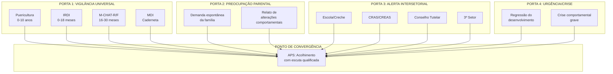
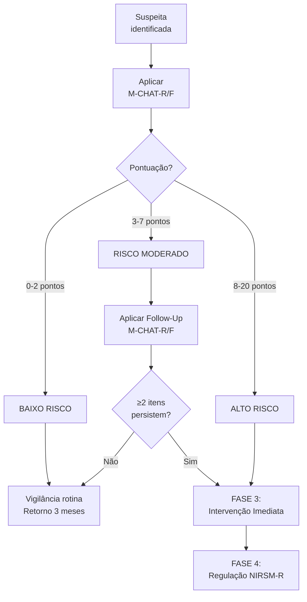
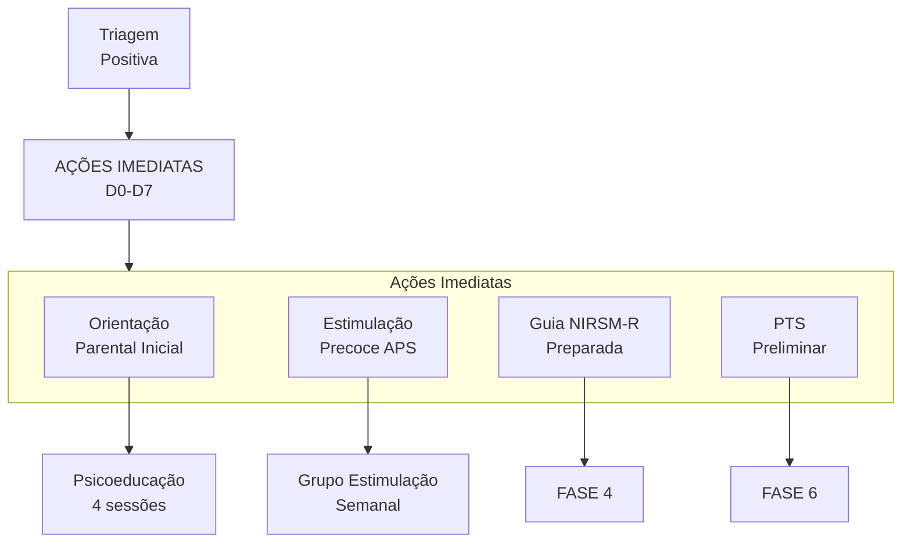
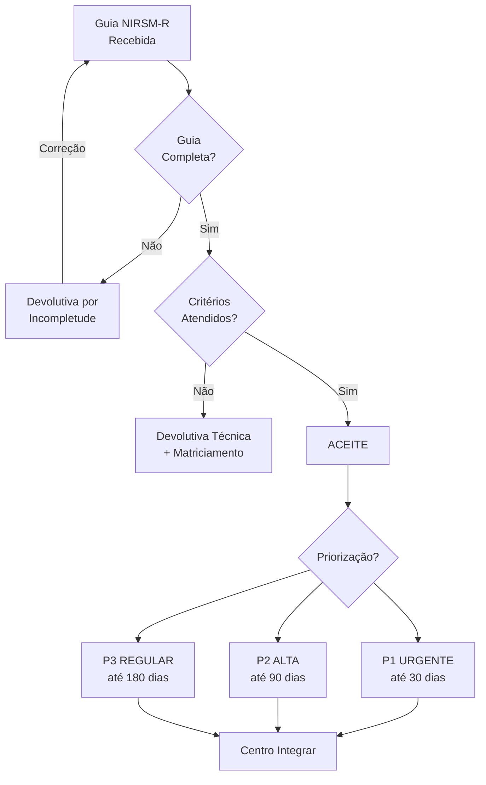
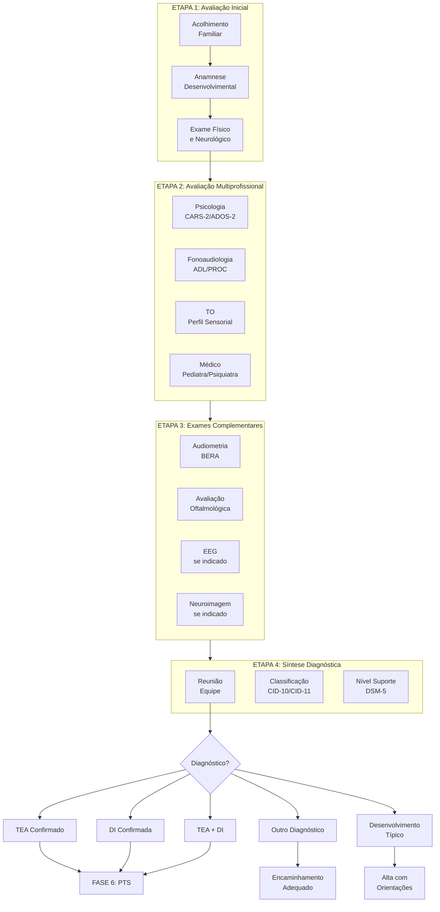
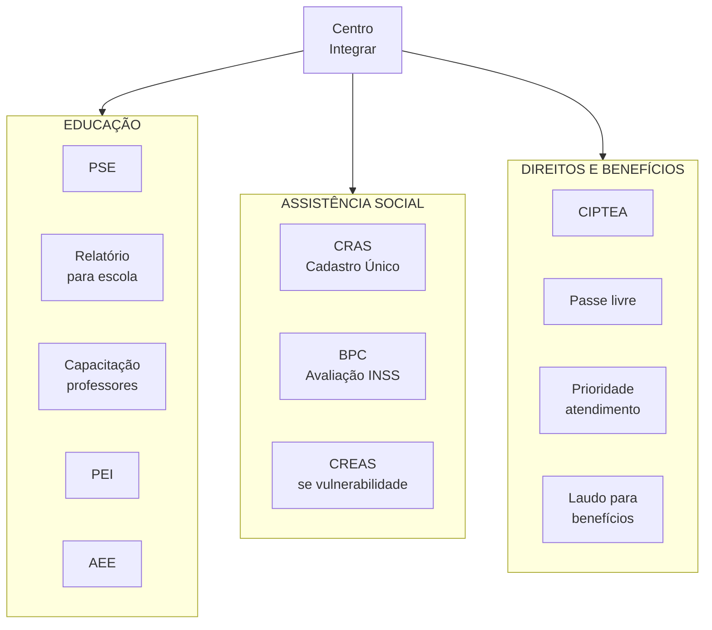
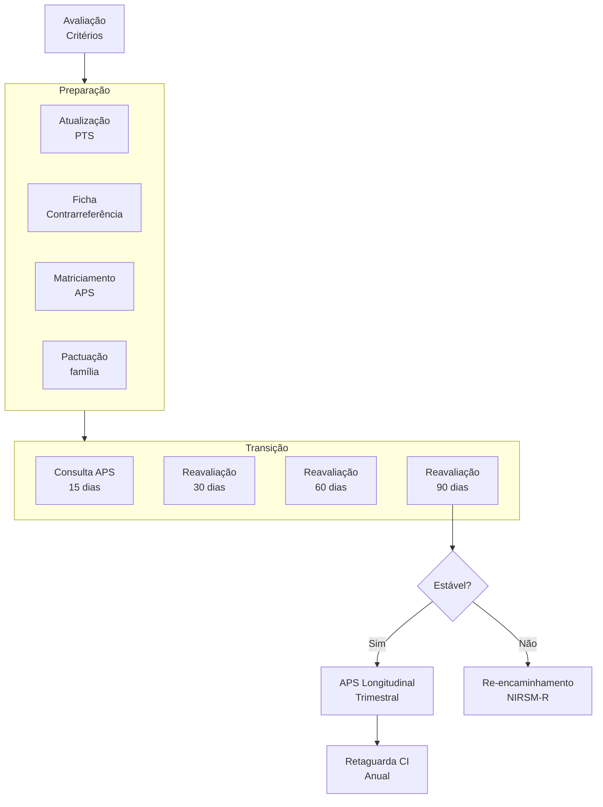
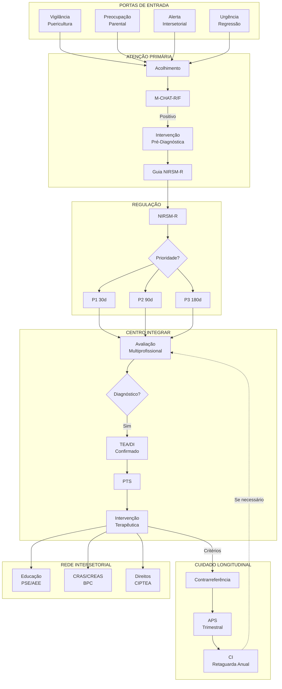

# PROTOCOLO PCC-06: MACROFLUXO NARRATIVO DI/TEA

## COMPARTILHAMENTO DO CUIDADO EM SAÚDE MENTAL
### Cascata de Eventos: Suspeição, Detecção e Acompanhamento de Deficiência Intelectual e Transtorno do Espectro Autista

---

**MUNICÍPIO DE EXTREMA — MINAS GERAIS**

| Campo | Informação |
|-------|------------|
| **Código** | PCC-06-2026 |
| **Versão** | 1.0 |
| **Vigência** | Janeiro a Dezembro de 2026 |
| **Próxima Revisão** | Julho de 2026 |
| **Elaboração** | Coordenação Municipal de Saúde Mental e Reabilitação |
| **Aprovação** | Secretaria Municipal de Saúde de Extrema-MG |
| **Alinhamento** | MS Brasil 2025 — Linha de Cuidado para Pessoas com TEA |

---

## SUMÁRIO

1. [Identificação](#1-identificação)
2. [Objetivo e Escopo](#2-objetivo-e-escopo)
3. [Fundamentação Normativa](#3-fundamentação-normativa)
4. [Definições e Conceitos](#4-definições-e-conceitos)
5. [Portas de Entrada](#5-portas-de-entrada)
6. [Fluxo Operacional — As 10 Fases](#6-fluxo-operacional--as-10-fases)
7. [Considerações Especiais por População](#7-considerações-especiais-por-população)
8. [Responsabilidades](#8-responsabilidades)
9. [Instrumentos e Registros](#9-instrumentos-e-registros)
10. [Indicadores de Monitoramento](#10-indicadores-de-monitoramento)
11. [Cronograma de Tempos Máximos](#11-cronograma-de-tempos-máximos)
12. [Anexos](#12-anexos)

---

## 1. IDENTIFICAÇÃO

| Campo | Conteúdo |
|-------|----------|
| **Título** | Macrofluxo Narrativo para Suspeição, Detecção e Acompanhamento de Deficiência Intelectual (DI) e Transtorno do Espectro Autista (TEA) |
| **Código** | PCC-06-2026 |
| **Versão** | 1.0 |
| **Data de Elaboração** | Janeiro de 2026 |
| **Vigência** | Janeiro a Dezembro de 2026 |
| **Próxima Revisão** | Julho de 2026 |
| **Elaboração** | Coordenação Municipal de Saúde Mental e Reabilitação |
| **Aprovação** | Secretaria Municipal de Saúde de Extrema-MG |
| **Protocolo Base** | CLI-02 — Transtorno do Espectro Autista v2.7 |

---

## 2. OBJETIVO E ESCOPO

### 2.1 Objetivo Geral

Definir a **cascata completa de eventos e ações** desde a suspeição inicial até o cuidado longitudinal para pessoas com Deficiência Intelectual (DI) e/ou Transtorno do Espectro Autista (TEA), mapeando toda a navegação do paciente dentro da Rede de Atenção à Saúde de Extrema/MG.

### 2.2 Objetivos Específicos

- Estabelecer as **4 portas de entrada** para identificação de suspeita
- Definir **10 fases sequenciais** do macrofluxo com critérios claros de transição
- Garantir **intervenção precoce antes do diagnóstico** conforme MS Brasil 2025
- Estabelecer **prazos máximos** (P1/P2/P3) para cada etapa
- Integrar fluxos com **rede intersetorial** (Educação, Assistência Social)
- Definir **indicadores de qualidade** mensuráveis para monitoramento

### 2.3 Aplicabilidade

Este protocolo aplica-se a:

| Ponto de Atenção | Equipes/Serviços |
|------------------|------------------|
| **Atenção Primária** | UBS, e-ESF, e-Multi, ACS |
| **Regulação** | NIRSM-R |
| **Atenção Especializada** | Centro Integrar, CSM, CAPS I |
| **Rede Intersetorial** | Educação (PSE), CRAS/CREAS, Conselho Tutelar |

**População-alvo:**
- Crianças 0-10 anos em vigilância do desenvolvimento
- Crianças e adolescentes com suspeita de TEA/DI
- Adultos com diagnóstico tardio de TEA
- Famílias e cuidadores

### 2.4 Não-Aplicabilidade (Exclusões)

Este protocolo **NÃO** se aplica diretamente a:

| Situação | Protocolo Aplicável |
|----------|---------------------|
| Urgência psiquiátrica aguda (sem suspeita TEA/DI) | CLI-05 — Emergências Psiquiátricas |
| Transtornos mentais comuns em adultos | CLI-01 — TMC na APS |
| Uso de álcool e outras drogas | CLI-04 — Álcool e Outras Drogas |
| Suicidabilidade e autolesão | CLI-03 — Suicidabilidade |

> **Nota:** Comorbidades psiquiátricas em pessoas com TEA/DI devem seguir ESTE protocolo para o fluxo geral, com articulação aos protocolos específicos quando necessário.

---

## 3. FUNDAMENTAÇÃO NORMATIVA

### 3.1 Base Legal

| Normativa | Descrição |
|-----------|-----------|
| **Lei Federal nº 10.216/2001** | Proteção e direitos das pessoas com transtornos mentais |
| **Lei Federal nº 12.764/2012** | Política Nacional de Proteção dos Direitos da Pessoa com TEA (Lei Berenice Piana) |
| **Lei Federal nº 13.146/2015** | Estatuto da Pessoa com Deficiência |
| **Portaria GM/MS nº 3.088/2011** | Institui a Rede de Atenção Psicossocial (RAPS) |
| **Portaria GM/MS nº 324/2024** | Diretrizes para organização da atenção às pessoas com TEA no SUS |
| **Decreto nº 8.368/2014** | Regulamenta a Lei Berenice Piana |
| **Lei Federal nº 14.624/2023** | Institui a CIPTEA (Carteira de Identificação da Pessoa com TEA) |

### 3.2 Referências Técnicas

| Documento | Fonte | Ano |
|-----------|-------|-----|
| Linha de Cuidado para Pessoas com TEA | MS Brasil | 2025 |
| Manual Diagnóstico e Estatístico de Transtornos Mentais (DSM-5-TR) | APA | 2022 |
| Classificação Internacional de Doenças (CID-11) | OMS | 2022 |
| Early Screening and Diagnosis of Autism | Pierce et al. | 2019 |
| M-CHAT-R/F Validação Brasileira | Losapio et al. | 2023 |
| mhGAP — Mental Health Gap Action Programme | OMS | 2023 |
| Metanálise Instrumentos Diagnósticos TEA | Santos et al., Clinics | 2024 |

### 3.3 Princípio Fundamental

> **"Atraso no desenvolvimento é URGÊNCIA FUNCIONAL. NÃO aguardar diagnóstico definitivo para iniciar intervenção."**
> — Ministério da Saúde, 2025

> **"A intervenção deve iniciar-se ANTES da conclusão do diagnóstico formal; o Projeto Terapêutico Singular (PTS) deve ser elaborado imediatamente após rastreamento positivo, não após confirmação diagnóstica."**
> — Linha de Cuidado TEA, MS Brasil, 2025

---

## 4. DEFINIÇÕES E CONCEITOS

### 4.1 Glossário Operacional

| Termo | Definição |
|-------|-----------|
| **TEA** | Transtorno do Espectro Autista — condição do neurodesenvolvimento caracterizada por diferenças na comunicação social e padrões restritos/repetitivos |
| **DI** | Deficiência Intelectual (anteriormente "retardo mental") — limitações significativas no funcionamento intelectual e comportamento adaptativo |
| **Comorbidade TEA+DI** | Coexistência de TEA e DI na mesma pessoa (32-40% dos casos de TEA) |
| **Neuroplasticidade** | Capacidade do cérebro de se reorganizar; máxima nos primeiros 3 anos de vida |
| **Janela Crítica** | Período 0-3 anos onde intervenções têm maior impacto |
| **Camuflagem/Masking** | Estratégia onde pessoa autista suprime comportamentos para "se encaixar" socialmente |
| **Intervenção Pré-Diagnóstica** | Início de estimulação e orientação familiar ANTES da confirmação diagnóstica |
| **Contrarreferência** | Retorno estruturado do paciente da atenção especializada para APS |

### 4.2 Siglas

| Sigla | Significado |
|-------|-------------|
| APS | Atenção Primária à Saúde |
| AES | Atenção Especializada em Saúde |
| CAPS | Centro de Atenção Psicossocial |
| CI | Centro Integrar |
| CSM | Centro de Saúde Mental |
| e-ESF | Equipe de Saúde da Família |
| e-Multi | Equipe Multiprofissional |
| IRDI | Indicadores de Risco para o Desenvolvimento Infantil |
| M-CHAT-R/F | Modified Checklist for Autism in Toddlers, Revised with Follow-Up |
| MDI | Marco do Desenvolvimento Infantil (Caderneta) |
| NIRSM-R | Núcleo Interno de Regulação de Saúde Mental |
| PTS | Projeto Terapêutico Singular |
| RAPS | Rede de Atenção Psicossocial |
| ACS | Agente Comunitário de Saúde |
| TO | Terapeuta Ocupacional |
| Fono | Fonoaudiólogo |
| CAA | Comunicação Aumentativa e Alternativa |
| CIPTEA | Carteira de Identificação da Pessoa com TEA |
| BPC | Benefício de Prestação Continuada |
| PEI | Plano Educacional Individualizado |
| AEE | Atendimento Educacional Especializado |
| PSE | Programa Saúde na Escola |

### 4.3 Níveis de Suporte DSM-5

| Nível | Comunicação Social | Comportamentos Repetitivos | Descrição |
|-------|-------------------|---------------------------|-----------|
| **Nível 1** | Dificuldades sem apoio | Interferência em alguns contextos | "Requer apoio" |
| **Nível 2** | Déficits marcados | Óbvios para observador casual | "Requer apoio substancial" |
| **Nível 3** | Déficits graves | Interferência marcada em todas áreas | "Requer apoio muito substancial" |

---

## 5. PORTAS DE ENTRADA

### 5.1 Visão Geral das 4 Portas de Entrada



### 5.2 Detalhamento das Portas de Entrada

#### PORTA 1: Via Vigilância Universal do Desenvolvimento

| Componente | Especificação |
|------------|---------------|
| **Gatilho** | Consulta de puericultura programada |
| **Instrumentos** | IRDI (0-18m), M-CHAT-R/F (16-30m), MDI (Caderneta) |
| **Responsável** | e-ESF (Médico/Enfermeiro) |
| **Critério de ativação** | Indicador ausente IRDI; M-CHAT ≥ 3; Marco ausente |
| **Prazo para ação** | Imediato (mesma consulta) |

**Calendário de Vigilância Recomendado:**

| Idade | Instrumento | Observações |
|-------|-------------|-------------|
| 1ª semana | MDI | Reflexos, interação inicial |
| 1-2-4-6 meses | MDI + IRDI | Vigilância contínua |
| 9-12 meses | MDI + IRDI | Atenção a sinais precoces |
| **18 meses** | **M-CHAT-R/F** | **Rastreio universal obrigatório** |
| **24 meses** | **M-CHAT-R/F** | **Reaplicação obrigatória** |
| 36+ meses | MDI | Vigilância contínua |

#### PORTA 2: Via Preocupação Parental

| Componente | Especificação |
|------------|---------------|
| **Gatilho** | Família expressa preocupação com desenvolvimento |
| **Acolhimento** | Escuta qualificada prioritária |
| **Responsável** | Enfermeiro/Médico APS |
| **Prazo para agendamento** | Até 72 horas |

> **REGRA DE OURO:** *"Preocupação parental persistente NUNCA deve ser ignorada, independente do resultado da triagem."* — Zwaigenbaum et al., 2019

**Preocupações Parentais Frequentes:**

| Preocupação | Idade Típica | Ação |
|-------------|--------------|------|
| "Não olha nos olhos" | 0-12 meses | Aplicar IRDI + retorno 30 dias |
| "Não responde ao nome" | 6-18 meses | Aplicar M-CHAT se ≥16m |
| "Perdeu palavras que tinha" | 15-24 meses | **URGÊNCIA** — encaminhamento imediato |
| "Não brinca de faz-de-conta" | 18-36 meses | Aplicar M-CHAT + avaliação e-Multi |
| "Só quer brincar sozinho" | 24+ meses | Avaliação completa |

#### PORTA 3: Via Alerta Intersetorial

| Componente | Especificação |
|------------|---------------|
| **Gatilho** | Ficha de Articulação Intersetorial recebida |
| **Origens** | Escola, EMEI, CMEI, CRAS, Conselho Tutelar, ONGs |
| **Documento** | Ficha F-01 — Articulação Intersetorial |
| **Prazo para acolhimento** | 7 dias (rotina) / 72h (prioridade) / Imediato (risco) |

**Sinais de Alerta Observáveis em Ambiente Escolar:**

| Sinal | Descrição |
|-------|-----------|
| Isolamento social persistente | Não interage com pares, prefere ficar só |
| Dificuldade de comunicação | Não responde quando chamado, fala pouco ou atípica |
| Comportamentos repetitivos | Flapping, girar, alinhar objetos |
| Rigidez com mudanças | Desorganização intensa com alterações de rotina |
| Dificuldade de aprendizagem | Discrepância significativa com pares |
| Sensibilidade sensorial | Reações extremas a sons, luzes, texturas |

#### PORTA 4: Via Urgência/Crise

| Componente | Especificação |
|------------|---------------|
| **Gatilho** | Regressão do desenvolvimento OU Crise comportamental grave |
| **Fluxo** | SAMU 192 → UPA/PS → CAPS I → Centro Integrar |
| **Classificação** | **P1 — URGENTE** (até 30 dias para avaliação especializada) |
| **Ação imediata** | Estabilização + Notificação ao Centro Integrar |

**Definição de Regressão:**
- Perda de **≥5 palavras** com significado comunicativo, OU
- Perda de habilidades sociais previamente estabelecidas
- Média de idade: 19-21 meses

> ⚠️ **REGRESSÃO = URGÊNCIA ABSOLUTA** — Encaminhamento imediato ao Centro Integrar

---

## 6. FLUXO OPERACIONAL — AS 10 FASES

### 6.0 Visão Geral das Fases

| Fase | Nome | Tempo Alvo | Ponto Principal |
|------|------|------------|-----------------|
| **0** | Vigilância Universal | Contínuo | APS (e-ESF) |
| **1** | Identificação de Suspeita | D0 | APS / Intersetorial |
| **2** | Rastreio Estruturado | D0-D7 | APS (e-ESF/e-Multi) |
| **3** | Intervenção Pré-Diagnóstica | D7 | APS + Centro Integrar |
| **4** | Regulação e Priorização | D7-D14 | NIRSM-R |
| **5** | Avaliação Diagnóstica | D14-D60 | Centro Integrar |
| **6** | Elaboração do PTS | D60-D75 | Centro Integrar + APS |
| **7** | Intervenção Terapêutica | D75+ | Centro Integrar |
| **8** | Articulação Intersetorial | Contínuo | Rede Integrada |
| **9** | Contrarreferência | Variável | APS + Centro Integrar |

---

### FASE 0: VIGILÂNCIA UNIVERSAL DO DESENVOLVIMENTO

**Objetivo:** Monitoramento contínuo e sistemático de TODAS as crianças 0-10 anos

**Responsável Principal:** e-ESF (Enfermeiro, Médico)

#### 6.0.1 Instrumentos por Faixa Etária

| Instrumento | Faixa Etária | Sensibilidade | Aplicador | Momento |
|-------------|--------------|---------------|-----------|---------|
| **IRDI** | 0-18 meses | 96,9% | e-ESF | Todas consultas puericultura |
| **M-CHAT-R/F** | 16-30 meses | 88,2% | e-ESF/e-Multi | 18 e 24 meses (obrigatório) |
| **MDI** | 0-10 anos | Variável | e-ESF | Todas consultas |

#### 6.0.2 IRDI — Indicadores de Risco para o Desenvolvimento Infantil

**Estrutura:** 31 indicadores em 4 fases

| Fase IRDI | Idade | Indicadores-Chave |
|-----------|-------|-------------------|
| Fase I | 0-4 meses | Fixação do olhar, sorriso responsivo |
| Fase II | 4-8 meses | Resposta ao nome, vocalização recíproca |
| Fase III | 8-12 meses | Imitação, atenção compartilhada |
| Fase IV | 12-18 meses | Palavras, brincadeira simbólica |

**Interpretação:**
- ✓ Indicadores presentes → Vigilância de rotina
- ✗ ≥2 indicadores ausentes em qualquer fase → **ALERTA — Acionar FASE 1**

#### 6.0.3 Sobreposição IRDI × M-CHAT (16-18 meses)

No período de 16-18 meses, ambos instrumentos são aplicáveis:

```
SE IRDI com indicadores ausentes aos 16 meses:
    → Antecipar M-CHAT-R/F para 16 meses
    → Não aguardar 18 meses

PADRÃO:
    → IRDI em todas consultas 0-18 meses
    → M-CHAT-R/F aos 18 e 24 meses
```

---

### FASE 1: IDENTIFICAÇÃO DE SUSPEITA

**Objetivo:** Reconhecimento inicial de sinais de alerta para TEA/DI

**Responsável:** APS (e-ESF/e-Multi) ou Rede Intersetorial

#### 6.1.1 Critérios de Entrada na Fase 1

Qualquer UM dos seguintes:

| Critério | Fonte | Ação |
|----------|-------|------|
| M-CHAT-R/F ≥ 3 pontos | Vigilância | Acionar Fase 2 |
| Qualquer item crítico M-CHAT (2, 5, 12) positivo | Vigilância | Acionar Fase 2 como ALTO RISCO |
| ≥2 indicadores IRDI ausentes | Vigilância | Acionar Fase 2 |
| Marco MDI ausente | Caderneta | Avaliação e-Multi |
| Preocupação parental persistente | Família | Acolhimento prioritário |
| Alerta intersetorial documentado | Escola/CRAS | Acolhimento em 7 dias |
| **Regressão de habilidades** | Família/Profissional | **URGÊNCIA — Fase 4 P1** |

#### 6.1.2 Sinais de Alerta por Faixa Etária

##### Bebês (0-12 meses)

| Sinal | Descrição | Idade Esperada |
|-------|-----------|----------------|
| Contato visual | Reduzido ou ausente | ≥2 meses |
| Sorriso social | Ausente ou inconsistente | ≥3 meses |
| Orientação ao nome | Não responde | ≥6 meses |
| Interesse por faces | Baixo | ≥2 meses |
| Atenção compartilhada | Não segue olhar | ≥9 meses |

##### Crianças (12-36 meses)

| Sinal | Descrição | Idade Esperada |
|-------|-----------|----------------|
| Palavras | Ausência aos 16 meses | ≥12 meses |
| Frases | Ausência aos 24 meses | ≥18 meses |
| Apontar protodeclarativo | Ausente | ≥12 meses |
| Imitação | Ausente | ≥9 meses |
| Brincadeira simbólica | Ausente | ≥18 meses |
| Estereotipias | Presentes | — |
| Regressão | Perda de habilidades | **URGÊNCIA** |

##### Crianças Maiores e Adolescentes

| Sinal | Descrição |
|-------|-----------|
| Dificuldade em fazer amizades | Persistente, múltiplos contextos |
| Literalidade | Não compreende ironia, metáforas |
| Rigidez | Resistência extrema a mudanças |
| Interesses restritos | Intensidade ou foco atípico |
| Sensibilidade sensorial | Hiper ou hiporreatividade |

#### 6.1.3 Ações da Fase 1

| Passo | Ação | Responsável | Prazo |
|-------|------|-------------|-------|
| 1.1 | Documentar observações no prontuário (SOAP) | Profissional identificador | Imediato |
| 1.2 | Aplicar instrumentos se não realizado | e-ESF | Na consulta |
| 1.3 | Acolher preocupações da família | Equipe APS | Imediato |
| 1.4 | Classificar prioridade inicial | e-ESF/e-Multi | Imediato |
| 1.5 | Acionar FASE 2 | Coordenador APS | Imediato |

---

### FASE 2: RASTREIO ESTRUTURADO

**Objetivo:** Confirmação e refinamento da suspeita através de avaliação sistemática

**Responsável:** APS (e-ESF/e-Multi)

**Prazo:** D0-D7 a partir da identificação da suspeita

#### 6.2.1 Fluxograma de Rastreio M-CHAT-R/F



#### 6.2.2 Interpretação do M-CHAT-R/F

| Pontuação | Classificação | Conduta |
|-----------|---------------|---------|
| **0-2** | Baixo risco | Vigilância de rotina; se <24m, reaplicar aos 24m |
| **3-7** | Risco moderado | Aplicar entrevista Follow-Up |
| **8-20** | Alto risco | **Encaminhamento IMEDIATO** para avaliação especializada |

#### 6.2.3 Itens Críticos do M-CHAT-R/F

> **REGRA:** Se QUALQUER item crítico for positivo, considerar **ALTO RISCO** independente da pontuação total.

| Item | Pergunta | Significado Clínico |
|------|----------|---------------------|
| **2** | Interesse em outras crianças | Déficit interação social |
| **5** | Brincadeira de faz-de-conta | Ausência jogo simbólico |
| **12** | Sensibilidade a ruídos | Alteração sensorial |

#### 6.2.4 Protocolo de Aplicação M-CHAT-R/F

| Etapa | Ação | Tempo | Responsável |
|-------|------|-------|-------------|
| 1 | Entrega questionário à família | 5 min | Recepção/Enfermagem |
| 2 | Preenchimento pela família | 5-10 min | Família |
| 3 | Cálculo pontuação | 2 min | Profissional |
| 4 | Verificação itens críticos | 1 min | Profissional |
| 5 | Follow-Up se 3-7 pontos | 10-15 min | Médico/Enfermeiro |
| 6 | Documentação e-SUS | 5 min | Profissional |

#### 6.2.5 Valor Preditivo do M-CHAT-R/F

| Parâmetro | Valor | Implicação |
|-----------|-------|------------|
| Sensibilidade | 88,2% | ~12% de falso-negativos possíveis |
| Especificidade | 98% | Baixa taxa de falso-positivos |
| VPP para TEA | 47% | Menos da metade confirma TEA |
| VPP para qualquer alteração | **95%** | Quase todos têm alguma alteração |

> **Implicação clínica:** Mesmo que M-CHAT positivo não confirme TEA, 95% das crianças apresentam alguma alteração do desenvolvimento que se beneficia de intervenção precoce.

---

### FASE 3: INTERVENÇÃO IMEDIATA PRÉ-DIAGNÓSTICA

**Objetivo:** Iniciar estimulação precoce e orientação familiar SEM aguardar confirmação diagnóstica

**Responsável:** APS (e-Multi) + Centro Integrar (matriciamento)

**Prazo:** A partir de D7 (até 7 dias após triagem positiva)

> **PRINCÍPIO MS BRASIL 2025:** *"A intervenção deve iniciar-se ANTES da conclusão do diagnóstico formal; o PTS deve ser elaborado imediatamente após rastreamento positivo."*

#### 6.3.1 Componentes da Intervenção Imediata



#### 6.3.2 Programa de Orientação Parental Inicial

| Sessão | Tema | Duração | Material |
|--------|------|---------|----------|
| 1 | O que é neurodesenvolvimento | 45 min | Folder ilustrado |
| 2 | Comunicação e interação | 45 min | Vídeo demonstrativo |
| 3 | Manejo de comportamentos | 45 min | Roteiro prático |
| 4 | Rotina e previsibilidade | 45 min | Checklist para casa |

**Conteúdo Obrigatório Sessão 1:**

> ⚠️ **IMPORTANTE — Orientar famílias:**
> O TEA **NÃO é causado por:**
> - Vacinas (refutado por múltiplos estudos)
> - Estilo parental ou "falta de afeto"
> - Fatores emocionais dos pais
> - Uso de telas (embora possa agravar sintomas)

#### 6.3.3 Estimulação Precoce na APS

| Atividade | Frequência | Responsável | Conteúdo |
|-----------|------------|-------------|----------|
| Grupo de estimulação | Semanal | e-Multi (Fono/TO) | Comunicação, motor, social |
| Visita domiciliar | Quinzenal | ACS + e-Multi | Ambiente, rotina |
| Monitoramento telefônico | Quinzenal | Enfermeiro | Adesão, dúvidas |

**Estratégias de Estimulação para Orientação Familiar:**

| Área | Estratégia | Exemplo Prático |
|------|------------|-----------------|
| Interação face a face | Posicionar-se na altura dos olhos | Sentar no chão para brincar |
| Atenção compartilhada | Apontar e nomear objetos de interesse | "Olha o cachorro!" |
| Brincadeiras imitativas | Imitar ações da criança | Repetir sons que ela faz |
| Rotinas previsíveis | Criar sequências fixas | Mesmo ritual de banho |
| Comunicação | Usar linguagem simples e repetitiva | Frases curtas, mesmas palavras |

#### 6.3.4 PTS Preliminar

Estrutura mínima do PTS preliminar (pré-diagnóstico):

| Componente | Conteúdo |
|------------|----------|
| Identificação | Nome, DN, CNS, família |
| Situação atual | Sinais de alerta identificados, M-CHAT |
| Hipótese de trabalho | Suspeita TEA/DI |
| Metas imediatas | 2-3 metas funcionais para 30 dias |
| Plano de estimulação | Atividades casa + APS |
| Referências | Profissional de referência APS |
| Prazo reavaliação | 30 dias |

---

### FASE 4: REGULAÇÃO E PRIORIZAÇÃO

**Objetivo:** Validar encaminhamento e priorizar conforme Sistema P1/P2/P3

**Responsável:** NIRSM-R

**Prazo:** D7-D14

#### 6.4.1 Fluxograma de Regulação



#### 6.4.2 Sistema de Priorização P1/P2/P3 para TEA/DI

| Prioridade | Cor | Critérios TEA/DI | Prazo Máx | Destino |
|------------|-----|------------------|-----------|---------|
| **P1** | 🔴 VERMELHA | < 3 anos com M-CHAT alto risco; Regressão; DI + suspeita TEA; Prematuros extremos (<32 sem) | **30 dias** | CI — Urgente |
| **P2** | 🟠 LARANJA | 3-6 anos com suspeita fundamentada; Comprometimento moderado-grave; Necessidade documentação BPC | **90 dias** | CI — Prioritária |
| **P3** | 🟡 AMARELA | > 6 anos primeira suspeita; Reavaliação pós-intervenção; Adultos diagnóstico tardio | **180 dias** | CI — Regular |

#### 6.4.3 Checklist Mínimo da Guia NIRSM-R

```
DOCUMENTAÇÃO OBRIGATÓRIA:

[ ] Dados identificação completos (Nome, DN, CNS, Endereço, UBS)
[ ] Resultado M-CHAT-R/F com pontuação e data de aplicação
[ ] Sinais de alerta documentados com exemplos específicos
[ ] Marcos do desenvolvimento (atingidos e ausentes)
[ ] Fatores de risco (prematuridade, história familiar)
[ ] Tentativas de intervenção na APS documentadas
[ ] Avaliação e-ESF assinada com carimbo
[ ] Avaliação e-Multi assinada com carimbo (se disponível)
[ ] Classificação de prioridade justificada (P1/P2/P3)
[ ] Ficha de Articulação Intersetorial (se origem escolar/CRAS)
```

#### 6.4.4 Critérios de Devolutiva

**Devolutiva por Incompletude:**
- Guia sem assinatura ou carimbo
- Dados identificação faltantes
- Resultado M-CHAT não informado

**Devolutiva Técnica (com Matriciamento):**
- Ausência de tentativa de intervenção na APS
- Caso não configura suspeita fundamentada
- Encaminhamento inadequado (ex: TMC puro sem suspeita TEA)

---

### FASE 5: AVALIAÇÃO DIAGNÓSTICA ESPECIALIZADA

**Objetivo:** Confirmação diagnóstica multidisciplinar

**Responsável:** Centro Integrar

**Prazo:** D14-D60 (conforme prioridade P1/P2/P3)

#### 6.5.1 Fluxograma de Avaliação Diagnóstica



#### 6.5.2 Equipe Mínima Centro Integrar

| Profissional | Função na Avaliação | Instrumentos |
|--------------|---------------------|--------------|
| **Médico** (Pediatra/Neuropediatra/Psiquiatra) | Avaliação clínica, exclusão causas orgânicas | Anamnese, exame físico |
| **Psicólogo** | Avaliação comportamental e cognitiva | CARS-2, ADOS-2, Vineland, Bayley |
| **Fonoaudiólogo** | Avaliação linguagem e comunicação | ADL, PROC, PLS-5 |
| **Terapeuta Ocupacional** | Avaliação sensorial e funcional | Perfil Sensorial, AVDs |

#### 6.5.3 Instrumentos Diagnósticos

| Instrumento | Sensibilidade | Especificidade | Uso |
|-------------|---------------|----------------|-----|
| **ADOS-2** | 87% | 75% | Observação estruturada |
| **CARS-2** | 89% | 79% | Rating scale clínico |
| **ADI-R** | 77% | 68% | Entrevista cuidadores |

> **Recomendação:** Nenhum instrumento isolado para diagnóstico. Acurácia máxima quando ADOS-2 + ADI-R combinados.

#### 6.5.4 Exames Complementares

| Exame | Indicação | Obrigatório? |
|-------|-----------|--------------|
| **Audiometria/BERA** | Excluir perda auditiva | **SIM — TODOS** |
| **Avaliação oftalmológica** | Excluir alteração visual | **SIM — TODOS** |
| **EEG** | Suspeita epilepsia, regressão | Se indicado |
| **RM Crânio** | Dismorfismos, macrocefalia, regressão | Se indicado |
| **Cariótipo/Array-CGH** | Dismorfismos, DI associada | Se indicado |
| **X-Frágil** | Meninos com TEA + DI | Se indicado |

#### 6.5.5 Codificação Diagnóstica

**CID-10 (Faturamento SUS):**

| Código | Denominação |
|--------|-------------|
| F84.0 | Autismo infantil |
| F84.1 | Autismo atípico |
| F84.5 | Síndrome de Asperger |
| F70-F79 | Deficiência Intelectual (por grau) |

**CID-11 (Documentação Clínica):**

| Código | Descrição |
|--------|-----------|
| 6A02.0 | TEA sem TDI, linguagem funcional |
| 6A02.1 | TEA com TDI, linguagem funcional |
| 6A02.2 | TEA sem TDI, deficiência linguagem |
| 6A02.3 | TEA com TDI, deficiência linguagem |
| 6A02.5 | TEA com TDI, ausência linguagem funcional |

---

### FASE 6: ELABORAÇÃO DO PTS

**Objetivo:** Construção colaborativa do Projeto Terapêutico Singular

**Responsável:** Centro Integrar + APS

**Prazo:** D60-D75 (até 15 dias após diagnóstico)

#### 6.6.1 Os 4 Momentos do PTS

| Momento | Descrição | Participantes | Prazo |
|---------|-----------|---------------|-------|
| **1. Diagnóstico Integral** | Avaliação biopsicossocial completa | Equipe CI + Família | D60-D65 |
| **2. Definição de Metas** | Metas SMART pactuadas COM a família | Equipe + Família + Usuário | D65-D70 |
| **3. Divisão de Responsabilidades** | Matriz de quem faz o quê | Todos envolvidos | D70-D73 |
| **4. Reavaliação** | Cronograma de revisões | Gestor de caso | D73-D75 |

#### 6.6.2 Modelo de Metas SMART por Área

| Área | Meta Exemplo | Indicador | Prazo |
|------|--------------|-----------|-------|
| **Comunicação** | Aumentar vocabulário funcional para 50 palavras | Registro semanal família | 6 meses |
| **Interação Social** | Manter atenção compartilhada por 30 segundos | Avaliação terapeuta | 3 meses |
| **Comportamento** | Reduzir crises de 5/semana para 1/semana | Diário família | 3 meses |
| **Autonomia** | Realizar alimentação com independência | Checklist AVDs | 6 meses |
| **Inclusão** | Frequência escolar regular com apoio | Relatório escolar | Contínuo |

#### 6.6.3 Componentes Obrigatórios do PTS para TEA/DI

| Área | Elementos |
|------|-----------|
| **Terapêutica** | Frequência e tipo de terapias (ABA, Fono, TO) |
| **Educação** | Apoio escolar, sala de recursos, mediação |
| **Saúde** | Consultas de acompanhamento, medicação |
| **Social** | Atividades de inclusão, lazer |
| **Família** | Orientação, grupos de apoio, descanso do cuidador |

---

### FASE 7: INTERVENÇÃO TERAPÊUTICA INTENSIVA

**Objetivo:** Implementação de abordagens terapêuticas baseadas em evidências

**Responsável:** Centro Integrar

**Prazo:** D75+ (contínuo conforme PTS)

#### 6.7.1 Abordagens Recomendadas

**Intervenções Comportamentais:**

| Abordagem | Descrição | Nível Evidência |
|-----------|-----------|-----------------|
| **ABA** | Análise do Comportamento Aplicada | Alto |
| **EIBI** | Intervenção Comportamental Intensiva Precoce | Alto |
| **PRT** | Treino de Respostas Pivotais | Moderado |
| **PECS** | Sistema de Comunicação por Troca de Figuras | Moderado |

**Intervenções Desenvolvimentais:**

| Abordagem | Descrição | Nível Evidência |
|-----------|-----------|-----------------|
| **ESDM** | Early Start Denver Model | Alto |
| **DIR/Floortime** | Modelo baseado no desenvolvimento e relação | Moderado |
| **TEACCH** | Tratamento e Educação de Crianças Autistas | Moderado |

**Intervenções Específicas:**

| Área | Intervenção |
|------|-------------|
| Linguagem | Fonoterapia, CAA (Comunicação Aumentativa Alternativa) |
| Motor/Sensorial | TO, Integração Sensorial |
| Social | Treino de Habilidades Sociais, Grupos Terapêuticos |
| Comportamento | Suporte Comportamental Positivo |

#### 6.7.2 Frequência por Nível de Suporte

| Nível DSM-5 | Frequência Mínima | Modalidades |
|-------------|-------------------|-------------|
| **Nível 1** | 2-3x/semana | TO + Fono + Grupos |
| **Nível 2** | 3-5x/semana | ABA + Fono + TO + Orientação parental |
| **Nível 3** | 5x/semana + intensivo | ABA intensivo + CAA + TO sensorial + Suporte família |

#### 6.7.3 Medicação

> **O TEA não tem tratamento medicamentoso específico.** Medicações são indicadas para comorbidades e sintomas-alvo.

| Sintoma/Comorbidade | Opções Farmacológicas |
|---------------------|----------------------|
| Irritabilidade/Agressividade | Risperidona*, Aripiprazol* |
| TDAH | Metilfenidato, Atomoxetina |
| Ansiedade | ISRS (Fluoxetina, Sertralina) |
| Insônia | Melatonina, higiene do sono |
| Epilepsia | Antiepilépticos conforme indicação |

*Únicos com indicação FDA para irritabilidade em TEA

---

### FASE 8: ARTICULAÇÃO INTERSETORIAL

**Objetivo:** Integração com educação, assistência social e direitos

**Responsável:** Rede Integrada (CI + APS + Intersetorial)

**Prazo:** Contínuo

#### 6.8.1 Fluxograma de Articulação



#### 6.8.2 Documentação para Articulação

| Documento | Finalidade | Responsável | Prazo |
|-----------|------------|-------------|-------|
| Relatório para escola | Orientações pedagógicas e adaptações | Equipe CI | 15 dias após PTS |
| Laudo BPC | Acesso ao benefício | Médico CI | Conforme demanda |
| Solicitação CIPTEA | Carteira identificação | Família + CI | Conforme demanda |
| Relatório PEI | Plano escolar individualizado | CI + Escola | Início ano letivo |

#### 6.8.3 Programa Saúde na Escola (PSE)

| Ação | Frequência | Responsável |
|------|------------|-------------|
| Capacitação professores sobre TEA | Semestral | CI + e-Multi |
| Vigilância desenvolvimento escolar | Contínuo | Professores |
| Devolutiva casos identificados | Conforme demanda | e-ESF |

---

### FASE 9: CONTRARREFERÊNCIA E CUIDADO LONGITUDINAL

**Objetivo:** Transição segura para acompanhamento compartilhado com APS

**Responsável:** Centro Integrar + APS

**Prazo:** Variável (conforme critérios de estabilidade)

#### 6.9.1 Critérios de Contrarreferência

| Critério | Operacionalização | Responsável |
|----------|-------------------|-------------|
| Objetivos PTS atingidos | ≥70% metas SMART alcançadas | Equipe CI |
| Estabilização funcional | Ausência regressão ≥3 meses | Terapeuta referência |
| Família capacitada | Conclusão programa psicoeducação | Psicólogo/AS |
| e-ESF/e-Multi capacitados | ≥1 profissional com formação | Coordenação APS |
| Inclusão escolar estabelecida | Matrícula + PEI elaborado | Articulador |

#### 6.9.2 Fluxograma de Contrarreferência



#### 6.9.3 Acompanhamento Longitudinal na APS

| Aspecto | O que Monitorar | Frequência |
|---------|-----------------|------------|
| Desenvolvimento | Ganhos funcionais | Trimestral |
| Comportamento | Irritabilidade, estereotipias | Contínuo |
| Comorbidades | Ansiedade, TDAH, sono, epilepsia | Semestral |
| Inclusão | Escola, comunidade | Semestral |
| Família | Sobrecarga cuidador | Trimestral |

#### 6.9.4 Retaguarda do Centro Integrar

| Modalidade | Frequência | Indicação |
|------------|------------|-----------|
| Tele-matriciamento | Mensal | Dúvidas manejo |
| Interconsulta presencial | Conforme necessidade | Casos complexos |
| Reavaliação completa | Anual | Todos contrarreferidos |
| Re-encaminhamento | Se critérios | Desestabilização |

---

## 7. CONSIDERAÇÕES ESPECIAIS POR POPULAÇÃO

### 7.1 Meninas com TEA — Fenômeno de Camuflagem

**Problema:** Meninas são diagnosticadas em média **7 ANOS mais tarde** que meninos.

#### 7.1.1 O Fenômeno da Camuflagem

| Componente | Descrição | Custo Associado |
|------------|-----------|-----------------|
| **Assimilação** | Esforço para parecer "normal" | Exaustão, perda de identidade |
| **Mascaramento** | Supressão de comportamentos autísticos | Ansiedade, burnout |
| **Compensação** | Estratégias cognitivas para simular habilidades sociais | Sobrecarga, depressão |

#### 7.1.2 Sinais de Alerta Específicos em Meninas

| Sinal | Descrição |
|-------|-----------|
| Interesses "típicos" mas intensos | Animais, K-pop, séries — com intensidade atípica |
| Imitação social | Copia comportamentos de pares |
| Exaustão pós-social | "Colapso" em casa após escola |
| Perfeccionismo | Alto desempenho inicial, ansiedade intensa |
| Amizade única | Uma amiga próxima ou preferência adultos |
| Mutismo seletivo | Fala em casa, silêncio na escola |
| Problemas alimentares | Seletividade extrema ou anorexia |

#### 7.1.3 Protocolo de Atenção Diferenciada

```
CHECKLIST MENINAS:

[ ] Aplicar M-CHAT mesmo sem sinais "clássicos"
[ ] Investigar ATIVAMENTE camuflagem
[ ] Colher informações de MÚLTIPLOS contextos (casa vs escola)
[ ] Manter limiar de suspeita MAIS BAIXO
[ ] Considerar CAT-Q e GQ-ASC como complemento
[ ] Questionar sobre ansiedade, problemas alimentares, mutismo
[ ] Avaliar diferença comportamental casa/escola
```

### 7.2 Bebês Prematuros

**Desafios do M-CHAT em Prematuros:**

| Parâmetro | Valor em Prematuros | Valor Geral |
|-----------|---------------------|-------------|
| Taxa triagem positiva | 13-26% | 3-5% |
| VPP | 20% | 47% |
| Sensibilidade | 52% | 88,2% |

#### 7.2.1 Abordagem Modificada para Prematuros

| Modificação | Justificativa |
|-------------|---------------|
| Usar **IDADE CORRIGIDA** até 24 meses | Ajuste desenvolvimento |
| Avaliações **SERIADAS** (não ponto único) | Maior acurácia |
| Manter vigilância **PIPA/MG** até 3 anos | Mesmo com M-CHAT negativo |
| Triagem aos 2-3 anos pode ser mais acurada | Maturação |

### 7.3 Populações Culturalmente Diversas

#### 7.3.1 Fatores de Atenção

| Fator | Impacto | Estratégia |
|-------|---------|------------|
| Expectativas contato visual | Varia entre culturas | Não usar como critério isolado |
| Barreiras linguísticas | Compreensão questionário | Usar intérprete/mediador |
| Estigma cultural | Suprime relatos | Abordagem acolhedora |
| Atribuições espirituais | Atraso busca serviços | Psicoeducação sensível |

#### 7.3.2 Disparidades Raciais no Brasil

| Indicador | Pop. Branca | Pop. Negra/Parda |
|-----------|-------------|------------------|
| Taxa diagnóstico | ~3% | **1,3%** |
| Idade no diagnóstico | Mais cedo | Mais tarde |
| Acesso a terapias | Maior | Substancialmente menor |

> **Princípio de Equidade:** A triagem universal é especialmente importante para populações vulneráveis. Profissionais devem realizar **busca ativa** de crianças em situação de vulnerabilidade social.

### 7.4 Manejo de Falso-Negativos

#### 7.4.1 Situações de Maior Risco de Falso-Negativo

| Situação | Motivo | Conduta |
|----------|--------|---------|
| Prematuros | VPP reduzido (~20%) | Manter vigilância PIPA até 3 anos |
| Meninas | Camuflagem social | Atenção sinais sutis |
| Crianças com DI | Sobreposição sintomática | Avaliação especializada |
| Regressão tardia | Sintomas após 24 meses | Nova triagem aos 30 meses |
| Preocupação parental persistente | Pais frequentemente estão certos | Encaminhar mesmo com M-CHAT negativo |

#### 7.4.2 Protocolo para Suspeita Clínica com M-CHAT Negativo

```
1. DOCUMENTAR preocupações parentais detalhadamente
2. REAPLICAR M-CHAT em 3-6 meses
3. SOLICITAR apoio matricial NIRSM-R ou CI
4. ENCAMINHAR DIRETAMENTE se:
   - Preocupação parental persistente ≥2 consultas
   - Perda de habilidades (regressão)
   - Qualquer item crítico positivo (2, 5, 12) mesmo com pontuação baixa
   - Suspeita clínica fundamentada do profissional
```

> **REGRA DE OURO:** *"Preocupação parental persistente NUNCA deve ser ignorada, independente do resultado da triagem."*

### 7.5 Comorbidade DI + TEA

**Prevalência:** 32-40% das crianças com TEA têm DI

#### 7.5.1 Pontos de Atenção

| Aspecto | Orientação |
|---------|------------|
| Diagnóstico TEA | Avaliar TEA mesmo quando DI já confirmada |
| Comunicação social | Deve estar ABAIXO do esperado para nível de desenvolvimento geral |
| Epilepsia | Risco alto (até 77,5% quando TEA + DI) |
| CAA | Necessidade frequentemente maior |

#### 7.5.2 Codificação CID-11 para TEA + TDI

| Código | Descrição |
|--------|-----------|
| 6A02.1 | TEA com TDI, linguagem funcional preservada |
| 6A02.3 | TEA com TDI, deficiência linguagem funcional |
| 6A02.5 | TEA com TDI, ausência linguagem funcional |

---

## 8. RESPONSABILIDADES

### 8.1 Matriz RACI

| Fase | APS (e-ESF) | e-Multi | NIRSM-R | Centro Integrar | CAPS I | Intersetorial |
|------|:-----------:|:-------:|:-------:|:---------------:|:------:|:-------------:|
| 0. Vigilância | **R, A** | C | I | I | I | I |
| 1. Identificação | **R, A** | C | I | I | I | C |
| 2. Rastreio | R | **R, A** | I | C | I | C |
| 3. Intervenção Pré-Dx | R | **R, A** | I | C | I | I |
| 4. Regulação | C | C | **R, A** | C | I | I |
| 5. Avaliação Dx | I | C | C | **R, A** | C | I |
| 6. PTS | C | C | I | **R, A** | C | C |
| 7. Intervenção | C | C | I | **R, A** | C | C |
| 8. Articulação | C | C | I | R | I | **R, A** |
| 9. Contrarreferência | **R, A** | R | C | C, A | I | I |

**Legenda:** R = Responsável | A = Aprovador | C = Consultado | I = Informado

### 8.2 Competências por Ponto de Atenção

#### APS (e-ESF)

- Vigilância universal do desenvolvimento
- Aplicação de instrumentos de rastreio (IRDI, M-CHAT)
- Acolhimento com escuta qualificada
- Orientação inicial à família
- Acompanhamento longitudinal pós-contrarreferência
- Coordenação do cuidado no território

#### e-Multi

- Apoio à avaliação de casos suspeitos
- Estimulação precoce na APS
- Grupos de orientação parental
- Matriciamento às e-ESF
- Articulação com rede intersetorial

#### NIRSM-R

- Triagem administrativa e técnica das guias
- Priorização conforme critérios P1/P2/P3
- Devolutiva e matriciamento quando necessário
- Monitoramento de tempos de espera
- Gestão das filas de acesso

#### Centro Integrar

- Avaliação diagnóstica multidisciplinar
- Elaboração do PTS
- Intervenção terapêutica especializada
- Capacitação de profissionais da rede
- Contrarreferência estruturada
- Retaguarda à APS

#### CAPS I

- Atendimento de comorbidades psiquiátricas graves
- Manejo de crises
- Matriciamento em saúde mental
- Porta aberta para urgências

#### Rede Intersetorial

- Identificação de sinais de alerta (escola, CRAS)
- Articulação via Ficha Intersetorial
- Implementação de adaptações (educação)
- Suporte social (assistência social)
- Acesso a direitos e benefícios

---

## 9. INSTRUMENTOS E REGISTROS

### 9.1 Formulários Obrigatórios

| Código | Instrumento | Aplicação | Fase |
|--------|-------------|-----------|------|
| F-01 | Ficha de Articulação Intersetorial | Origem escolar/CRAS | 1 |
| F-02 | M-CHAT-R/F | Rastreio universal | 2 |
| F-03 | M-CHAT-R/F Follow-Up | Risco moderado | 2 |
| F-04 | Guia de Referência NIRSM-R | Encaminhamento | 4 |
| F-05 | Ficha de Avaliação Multiprofissional | Diagnóstico | 5 |
| F-06 | PTS — Projeto Terapêutico Singular | Planejamento | 6 |
| F-07 | Ficha de Contrarreferência | Retorno APS | 9 |

### 9.2 Escalas e Instrumentos Clínicos

| Instrumento | Finalidade | Quando Aplicar | Aplicador |
|-------------|-----------|----------------|-----------|
| IRDI | Vigilância 0-18m | Todas consultas puericultura | e-ESF |
| M-CHAT-R/F | Rastreio TEA | 18 e 24 meses | e-ESF/e-Multi |
| CARS-2 | Avaliação comportamental | Diagnóstico | Psicólogo CI |
| ADOS-2 | Observação estruturada | Diagnóstico | Psicólogo CI |
| Perfil Sensorial | Avaliação sensorial | Diagnóstico | TO CI |
| IFBrM | Funcionalidade | Diagnóstico + BPC | Equipe CI |
| Vineland | Comportamento adaptativo | Diagnóstico | Psicólogo CI |

### 9.3 Registros em Sistemas de Informação

| Sistema | Registro Obrigatório | Responsável |
|---------|---------------------|-------------|
| **e-SUS PEC** | Atendimento individual, SOAP, CID-10 | APS |
| **e-SUS PEC** | Procedimentos (M-CHAT, IRDI) | APS |
| **SISREG/Próprio** | Guias NIRSM-R | NIRSM-R |
| **Prontuário CI** | Avaliações, PTS, evoluções | Centro Integrar |

---

## 10. INDICADORES DE MONITORAMENTO

### 10.1 Indicadores de Processo

| Indicador | Fórmula | Meta | Periodicidade |
|-----------|---------|------|---------------|
| Cobertura triagem M-CHAT 18-24m | (Triados / Total 18-24m cadastrados) x 100 | ≥80% | Mensal |
| Taxa triagem positiva | (M-CHAT+ / Total triados) x 100 | 3-5% | Mensal |
| Intervenção pré-dx em 7 dias | (Iniciados até D7 / Total M-CHAT+) x 100 | ≥90% | Mensal |
| Guias NIRSM-R completas | (Completas / Total recebidas) x 100 | ≥90% | Mensal |
| Tempo médio regulação | Média (Data aceite - Data guia) | ≤7 dias | Mensal |

### 10.2 Indicadores de Resultado

| Indicador | Fórmula | Meta | Periodicidade |
|-----------|---------|------|---------------|
| Tempo médio dx P1 | Média (Data dx - Data triagem+) | ≤60 dias | Mensal |
| Tempo médio dx P2 | Média (Data dx - Data triagem+) | ≤120 dias | Mensal |
| PTS em 60 dias pós-dx | (PTS até D60 / Total dx confirmados) x 100 | ≥90% | Trimestral |
| Crianças <3a em estimulação | (Em estimulação / Total <3a com TEA) x 100 | ≥90% | Trimestral |
| Inclusão escolar com PEI | (Com PEI / Total idade escolar TEA) x 100 | ≥80% | Semestral |
| Taxa re-encaminhamento 90d | (Re-encaminhados / Contrarreferidos) x 100 | ≤20% | Trimestral |

### 10.3 Painel de Monitoramento

| Indicador | Meta | Jan | Fev | Mar | ... |
|-----------|------|-----|-----|-----|-----|
| Cobertura M-CHAT | ≥80% | | | | |
| Tempo dx P1 | ≤60d | | | | |
| PTS em 60 dias | ≥90% | | | | |
| Inclusão escolar | ≥80% | | | | |

---

## 11. CRONOGRAMA DE TEMPOS MÁXIMOS

### 11.1 Linha do Tempo

```
D0 ───→ D7 ───→ D14 ───→ D30 ───→ D60 ───→ D75 ───→ D90+ ───→ Variável
 │       │       │        │        │        │        │          │
 │       │       │        │        │        │        │          │
SUSP.  INTERV.  GUIA   CONSULT. DIAGN.   PTS    INTERV.    CONTRARREF.
IDENT. PRÉ-DX  NIRSM-R  CI(P1)  CONFIRM. ELAB.  TERAP.     (se critérios)
```

### 11.2 Tempos Críticos

| Marco | Tempo Máximo | Justificativa |
|-------|--------------|---------------|
| Suspeita → Intervenção pré-dx | **7 dias** | Janela neuroplasticidade |
| Triagem+ → Consulta CI (P1) | **30 dias** | Urgência funcional |
| Triagem+ → Consulta CI (P2) | **90 dias** | Prioridade alta |
| Triagem+ → Consulta CI (P3) | **180 dias** | Regular |
| Consulta CI → Diagnóstico | **60 dias** | Avaliação completa |
| Diagnóstico → PTS | **15 dias** | Início intervenção |
| PTS → Contrarreferência | Variável | Critérios estabilidade |

---

## 12. ANEXOS

### Anexo I — Fluxograma Consolidado (Visão End-to-End)



### Anexo II — Checklist de Implementação do Protocolo

```
VERIFICAÇÃO POR FASE:

FASE 0 - VIGILÂNCIA
[ ] Calendário de puericultura disponível
[ ] IRDI integrado às consultas
[ ] M-CHAT disponível em todas UBS
[ ] Profissionais capacitados

FASE 1-2 - IDENTIFICAÇÃO E RASTREIO
[ ] Fluxo de sinais de alerta definido
[ ] M-CHAT-R/F padronizado
[ ] Follow-Up disponível
[ ] Documentação e-SUS configurada

FASE 3 - INTERVENÇÃO PRÉ-DIAGNÓSTICA
[ ] Programa orientação parental estruturado
[ ] Grupo estimulação e-Multi operacional
[ ] PTS preliminar modelado

FASE 4 - REGULAÇÃO
[ ] Checklist guia NIRSM-R divulgado
[ ] Critérios P1/P2/P3 publicados
[ ] Fluxo devolutiva definido

FASE 5-7 - DIAGNÓSTICO E INTERVENÇÃO
[ ] Equipe CI completa
[ ] Instrumentos diagnósticos disponíveis
[ ] Protocolos terapêuticos definidos

FASE 8 - ARTICULAÇÃO
[ ] PSE articulado
[ ] Fluxo BPC definido
[ ] CIPTEA operacional

FASE 9 - CONTRARREFERÊNCIA
[ ] Critérios publicados
[ ] Ficha contrarreferência modelada
[ ] Retaguarda CI definida
```

### Anexo III — Referências Normativas e Técnicas

*Ver Seção 3 — Fundamentação Normativa*

---

## APROVAÇÃO E VIGÊNCIA

| | Nome | Cargo | Assinatura | Data |
|---|------|-------|------------|------|
| **Elaboração** | | Coordenador(a) de Saúde Mental | | |
| **Revisão Técnica** | | | | |
| **Aprovação** | | Secretário(a) Municipal de Saúde | | |

---

**Documento elaborado em janeiro de 2026**
**Secretaria Municipal de Saúde — Extrema/MG**
**Coordenação de Saúde Mental e Reabilitação**

---

*Protocolo PCC-06 — Versão 1.0 — Vigência: Janeiro a Dezembro de 2026*
