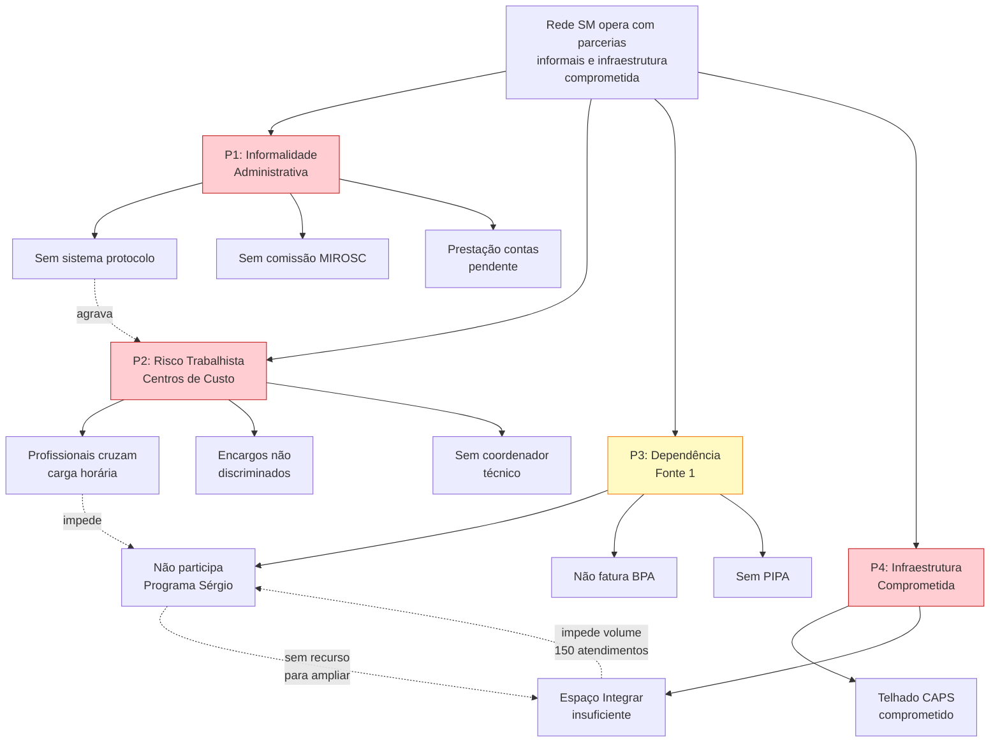
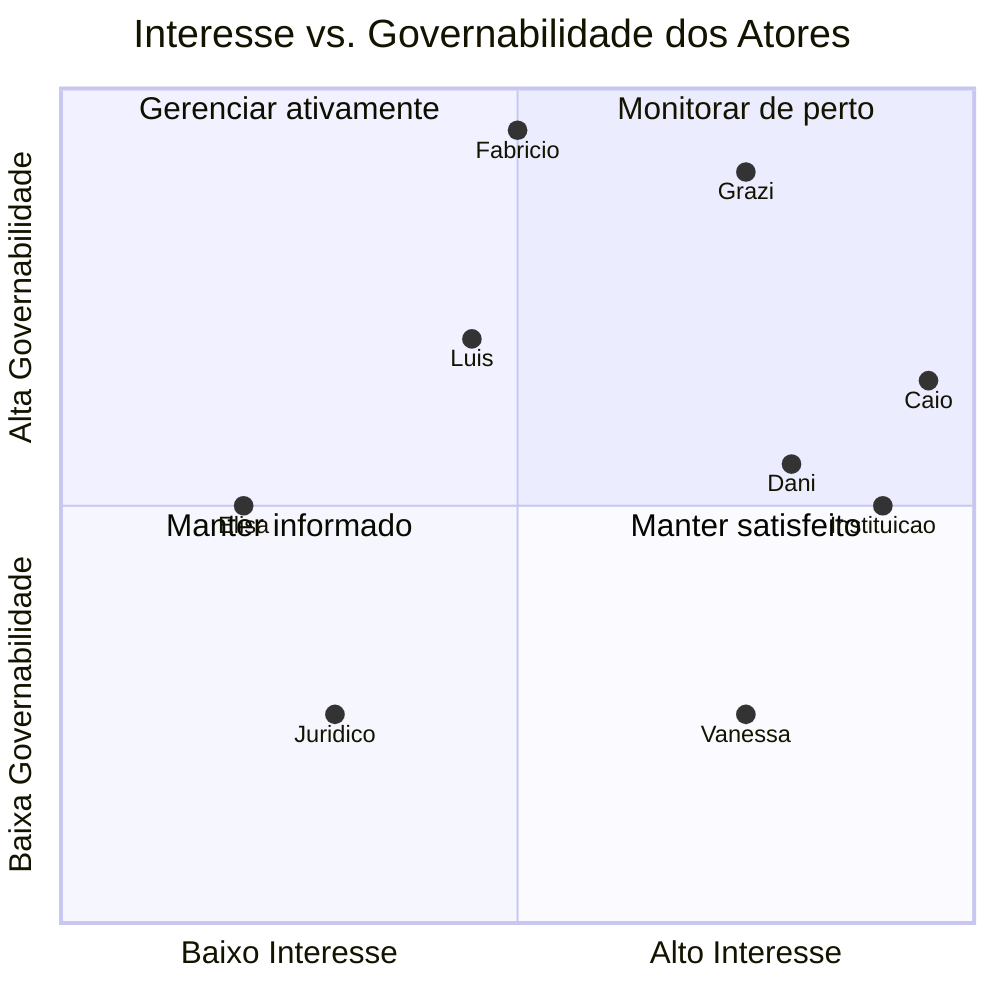

# ANÁLISE SITUACIONAL PES — PARCERIAS EM SAÚDE MENTAL

| Campo | Informação |
|-------|-----------|
| **Código** | PES-SM-001/2026 |
| **Versão** | 1.0 |
| **Data** | Fevereiro de 2026 |
| **Metodologia** | Planejamento Estratégico Situacional (Carlos Matus) |
| **Fonte primária** | Reunião de 29/01/2026 — Termos de Colaboração e Parcerias |
| **Elaboração** | Coordenação de Saúde Mental e Reabilitação — SMS Extrema/MG |

---

## 1. SITUAÇÃO-PROBLEMA CENTRAL

**A rede de saúde mental e reabilitação de Extrema opera com parcerias informais, infraestrutura comprometida e dependência exclusiva de recurso municipal (Fonte 1), sem sustentabilidade financeira, rastreabilidade documental ou conformidade plena com marcos regulatórios (Lei 13.019/2014, MIROSC).**

Essa situação gera quatro problemas estruturantes interdependentes, detalhados a seguir.

---

## 2. PROBLEMAS ESTRUTURANTES

### P1. Informalidade Administrativa

**Descrição:** As parcerias com instituições da sociedade civil operam sem instrumentos jurídicos adequados. Não há sistema de protocolo documental na Coordenação de Saúde Mental, os processos tramitam verbalmente ou por e-mail (meio inadequado para protocolos formais), e a prestação de contas do contrato anterior está pendente.

**Evidências (da reunião):**
- Documento do CRI encontrado sem protocolo de recebimento formal
- E-mail institucional com problemas técnicos
- Ausência de caderninho de remessa ou numeração de documentos
- Prestação de contas anterior não finalizada
- Comissão MIROSC inexistente

**Consequências:** Risco de questionamento pelo Tribunal de Contas (auditoria mencionada — 2021 e 2023), impossibilidade de comprovação documental, vulnerabilidade jurídica do município.

---

### P2. Risco Trabalhista e Fiscal por Cruzamento de Centros de Custo

**Descrição:** Profissionais contratados por uma secretaria (Assistência Social) prestam serviços para outra (Saúde) no mesmo horário, sem instrumentos distintos. A instituição parceira não discrimina adequadamente encargos trabalhistas na composição de custos e mistura recursos entre secretarias.

**Evidências:**
- Assistente social da instituição remunerada pela Assistência Social, mas atendendo demandas da Saúde
- Planilha de custos apresentada sem rubrica de encargos trabalhistas clara
- Ausência de coordenador técnico na equipe (ninguém responde formalmente pela prestação de contas)
- Discussão sobre regime CLT vs. PJ dos profissionais

**Consequências:** Auditoria do Tribunal de Contas pode configurar desvio de finalidade, riscos trabalhistas (vínculo empregatício), desorganização orçamentária entre blocos de financiamento distintos.

---

### P3. Dependência Exclusiva de Fonte 1 (Recurso Municipal)

**Descrição:** Todo o custeio da parceria com a instituição depende de recurso próprio municipal (Fonte 1), sem captação de recurso estadual (Programa Sérgio) ou federal. O município não participa de programas de produtividade do Estado de Minas Gerais, apesar de atender aos requisitos técnicos.

**Evidências:**
- Valor atual do contrato: ~R$10.500/mês (proposta André: R$12.500)
- Estimativa de custo real da equipe ampliada: ~R$36.500/mês
- Programa Sérgio poderia aportar R$20.000–25.000/mês
- Alfenas (cidade comparável) recebe R$66.000/mês via produtividade estadual
- PIPA oferece incentivo de até 40% da PPI
- Município não participa ("Que nós é ricos" — referência irônica da reunião)

**Consequências:** Subfinanciamento crônico dos serviços, impossibilidade de ampliação, precarização da equipe, perda de oportunidade de captação de recurso.

---

### P4. Infraestrutura Comprometida (CAPS) e Espaço Insuficiente (Integrar)

**Descrição:** O CAPS opera com telhado necessitando troca integral (não apenas reforma). O serviço Integrar opera em espaço com capacidade limitada, com fila de espera e impossibilidade de atingir volume de atendimentos necessário para habilitação estadual (mín. 150/mês).

**Evidências:**
- Vistoria técnica indica troca total do telhado
- Secretário Fabrício concordou com a necessidade
- Falta de documentação formal do problema (não há ofício, apenas conversa)
- Integrar: 200+ pacientes, 3 psicólogos, fila imensa, 1.8 SERG de encontro profissional

**Consequências:** Risco de interdição do CAPS, impossibilidade de habilitação Sérgio sem volume adequado, comprometimento da qualidade do cuidado.

---

## 3. ÁRVORE DE PROBLEMAS



**Observação:** Os problemas formam um ciclo vicioso — a informalidade impede a habilitação, a falta de habilitação mantém a dependência de Fonte 1, e a escassez de recurso impede a adequação de infraestrutura.

---

## 4. ANÁLISE DE ATORES

| Ator | Papel | Governabilidade | Interesse | Capacidade de bloqueio |
|------|-------|----------------|-----------|----------------------|
| **Caio** (Coord. SM) | Protagonista operacional | Alta (dentro do escopo) | Muito alto | Baixa |
| **Grazi** (Secretária SMS) | Decisora-chave | Muito alta | Alto | Alta |
| **Dani** (Assessora gabinete) | Articuladora administrativa | Média | Alto | Média (orienta processos) |
| **Fabrício** (Secretário) | Autoridade final | Muito alta | Médio | Muito alta |
| **Luís** (Diretor) | Intermediário com obras | Alta | Médio | Média |
| **Elisa** (Ref. obras) | Técnica de obras | Média | Baixo | Alta (não responde demandas) |
| **Instituição CRI** | Parceira executora | Média | Muito alto (depende do recurso) | Média (pode atrasar documentação) |
| **Vanessa** (Proprietária imóvel) | Fornecedora de espaço | Baixa | Alto (quer alugar) | Média (pode atrasar valores) |
| **Jurídico municipal** | Parecerista | Baixa | Neutro | Alta (pode vetar INEX) |
| **Tribunal de Contas** | Fiscalizador externo | Nenhuma | N/A | Muito alta |
| **SES/MG** (Estado) | Habilitador Sérgio | Nenhuma | N/A | Alta (aprovação depende deles) |

### Mapa de Governabilidade



---

## 5. OPERAÇÕES POR NÓ CRÍTICO

### NC1: Formalização dos Processos Administrativos

| Operação | Produto esperado | Responsável | Recursos | Prazo |
|----------|-----------------|-------------|----------|-------|
| Criar sistema de numeração CSM | Controle documental ativo | Caio | Caderninho, modelo numeração | 1 semana |
| Implantar caderninho de remessa | Rastreabilidade de correspondências | Caio | Caderninho físico | 1 semana |
| Redigir sequência de ofícios CRI | Processo INEX documentado | Caio | Modelo de ofício, textos técnicos | 2 semanas |
| Solicitar prestação de contas pendente | Fechamento parecer anual | Caio → Instituição | Ofício + modelo | Até março |
| Implantar comissão MIROSC | Monitoramento formalizado | Dani + Caio | Portaria, regimento | Com 1º termo |

**Indicador:** 100% dos documentos da CSM com numeração e protocolo até março/2026.

---

### NC2: Regularização de Centros de Custo

| Operação | Produto esperado | Responsável | Recursos | Prazo |
|----------|-----------------|-------------|----------|-------|
| Separar termos por secretaria | Dois instrumentos distintos (Saúde/Social) | Caio + Dani | Orientação jurídica | No plano de trabalho |
| Exigir planilha discriminada | Custos auditáveis com encargos | Caio → Instituição | Modelo de planilha | Com plano de trabalho |
| Incluir coordenador técnico | Responsável formal pela equipe | Instituição | R$3.000/mês | No termo |
| Orientar regime PJ | Reduzir risco trabalhista | Dani → Instituição | Assessoria | Reunião dedicada |

**Indicador:** Zero sobreposição de carga horária entre Saúde e Assistência Social no plano de trabalho.

---

### NC3: Diversificação de Fonte de Financiamento

| Operação | Produto esperado | Responsável | Recursos | Prazo |
|----------|-----------------|-------------|----------|-------|
| Articular habilitação Sérgio | Receita por produtividade | Grazi + Caio | Documentação equipe, CNES | Mar-Abr/2026 |
| Cadastrar códigos BPA | Faturamento ativo | Caio + TI | Acesso Vector, tabela códigos | Com habilitação |
| Avaliar elegibilidade PIPA | Incentivo até 40% PPI | Caio | Estudo de viabilidade | Pós-Sérgio |
| Habilitar serviço municipal + instituição | Dupla pontuação (~100 pontos) | Grazi | Processo conjunto | Com Sérgio |

**Indicador:** Fonte 1 representa ≤50% do custeio total da parceria até dez/2026.

---

### NC4: Adequação de Infraestrutura

| Operação | Produto esperado | Responsável | Recursos | Prazo |
|----------|-----------------|-------------|----------|-------|
| Oficiar Luís sobre telhado CAPS | Processo formal iniciado | Caio | CI pronta | Imediato |
| Definir modalidade (licitação/credenciamento) | Decisão técnica | Elisa | Reunião quarta | Fev/2026 |
| Contratualizar imóvel Integrar | Espaço disponível | Caio → Grazi | Ofício + validação orçamentária | Fev-Mar/2026 |
| Atingir volume 150-200 atendimentos/mês | Requisito Sérgio atendido | Equipe Integrar | Espaço + equipe | Após novo espaço |

**Indicador:** Telhado CAPS trocado até mai/2026; imóvel Integrar contratado até mar/2026.

---

## 6. ANÁLISE DE VIABILIDADE

### Viabilidade Política

| Fluxo | Avaliação | Fundamento |
|-------|-----------|-----------|
| CRI (INEX) | **VIÁVEL** com ressalvas | Secretário ciente, gabinete orientando. Risco: parecer jurídico pode questionar INEX se justificativa fraca |
| Integrar | **VIÁVEL** | Grazi apoiou a ideia, proprietária interessada. Depende de comissão de imóveis |
| Telhado CAPS | **VIÁVEL** | Fabrício concordou, incluído em lista de obras. Canal via Luís estabelecido |
| Sérgio | **VIÁVEL** | Grazi articulando. Depende de equipe formalizada (CRI precisa sair primeiro) |

### Viabilidade Técnica

| Fluxo | Avaliação | Fundamento |
|-------|-----------|-----------|
| CRI | **VIÁVEL** | Instituição tem experiência, equipe formada, infraestrutura. Falta composição formal de custos |
| Integrar | **VIÁVEL** com pendências | Imóvel identificado, mas adequações necessárias. Prazos dependem de Vanessa |
| Telhado | **VIÁVEL** | Problema identificado, solução clara (troca). Depende de orçamento e modalidade |
| Sérgio | **PARCIALMENTE VIÁVEL** | Equipe existe, mas volume de atendimentos insuficiente sem novo espaço |

### Viabilidade Financeira

| Fluxo | Investimento estimado | Fonte | Avaliação |
|-------|----------------------|-------|-----------|
| CRI | ~R$36.500/mês | Fonte 1 → Sérgio | **VIÁVEL** se habilitação Sérgio concretizar |
| Integrar | ~R$12.000/mês (10 primeiras) → R$2.500+/mês | Fonte 1 | **VIÁVEL** (valor baixo) |
| Telhado | [A ORÇAR] | Recurso obras SMS | **INCERTO** (depende de orçamento obras) |
| Sérgio | R$0 (retorno: R$20-25k/mês) | Recurso estadual | **ALTAMENTE VIÁVEL** (ROI positivo) |

### Viabilidade Administrativa

| Fluxo | Avaliação | Gargalo principal |
|-------|-----------|------------------|
| CRI | **MÉDIA** | Processo retroativo exige documentação impecável. Comissão MIROSC inexistente |
| Integrar | **MÉDIA** | Comissão de imóveis pode não existir. Fluxo de locação não é claro |
| Telhado | **BAIXA-MÉDIA** | Dependência de Elisa (não responsiva). Modalidade indefinida |
| Sérgio | **ALTA** | Processo técnico com SES/MG — depende mais de documentação que de articulação |

---

## 7. SÍNTESE ESTRATÉGICA

### Sequência Ótima de Execução

```
1. FORMALIZAR (NC1) → 2. REGULARIZAR (NC2) → 3. INFRAESTRUTURA (NC4) → 4. DIVERSIFICAR (NC3)
```

**Lógica:** Sem formalização documental, nenhum dos outros processos resiste a escrutínio externo. Sem regularização de centros de custo, a habilitação estadual fica comprometida. Sem infraestrutura adequada (novo espaço Integrar), não se atinge volume para Sérgio.

### Ponto de Alavancagem

O **Programa Sérgio** é o ponto de alavancagem do sistema inteiro: transforma uma operação deficitária (~R$36.500/mês em Fonte 1) em uma operação parcialmente financiada pelo Estado (R$20-25k/mês de retorno), liberando Fonte 1 para outras necessidades da rede. A referência de Alfenas (R$66k/mês) demonstra que o teto é significativamente maior que o investimento atual.

### Cenários

| Cenário | Probabilidade | Resultado | Condições |
|---------|-------------|-----------|-----------|
| **Otimista** | 30% | CRI + Integrar + Sérgio operando até jun/2026 | Tudo tramita sem bloqueios, habilitação rápida |
| **Realista** | 50% | CRI formalizado fev, Integrar mar, Sérgio mai/2026 | Alguns atrasos administrativos, habilitação em prazo normal |
| **Pessimista** | 20% | CRI atrasado por parecer jurídico, Sérgio adiado para 2º semestre | INEX questionada, comissão imóveis inativa, Elisa não responsiva |

---

## 8. RECOMENDAÇÕES

1. **Prioridade zero:** Formalizar o sistema documental da Coordenação (numeração, remessa, protocolo). Sem isso, todo o resto fica vulnerável.

2. **Ofício CRI é o documento mais crítico:** A justificativa técnica para INEX deve ser irretocável — é o que sustenta toda a parceria diante de eventual auditoria.

3. **Não esperar Vanessa para avançar o CRI:** Os dois fluxos (CRI e Integrar) podem e devem correr em paralelo. A dependência é mínima.

4. **Canal Luís → Elisa para obras:** Não tentar contato direto com Elisa. Toda comunicação sobre telhado deve passar por Luís, que é o canal efetivo.

5. **Capacitar a instituição para MIROSC:** A instituição provavelmente não conhece as exigências da Lei 13.019. Incluir orientação sobre prestação de contas no fluxo de formalização.

6. **Monitorar Tribunal de Contas:** A reunião mencionou auditorias em 2021 e 2023. Se o TC retomar em 2026, todos os processos retroativos estarão sob escrutínio. Documentação impecável é inegociável.

---

**Elaborado em:** Fevereiro de 2026
**Secretaria Municipal de Saúde — Extrema/MG**
**Coordenação de Saúde Mental e Reabilitação**

> **Ressalva:** Esta análise utiliza metodologia PES (Planejamento Estratégico Situacional) como ferramenta de apoio à gestão. As decisões finais são de responsabilidade dos gestores e devem considerar informações adicionais não disponíveis no momento da elaboração deste documento.
