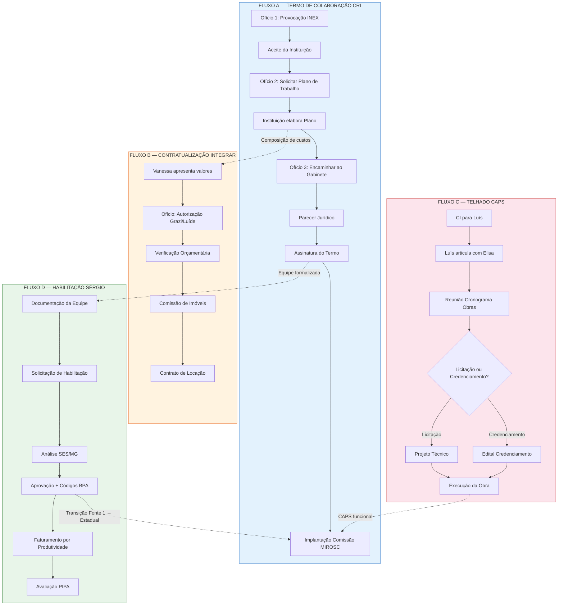

# PLANO DE AÇÃO — PARCERIAS E CONTRATUALIZAÇÕES EM SAÚDE MENTAL

| Campo | Informação |
|-------|-----------|
| **Código** | PA-SM-001/2026 |
| **Versão** | 1.0 |
| **Data** | Fevereiro de 2026 |
| **Origem** | Reunião de 29/01/2026 — Termos de Colaboração e Parcerias |
| **Responsável** | Caio Villani — Coordenação de Saúde Mental e Reabilitação |
| **Status** | Em execução |

---

## 1. OBJETIVO

Formalizar, em prazo adequado, quatro processos administrativos paralelos identificados na reunião de 29/01/2026: (A) Termo de Colaboração com instituição CRI via inexigibilidade, (B) Contratualização do espaço Integrar, (C) Adequação da infraestrutura do CAPS, (D) Habilitação estadual no Programa Sérgio. Garantir rastreabilidade documental, conformidade legal e sustentabilidade financeira das parcerias.

---

## 2. DIAGRAMA DE FLUXOS E DEPENDÊNCIAS

---

## 3. CRONOGRAMA POR FLUXO

### Fluxo A — Termo de Colaboração CRI

| Etapa | Ação | Responsável | Prazo | Entregável | Dependência |
|-------|------|-------------|-------|-----------|-------------|
| A1 | Redigir e enviar Ofício de Provocação INEX | Caio → Grazi | Retroativo ~15/dez/2025 | Ofício nº [X]/2025-SMS | — |
| A2 | Receber aceite formal da instituição | Instituição → Secretário | Retroativo ~22/dez/2025 | Carta de aceite | A1 |
| A3 | Enviar Ofício solicitando Plano de Trabalho + modelo | Caio | Retroativo 1ª sem/jan/2026 | Ofício nº [X]/2026-CSM | A2 |
| A4 | Instituição elabora Plano de Trabalho com custos | Instituição | Final jan/2026 | Plano de Trabalho completo | A3 |
| A5 | Encaminhar Plano ao gabinete + setor licitações | Caio → Gabinete | 1ª sem/fev/2026 | Ofício + Plano anexo | A4 |
| A6 | Parecer jurídico sobre INEX e minuta do Termo | Jurídico/Licitações | 2ª-3ª sem/fev/2026 | Parecer + Minuta | A5 |
| A7 | Assinatura do Termo de Colaboração | Secretário + Instituição | Final fev/2026 | Termo assinado | A6 |
| A8 | Implantação da Comissão MIROSC | Dani + Caio | Com A7 | Portaria + Ata 1ª reunião | A7 |
| A9 | Cessão de médico (apostilamento) | Caio | Pós A7 (quando viável) | Apostilamento ao Termo | A7 |

### Fluxo B — Contratualização Integrar

| Etapa | Ação | Responsável | Prazo | Entregável | Dependência |
|-------|------|-------------|-------|-----------|-------------|
| B1 | Solicitar valores formais à Vanessa (aluguel + adequações) | Caio | Até 10/fev/2026 | Proposta comercial | — |
| B2 | Redigir Ofício de autorização para Grazi/Luíde | Caio | Até 14/fev/2026 | Ofício nº [X]/2026-CSM | B1 |
| B3 | Verificação de disponibilidade orçamentária | Setor financeiro | Até 21/fev/2026 | Nota de disponibilidade | B2 |
| B4 | Encaminhamento à Comissão de Imóveis | Gabinete | Até 28/fev/2026 | Laudo avaliação mercado | B3 |
| B5 | Formalização do contrato de locação | Jurídico | Até 15/mar/2026 | Contrato assinado | B4 |
| B6 | Início das adequações pela proprietária | Vanessa | Até 30/mar/2026 | Obras iniciadas | B5 |

### Fluxo C — Telhado CAPS

| Etapa | Ação | Responsável | Prazo | Entregável | Dependência |
|-------|------|-------------|-------|-----------|-------------|
| C1 | Enviar CI para Luís (necessidade de troca) | Caio | **IMEDIATO** | CI nº [X]/2026-CSM | — |
| C2 | Luís articula com Elisa sobre procedimento | Luís → Elisa | Até quarta (próxima) | Encaminhamento | C1 |
| C3 | Reunião cronograma de obras (Enes + Elisa + diretores) | Todos | Quarta 11h | Ata + priorização | C2 |
| C4 | Reunião setor obras (Enes + Elisa + João) | Enes + Elisa | Quinta | Cronograma obras | C3 |
| C5 | Definição de modalidade (licitação/credenciamento) | Elisa (parecer) | Até 14/fev/2026 | Parecer técnico | C4 |
| C6 | Elaboração de projeto/edital | Setor obras | Mar/2026 | Projeto técnico | C5 |
| C7 | Execução da obra | Empresa contratada | Abr-Mai/2026 | Telhado novo | C6 |

### Fluxo D — Habilitação Programa Sérgio

| Etapa | Ação | Responsável | Prazo | Entregável | Dependência |
|-------|------|-------------|-------|-----------|-------------|
| D1 | Levantar documentação da equipe para habilitação | Caio + Instituição | Fev/2026 | Dossiê equipe | A4 (parcial) |
| D2 | Solicitar habilitação junto à SES/MG | Grazi | Mar/2026 | Processo de habilitação | D1 |
| D3 | Cadastrar códigos BPA e configurar Vector | Caio + TI | Com D2 | Códigos ativos | D2 |
| D4 | Aprovar habilitação e iniciar faturamento BPA | SES/MG | Abr-Mai/2026 | Habilitação ativa | D3 |
| D5 | Transição Fonte 1 → recurso estadual | Financeiro | Após D4 | Mudança fonte pgto | D4 |
| D6 | Avaliar credenciamento PIPA (se CERD) | Caio | Pós D4 | Análise de viabilidade | D4 |

---

## 4. AÇÕES TRANSVERSAIS

| Ação | Responsável | Prazo | Observação |
|------|-------------|-------|-----------|
| Criar sistema de numeração documental CSM | Caio | Imediato | Formato: CI/OF nº XX/2026-CSM |
| Implantar caderninho de remessa | Caio | Imediato | Entrada e saída de correspondências |
| Cobrar prestação de contas pendente (contrato anterior) | Caio → Instituição | Até março/2026 | Necessário para parecer anual |
| Resolver problema e-mail institucional | Caio → TI | Até 07/fev | Priorizar protocolo físico enquanto pendente |
| Verificar existência de comissão de imóveis | Caio → Fernando | Imediato | Necessário para Fluxo B |

---

## 5. METAS E INDICADORES DO PLANO DE TRABALHO (CRI)

### Metas Quantitativas

| Meta | Indicador | Fórmula | Fonte | Alvo |
|------|-----------|---------|-------|------|
| Satisfação dos usuários e familiares | % satisfação positiva | (Avaliações ≥ bom / Total avaliações) × 100 | Pesquisa satisfação | ≥70% |
| Ocupação das vagas | % vagas preenchidas | (Vagas ocupadas / Vagas contratadas) × 100 | Relatório mensal | 100% |
| Cobertura de PTI | % atendidos com PTI | (Atendidos com PTI / Total atendidos) × 100 | Prontuários | 100% |

### Metas Qualitativas

| Meta | Indicador | Fonte de comprovação | Periodicidade |
|------|-----------|---------------------|--------------|
| Educação permanente da equipe | Capacitação realizada | Lista de presença + certificado | Mensal (1x/mês) |
| CNES atualizado | CNES da instituição atualizado | Print do sistema CNES | Trimestral |
| Pesquisa de satisfação | Pesquisa aplicada a usuários e familiares | Instrumento + tabulação | Semestral |

### Indicadores de Desempenho

| Indicador | Métrica | Fonte | Alvo |
|-----------|---------|-------|------|
| Pontualidade da prestação de contas | Entrega na data acordada | Protocolo de recebimento | 100% |
| Frequência dos usuários | % assiduidade nos atendimentos | Sistema Vector | A definir |
| Faturamento BPA | % procedimentos faturados vs. realizados | BPA / Relatório | ≥80% |

---

## 6. RISCOS E MITIGAÇÕES

| Risco | Probabilidade | Impacto | Mitigação |
|-------|-------------|---------|-----------|
| Instituição não consegue compor custos adequadamente | Alta | Alto | Assessoria técnica de Dani/gabinete na montagem da planilha |
| Parecer jurídico questiona INEX | Média | Alto | Justificativa técnica robusta no Ofício 1 + documentação completa |
| Habilitação Sérgio demora mais que previsto | Média | Médio | Manter Fonte 1 como backup até transição efetiva |
| Cruzamento de centros de custo gera problema trabalhista | Alta | Alto | Contratos separados, cargas horárias distintas, auditável |
| Comissão de imóveis inexistente ou inativa | Média | Médio | Verificar com Fernando; se necessário, solicitar criação |
| Telhado CAPS agrava durante espera | Alta | Alto | Priorizar na lista de obras + contingência (lona/reparo emergencial) |
| Tribunal de Contas audita processos retroativos | Baixa | Muito Alto | Documentação impecável, cronologia plausível, justificativas técnicas |

---

## 7. COMPOSIÇÃO FINANCEIRA ESTIMADA

### Termo de Colaboração CRI (mensal)

| Rubrica | Valor estimado |
|---------|---------------|
| Recursos Humanos (equipe multidisciplinar) | ~R$ 28.000 |
| Material de consumo | ~R$ 500 |
| Coordenação técnica (20h) | ~R$ 3.000 |
| Transporte (van + motorista) | A orçar (~R$ 5.000) |
| **Subtotal estimado** | **~R$ 36.500** |

### Referências de sustentabilidade

| Fonte | Valor estimado | Status |
|-------|---------------|--------|
| Fonte 1 (recurso municipal) | Até R$ 36.500/mês | Disponível |
| Programa Sérgio (produtividade) | R$ 20.000–25.000/mês | Pendente habilitação |
| PIPA (incentivo neonatos risco) | Até 40% da PPI | Posterior ao Sérgio |
| Referência Alfenas | R$ 66.000/mês | Benchmark |

**Estratégia financeira:** Iniciar com Fonte 1. Após habilitação Sérgio, migrar parcialmente para recurso estadual. Meta: reduzir dependência de Fonte 1 em ≥50% até dez/2026.

---

## 8. CHECKLIST DE ACOMPANHAMENTO

### Semana 1 (03-07/fev)

- [ ] CI Telhado CAPS enviada a Luís
- [ ] Ofício 1 CRI redigido (texto técnico INEX)
- [ ] Combinado com instituição sobre datas retroativas
- [ ] Sistema de numeração CSM criado
- [ ] Caderninho de remessa implantado
- [ ] Valor solicitado à Vanessa (Integrar)

### Semana 2 (10-14/fev)

- [ ] Aceite retroativo da instituição recebido
- [ ] Ofício 2 CRI enviado (solicitar plano de trabalho)
- [ ] Ofício Integrar redigido (após valor Vanessa)
- [ ] Verificar comissão de imóveis com Fernando
- [ ] Verificar disponibilidade de médico para cessão

### Semana 3-4 (17-28/fev)

- [ ] Plano de trabalho da instituição recebido e analisado
- [ ] Ofício 3 CRI enviado (gabinete + licitações)
- [ ] Verificação orçamentária Integrar concluída
- [ ] Resultado reunião telhado → definição modalidade
- [ ] Checklist MIROSC 600-AP obtido

### Março/2026

- [ ] Parecer jurídico INEX recebido
- [ ] Termo de Colaboração CRI assinado
- [ ] Comissão de imóveis avalia Integrar
- [ ] Prestação de contas anterior cobrada da instituição
- [ ] Documentação equipe levantada para Sérgio

---

**Próxima revisão:** 14/02/2026
**Elaborado em:** Fevereiro de 2026
**Secretaria Municipal de Saúde — Extrema/MG**
**Coordenação de Saúde Mental e Reabilitação**
