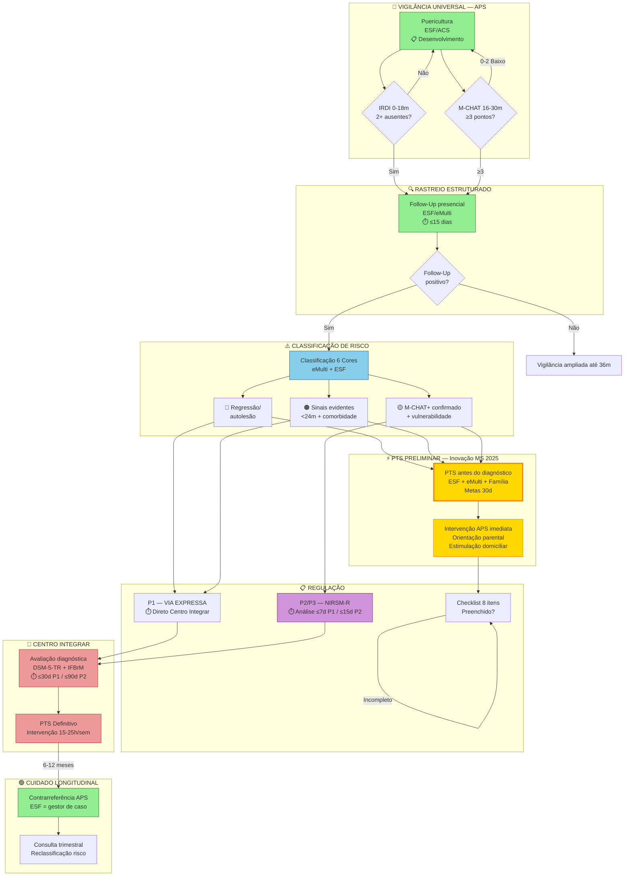

# DEV PROMPT: Protocolo TEA Consolidado — Extrema/MG 2026

---

## METADADOS

```yaml
autor: Caio Villani (Coordenação SM, SMS Extrema-MG)
assistência: Claude Opus 4.6 (Anthropic)
versão_prompt: "1.0"
data_criação: "2026-02-09"
modelo_esperado: Claude Opus 4.6+ ou equivalente com contexto ≥200k tokens
produto_esperado: PROTOCOLO_TEA_EXTREMA_2026.md (~2.500 linhas, 10 seções, 4 fluxogramas Mermaid, 40+ refs Vancouver)
arquivo_raciocínio: analises/TRIANGULACAO_TEA_OFICIAL_vs_LOCAL_2026.md
```

---

## §1. OBJETIVO

Gere um **protocolo clínico consolidado para Transtorno do Espectro Autista (TEA)** no município de Extrema-MG, integrando três documentos-base existentes:

1. **CLI-02 v2.7** — Protocolo Clínico TEA (1.928 linhas, 34 refs Vancouver)
2. **PCC-06** — Macrofluxo Narrativo DI/TEA (1.461 linhas, 10 fases navegacionais)
3. **GN-01** — Guia Narrativo APS DI/TEA (1.759 linhas, 12 micro-etapas)

O protocolo consolidado deve eliminar a sobreposição de ~40% entre os documentos e produzir um **documento único e navegável** para a jornada completa do paciente:

```
REDE INTERSETORIAL → APS (ESF + eMulti) → NIRSM-R → CENTRO INTEGRAR → CONTRARREFERÊNCIA → APS LONGITUDINAL
```

**O problema que este protocolo resolve:** Equipes de linha de frente precisam consultar 4 documentos distintos para uma decisão clínica que deveria ocorrer em minutos. A fragmentação gera atrasos, inconsistências e insegurança operacional.

**Resultado esperado:** `PROTOCOLO_TEA_EXTREMA_2026.md` — ~2.500 linhas (±10%), 10 seções obrigatórias, 4 fluxogramas Mermaid por faixa etária, 40+ referências Vancouver, checklist de escalonamento operacionalizado.

---

## §2. CONTEXTO SITUACIONAL

### 2.1 Município de Extrema-MG

```yaml
população: ~36.000 (IBGE 2022)
prevalência_TEA_estimada: ~115 pessoas (CDC 2025: 1:31)
região: Sul de Minas Gerais, divisa com São Paulo
perfil: Município industrial com crescimento populacional acelerado

rede_raps:
  aps:
    esf: 8 equipes
    emulti: 2 equipes
    cobertura: "~85%"
  atenção_especializada:
    centro_integrar:
      serviços: "Avaliação TEA/DI, intervenções intensivas, grupos terapêuticos"
      profissionais: "2 psicólogos, 1 TO, 1 fono, 1 neuropediatra (consultor)"
      capacidade: "~40 atendimentos/mês"
    caps_i: "Transtornos graves, crises, acolhimento"
    csm: "Ambulatório especializado (adultos)"
  regulação:
    nirsm_r:
      função: "Gatekeeper — análise técnica antes de autorizar vaga especializada"
      composição: "1 coordenador + 1 membro rotativo eMulti"
      volume: "~60 análises/mês (todas as condições SM)"
  rede_intersetorial:
    educação: "12 escolas municipais com AEE, PSE ativo em 100%"
    assistência_social: "2 CRAS (cobertura territorial completa), 1 CREAS"
    terceiro_setor: "APAEs regionais, associações de pais"
```

### 2.2 Problema Estrutural

Os três documentos-base somam ~5.148 linhas com sobreposição de ~40%:

| Documento | Linhas | Foco | Sobreposição |
| --------- | ------ | ---- | ------------ |
| CLI-02 v2.7 | 1.928 | Fundamentação técnica, instrumentos, intervenções | M-CHAT, DSM-5-TR, fluxo geral |
| PCC-06 v1.0 | 1.461 | Cascata 10 fases, P1/P2/P3, RACI | M-CHAT, portas de entrada, priorização |
| GN-01 v1.0 | 1.759 | Guia operacional APS, 12 micro-etapas | M-CHAT, IRDI, papel da ESF |

**Consequências:** (a) enfermeira ESF com M-CHAT+ precisa consultar 4 documentos; (b) critérios de escalonamento APS→Centro Integrar dispersos; (c) NIRSM-R mencionado 47 vezes mas sem protocolo TEA-específico; (d) contradição sobre papel da APS na intervenção.

### 2.3 Marcos Regulatórios Prioritários

Em ordem de prevalência (legislação > diretrizes > evidência):

| Nível | Fonte | Ano | Relevância |
| ----- | ----- | --- | ---------- |
| **1 — Legislação** | Lei 12.764/2012 (Berenice Piana) | 2012 | Política Nacional TEA |
| **1** | Lei 15.256/2025 (TEA adultos/idosos) | 2025 | Extensão de direitos 18+ |
| **1** | Lei 13.146/2015 (LBI) | 2015 | Avaliação biopsicossocial IFBrM |
| **1** | Lei 10.216/2001 (Reforma Psiquiátrica) | 2001 | Cuidado em liberdade |
| **1** | Portaria 2.436/2017 (PNAB) | 2017 | APS como coordenadora do cuidado |
| **1** | Portaria 3.088/2011 (RAPS) | 2011 | Rede de Atenção Psicossocial |
| **2 — Diretriz MS** | Linha de Cuidado TEA (MS Brasil) | Set/2025 | M-CHAT universal, intervenção antes do diagnóstico |
| **2** | Resolução SES-MG 8.971/2023 | 2023 | Diretrizes TEA no SUS-MG |
| **2** | CIB-SUS/MG 1.404/2013 (PIPA) | 2013 | Intervenção precoce alto risco |
| **3 — Internacional** | mhGAP-OMS (versão portuguesa) | 2019 | Algoritmos APS |
| **3** | AAP Hyman et al. | 2020 | Triagem 18m+24m, tríplice simultâneo |
| **3** | NICE CG128 (2021 surveillance) | 2021 | Diagnóstico ≤3 meses |

---

## §3. ESPECIFICAÇÕES TÉCNICAS DO PROTOCOLO

### 3.1 Estrutura Obrigatória (Template PCC)

O protocolo DEVE seguir a estrutura do template `_Templates/TEMPLATE_PROTOCOLO_PCC.md` adaptada para TEA:

```
# PROTOCOLO DE CUIDADO AO TRANSTORNO DO ESPECTRO AUTISTA (TEA) — EXTREMA/MG 2026

## Metadados
Código: CLI-TEA-2026 | Versão: 1.0 | Vigência: 2026 | Revisão: Jul/2026

## Sumário Clicável

## §1. INTRODUÇÃO E FUNDAMENTAÇÃO TÉCNICA (~300 linhas)
   1.1 Conceito e Classificação (DSM-5-TR 299.00, CID-11 6A02)
   1.2 Epidemiologia (CDC 2025: 1:31; razão 3,4:1; herdabilidade 80-90%)
   1.3 Bases Neurobiológicas (>100 genes, conectividade atípica)
   1.4 Heterogeneidade (linguística, cognitiva, sensorial)
   1.5 Comorbidades (TDAH 30-50%, ansiedade 40-50%, epilepsia até 77,5%)
   1.6 Marco Regulatório (Lei 12.764, Lei 15.256, Portarias MS)
   1.7 Princípios Norteadores (neurodiversidade, pessoa-primeiro, cuidado em liberdade)

## §2. POPULAÇÃO-ALVO E ABRANGÊNCIA (~100 linhas)
   2.1 Critérios DSM-5-TR (A-E)
   2.2 Faixas Etárias (0-3a, 4-12a, 13-17a, 18+a)
   2.3 Níveis de Suporte (1, 2, 3)
   2.4 Aplicabilidade (quem está incluído)
   2.5 Não-Aplicabilidade (com protocolo de destino)

## §3. VIGILÂNCIA E RASTREAMENTO (~350 linhas)
   3.1 Vigilância Universal do Desenvolvimento (puericultura)
   3.2 IRDI (0-18 meses): 31 indicadores, sensibilidade 96,9%
   3.3 M-CHAT-R/F (16-30 meses): 20 itens, Follow-Up, itens críticos 2/5/12
   3.4 Dois Momentos Obrigatórios (18m + 24m) — AAP 2020
   3.5 Populações Especiais (meninas/camuflagem, prematuros, diversidade cultural)
   3.6 Protocolo de Falso-Negativos (M-CHAT negativo + suspeita clínica)
   3.7 Orientações de Estimulação para Famílias
   3.8 Registro Obrigatório e-SUS PEC

## §4. FLUXO ASSISTENCIAL NAVEGACIONAL (~500 linhas)
   4.1 Visão Geral (diagrama ASCII)
   4.2 As 4 Portas de Entrada
   4.3 Fluxo na APS (ESF → eMulti → classificação de risco)
   4.4 Checklist Pré-Encaminhamento NIRSM-R (8 itens obrigatórios)
   4.5 NIRSM-R TEA-Específico (composição, fluxo, tempos, critérios devolução)
   4.6 Via Expressa P1 (bypass NIRSM-R para regressão + <36m)
   4.7 Centro Integrar: Protocolo de Recepção e Avaliação
   4.8 Casos que NÃO Requerem Centro Integrar (manejo APS + eMulti)
   ⚡ 4 FLUXOGRAMAS MERMAID (0-3a, 4-12a, 13-17a, 18+a)

## §5. AVALIAÇÃO DIAGNÓSTICA (~250 linhas)
   5.1 Equipe de Avaliação (composição mínima)
   5.2 Componentes (anamnese, observação, instrumentos, exames)
   5.3 Instrumentos com Propriedades Psicométricas (ADOS-2, CARS-2, ADI-R)
   5.4 Diagnóstico Diferencial (DI, TDAH, ansiedade, seletivismo alimentar)
   5.5 Avaliação Funcional IFBrM (LBI)
   5.6 Classificação Final (CID-11, nível de suporte, cor de risco)

## §6. ESTRATIFICAÇÃO DE RISCO E PRIORIZAÇÃO (~200 linhas)
   6.1 Sistema de 6 Cores TEA-Específico
   6.2 Regras de Majoração TEA
   6.3 Regras de Minoração TEA
   6.4 Mapeamento Cores ↔ Prioridades (P1/P2/P3)
   6.5 Tabela de Decisão Rápida

## §7. INTERVENÇÃO TERAPÊUTICA E PTS (~350 linhas)
   7.1 PTS Preliminar Pré-Diagnóstico (MS 2025) — ⚡ INOVAÇÃO
   7.2 Algoritmo de Seleção de Intervenção (perfil → abordagem → intensidade)
   7.3 Matriz de Intervenção (idade × nível × linguagem → intervenção → local → responsável)
   7.4 Matriz RACI: APS vs. Centro Integrar
   7.5 PTS Definitivo (4 momentos, metas SMART 30/90/>90d)
   7.6 Cronograma de Reavaliação
   7.7 Medicação (sintomático, não tratamento TEA)

## §8. RESPONSABILIDADES POR PONTO DE ATENÇÃO (~200 linhas)
   8.1 ESF (médico, enfermeiro, ACS)
   8.2 eMulti (psicólogo, TO, fono, assistente social)
   8.3 NIRSM-R (coordenador, membro rotativo)
   8.4 Centro Integrar (equipe avaliação, equipe intervenção)
   8.5 CAPS I (crises, transtornos graves comórbidos)
   8.6 Rede Intersetorial (Educação PSE/AEE, CRAS/CREAS, 3º setor)
   8.7 Família e Pessoa com TEA (co-responsabilização)

## §9. CONTRARREFERÊNCIA E CUIDADO LONGITUDINAL (~200 linhas)
   9.1 Critérios de Contrarreferência (7 critérios com responsável)
   9.2 Protocolo Pós-Contrarreferência (15d ESF, 30d eMulti, trimestral 12m)
   9.3 Protocolo Consulta Trimestral APS
   9.4 Transição para Vida Adulta (Lei 15.256/2025)
   9.5 Critérios de Re-Encaminhamento ao Centro Integrar
   9.6 Fluxo de Retorno

## §10. INDICADORES E MONITORAMENTO (~150 linhas)
   10.1 Indicadores de Processo (4 indicadores, mensal)
   10.2 Indicadores de Resultado (5 indicadores, trimestral)
   10.3 Indicadores de Estrutura (4 indicadores, anual)
   10.4 Fluxo de Consolidação (responsável, dashboard, PDCA)
   10.5 Indicador de Satisfação das Famílias (semestral)

## ANEXOS
   A — M-CHAT-R/F Completo (20 itens + Follow-Up) + Cartão de Bolso
   B — IRDI (31 indicadores, 4 eixos)
   C — Sinais de Alerta para ACS (material campo)
   D — IFBrM (formulário com domínios)
   E — Checklist Pré-Encaminhamento NIRSM-R TEA
   F — Modelo PTS Preliminar TEA
   G — Modelo PTS Definitivo TEA
   H — Glossário e Siglas
   I — Referências (40+ Vancouver com DOIs)
   J — Histórico de Revisões
```

### 3.2 Fluxogramas Mermaid (4 obrigatórios)

Gerar **4 fluxogramas Mermaid** por faixa etária. Cada fluxograma DEVE incluir:

- **Decisões em losango** (condições sim/não)
- **Responsável por cor:** verde=ESF, azul=eMulti, roxo=NIRSM-R, vermelho=Centro Integrar
- **Tempo máximo** por etapa (ex.: "≤30d" para P1)
- **Critérios de passagem** entre etapas
- **PTS Preliminar** destacado visualmente como inovação

**Modelo para Fluxograma 0-3 anos:**



**Gerar fluxogramas equivalentes para:**
- **4-12 anos:** Portas de entrada (escola, demanda espontânea, CRAS) → APS → diagnóstico diferencial → NIRSM-R → Centro Integrar → Intervenção → Escola inclusiva
- **13-17 anos:** Adolescência → desafios específicos (identidade, bullying, transição) → APS → avaliação → intervenção com foco social/pré-vocacional → preparação transição adulto
- **18+ anos:** Adultos (Lei 15.256/2025) → diagnóstico tardio → avaliação funcional IFBrM → CAPS/CREAS → autonomia → trabalho protegido → manutenção

### 3.3 Sistema de 6 Cores TEA-Específico

```yaml
classificação_risco_tea:
  🔴_VERMELHO:
    critérios:
      - Regressão linguística súbita (perda >5 palavras em <3 meses)
      - Autolesão grave ou risco iminente
      - Epilepsia descompensada + TEA
    conduta: "P1 — Via expressa Centro Integrar ≤30d"
    majoração: "Automática se cumulativo com vulnerabilidade social extrema"

  🟠_LARANJA:
    critérios:
      - Sinais evidentes TEA <24 meses
      - Comorbidade grave (epilepsia refratária, DI severa)
      - M-CHAT alto risco (8-20) + <36 meses
    conduta: "P1 — NIRSM-R ≤7d → Centro Integrar ≤30d"

  🟡_AMARELO:
    critérios:
      - M-CHAT moderado (3-7) confirmado Follow-Up
      - Suspeita clínica fundamentada sem urgência
      - Alta vulnerabilidade social (CadÚnico sem CRAS)
    conduta: "P2 — NIRSM-R ≤15d → Centro Integrar ≤90d"

  🟢_VERDE:
    critérios:
      - Triagem negativa com fatores de risco (irmão TEA, prematuridade)
      - ASD nível 1 com boa resposta a grupos APS
      - Diagnóstico confirmado, estável, em acompanhamento APS
    conduta: "Vigilância ampliada APS — Reavaliação 6 meses"

  🔵_AZUL:
    critérios:
      - Diagnóstico confirmado, estável
      - PTS com metas alcançadas >70%
      - Contrarreferência adequada recebida
    conduta: "Cuidado longitudinal APS — Consulta trimestral"

  ⚪_BRANCO:
    critérios:
      - Alta clínica do protocolo TEA
      - Reclassificação para vigilância geral
    conduta: "Vigilância geral do desenvolvimento — Sem protocolo TEA ativo"

regras_majoração_tea:
  - "Regressão linguística após 18 meses → +2 níveis (automático)"
  - "Epilepsia + TEA → +1 nível"
  - "Vulnerabilidade social extrema (CadÚnico sem CRAS) → +1 nível"
  - "Evasão escolar + nível de suporte 2-3 → +1 nível"
  - "Acesso a meios letais + ideação suicida → automaticamente 🔴"

regras_minoração_tea:
  - "Resposta rápida à intervenção mediada por pais (>80% adesão, progresso em 90d) → -1 nível"
  - "Rede de apoio forte (família estruturada + CRAS + escola inclusiva com AEE) → -1 nível"
  - "Inclusão escolar efetiva com PEI implementado → -1 nível (com justificativa)"
```

### 3.4 Critérios de Escalonamento APS → Centro Integrar

**Checklist pré-encaminhamento (8 itens OBRIGATÓRIOS):**

```markdown
CHECKLIST PRÉ-ENCAMINHAMENTO NIRSM-R — TEA

□ 1. Avaliação dupla concluída (ESF + eMulti)
□ 2. M-CHAT-R/F completo (com Follow-Up se ≥3)
□ 3. Relatório técnico com: histórico do desenvolvimento, sinais atuais,
      comorbidades, contexto familiar/escolar
□ 4. Classificação de risco (cor) + justificativa
□ 5. PTS Preliminar elaborado (mesmo sem diagnóstico)
□ 6. Intervenções APS tentadas: mínimo 3 meses de manejo OU evidência
      documentada de não-resposta (para P2/P3; P1 isento deste critério)
□ 7. Priorização P1/P2/P3 justificada com critérios clínicos
□ 8. Família orientada sobre próximos passos e prazos

ATENÇÃO: Encaminhamento com checklist incompleto será devolvido pelo NIRSM-R
com orientações específicas para complementação.
```

**Casos que NÃO requerem Centro Integrar (manejo APS + eMulti):**
- M-CHAT baixo risco (0-2) sem sinais clínicos adicionais → vigilância
- ASD nível 1 confirmado com boa resposta a grupos de habilidades sociais na APS
- Diagnóstico estável, risco verde/azul, sem intercorrências
- Reavaliação de rotina (6 meses) sem alteração de nível

### 3.5 P1/P2/P3 para TEA

| Prioridade | Prazo | Critérios TEA-Específicos | Exemplo Clínico |
| ---------- | ----- | ------------------------- | --------------- |
| **P1** | ≤30 dias | Regressão linguística/comportamental súbita; autolesão grave; epilepsia descompensada + sinais TEA; <24m + M-CHAT alto risco (8-20) | Criança 20m, falava 10 palavras, parou há 2 meses + autoagressão |
| **P2** | ≤90 dias | M-CHAT+ confirmado Follow-Up + idade <36m; sinais evidentes + vulnerabilidade social; comorbidade moderada-grave | Criança 24m, M-CHAT 12/20, sem fala, família CadÚnico |
| **P3** | ≤180 dias | Suspeita clínica sem urgência + idade >36m; reavaliação diagnóstica pós-intervenção; diagnóstico diferencial complexo | Criança 6 anos, dificuldades sociais, linguagem preservada, escola reporta isolamento |

### 3.6 NIRSM-R TEA-Específico

```yaml
nirsm_r_tea:
  composição:
    coordenador: "Psicólogo ou médico com experiência TEA"
    membro_rotativo: "Profissional eMulti (rodízio mensal)"
    apoio_administrativo: "Agendamento, SISREG"

  fluxo_análise:
    1_receber: "Referência da APS (checklist completo)"
    2_analisar: "Análise técnica: ≤7 dias úteis (P1) ou ≤15 dias (P2/P3)"
    3_decidir:
      a: "Autorizar vaga Centro Integrar (P1/P2/P3)"
      b: "Devolver para APS com orientações de manejo"
      c: "Solicitar informações complementares (prazo 10 dias)"
    4_comunicar: "Família e ESF notificados em ≤48h após decisão"

  critérios_devolução:
    - "Checklist pré-encaminhamento incompleto"
    - "Intervenções APS não tentadas (encaminhamento prematuro) — exceto P1"
    - "Risco verde/azul sem justificativa clínica"
    - "Ausência de PTS Preliminar"

  via_expressa_p1:
    critérios: "Regressão + <36 meses OU autolesão grave OU epilepsia descompensada"
    fluxo: "Encaminhamento direto Centro Integrar — NIRSM-R recebe cópia e valida retrospectivamente"
    justificativa: "Evitar delay clinicamente significativo em janela de neuroplasticidade"

  indicadores_desempenho:
    - "Tempo médio análise: ≤7d (P1), ≤15d (P2/P3)"
    - "Taxa devolução: <20% (indica qualidade das referências APS)"
    - "Taxa autorização: monitorar para detectar sub/super-encaminhamento"
```

### 3.7 Matriz de Intervenção

| Idade | Nível Suporte | Linguagem | Intervenção Primária | Intensidade | Local | Responsável |
| ----- | ------------- | --------- | -------------------- | ----------- | ----- | ----------- |
| 0-3a | Nível 3 | Ausente/mínima | ESDM ou PRT | 15-25h/sem | Centro Integrar + domicílio | TO + Fono + Psicólogo |
| 0-3a | Nível 2 | Emergente | Parent-mediated (Hanen) + PECS | 10-15h/sem | UBS + domicílio | eMulti + família |
| 0-3a | Nível 1 | Funcional | Orientação parental + estimulação | 5-10h/sem | UBS + domicílio | ESF + família |
| 4-6a | Nível 2-3 | Funcional | Grupos habilidades sociais + PECS | 10-15h/sem | Centro Integrar | Psicólogo + TO |
| 4-6a | Nível 1 | Adequada | Grupos sociais + suporte escolar | 5-10h/sem | UBS + escola | eMulti + AEE |
| 7-12a | Nível 2-3 | Variável | TEACCH + integração sensorial + grupos | 10-15h/sem | Centro Integrar + escola | Equipe CI + AEE |
| 7-12a | Nível 1 | Adequada | Grupos sociais + apoio acadêmico | 3-5h/sem | Escola + UBS | eMulti + AEE |
| 13-17a | Nível 1-2 | Adequada | Habilidades sociais + pré-vocacional | 3-5h/sem | CAPS i + CRAS | Psicólogo + AS |
| 18+a | Qualquer | Qualquer | Manutenção + autonomia + trabalho | 2-5h/sem | CAPS + CREAS | Téc. Referência CAPS |

**Base científica obrigatória:**
- ESDM: Tryfon et al. 2022 (g=0,36, 33 ECRs, n=2.581) [Ref. 17]
- Parent-mediated: Sandbank et al. 2023 (efeitos mantidos 12m+) [Ref. 18]
- PRT: Tryfon et al. 2022 (g=0,42) [Ref. 17]

### 3.8 PTS Preliminar (Inovação MS 2025)

```yaml
pts_preliminar:
  conceito: "PTS elaborado ANTES da confirmação diagnóstica para iniciar intervenção
    sem esperar. Alinhado com MS 2025 e janela de neuroplasticidade 0-3 anos."

  quando_elaborar:
    - "M-CHAT-R/F positivo confirmado com Follow-Up"
    - "IRDI com 2+ indicadores ausentes + sinais clínicos adicionais"
    - "Suspeita clínica fundamentada (mesmo sem instrumento formal)"

  quatro_momentos:
    1_diagnóstico_situacional:
      - "Desenvolvimento atual (marcos, regressões)"
      - "Contexto familiar (rede de apoio, renda, escolaridade cuidadores)"
      - "Barreiras de acesso (transporte, horários, linguísticas)"
    2_metas_smart:
      curto_prazo_30d: "Ex: Família treinada em 3 estratégias de comunicação"
      médio_prazo_90d: "Ex: Aumento de contato visual em brincadeira (observação estruturada)"
      longo_prazo_gt90d: "Ex: Primeiras palavras funcionais OU sistema AAC implementado"
    3_responsabilidades:
      esf: "Vigilância mensal, articulação com escola/CRAS"
      emulti: "Intervenção 2x/semana (orientação parental, estimulação)"
      família: "Aplicar estratégias domiciliares diariamente (registro)"
      educação: "Adaptações no berçário/creche (se aplicável)"
    4_reavaliação: "A cada 30 dias durante espera diagnóstica"
```

### 3.9 Critérios de Contrarreferência Centro Integrar → APS

| # | Critério | Responsável Monitoramento | Indicador de Verificação |
| - | -------- | ------------------------- | ------------------------ |
| 1 | Diagnóstico confirmado e classificado (nível suporte + CID-11) | Centro Integrar | Relatório diagnóstico completo entregue |
| 2 | PTS definitivo elaborado com metas 6-12 meses | Centro Integrar + ESF | PTS assinado por ≥3 atores |
| 3 | Intervenção intensiva concluída (mínimo 6 meses) | Centro Integrar | Relatório de progresso |
| 4 | Família treinada em estratégias de manejo | eMulti | Checklist de competências |
| 5 | Rede intersetorial ativada (Educação + CRAS) | ESF (gestor de caso) | PEI escolar + PAIF ativo |
| 6 | Risco estabilizado (verde ou azul) | eMulti | Reclassificação documentada |
| 7 | APS com capacidade de acompanhamento longitudinal | Coordenação APS | eMulti disponível |

**Protocolo pós-contrarreferência:**
- 15 dias: Consulta ESF (acolhimento, revisão PTS)
- 30 dias: Consulta eMulti (reavaliação funcional)
- Trimestral: Monitoramento 12 meses (consulta padronizada)
- Semestral: Reclassificação de risco
- Retorno ao Centro Integrar se: piora clínica, nova comorbidade, transição etária (adolescência), perda de rede de apoio

### 3.10 Indicadores de Qualidade (13 indicadores)

**Processo (mensal):**

| # | Indicador | Fórmula | Meta | Fonte |
| - | --------- | ------- | ---- | ----- |
| 1 | Cobertura triagem M-CHAT 18-30m | (Crianças triadas 18-30m / Total crianças 18-30m cadastradas) × 100 | ≥95% | e-SUS APS |
| 2 | Tempo médio análise NIRSM-R | Σ(Data decisão - Data recebimento) / N referências | ≤7d (P1), ≤15d (P2/P3) | SISREG |
| 3 | Completude checklist pré-encaminhamento | (Encaminhamentos completos / Total encaminhamentos) × 100 | ≥90% | Auditoria NIRSM-R |
| 4 | Taxa de Follow-Up realizado | (Follow-Up realizados / M-CHAT ≥3) × 100 | ≥95% | e-SUS APS |

**Resultado (trimestral):**

| # | Indicador | Fórmula | Meta | Fonte |
| - | --------- | ------- | ---- | ----- |
| 5 | Crianças <3a em intervenção ≤6m pós-triagem+ | (Em intervenção ≤6m / M-CHAT+ confirmados) × 100 | ≥80% | Centro Integrar |
| 6 | Alcance de metas PTS 30d | (Metas 30d alcançadas / Total metas 30d) × 100 | ≥70% | Reavaliação PTS |
| 7 | Contrarreferência adequada | (Contrarref. com 7 critérios / Total contrarref.) × 100 | ≥80% | Auditoria ESF |
| 8 | PTS com participação da família | (PTS com família / Total PTS) × 100 | ≥90% | PTS |
| 9 | Reclassificação de risco no prazo | (Reclassificações no prazo / Reclassificações devidas) × 100 | ≥85% | e-SUS APS |

**Estrutura (anual):**

| # | Indicador | Fórmula | Meta | Fonte |
| - | --------- | ------- | ---- | ----- |
| 10 | Profissionais capacitados ESDM/PRT | N com certificação / Total Centro Integrar | ≥60% | RH |
| 11 | Profissionais APS capacitados TEA | N com capacitação ≥20h / Total ESF+eMulti | ≥80% | Educação Permanente |
| 12 | Tempo médio triagem → intervenção | Σ(Data 1ª intervenção - Data M-CHAT+) / N | ≤6 meses | e-SUS + CI |
| 13 | Satisfação das famílias | Pesquisa semestral (escala 1-10) | ≥7/10 | Pesquisa SMS |

**Consolidação:** Coordenação de Saúde Mental exporta dashboard trimestral para Secretaria. Indicador abaixo da meta → análise causal → ação corretiva → reavaliação (ciclo PDCA).

---

## §4. DADOS E CONTEXTOS A INJETAR

### 4.1 Evidência Científica Prioritária

Cada referência abaixo DEVE ser citada na seção indicada do protocolo:

| Referência | Dado-Chave | Citar em |
| ---------- | ---------- | -------- |
| Shaw et al. CDC MMWR, Abr/2025 | Prevalência 1:31 (3,2%); razão 3,4:1 | §1.2 Epidemiologia |
| Losapio et al. J Autism Dev Disord, 2023 | M-CHAT-R/F BR: Sens 88,2%, Espec 75%, α 0,88 | §3.3 M-CHAT |
| Santos et al. Clinics, 2024 | ADOS-2 AUC 0,92; CARS-2 α 0,94 | §5.3 Instrumentos |
| Tryfon et al. Dev Med Child Neurol, 2022 | 33 ECRs, n=2.581; ESDM g=0,36; PRT g=0,42 | §7.2 Algoritmo intervenção |
| Sandbank et al. J Speech Lang Hear Res, 2023 | Parent-mediated mantém efeitos 12m+ | §7.3 Matriz intervenção |
| Tick et al. J Child Psychol Psychiatry, 2016 | Herdabilidade 80-90% | §1.3 Neurobiologia |
| Pierce et al. JAMA Pediatrics, 2019 | Estabilidade diagnóstica desde 12 meses | §5 Avaliação |
| Lord et al. Nat Rev Dis Primers, 2020 | Review TEA (classificação, heterogeneidade) | §1.1 Conceito |
| Hull et al. J Autism Dev Disord, 2017 | Camuflagem social feminina | §3.5 Populações especiais |
| Ozonoff et al. Autism Res, 2018 | Padrões início: precoce 70%, regressão 25-30% | §1.4 Heterogeneidade |
| Hyman et al. Pediatrics, 2020 (AAP) | Triagem 18m+24m; tríplice simultâneo | §3.4 Dois momentos |
| NICE CG128 (2021 surveillance) | Diagnóstico ≤3 meses | §5 Avaliação |
| mhGAP-OMS 2019 (português) | Algoritmos APS; parent-skills training | §7, §8 |
| MS Brasil Linha Cuidado TEA, Set/2025 | Universal M-CHAT; intervenção antes diagnóstico; PTS obrigatório | §3, §4, §7 |

### 4.2 Legislação Brasileira

| Lei/Portaria | Artigo Relevante | Citar em |
| ------------ | ---------------- | -------- |
| Lei 12.764/2012 (Berenice Piana) | Art. 2º — direitos (diagnóstico precoce, medicamentos, nutrição) | §1.6, §8.5 |
| Lei 15.256/2025 | Extensão de direitos a adultos e idosos com TEA | §1.6, §9.4 |
| Lei 13.146/2015 (LBI) | Art. 2º — avaliação biopsicossocial IFBrM | §5.5 |
| Lei 10.216/2001 | Art. 2º — cuidado em liberdade, base comunitária | §1.7 |
| Portaria 2.436/2017 (PNAB) | APS como coordenadora do cuidado | §4.3 |
| Portaria 3.088/2011 (RAPS) | Componentes da rede | §1.6, §8 |

### 4.3 Dados Locais Extrema-MG

Inserir nos contextos relevantes:
- 8 ESF + 2 eMulti → cobertura ~85%
- Centro Integrar: ~40 atendimentos/mês
- NIRSM-R: ~60 análises/mês (todas condições SM)
- 12 escolas municipais com AEE
- 2 CRAS + 1 CREAS (cobertura territorial completa)
- Prevalência estimada: ~115 pessoas com TEA (CDC 1:31 aplicado a população pediátrica)

---

## §5. RESTRIÇÕES E REQUISITOS TÉCNICOS

### 5.1 Idioma e Formatação

- **Idioma:** Português brasileiro (pt-BR)
- **Formato:** GitHub Flavored Markdown + Mermaid compatível
- **Referências:** Vancouver (ICMJE) com DOIs quando disponíveis
- **Extensão:** ~2.500 linhas (±10%) — seções 1.500-2.000 + anexos 500-1.000
- **Tabelas:** Preferir tabelas sobre prosa para decisões rápidas

### 5.2 Vocabulário Obrigatório

- **Pessoa-primeiro sempre:** "pessoa com TEA", "criança com TEA" — nunca "autista" como substantivo
- **Destigmatizante:** "condição do neurodesenvolvimento" — nunca "doença", "portador", "acometido"
- **Regulatório:** Citar Lei Berenice Piana, CIPTEA (Carteira de Identificação), BPC-LOAS quando pertinente
- **Neurodiversidade:** Reconhecer variação neurológica sem patologizar — alinhar com Reforma Psiquiátrica

### 5.3 Qualidade Narrativa

- **BLUF:** Cada seção inicia com resumo executivo (2-3 parágrafos)
- **Densidade informacional alta:** Sem clichês ("é importante lembrar que..."), jargão não explicado, referências vagas ("estudos mostram...")
- **Conexões explícitas:** "Conforme §3.2...", "Este passo articula-se com §7.1..."
- **Progressão:** Simples → complexo dentro de cada seção
- **Zero erros de transcrição:** Dados numéricos verificados contra fonte primária

### 5.4 Rastreabilidade

- Cada afirmação técnica → referência específica (Vancouver)
- Cada fluxograma → seção textual correspondente
- Cada indicador → fórmula + meta + fonte de dados
- Cada responsabilidade → profissional/serviço específico
- P1/P2/P3 → prazos idênticos em TODAS as menções
- Cores de risco → consistentes em todo o documento

### 5.5 Safety Net

Incluir em §1 (Introdução) e em seções de crise/urgência:

```
⚠️ RECURSOS DE APOIO EM CRISE
• CVV — 188 (24h, ligação gratuita)
• SAMU — 192
• UPA 24h Extrema
• CAPS I — [telefone local]
• UBS mais próxima — e-SUS/APS
```

---

## §6. INSTRUÇÕES DE EXECUÇÃO

### Fase 1: Estrutura e Fundamentação (§1-2)

1. Criar estrutura completa com 10 seções + Anexos (sumário clicável)
2. Preencher §1 Introdução (epidemiologia CDC 2025, DSM-5-TR, neurobiologia, marco regulatório)
3. Preencher §2 População-Alvo (critérios A-E, faixas etárias, níveis suporte)
4. **Gate de qualidade:** Verificar todas as referências de §4.1 citadas em §1-2

### Fase 2: Fluxo Clínico (§3-5)

5. Preencher §3 Vigilância/Rastreamento (IRDI, M-CHAT, Follow-Up, falso-negativos, populações especiais)
6. Gerar 4 fluxogramas Mermaid (§3.2 deste prompt como modelo)
7. Preencher §4 Fluxo Assistencial (10 fases, NIRSM-R TEA, via expressa P1, checklist 8 itens)
8. Preencher §5 Avaliação Diagnóstica (equipe, instrumentos com psicometria, IFBrM)
9. **Gate de qualidade:** Fluxogramas têm responsáveis, tempos e critérios de passagem

### Fase 3: Intervenção e Coordenação (§6-9)

10. Preencher §6 Estratificação de Risco (6 cores, majoração/minoração, mapeamento P1/P2/P3)
11. Preencher §7 Intervenção e PTS (PTS Preliminar, algoritmo, matriz RACI)
12. Preencher §8 Responsabilidades (por ponto de atenção e por profissional)
13. Preencher §9 Contrarreferência (7 critérios, pós-contra, transição adulto)
14. **Gate de qualidade:** Matriz RACI sem ambiguidades; PTS Preliminar destacado

### Fase 4: Monitoramento e Anexos (§10 + Anexos)

15. Preencher §10 Indicadores (13 indicadores com fórmula/meta/fonte/periodicidade/responsável)
16. Compilar Anexos A-J (escalas, checklists, modelos, glossário)
17. Consolidar Referências (40+ Vancouver com DOIs)
18. **Gate de qualidade:** Todos os indicadores têm periodicidade e responsável

### Fase 5: Revisão e Integração

19. Verificar consistência interna (P1/P2/P3 idênticos em todas as menções)
20. Adicionar conexões explícitas entre seções ("§3.2 articula-se com §7.1...")
21. Revisar fluxogramas (cores, responsáveis, tempos alinhados com texto)
22. Verificar rastreabilidade (cada afirmação → referência)
23. **Gate de qualidade final:** Executar checklist completo (§7 abaixo)

---

## §7. CHECKLIST DE VALIDAÇÃO FINAL

Executar ANTES de considerar o protocolo concluído:

**Estrutura:**
- [ ] 10 seções obrigatórias presentes
- [ ] Sumário clicável funcional
- [ ] Metadados completos (código, versão, vigência, revisão)
- [ ] ~2.500 linhas (±10%)

**Fluxogramas:**
- [ ] 4 fluxogramas Mermaid (0-3a, 4-12a, 13-17a, 18+a)
- [ ] Cada fluxograma com: decisões, responsáveis por cor, tempos, critérios
- [ ] PTS Preliminar destacado visualmente em todos os fluxogramas
- [ ] Cores de risco consistentes com §6

**Conteúdo Clínico:**
- [ ] DSM-5-TR critérios A-E completos
- [ ] M-CHAT-R/F com propriedades psicométricas (Losapio 2023)
- [ ] IRDI 31 indicadores referenciados
- [ ] Algoritmo de intervenção com base em Tryfon 2022 e Sandbank 2023
- [ ] IFBrM integrado (Lei 13.146/2015)
- [ ] Populações especiais (meninas, prematuros, diversidade cultural)

**Fluxo Operacional:**
- [ ] 4 portas de entrada definidas
- [ ] Checklist pré-encaminhamento NIRSM-R (8 itens)
- [ ] Via expressa P1 (bypass NIRSM-R para regressão + <36m)
- [ ] NIRSM-R TEA-específico (composição, fluxo, tempos, critérios devolução)
- [ ] Critérios "quando NÃO encaminhar" (manejo APS)
- [ ] 7 critérios de contrarreferência com responsáveis
- [ ] Protocolo pós-contrarreferência (15d/30d/trimestral)

**Inovações Preservadas:**
- [ ] PTS Preliminar pré-diagnóstico (MS 2025)
- [ ] Sistema 6 cores com majoração/minoração TEA-específica
- [ ] NIRSM-R como gatekeeper qualificador

**Matriz RACI:**
- [ ] Presente para cada fase navegacional
- [ ] Resolve ambiguidade APS vs. Centro Integrar
- [ ] Inclui responsabilidades da família

**Indicadores:**
- [ ] 13 indicadores com fórmula, meta, fonte
- [ ] Periodicidade definida (mensal/trimestral/anual)
- [ ] Responsável por consolidação (Coordenação SM)
- [ ] Feedback loop (PDCA)
- [ ] Satisfação das famílias incluído

**Referências:**
- [ ] 40+ referências Vancouver com DOIs
- [ ] Todas as fontes de §4.1 citadas nas seções indicadas
- [ ] Legislação brasileira completa (§4.2)
- [ ] Dados numéricos verificados contra fonte primária

**Vocabulário:**
- [ ] Pessoa-primeiro em 100% das menções
- [ ] Zero diagnósticos como adjetivos
- [ ] Linguagem destigmatizante
- [ ] Safety Net Brasil incluído (CVV 188, SAMU 192)

**Consistência:**
- [ ] P1/P2/P3 prazos idênticos em todas as menções
- [ ] Cores de risco (🔴🟠🟡🟢🔵⚪) consistentes
- [ ] Nomenclatura uniforme ("Centro Integrar", não "ambulatório especializado")
- [ ] Faixas etárias alinhadas (0-3a, 4-12a, 13-17a, 18+a)
- [ ] Sem contradições internas

---

**FIM DO PROMPT DE DESENVOLVIMENTO**

Este prompt, quando executado com o modelo Claude Opus 4.6+ e os documentos-base como contexto, deve gerar o `PROTOCOLO_TEA_EXTREMA_2026.md` com as especificações acima.

**Pós-geração:**
1. Validação técnica por equipe NIRSM-R + Centro Integrar
2. Consulta com famílias/usuários (co-design)
3. Revisão regulatória (SES-MG, CIB-SUS)
4. Piloto 3 meses (3 ESF + 1 eMulti)
5. Ajustes e publicação oficial
6. Capacitação das equipes

---

*Elaborado com assistência de IA (Claude Opus 4.6, Anthropic). Validação humana obrigatória antes de uso clínico.*
